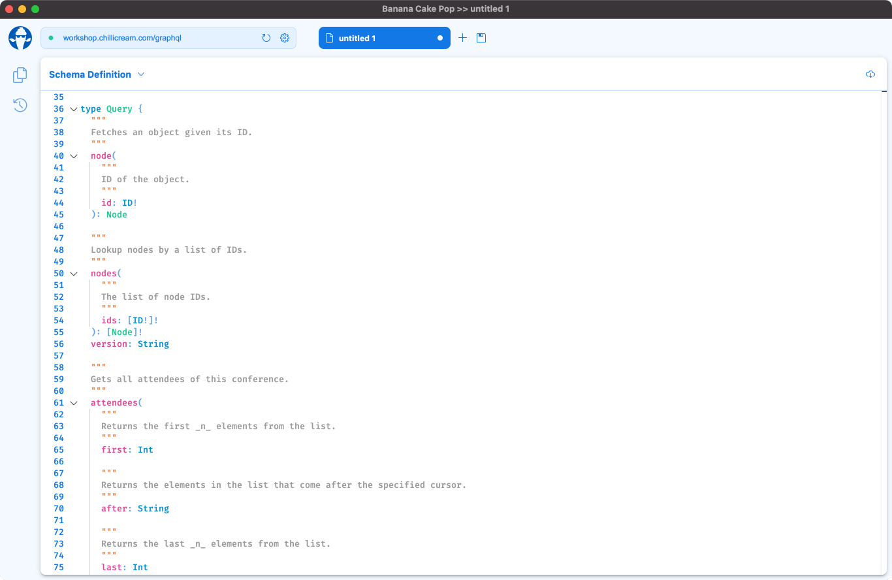

Banana Cake Pop is our brand new GraphQL IDE which works well with Hot Chocolate and any other GraphQL server. It's still in preview so try it out and give us feedback via our slack channel.

# Download

Banana Cake Pop is currently in preview and the current version is `1.0.0-preview.2`.

- [macOS Installer](https://github.com/ChilliCream/bananacakepop/releases/download/v1.0.0-preview.1/BananaCakePop-1.0.0-preview.1.dmg)
- [windows Installer](https://github.com/ChilliCream/bananacakepop/releases/download/v1.0.0-preview.1/BananaCakePop-1.0.0-preview.1.exe)
- [ubuntu Installer](https://github.com/ChilliCream/bananacakepop/releases/download/v1.0.0-preview.1/BananaCakePop-1.0.0-preview.1.AppImage)
