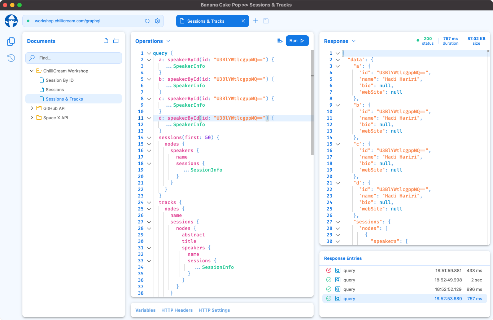

Banana Cake Pop makes it easy and enjoyable to test your GraphQL server implementations. It works well with Hot Chocolate and any other GraphQL server. Try it out and give us feedback via [slack](http://slack.chillicream.com/) in the **#banana-cake-pop** channel.

# Web
You can try Banana Cake Pop on the web by going to [eat.bananacakepop.com](https://eat.bananacakepop.com/)

The web version will let you query public GraphQL APIs and try out the Banana Cake Pop features. However, if you want to access local GraphQL servers, we recommend installing the Banana Cake Pop App.

# Desktop App

> The Banana Cake Pop App is currently in preview and the current version is `1.0.0-preview.31`. It has an auto-update feature built in, so as new releases come out you will be notified to update within the app.



## macOS
Banana Cake Pop App can be installed in macOS <!--using Homebrew (recommended) or--> by downloading the DMG installer.
<!--### Homebrew
```
$ brew install --cask banana-cake-pop
```-->
### Download
Make sure to download the correct installer if you're using an Apple Silicon Mac (M1) or an Intel Mac.
- [Intel Mac (x64)](https://download.chillicream.com/bananacakepop/BananaCakePop-1.0.0-preview.31-mac-x64.dmg)
- [Apple Silicon Mac (ARM 64)](https://download.chillicream.com/bananacakepop/BananaCakePop-1.0.0-preview.31-mac-arm64.dmg)

## Windows
Banana Cake Pop App can be installed in Windows using the Windows Package Manager (recommended) or by downloading the installer.
### Windows Package Manager (Winget)
```
C:\> winget install banana-cake-pop
```
### Installer
- [Download Installer](https://download.chillicream.com/bananacakepop/BananaCakePop-1.0.0-preview.31-win-x64.exe)

## Linux
We offer an AppImage and Snap installer for Ubuntu. At the moment, we do not support other distributions or installer formats.
- [Ubuntu Installer (AppImage)](https://download.chillicream.com/bananacakepop/BananaCakePop-1.0.0-preview.31-linux-x86_64.AppImage)
- [Ubuntu Installer (Snap)](https://download.chillicream.com/bananacakepop/BananaCakePop-1.0.0-preview.31-linux-amd64.snap)

After downloading head over to [getting started](/docs/bananacakepop/getting-started) and lets make our first GraphQL query in Banana Cake Pop.
