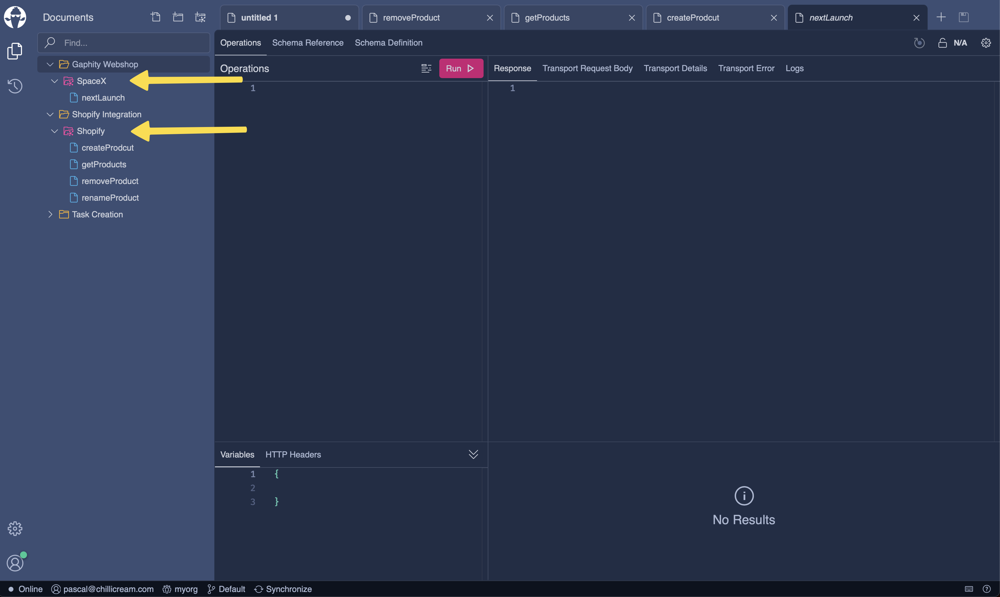
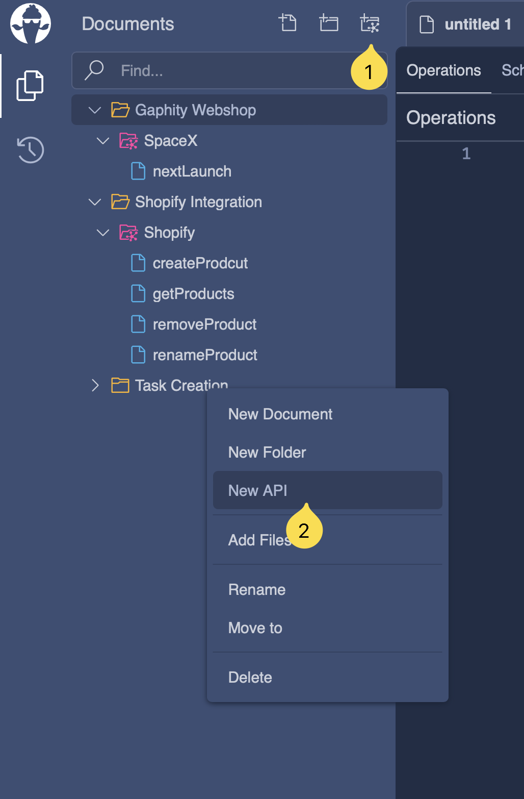

--- 
title: Apis
---

An API within the context of Banana Cake Pop, refers to an representation of your GraphQL Servers. 
This representation is more than a mere conceptual framework — it serves as a practical tool that allows you to group your documents and share common settings like connection and authorization parameters among them.

An API also serves as the basis for your client and schema registry setup. You can find more information about this feature in the [Schema & Client Registry](/docs/bananacakepop/v2/schema-client-registry) guide.

# Creating an API

Creating an API in Banana Cake Pop is a straightforward task. Here's are two ways to do it:

1. The first way is to click on the `Create Api` button located at the top of the document explorer toolbar.
2. The second way is to right-click within the document explorer and select `New Api` from the context menu. This will create a new api within the currently selected folder. Apis can be in folders but cannot be nested within each other. 
