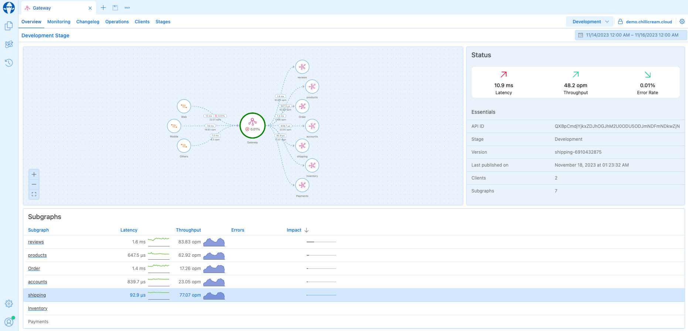
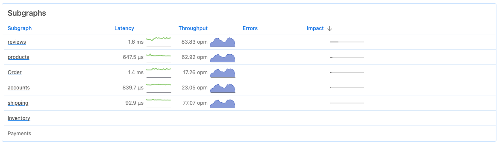
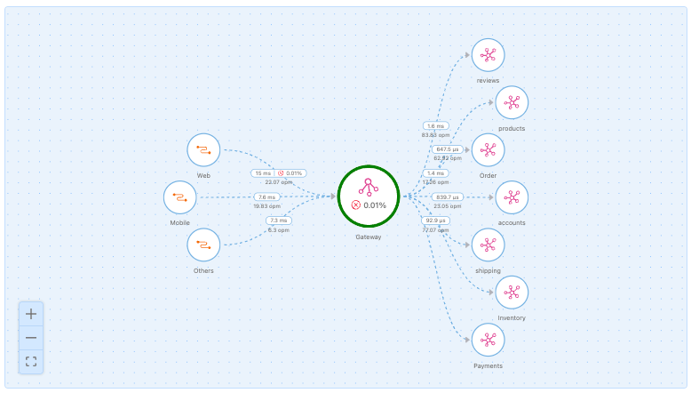
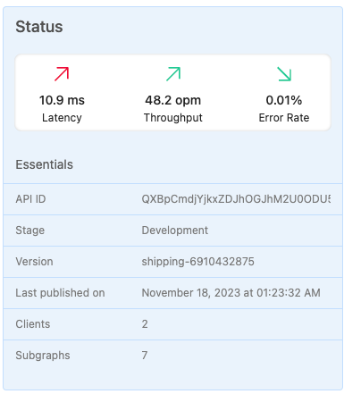
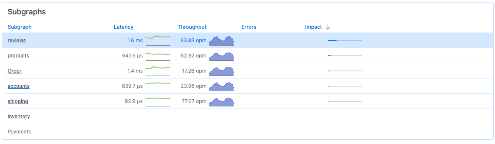
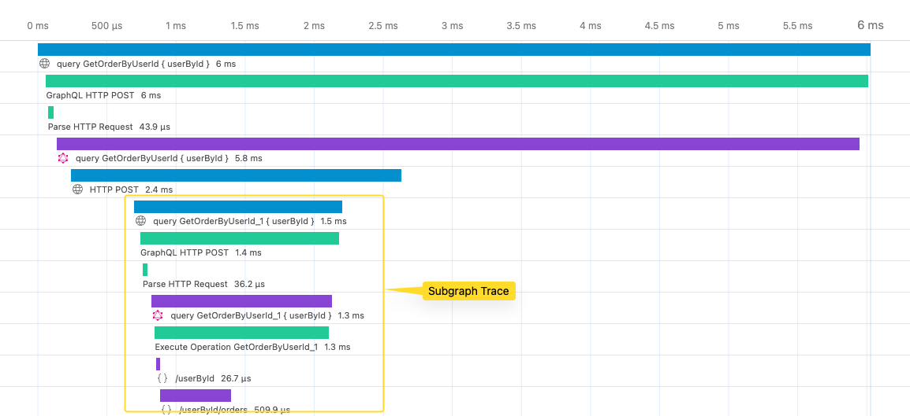

BananaCakePop can be used as your orchestrator for your Fusion Gateway. It deeply integrates with your development workflow and allows you to publish, validate, consume and monitor your Fusion Gateway. 



On the fusion dashboard you can now see the tracing information of your gateway and your subgraphs.

# Dashboard
The fusion dashboard gives you a quick overview of your gateway and subgraphs. It shows you the status of your gateway and the status of your subgraphs. You can also see the latest telemetry data insights of your gateway and subgraphs.

## Topology


The topology view shows you the connections between your gateway and your subgraphs. You can also see which clients are connected to your gateway and how many operations they are executing.

## Status

The status view shows you a quick overview of the status of your gateway. With the indicators for latency, throughput and errors you see how your gateway statistics developed between the previous and the current time range.

You also see the essential information about your gateway, such as the version, the stage, how many subgraphs are connected and how many clients are connected.

## Insights

The subgraph insights show you a quick overview over your connected subgraphs. You can see the latency, throughput and error rate of each subgraph. 

# Gateway Management 
With fusion you compose your gateway configuration locally when you deploy a subgraph. This means that you somehow need to inform your gateway that there is a new configuration available.

With Banana Cake Pop you can automate this process. You can configure your gateway to automatically pull the latest configuration from Banana Cake Pop. This way you can be sure that your gateway always has the latest configuration. You can also validate your configuration against the schema and client registry to make sure that your change does not break any clients.

## Configure your gateway
To configure your fusion gateway to pull the configuration from Banana Cake Pop, you need to install the BananaCakePop.Services package. You can do this by running the following command in your project's root directory:

```bash
dotnet add package BananaCakePop.Services
```

After installing the package, you need to configure the services in your startup class. Below is a sample implementation in C#:

```csharp
builder.Services
  .AddFusionGatewayServer()
  .ConfigureFromCloud(x => 
  {
      x.ApiKey = "<<your-api-key>>";
      x.ApiId = "QXBpCmc5NGYwZTIzNDZhZjQ0NjBmYTljNDNhZDA2ZmRkZDA2Ng==";
      x.Stage = "dev";
  })                
```

> **Tipp: Using Environment Variables**
>
> Alternatively, you can set the required values using environment variables. This method allows you to call `ConfigureFromCloud` without explicitly passing parameters.
>- `BCP_API_KEY` maps to `ApiKey`
>- `BCP_API_ID` maps to `ApiId`
>- `BCP_STAGE` maps to `Stage`
>```csharp
> builder.Services
>   .AddFusionGatewayServer()
>   .ConfigureFromCloud();                
>```
>In this setup, the API key, ID, and stage are set through environment variables.

Now your gateway will be notified whenever there is a new configuration available and will automatically pull it.

## Integration into your CI/CD pipeline
The deployment of a subgraph is a multi step process. To integrate BananaCakePop into this process you need to install Barista, the BananaCakePop CLI. You can find more information about Barista in the [Barista Documentation](/docs/barista/v1). 
```bash
dotnet new tool-manifest
dotnet tool install Barista
```

You will also need the [Command Line Tools](https://www.nuget.org/packages/HotChocolate.Fusion.CommandLine) for packing and composing your subgraph. 

```bash
dotnet tool install HotChocolate.Fusion.CommandLine
```


### 1. Pack the subgraph
All changes to the gateway originate from a subgraph. Once the subgraph is ready to be deployed, you need to pack it. Packing a subgraph will create a subgraph package file that contains the schema, the extensions and the configuration of the subgraph.

To easily access the newest schema and extensions, you can use the `schema export` command from the [Command Line Extension](/docs/hotchocolate/v13/server/command-line). This command exports your current schema into a specified output file.

```bash
dotnet run -- schema export --output schema.graphql
dotnet fusion subgraph pack
```

This step is usually done in a separate build step in your CI/CD pipeline where you build and test your project before you go into the deployment phase.

### 2. Wait for a deployment slot 
Once your changes are ready to be deployed, you need to wait for a deployment slot. There can only ever be one deployment at the time. If there is already a deployment in progress, you need to wait until it is finished.

Banana Cake Pop helps you coordinate your subgraph deployments. You register for a deployment by calling:
  
```bash  
dotnet barista fusion-configuration publish begin \
  --tag <<tag>> \
  --api-id <<api-id>> \
  --subgraph-name <<subgraph-name>> \
  --api-key <<api-key>>
```

This command will complete once your turn has come and you can start deploying your subgraph.

### 3. Start the deployment
Once you have a deployment slot, you need to notify Banana Cake Pop that you are still interested in the slot. You do this by calling:

```bash
dotnet barista fusion-configuration publish start --api-key <<api-key>> 
```

### 4. Configure the subgraph
As most likely, your connection information is different from environment to environment, you need to configure the url of your subgraph. You can do this by calling:

```bash 
dotnet fusion subgraph config set http \
  --url <<url>> 
  -c path/to/your/subgraph/config.fsp
```

### 5. Compose the subgraph
To compose the subgraph, you first need to fetch the latest configuration from Banana Cake Pop. You can do this by calling:

```bash
dotnet barista fusion-configuration download \
  --api-id <<api-key>> \
  --stage <<name-of-the-stage>> \
  --output-file ./gateway.fgp \
  --api-key <<api-key>> 
```

This will download the latest configuration from Banana Cake Pop and save it to the specified file (`gateway.fgp`).

Now you can compose the subgraph by calling:

```bash
dotnet fusion compose -p ./gateway.fgp -s path/to/your/subgraph/config.fsp
```

### 6. Validate the subgraph (optional)
If you want to make sure that your subgraph is compatible with the schema and client registry, you can validate it by calling:

```bash
barista fusion-configuration publish validate --configuration ./gateway.fgp --api-key <<api-key>>
```

In case the validation fails, you will get an error message. You have to cancel the deployment manually though. You can add deployment step to your CI/CD pipeline which will cancel the deployment if the validation fails by calling:

```bash
dotnet barista fusion-configuration publish cancel --api-key <<api-key>>
```

### 7. Deploy the subgraph
Now it's time to deploy your subgraph to your infrastructure

### 8. Commit the deployment
To complete the deployment, you need to commit the deployment. This will notify Banana Cake Pop that you are done with the deployment and that the next deployment can start. Banana Cake Pop will also notify your gateway that the deployment is finished and that it can pull the latest configuration.

You can commit the deployment by calling:

```bash
dotnet barista fusion-configuration publish commit --api-key <<api-key>>
```

# Distributed Telemetry

Banana Cake Pop provides a distributed telemetry solution for your Fusion Gateway. It allows you to monitor your gateway and all your subgraphs in one place. You can inspect the traces of your operations on the gateway and see how they are executed on the subgraphs.

To enable telemetry for your gateway and subgraphs, all of them need to be configured to send telemetry data to Banana Cake Pop. Your subgraphs can be configured to send telemetry data by using the [BananaCakePop.Services](https://www.nuget.org/packages/BananaCakePop.Services/) package. You can find more information about how to configure your subgraphs in the [Open Telemetry](/docs/bananacakepop/v2/apis/open-telemetry) guide.

To send telemetry data from the gateway you need to add the instrumentation and the exporter to your gateway. 

```csharp
builder.Services
    .AddFusionGatewayServer()
    .ConfigureFromCloud()
    .CoreBuilder
    .AddInstrumentation();

builder.Services
    .AddOpenTelemetry()
    .WithTracing(b => b
        .AddHttpClientInstrumentation()
        .AddAspNetCoreInstrumentation()
        .AddBananaCakePopExporter());
```

Now your gateway will send the telemetry data to Banana Cake Pop. To connect your subgraphs to the gateway, you need to add an extension to your `subgraph-config.json`. You need to specify the `apiId` of the subgraph
```json
{
  "subgraph": "Order",
  "http": { "baseAddress": "http://localhost:59093/graphql" },
  "extensions": {
    "bcp": {
      "apiId": "QXBpCmc4ZjdhZTUxYjE5YTY0ZjFiYjcwNTc3NjJkMDkzOTg2Nw=="
    }
  }
}
```
