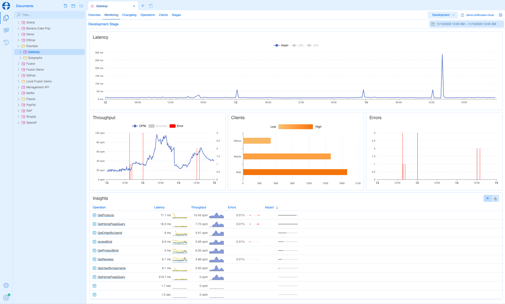
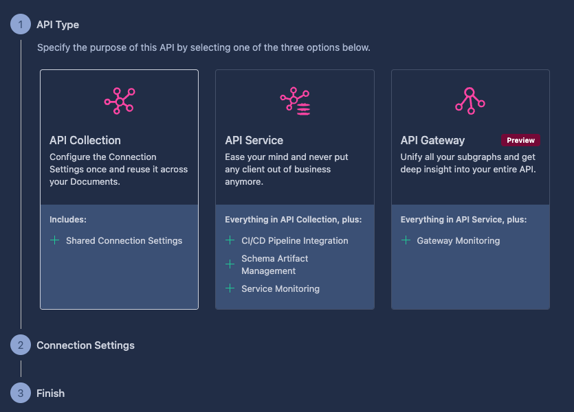
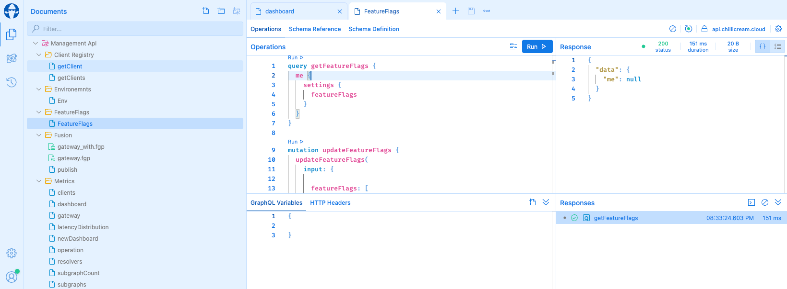
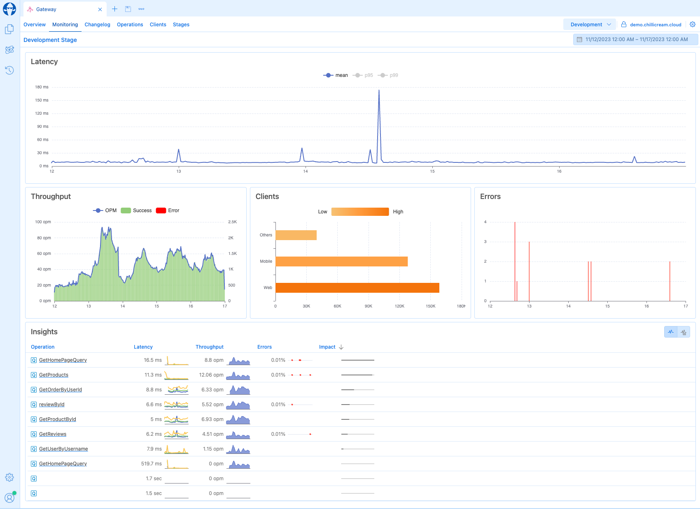
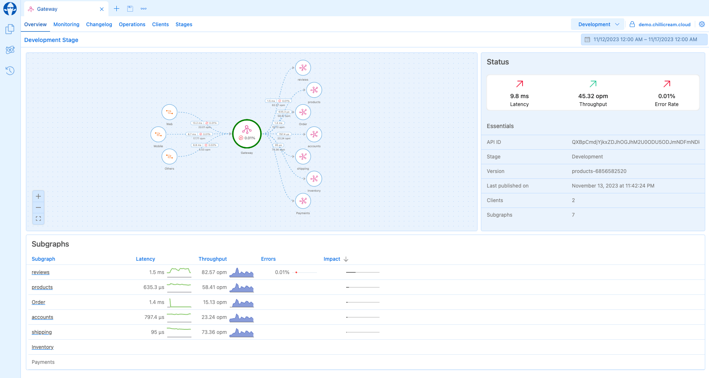
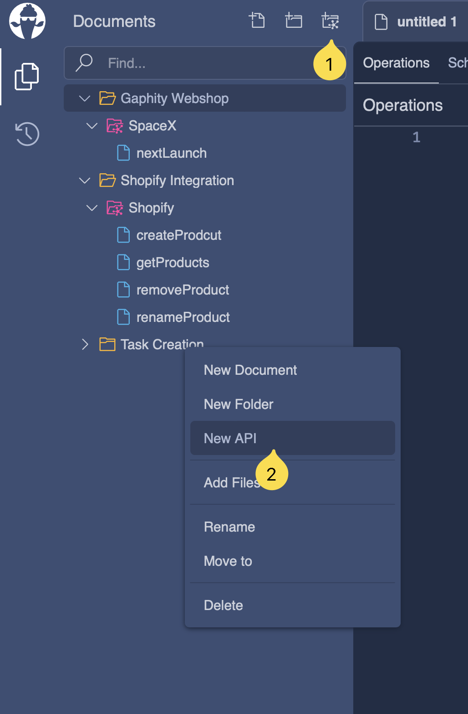

--- 
title: Apis
---

An API within the context of Banana Cake Pop, refers to an representation of your GraphQL Servers. 
This representation is more than a mere conceptual framework — it serves as a practical tool that allows you to group your documents and share common settings like connection and authorization parameters among them.

Additionally, an API forms the foundation for your client registry, schema registry setup and the telemetry. For more detailed information on these features, refer to the [Schema Registry](/docs/bananacakepop/v2/apis/schema-registry) guide
 the [Client Registry](/docs/bananacakepop/v2/apis/client-registry) and the [Telemetry](/docs/bananacakepop/v2/apis/open-telemetry) guide.

# API Types

## API Collection

A compilation of GraphQL Documents with shared connection settings, enabling the grouping of documents for sharing with your t.

## API Service

Incorporates all features of an API Collection and adds the capability to register your schema and clients in the schema registry. It also includes the use of telemetry for service monitoring. This type is ideal for representing a single deployment service or a subgraph.

## API Gateway

Encompasses all the features of the API Service, along with the ability to publish and manage fusion configuration. Additionally, it supports distributed telemetry for comprehensive monitoring of your Gateway.

# Creating an API

Creating an API in Banana Cake Pop is a user-friendly process. There are three methods available:

1. Click on the `Create Api` button located at the top of the document explorer toolbar.
2. Right-click within the document explorer and select `New Api` from the context menu. This creates a new API within the currently selected folder. Note: APIs can be organized in folders but cannot be nested within each other.
3. Choose the API Type. Options include `API Collection`, `API Service`, or `API Gateway`.
