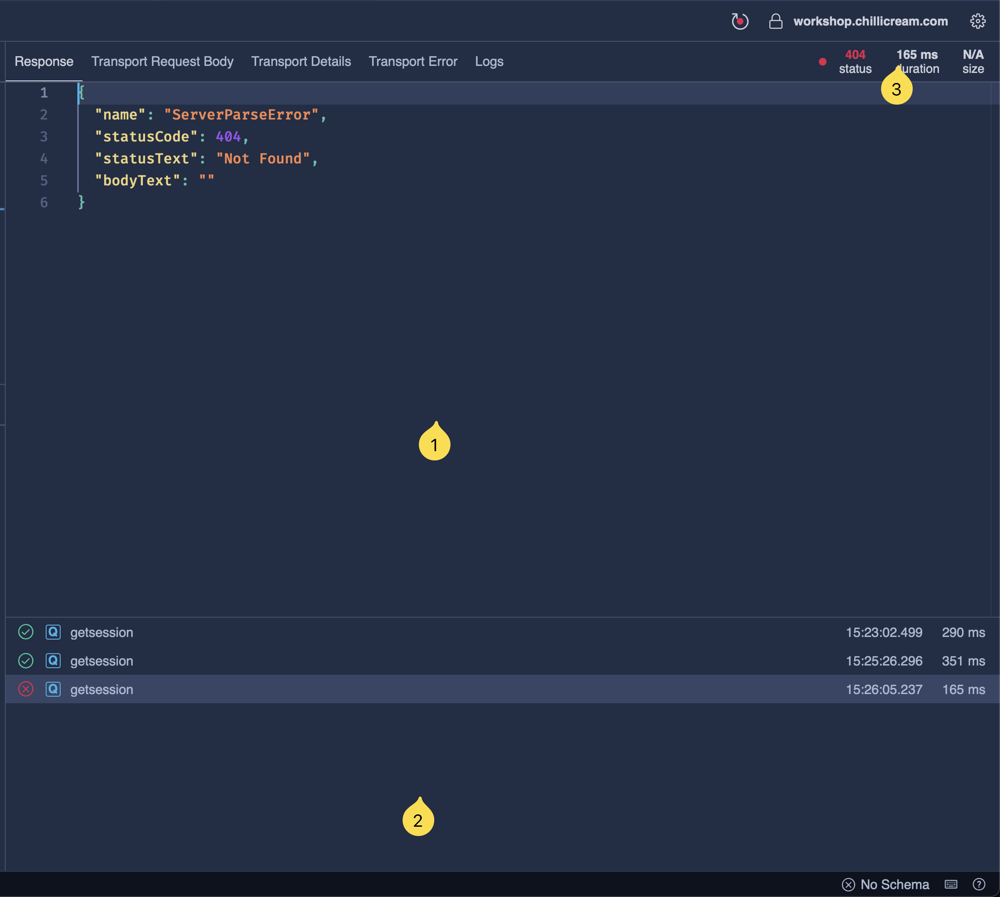
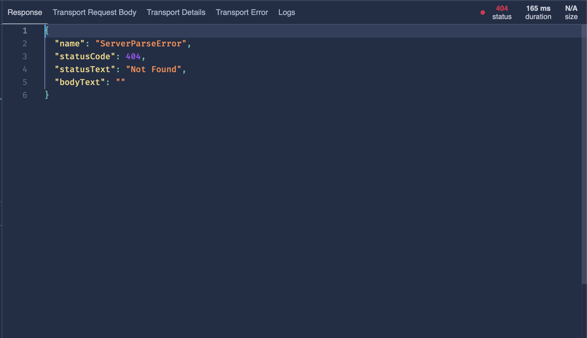
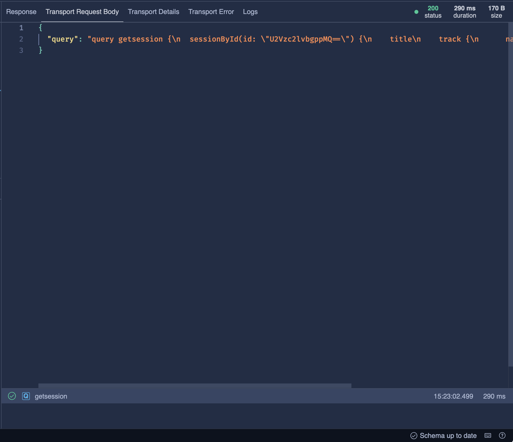
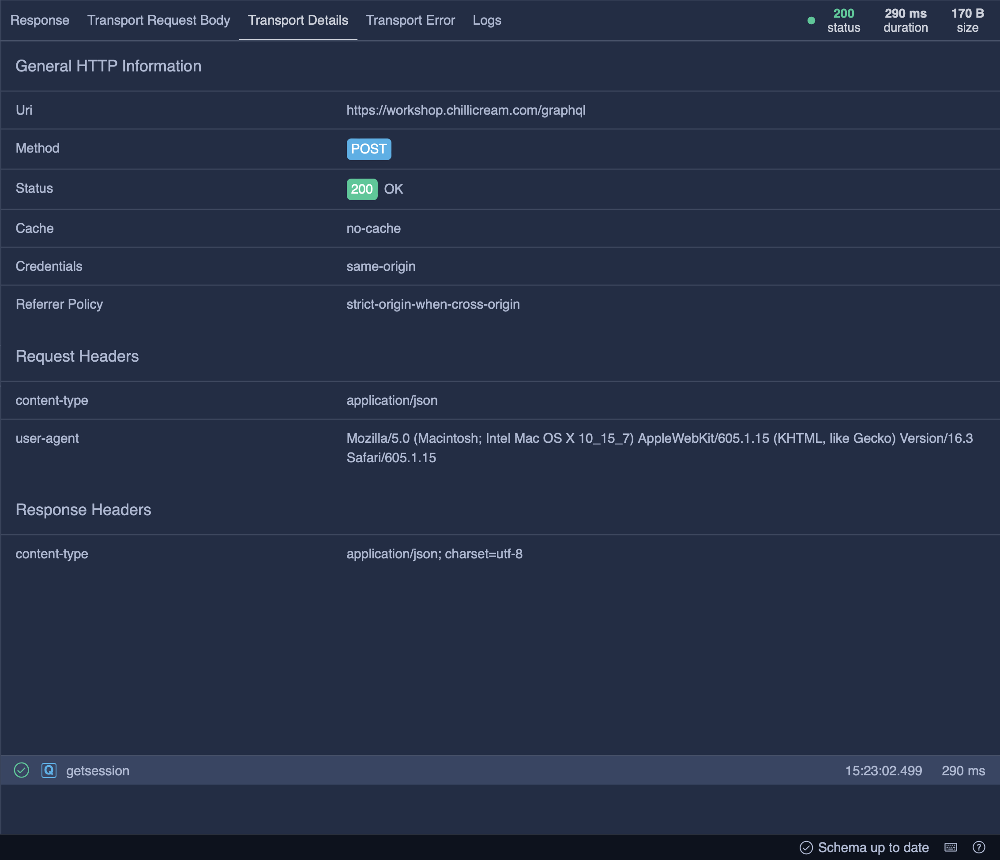
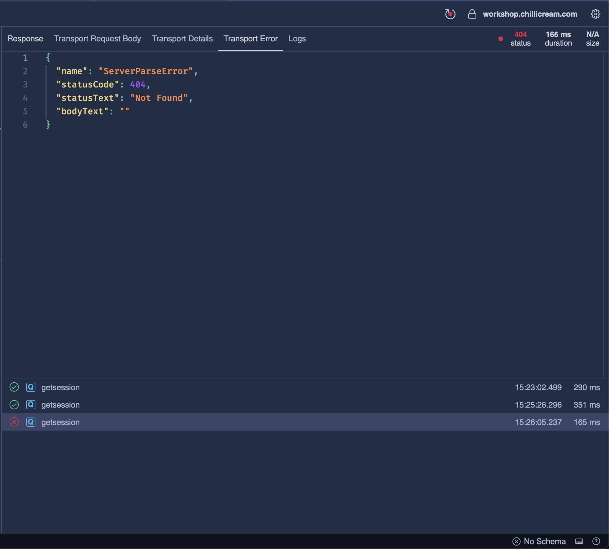
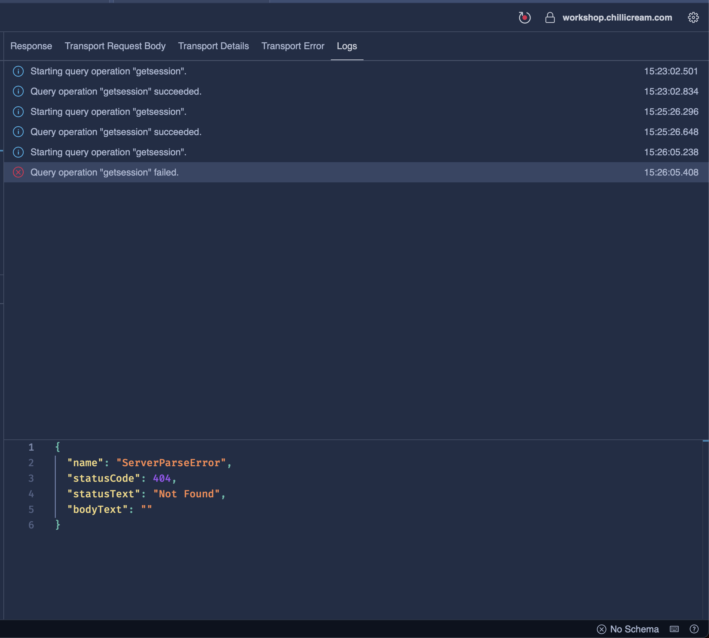
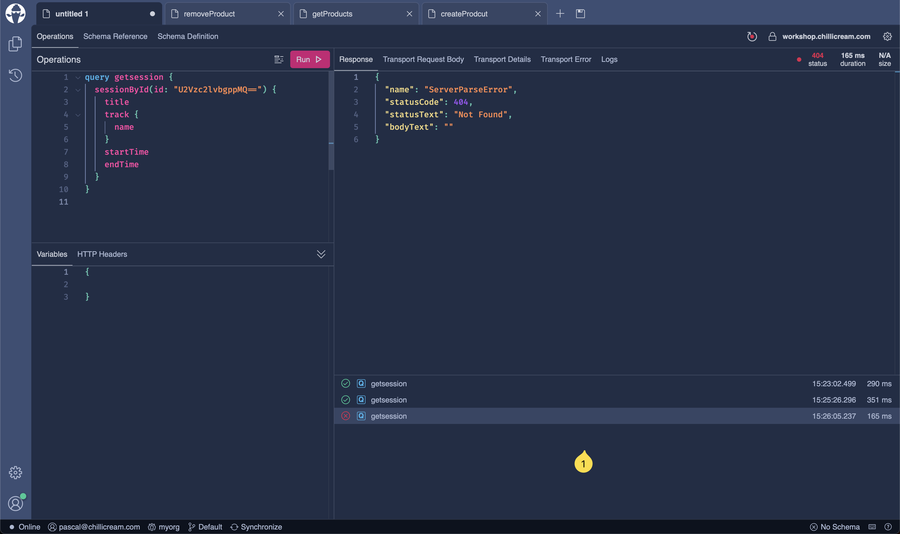

The Response Pane is a central feature that is located to the right of the query editor. Its primary function is to display the response of a query that has been executed, but it offers a range of additional features that help in analyzing these responses.

The pane is divided into two sections:

1. The upper section displays all response and transport information.
2. The lower section maintains a record of all executed queries related to the current document.
3. Additionally, you can get a brief overview of the response status code, the duration, and the size of the last executed request on the top right of the pane.

# Response Section

This part of the pane  displays the JSON response of the executed query. In case you have deferred results, this view amalgamates all results into one JSON object. For those using subscriptions, this view will display the most recent result of the subscription.

# Transport Request Body

Found under a separate tab, this section provides the raw JSON request sent to the server.

# Transport Details

This pane  provides in-depth details of the request and response. Here is a rundown of the information displayed:

* **General HTTP Information:** Contains basic information such as the URI, HTTP Method, and Status Code.
* **Request Headers:** Display metadata for the HTTP request, including content-type and user-agent.
* **Response Headers:** Provide information about the HTTP response, such as the content-length, content-security-policy, and strict-transport-security.

# Transport Error

This tab  displays a JSON representation of any errors returned by the server when the request fails.

# Logs

The Logs tab  records all logs generated during the execution of a query. This includes all requests, patch responses, subscription results, errors, and warnings. Clicking on a log entry will prompt the editor below to show more details about the log entry.

# History

The History tab  keeps track of all the queries that have been executed in the current document. Clicking on a history entry will load the corresponding query into the editor, allowing you to review the response.
