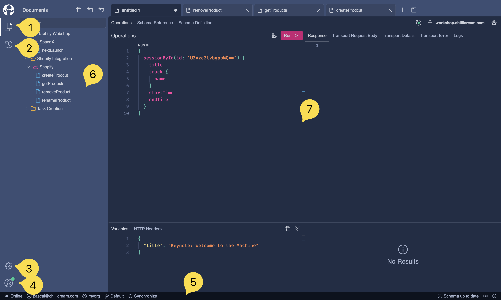

Let's explore the main components of the Banana Cake Pop application's user interface:

1. **Sidebar**: The sidebar contains various icons representing different sections of the application. Interacting with these icons will alter the content displayed in the main area. For instance, in the current view, the highlighted icon indicates that we are in the **Documents** section. For detailed information, please refer to our guide on [Documents](/docs/bananacakepop/v2/documents).

2. **History**: This section displays the list of recently executed queries.

3. **Settings**: To modify application preferences, you can navigate to the Settings section. Learn more about it in our [Settings Guide](/docs/bananacakepop/v2/settings).

4. **User Menu**: This section allows users to sign in/out, manage their accounts, and handle billing. You can read more about account management and billing in the organization section [Organizations](/docs/bananacakepop/v2/organizations).

5. **Status Bar**: The status bar provides quick access to workspace, organization, and synchronization features. It also displays additional information. More details are provided in our [Status Bar Guide](/docs/bananacakepop/v2/explore-the-ui/status-bar).

6. **Document Tree**: Here you can manage files, folders, documents, and APIs. Read more about it in the [Explorer](/docs/bananacakepop/v2/explore-the-ui/explorer).

7. **Main Area**: The main area showcases the content related to the selected section from the sidebar. In this instance, it displays the **Documents** section.
