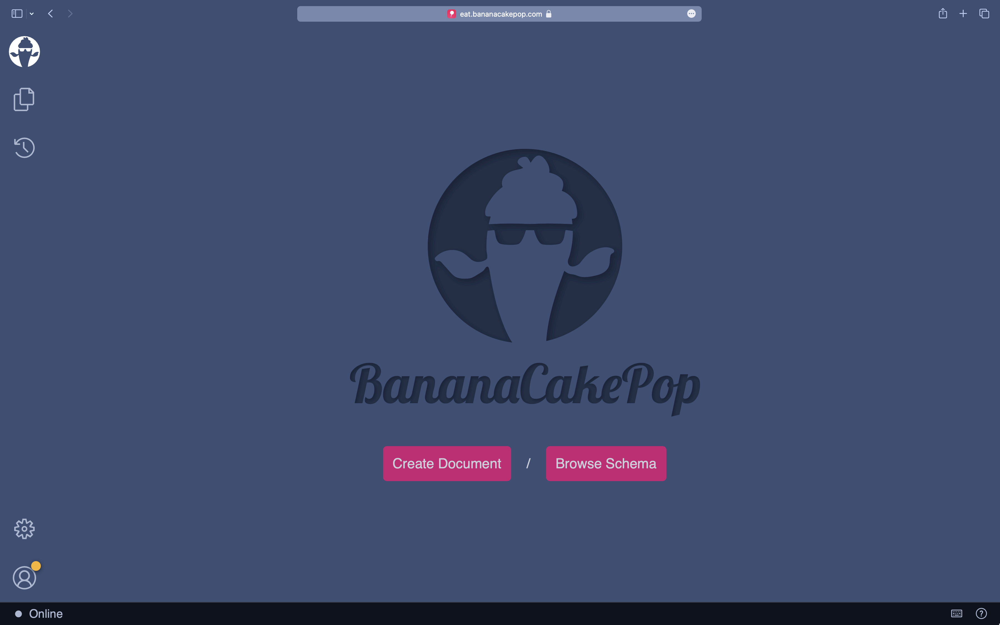
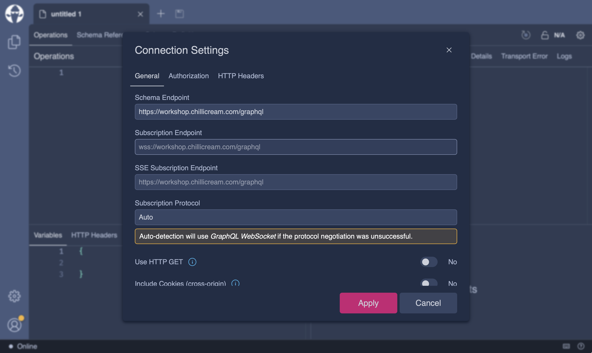
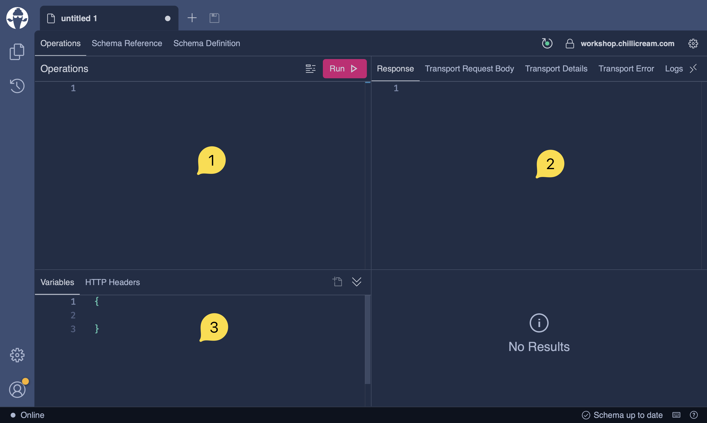
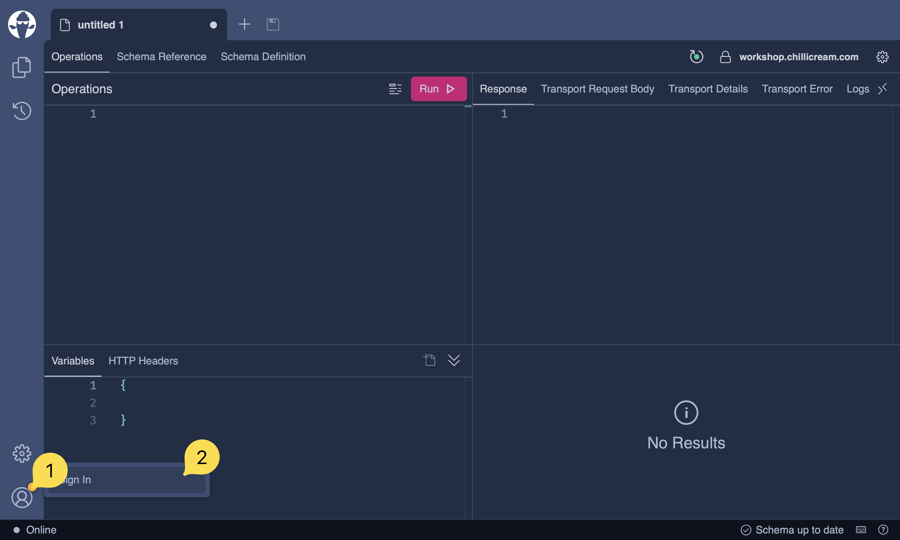
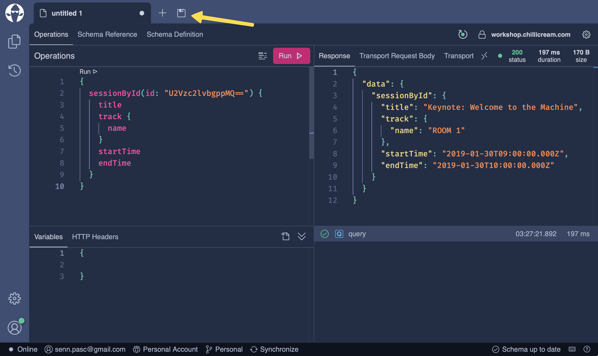

Ready to explore the delicious features of Banana Cake Pop? In this getting started guide, we'll show you how to get up and running with Banana Cake Pop. 
You have the option to choose between the convenience of the web app or the enhanced capabilities of the desktop version. We'll guide you through the setup process, so you can start enjoying all that Banana Cake Pop has to offer.

Get ready to unlock the full potential of GraphQL with Banana Cake Pop. Choose your preferred option and follow the setup instructions to start enjoying the delicious features that Banana Cake Pop has to offer.
# Web App

To begin your exploration, simply visit [eat.bananacakepop.com](https://eat.bananacakepop.com/) and experience the convenience of Banana Cake Pop's web-based version. This excellent starting point allows you to conveniently probe public GraphQL APIs and access most of the features that Banana Cake Pop offers. For an even more immersive experience, you can also install the web app as a Progressive Web App (PWA) on your device, providing a native-like experience.

# Desktop App

You can install the Banana Cake Pop App directly from our [download page](/products/bananacakepop). The download page provides DMG installers for macOS, x64 installers for Windows, and AppImage/Snap installers for Ubuntu and Ubuntu-based Linux distributions. Note that other Linux distributions or installer formats are currently unsupported.

## Package Managers 

1. **Homebrew**: If you have [Homebrew](https://brew.sh) installed, use this command to install the app:

```bash
brew install --cask banana-cake-pop
```

2. **Windows Package Manager**: For Windows 11 or a supported version of Windows 10 with the [Windows Package Manager](https://docs.microsoft.com/en-us/windows/package-manager/) installed, use:
    ```powershell
    winget install banana-cake-pop
    ```
3. **Scoop**: To install on Windows 7, 10, or 11 using [Scoop](https://scoop.sh/), run these commands:
    ```powershell
    scoop bucket add extras
    scoop install banana-cake-pop
    ```

Upon successful installation, follow the steps in the [Your first Query](#your-first-query) guide to execute your first GraphQL query using Banana Cake Pop.

# Your First Query

Lets guide you through the process of creating your first GraphQL query document using Banana Cake Pop.

**Step 1:** Start the Banana Cake Pop application. You should see an interface similar to this: 


**Step 2:** Click on the "Create Document" button to initiate the creation of your first query document.

**Step 3:** You'll see a new document called 'untitled 1' generated. Simultaneously, the connection settings dialog box will pop up automatically. 
Now, input the following link into the 'Schema Endpoint' field: https://workshop.chillicream.com/graphql
It should resemble this:



**Step 4:** Click on the 'Apply' button. This will save your settings and close the dialog box.

**Step 5:** At this point, your screen should look like this:


Take note of the following key elements:

1. **Operation Pane:** This is where you will input your queries.
1. **Response Pane:** Here, you will see the output or response of your queries.
1. **Variables Pane:** This is where you can define variables for your query.


**Step 6:** The green circle at the top right next to the schema url indicates that you are connected to the GraphQL server and that your schema is fetched. You now have full intellisense for your queries. Copy the following GraphQL query and paste it into the 'Operations' editor area:

```graphql
{
  sessionById(id: "U2Vzc2lvbgppMQ==") {
    title
    track {
      name
    }
    startTime
    endTime
  }
}
```

**Step 7:** Click on the 'Run' button. You should see a response with data in the 'Response' area. Congratulations, you have completed a GraphQL query!

**Step 8:** 
Now, let's save your document. 


Sign in to your account by clicking the 'Sign In' button on the user icon in the bottom left corner of the screen. If you don't have an account, you can create a new one.

**Step 9:** Once you are signed in, save your document by clicking the 'Save' button next to the tabs. Your documents are now synced between your devices.



**Step 10:** Great job! You've successfully created, executed, and saved your first GraphQL query using Banana Cake Pop. To learn more about the Banana Cake Pop User Interface, head over to the [Explore the UI](/docs/bananacakepop/v2/explore-the-ui) guide.

Happy querying!
