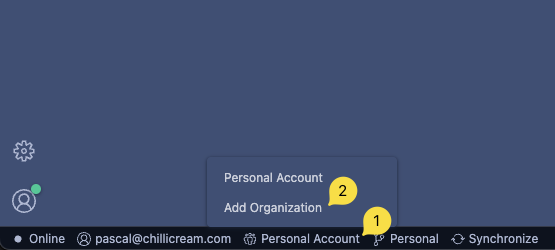
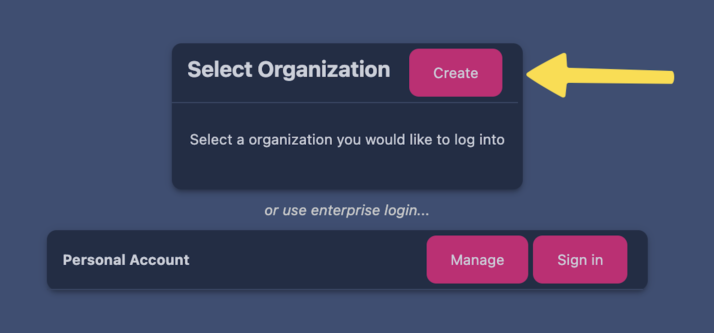
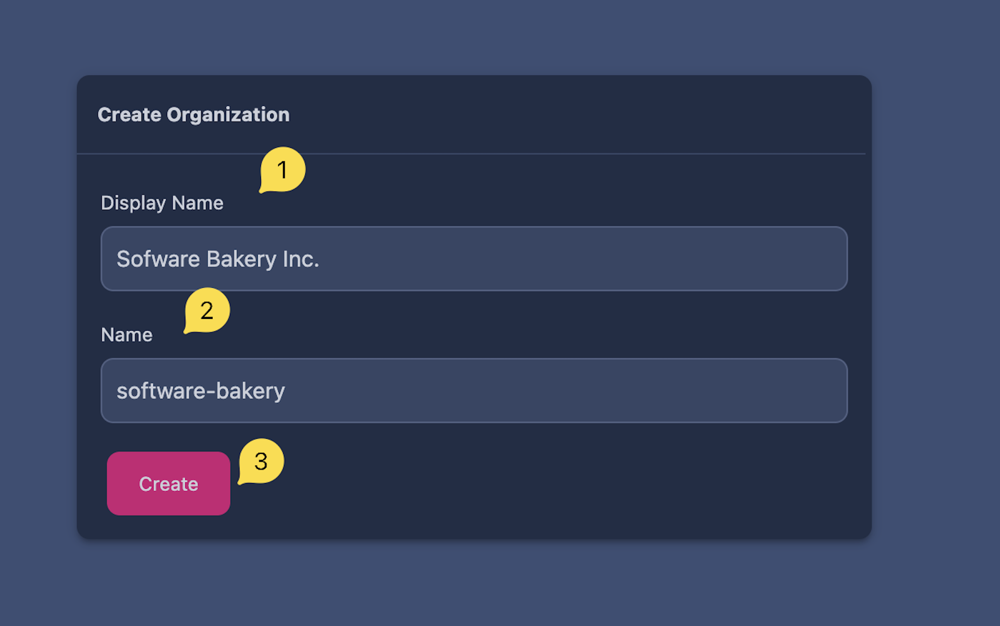
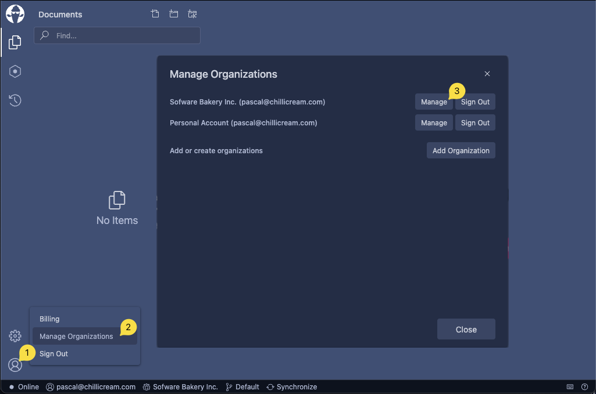
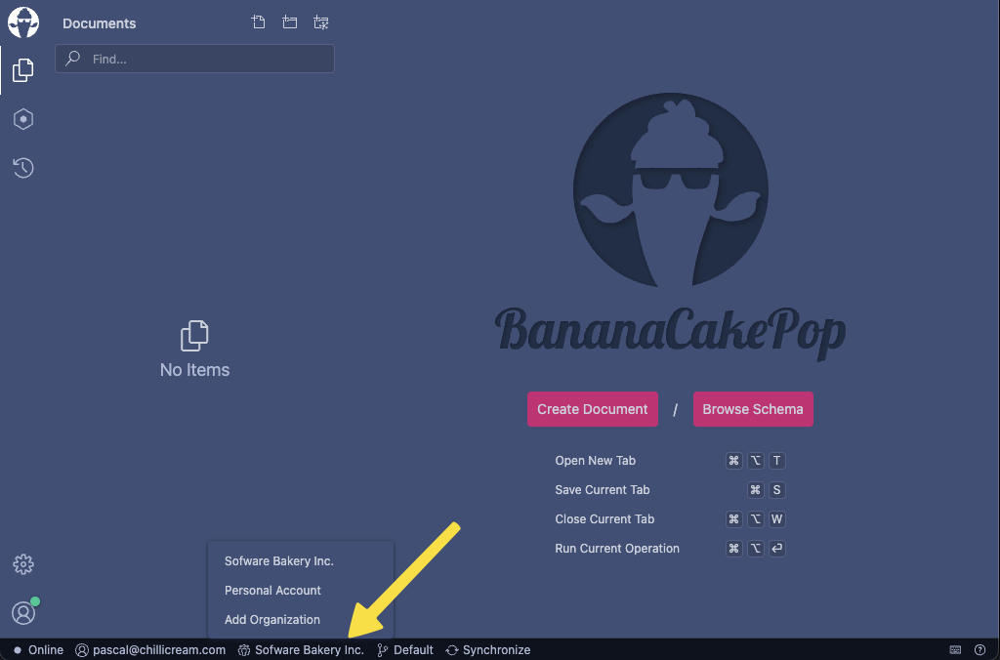
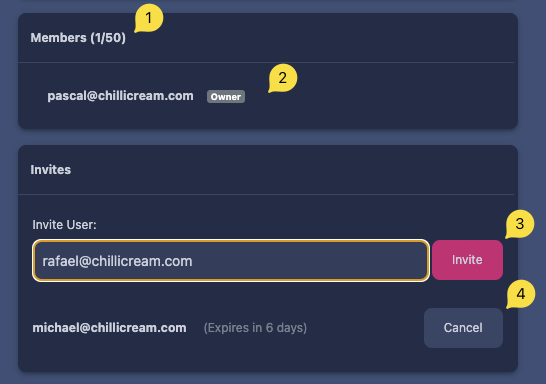
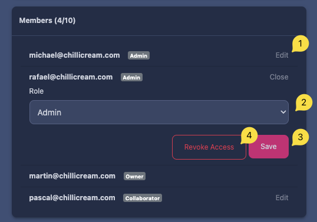
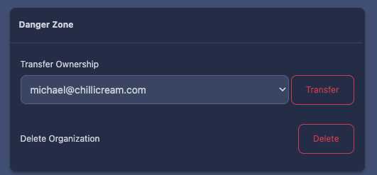
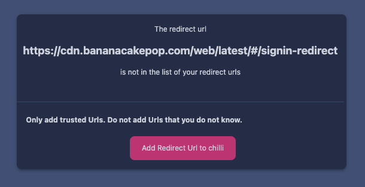
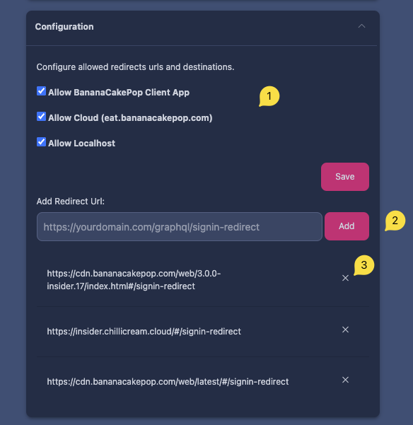

This guide will walk you through the features and functionalities of BCP Organizations, a structure designed to help teams and individuals work efficiently and effectively on GraphQL related services.

# What is an Organisation
 An organization typically represents an entire entity or a larger unit within an entity. Each organization can host multiple workspaces, allowing further categorization and organization of resources. A workspace might correspond to a specific project, a specific team within the organization, or a group of related APIs. 

Each BCP user has a personal organization. This is a private space for individual work or for projects that are not associated with any team or company organization. The personal organization is not visible to other users, is created by default and cannot be deleted. 

# Creating an Organisation

BCP allows for multiple organisations under one account. To add a new organisation, navigate to the organisation switcher in the status bar and click on the "Add Organisation" button.

You will be redirected to the management portal. Here you can create a new organisation by clicking the 'Create' button.

Each organisation has a unique name and a display name which can be set during creation. 
The name must be lowercase and may only include dashes (-) and underscores (_).

# Managing Organisations
To manage your organisations, you have to open the management portal. 

In the client app, you can do this by clicking Manage Organizations'  and then 'Manage' on the organization that you like to manage.

You can also navigate to [here](https://identity.chillicream.com/Organizations) to open the management portal and press 'Manage' on the organization that you like to manage.

# Switching Organisations
In Banana Cake Pop, you can be signed into multiple organisations at the same time and switch between them in the status bar. The organisation switcher also allows you to create new organisations. 

# Managing Members

1. The count of members and the number of seats available in your subscription are displayed in the management overview section. (members/total seats)

2. This list show all the members of the organisation and their role.

3. Members can be invited to join an organisation via email. In the management overview section, the 'Invite User' button allows you to send an invitation email containing a join link. 

4. Open invitations are displayed below. You can revoke an invitation by clicking on the 'Cancel' button. Once an invitation is expired, you can resend it by clicking on the 'Resend' button.

## Joining an Organisation
Invited users can join an organisation in two ways:

1. By clicking on the join link they received via email.
1. By opting to join during login on the sign in page.

During sign-in, the user can select into which organisation (join orgs or personal) they want to sign in.

[Description of visualization: Screenshot showing the organisation selection during sign-in]

# User Roles and Access

There are three distinct roles within an organisation: Owner, Admin, and Collaborator. Each role carries specific permissions:

| Role         | Transfer Ownership | Delete Organization | Invite Users | View Subscriptions | Add Redirect URLs |
| ------------ | ------------------ | ------------------- | ------------ | ------------------ | ----------------- |
| Owner        | Yes                | Yes                 | Yes          | Yes                | Yes               |
| Admin        | No                 | No                  | Yes          | Yes                | Yes               |
| Collaborator | No                 | No                  | No           | No                 | No                |

- **Owner:** The owner can transfer ownership, delete the organisation, and has all the permissions of an admin. Each organisation can only have one owner.

- **Admin:** Admins can invite users to the organisation, view subscriptions, and add redirect URLs. They also have all the permissions of a collaborator.

- **Collaborator:** Collaborators can log into the organisation and leave the organisation. They cannot add redirect URLs or invite new users.

## Managing Permissions

You can manage the permissions of each member in the member list. 

1. Press the 'Edit' button on the right side of the member list to open the edit dialog.

2. Select the desired role for the member.

3. Press the 'Save' button to save the changes.

4. You can also remove a member from the organisation by clicking on the 'Revoke Access' button.

# Transferring Ownership 

Ownership of the organisation can be transferred to any existing member from the management portal. 
In the danger zone section, click on the 'Transfer Ownership' button to open the transfer dialog.

# Redirect URLs 

Each time a user signs into an organisation from a new origin, a redirect URL must be added to the organisation. 

This security measure is designed to prevent your access tokens from being leaked to any arbitrary site hosted by third parties.

If the user is a collaborator, they won't have the permissions to add the URL and will see an informative message. An admin, on the other hand, can directly add the URL to the organisation. 

You can add the redirect URL in two ways:

1. By signing in from the new origin. This will trigger a prompt to add the URL to the organisation.

2. By adding the URL directly from the management portal. 

In the portal you have more options to configure the allowed destinations. You can for example allow all localhost origins. Or disable the access to the web UI in the [cloud](https://eat.bananacakepop.com) 

1. Configure the allowed types of origins.
2. Add redirect Urls to the organisation.
3. Remove redirect Urls from the organisation.
