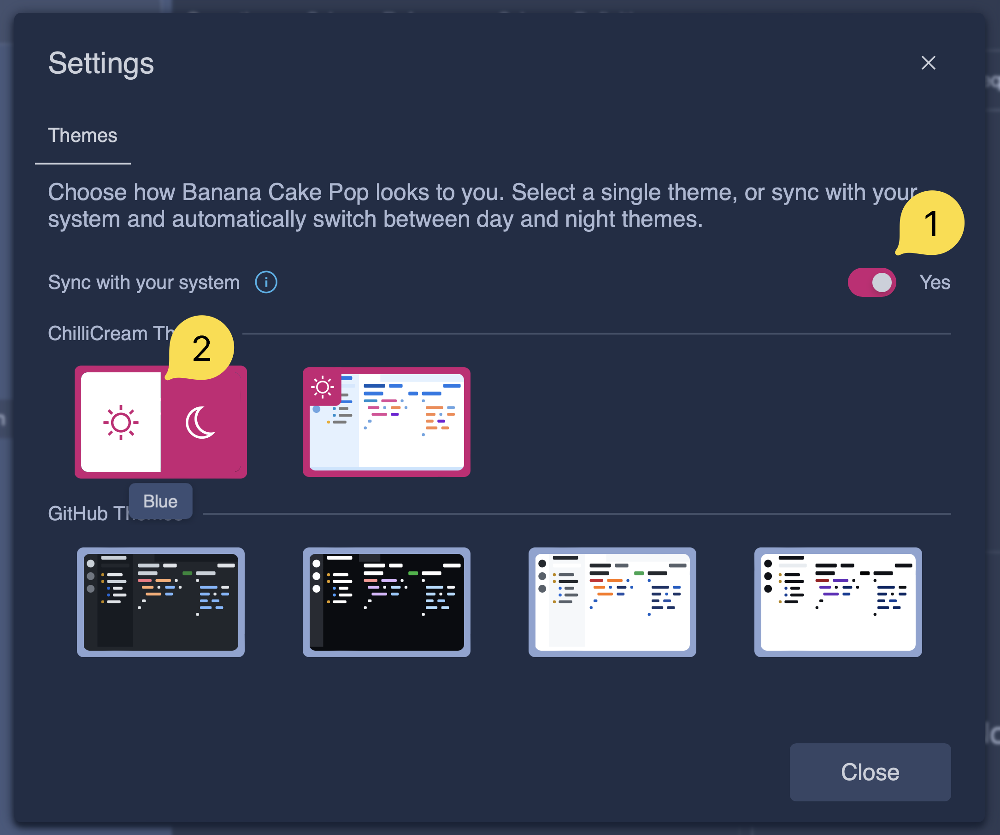
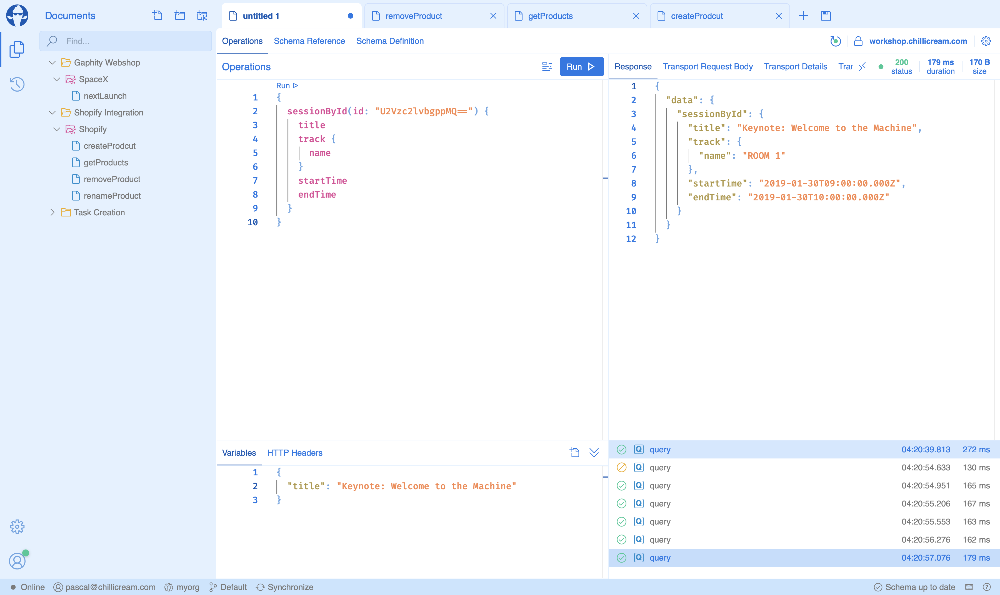
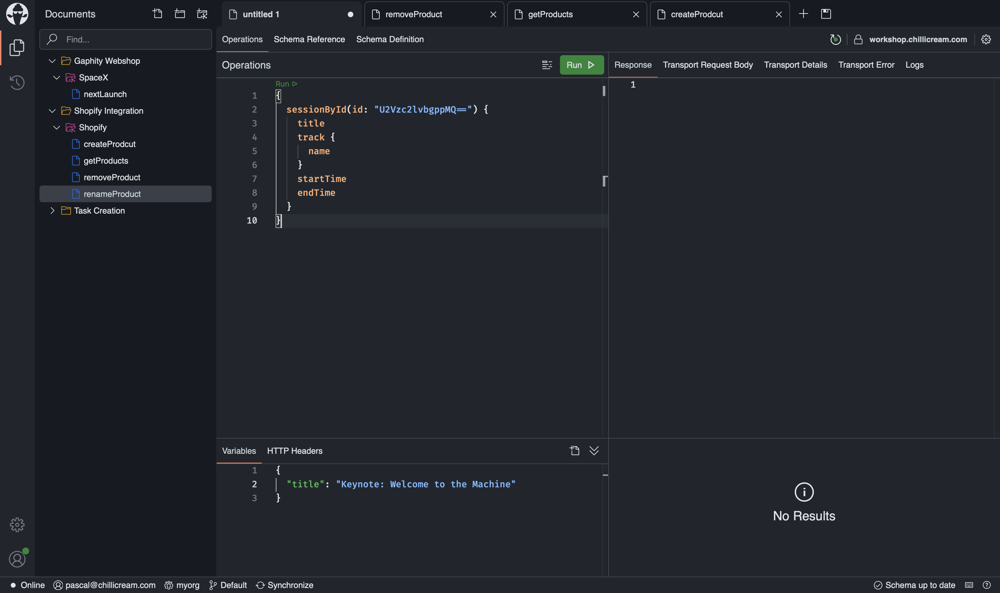
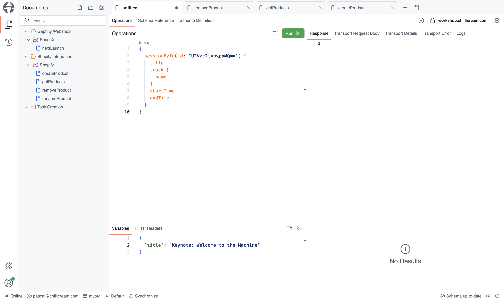
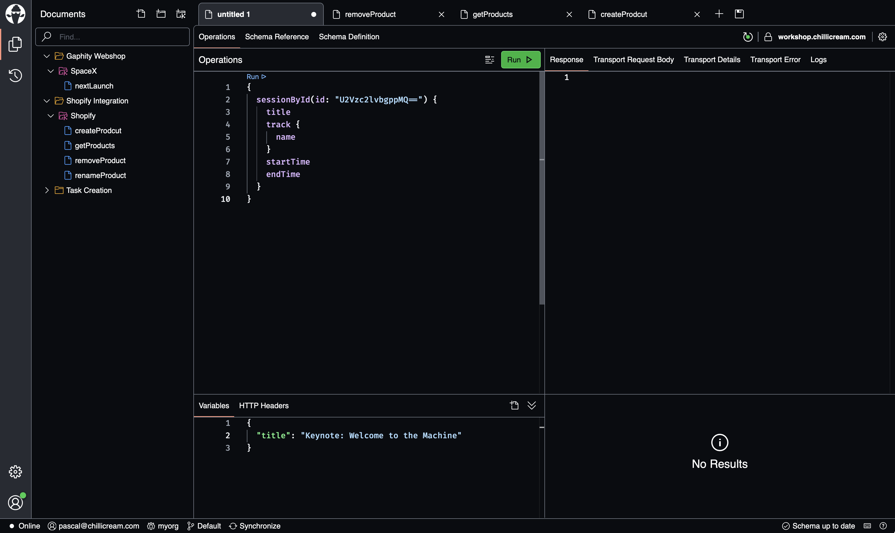
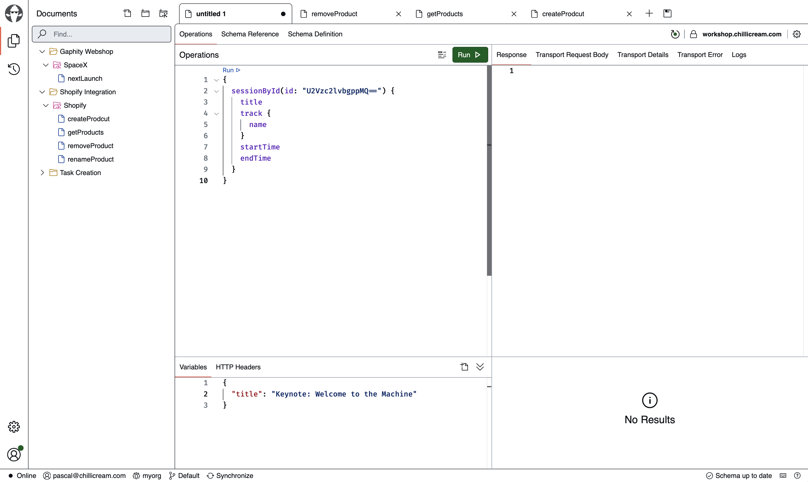

BCP offers a range of themes to customize the visual appearance of the application. These themes are available as light and dark themes, providing flexibility to suit different user preferences.

By syncing the theme mode with your operating system (OS) settings, BCP can automatically adjust the theme based on your OS's light or dark mode. When you switch between light and dark mode on your OS, the theme in BCP will change accordingly. You can specify a dark theme and a light theme to be used when syncing with your OS settings. You can set a default theme for light mode by clicking on the left side of the theme, or set a default theme for dark mode by clicking on the right side of the theme.

Here are the available themes:

**Chilli Cream Blue** 

**Chilli Cream White** 

**GitHub Dark** 

**GitHub Light** 

**GitHub High Contrast Dark** 

**GitHub High Contrast Light** 

