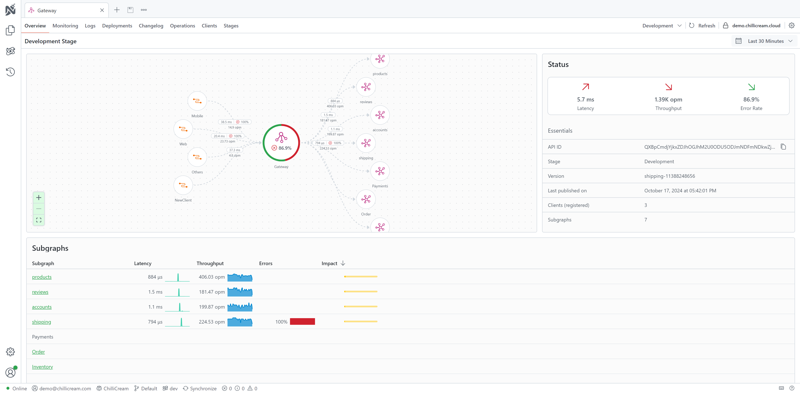
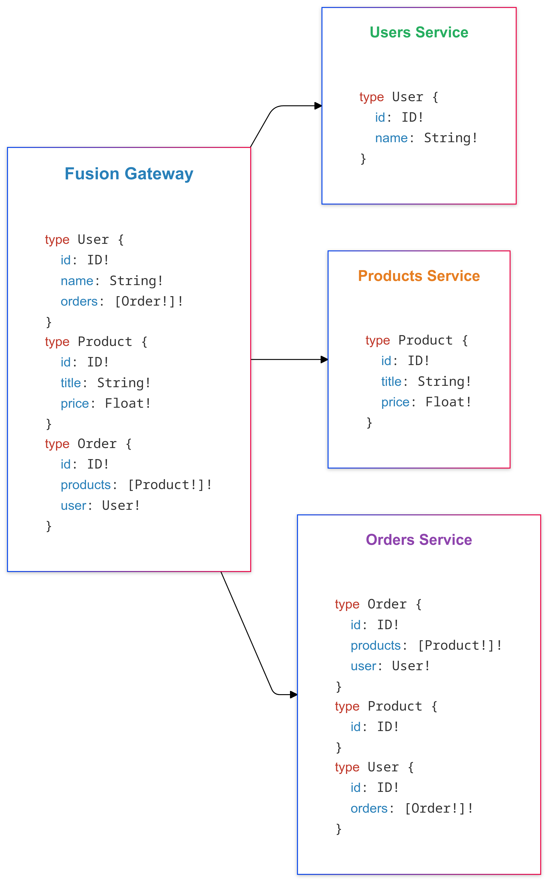

Fusion combines different source schemas into a single unified schema. This allows multiple GraphQL services to work together seamlessly, providing a unified API experience while preserving the independence of each service.

At its core, Fusion adopts a distributed architecture that combines multiple GraphQL services, into a single, cohesive API. This architecture allows each source to own its domain-specific schema and logic, keeping autonomy and independent development across different teams.

In an era where microservices and distributed systems are the norm, managing and scaling APIs efficiently becomes a significant challenge. Fusion addresses these challenges by allowing teams to develop, deploy, and scale their GraphQL services independently while still contributing to a cohesive and unified API.

Fusion introduces a gateway component that acts as the single entry point for client requests. When a client queries the gateway, Fusion intelligently routes parts of the query to the appropriate domain services, aggregates the results, and returns a unified response. This process is transparent to the client, which interacts with the supergraph as if it were a monolithic GraphQL API.



# Video Walkthrough

Join Michael in this video as he introduces Fusion and explains you how to get started with it:

<Video videoId="peMdejyrKD4" />

# Benefits of Using Fusion

## Autonomous Team Development

Fusion makes it easy for teams to work independently on their own services while still contributing to a unified schema. By clearly separating schemas, Fusion allows each team to develop, test, and deploy their services without being tightly connected to what other teams are doing. This reduces the need for constant coordination and makes it easier for teams to focus on their own goals.

Schema boundaries act like agreements between teams, ensuring that everything works together without requiring teams to be tightly linked. This approach speeds up development, simplifies teamwork, and helps teams deliver their services without unnecessary delays.

## Scalability and Modularity

Fusion is designed to support the modularity of your domain. By enabling the composition of different bounded contexts into a unified schema, Fusion allows each service to reflect its specific domain while remaining independently developed, deployed, and scaled. This modular approach ensures that teams can evolve their services to meet unique performance and domain needs without disrupting the broader system.

## Unified API Experience

By consolidating multiple GraphQL APIs into a single endpoint, Fusion allows clients to fetch all the required data with a single request. This eliminates the need for clients to manage multiple endpoints or coordinate several requests, leading to improved performance and a simplified client-side codebase.

Clients interact with a single, unified GraphQL API, simplifying the development of frontend applications. Fusion handles the complexity of distributed systems behind the scenes, providing a seamless API experience.

## Alignment with Industry Standards

Fusion is a key contributor to the Composite Schema Specification, an open standard under the GraphQL Foundation that aims to standardize the composition and execution of distributed GraphQL services. Backed by industry leaders, this specification seeks to create a unified approach for federated GraphQL schemas.

Although the specification is still in development, Fusion actively aligns with its evolving guidelines and is committed to full compliance once finalized. This ensures that Fusion remains interoperable, up-to-date with industry best practices, and at the forefront of GraphQL innovation.

# When to Use Fusion

Fusion is a powerful choice for organizations looking to streamline and enhance their GraphQL architecture. Here are some scenarios where Fusion shines:

- **Operate Multiple Domains**: If your application spans multiple domains, each managed by separate teams or departments, Fusion simplifies integration by unifying these services under a single GraphQL schema. This allows teams to focus on their specific domain without worrying about breaking the overall API.

- **Embrace Microservices**: Fusion is an excellent fit for organizations adopting a microservices architecture. It enables each service to be independently developed, deployed, and maintained, while still offering a seamless, unified API for clients. This reduces complexity and promotes clear service boundaries.

- **Require Scalability**: Applications often have components with different scaling needs. Fusion lets you scale individual services independently based on their specific load requirements, avoiding the overhead of scaling the entire system unnecessarily.

- **Seek Team Autonomy**: For organizations with large or decentralized teams, Fusion empowers each team to work autonomously on their own services. Teams can adopt their preferred technologies, workflows, and development schedules while Fusion ensures everything integrates smoothly. This minimizes interdependencies, speeds up development, and reduces coordination challenges.

- **Simplify API Maintenance**: Fusion helps reduce the operational overhead of managing multiple APIs by consolidating them into a single, cohesive GraphQL schema. This makes it easier to track changes, troubleshoot issues, and evolve the API as business requirements grow.

Whether you're looking to unify a complex domain, scale individual services, or enable independent team workflows, Fusion provides the tools to achieve these goals effectively.

# Composition

Composition in Fusion refer to the process of combining multiple GraphQL schemas from different services into a single, unified schema. This involves merging types, resolving conflicts, and establishing relationships between types defined in different services.

This process occurs at build time rather than runtime. If there are any issues with the composition, Fusion provides feedback during the build phase, allowing you to identify and resolve conflicts or inconsistencies before deploying the composed schema.

Consider an e-commerce platform with separate services for users, products, and orders. Each service defines its own GraphQL schema:

- **Users Service**: Defines the User type with fields like id, name, and orders.
- **Products Service**: Defines the Product type with fields like id, title, price, and inStock.
- **Orders Service**: Defines the Order type and references the Product type.

During composition, Fusion merges these schemas into a unified schema that clients can query seamlessly. The gateway understands how to fetch and assemble data across these services, making cross-service relationships transparent to the client.

A client might execute a query like:

```graphql
query {
  user(id: "123") {
    name
    orders {
      id
      products {
        title
        price
      }
    }
  }
}
```

The Fusion gateway routes parts of this query to the appropriate services, collects the responses, and assembles them into a single, cohesive result.

# Thinking in Fusion

Fusion introduces a new way of GraphQL API development by emphasizing entities and their relationships across different services.

Entities are central to Fusion’s approach. They are types that can be extended across multiple services, identified by a unique key, and can be referenced and resolved by different services. This allows services to extend types defined elsewhere, adding fields or resolvers specific to their domain.

For example, the Orders service might define an Order type and reference a Product type defined in the Products service. Through entities, the gateway understands how to fetch and assemble data for Product when included in an Order.

# Relationship with Schema Stitching

Schema stitching was an early method of combining multiple GraphQL schemas, but it has some significant limitations. Changes to a service often require corresponding updates to the central gateway, increasing maintenance overhead. Additionally, schema stitching is resolver-based rather than entity-based. Without the concept of entities, schema stitching cannot optimize data fetching effectively, often leading to less efficient query execution and increased complexity.

Fusion addresses these limitations by introducing automated schema composition and leveraging an entity-based approach. This enables optimized data fetching and better handling of relationships between types across services.
