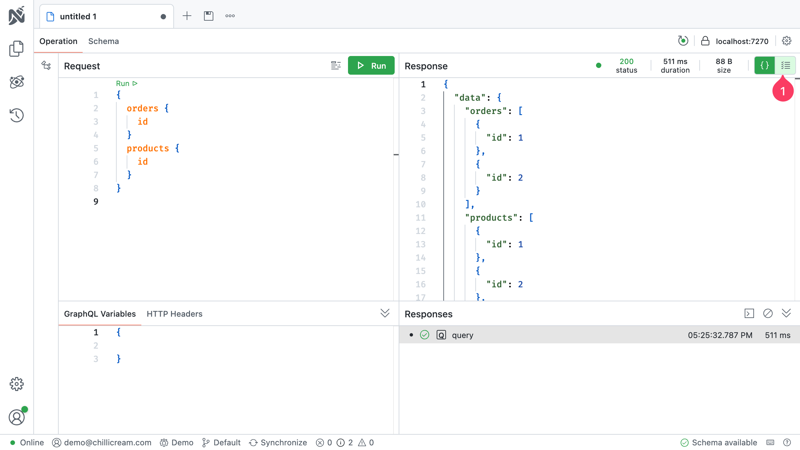
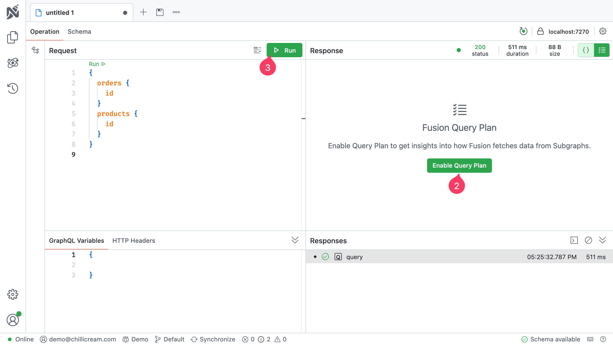
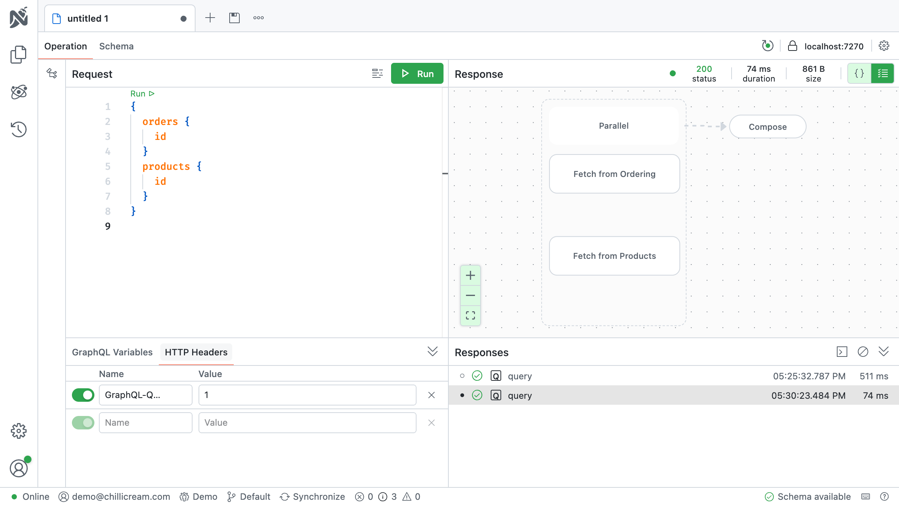

All example code can be found in the [Fusion Quick Start repository](https://github.com/ChilliCream/hotchocolate-examples/tree/master/fusion)

# Introduction

This quick start guide will walk you through setting up a federated GraphQL API using Fusion. By the end of this tutorial, you'll have a gateway that unifies two independent GraphQL services—`Products` and `Orders`—into a single, cohesive API. This unified API will allow clients to query data from both services seamlessly, demonstrating the power and flexibility of Fusion in orchestrating microservices.

You can find the complete code for this tutorial in the [Fusion Quick Start repository](https://github.com/ChilliCream/hotchocolate-examples/tree/master/fusion/complete/quick-start)

## Prerequisites

- **.NET SDK** installed on your machine
- [Checkout the initial code](https://github.com/ChilliCream/hotchocolate-examples/tree/master/fusion/initial/quick-start)

# Step 1: Understanding the Source Schemas

We start with two separate GraphQL services, each with its own schema and responsibilities:

## Orders Service

The `Orders` service manages order-related data. Its schema defines two primary types: `Order` and `LineItem`.

```graphql
type LineItem {
  id: Int!
  quantity: Int!
  productId: Int!
}

type Order {
  id: Int!
  name: String!
  description: String!
  items: [LineItem!]!
}

type Query {
  orders: [Order!]! @cost(weight: "10")
}
```

- **LineItem** represents an individual item within an order, including the `productId` that references a product.
- **Order** encapsulates order details and contains a list of `LineItem` entries.
- The root `Query` allows clients to fetch all orders.

## Products Service

The `Products` service handles product-related data. Its schema defines the `Product` type.

```graphql
type Product {
  id: Int!
  name: String!
  sku: String!
  description: String!
  price: Decimal!
}

type Query {
  products: [Product!]! @cost(weight: "10")
}
```

- **Product** represents an item available for purchase.
- The root `Query` enables clients to fetch all products.

These two services are completely independent and unaware of each other's existence. Our goal is to use Fusion to create a gateway that unifies these schemas into a single API.

# Step 2: Setting Up the Fusion Gateway

The Fusion gateway will act as a single entry point for clients, hosting the unified schema that combines the `Products` and `Orders` services.

## Creating the Gateway Project

Begin by creating a new web project for the gateway:

```bash
dotnet new web -n quick-start.Gateway
cd quick-start.Gateway
```

Add the Fusion package to your project:

```bash
dotnet add package HotChocolate.Fusion
```

## Configuring the Gateway

Update the `Program.cs` file to set up the Fusion gateway:

```csharp
var builder = WebApplication.CreateBuilder(args);

builder.Services.AddHttpClient("Fusion");

builder.Services
    .AddFusionGatewayServer()
    .ConfigureFromFile("gateway.fgp")
    // Note: AllowQueryPlan is enabled for demonstration purposes. Disable in production environments.
    .ModifyFusionOptions(x => x.AllowQueryPlan = true);

var app = builder.Build();

app.MapGraphQL();

app.Run();
```

In this configuration:

- `AddFusionGatewayServer()` registers the Fusion gateway services.
- `ConfigureFromFile("gateway.fgp")` instructs the gateway to load its configuration from the `gateway.fgp` file, which we will create later.
- `ModifyFusionOptions()` allows you to modify Fusion-specific settings, such as enabling query plan visualization for debugging purposes.

# Step 3: Preparing the Source Schemas for Composition

Before the gateway can unify the schemas, we need to prepare each service by creating configuration files and packaging them as Fusion subgraph packages.

## Installing the Fusion CLI Tool

Install the Fusion command-line tool, which we'll use to pack and compose the subgraphs:

```bash
dotnet tool install -g HotChocolate.Fusion.CommandLine
```

## Creating Configuration Files

For each service, create a `subgraph-config.json` file that specifies the subgraph name and its endpoint.

### Products Service Configuration

In the `quick-start.Products` directory, create a file named `subgraph-config.json` with the following content:

```json
{
  "subgraph": "Products",
  "http": {
    "baseAddress": "http://localhost:5003/graphql"
  }
}
```

### Orders Service Configuration

In the `quick-start.Orders` directory, create a `subgraph-config.json` file:

```json
{
  "subgraph": "Orders",
  "http": {
    "baseAddress": "http://localhost:5004/graphql"
  }
}
```

Ensure that the `baseAddress` matches the actual endpoints where each service is running.

## Exporting the Schemas

Each service needs to export its schema to a `schema.graphql` file. Assuming you are using `HotChocolate.AspNetCore.CommandLine` and have included `app.RunWithGraphQLCommands(args);` in your `Program.cs`, you can generate the schema file by running:

```bash
dotnet run -- schema export --output schema.graphql
```

Execute this command in both the `quick-start.Products` and `quick-start.Orders` directories to generate their respective schema files.

### Packing the Subgraphs

With the configuration and schema files in place, package each service into a Fusion subgraph package (`.fsp` file) by running the following command in each service directory:

```bash
fusion subgraph pack
```

This command creates an `.fsp` file containing the schema and configuration for each subgraph, preparing them for composition.

# Step 4: Composing the Gateway Schema

Now that we have packaged the subgraphs, we can compose them into a unified schema that the gateway will serve.

## Composing Subgraphs into a Gateway Package

Navigate to the `quick-start.Gateway` project directory and compose the subgraphs into a Fusion gateway package (`.fgp` file):

```bash
fusion compose -p gateway.fgp -s ../quick-start.Orders
fusion compose -p gateway.fgp -s ../quick-start.Products
```

Here:

- `-p gateway.fgp` specifies the output package file for the gateway.
- `-s` points to each subgraph package you want to include.

This process merges the schemas from both services into a single schema that the gateway can serve to clients.

## Starting the Gateway

With the composition complete, start the gateway by running:

```bash
dotnet run
```

The gateway is now running and ready to accept queries from clients, providing a unified API that represents both the `Products` and `Orders` services.

# Step 5: Querying the Unified API

You can now query both services through the gateway's single endpoint, demonstrating how Fusion seamlessly integrates multiple GraphQL services.

## Example Query

Try running the following query against the gateway:

```graphql
query {
  products {
    id
    name
    price
  }
  orders {
    id
    name
    items {
      id
      quantity
      productId
    }
  }
}
```

This query fetches data from both the `Products` and `Orders` services. The gateway handles the distribution of the query to the appropriate services and assembles the results before returning them to the client.

## Inspecting the Query Plan

Using Nitro, you can inspect the query plan to see how the gateway orchestrates the requests. You'll observe that the gateway fetches data from the `products` and `orders` services in parallel, optimizing performance and reducing latency.





# Step 6: Implementing Lookups for Cross-Service References

Currently, the `LineItem` type in the `Orders` service includes a `productId` field that references a product but doesn't provide detailed product information. We can enhance the schema to allow clients to fetch product details directly through the `LineItem` type, leveraging Fusion's lookup capabilities.

## Modifying the Orders Service

We need to adjust the `LineItem` type in the `Orders` service to include a `Product` field instead of just `productId`. This involves adding a `Product` type and resolving it using the existing `productId`.

In your `Orders` service, update the `LineItemType` class as follows:

```csharp
[ObjectType<LineItem>]
public static partial class LineItemType
{
    static partial void Configure(IObjectTypeDescriptor<LineItem> descriptor)
    {
        descriptor.Ignore(x => x.ProductId);
    }

    public static Product GetProduct([Parent] LineItem lineItem)
        => new Product(lineItem.ProductId);
}

public sealed record Product(int Id);
```

- **Ignoring `productId`:** The `Configure` method tells the schema to ignore the `productId` field, preventing it from appearing in the GraphQL schema.
- **Resolving `Product`:** The `GetProduct` method returns a new `Product` instance with the `Id` set to the `productId` from the `LineItem`.

## Updating the Schema

After making these changes, regenerate the `schema.graphql` file for the `Orders` service:

```bash
dotnet run -- schema export --output schema.graphql
```

## Modifying the Products Service

To enable the gateway to resolve `Product` details by `id`, we need to add a query to the `Products` service that allows fetching a product by its `id`.

In the `Products` service, add the following code:

```csharp
public static class ProductOperations
{
    [Query]
    [Lookup]
    [Internal]
    public static Product GetProductById(int id)
    {
        // Replace with actual data retrieval logic
        return new Product
        {
            Id = id,
            Name = $"Product {id}",
            Sku = $"SKU{id}",
            Description = $"Description {id}",
            Price = id
        };
    }
}
```

The `[Lookup]` and `[Internal]` attributes are from the `HotChocolate.Fusion.SourceSchema` package. Technically, these attributes are not required, yet, it's a good practice to mark all lookup methods with `[Lookup]`. In case the lookup should not be used as an entry point in a query, you can mark it as `[Internal]`.

You can learn more about lookups in the [Fusion documentation](/docs/fusion/v14/lookups).

This method provides a way for the gateway to fetch a `Product` by its `id`, which is essential for resolving cross-service references.

## Regenerating and Repacking Subgraphs

After updating both services, export their schemas and pack them into subgraph packages again. For each service, run:

```bash
dotnet run -- schema export --output schema.graphql
fusion subgraph pack
```

## Recomposing the Gateway Schema

With the updated subgraphs, recompose the gateway schema:

```bash
fusion compose -p gateway.fgp -s ../quick-start.Products
fusion compose -p gateway.fgp -s ../quick-start.Orders
```

## Restarting the Gateway

Restart the gateway to apply the new schema:

```bash
dotnet run
```

The gateway now understands how to resolve `Product` details when encountered within `LineItem` objects.

# Step 7: Querying Cross-Service Data

With the services updated and the gateway reconfigured, you can now write queries that fetch detailed product information through the `LineItem` type in orders.

Try running the following query:

```graphql
query {
  orders {
    id
    name
    items {
      id
      quantity
      product {
        id
        name
        price
      }
    }
  }
}
```

This query fetches orders and, for each line item, retrieves detailed information about the associated product, even though the product data resides in a different service.

# Step 8: Setting up Nitro

Nitro simplifies deployment orchestration, allowing downstream services to be deployed independently without requiring a full gateway redeployment.

[Learn more about the DevOps process with Nitro in the DevOps documentation.](/docs/fusion/v14/devops).

## Next Steps

- **Lookups:** Learn more about resolving entities in Fusion using lookups. [Read the Lookups documentation](/docs/fusion/v14/lookups)
- **Entities:** Understand how Fusion handles entities and relationships across services. [Explore the Entity Relationships guide](/docs/fusion/v14/entities)
- **Engage with the Community:** Join the ChilliCream community to share your experiences, seek support, and contribute to the ongoing development of Fusion. [Joint the Slack Community](https://slack.chillicream.com/)
