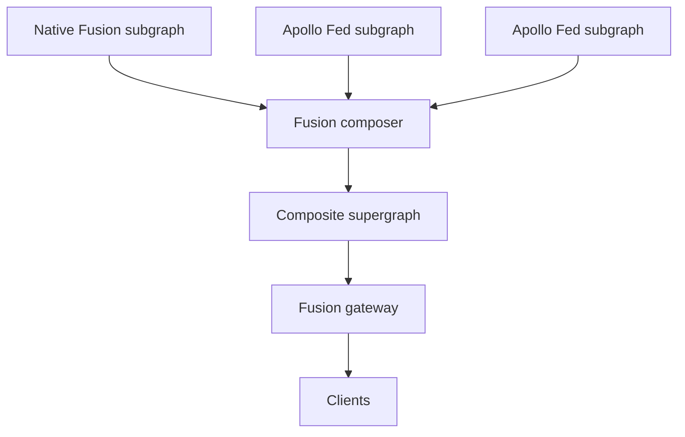

# Apollo Federation Connector

The Apollo Federation connector lets HotChocolate Fusion compose over Apollo Federation subgraphs as a source system. You keep your existing Apollo subgraphs running, untouched, and Fusion plans and executes queries across them. No `@apollo/subgraph` swap, no `__resolveReference` rewrite, no flag day.

This is one of a family of Fusion connectors. Apollo Federation, REST, gRPC, and direct database connectors all follow the same shape: a source system that Fusion composes over, with a clear boundary between source-internal semantics and the composite supergraph.

## When to use this connector

Use the Apollo Federation connector if any of the following apply:

- You have an existing Apollo Federation subgraph and want Fusion's gateway, planner, and tooling without rewriting subgraphs.
- You want to add new Fusion-native subgraphs alongside your Apollo Federation cluster and have them all participate in one composite schema.
- You are evaluating Fusion and want to adopt incrementally rather than as a migration project.

You do not need the connector if your subgraphs are already HotChocolate Fusion subgraphs. Native Fusion subgraphs use the [GraphQL Composite Schemas specification](https://graphql.github.io/composite-schemas-spec/) directly.

## Mental model

Fusion treats each Apollo Federation subgraph as an independent source schema. During composition, Fusion ingests the subgraph's SDL, normalizes it into Composite Schema Spec form, and composes it with every other source schema (Apollo Federation or otherwise) into a single supergraph. Apollo's own composition is not involved. Fusion is the composer.

Each source schema contributes two things to composition: its SDL, which carries the type shape and connector bindings, and a `schema-settings.json`, which carries transport and connection details (URL, headers, environments). Fusion requires both for every source schema, Apollo Federation or native.

At runtime, the connector translates between the supergraph and Apollo's wire protocol. When the gateway needs to fetch an entity from an Apollo subgraph, the connector rewrites the request into an `_entities` query with the appropriate representations. Your subgraph still answers through its existing resolvers.



## Quick start

The connector is zero configuration on the composition side. Fusion detects Apollo Federation by the presence of an `@link` directive that imports `https://specs.apollo.dev/federation`, and applies the connector pipeline automatically.

### 1. Export each subgraph's schema

For Apollo subgraphs, this is whatever your existing tooling produces. The schema you would publish to GraphOS or pass to `rover supergraph compose` is the schema Fusion reads. A typical Apollo Federation v2 schema looks like this:

```graphql
schema
  @link(url: "https://specs.apollo.dev/federation/v2.5",
        import: ["@key", "@shareable", "@external", "@requires", "@provides"])

type Query {
  product(id: ID!): Product
}

type Product @key(fields: "id") {
  id: ID!
  name: String!
  price: Float!
}
```

Save it as `products.graphql` (or whatever filename your pipeline uses).

### 2. Compose

Run composition the same way you would for native Fusion subgraphs:

```bash
nitro fusion compose \
  --source-schema-file ./products/products.graphql \
  --source-schema-file ./reviews/reviews.graphql \
  --archive gateway.far
```

Composition detects the Apollo `@link`, runs the Apollo connector pipeline (see [What composition does](#what-composition-does) below), and folds the result into the archive. You can mix Apollo Federation subgraphs and native Fusion subgraphs in the same composition. Each is processed by the right pipeline based on what its SDL declares.

### 3. Add the connector to your gateway

Install the connector package:

```bash
dotnet add package HotChocolate.Fusion.Connectors.ApolloFederation
```

Register it on the gateway builder:

```csharp
var builder = WebApplication.CreateBuilder(args);

builder
    .AddGraphQLGateway()
    .AddApolloFederationSupport()
    .AddFileSystemConfiguration("./gateway.far");

var app = builder.Build();
app.MapGraphQL();
app.Run();
```

`AddApolloFederationSupport()` registers the connector's runtime: the source-schema client factory that speaks `_entities`, and the configuration parser that reads connector settings out of the archive.

### 4. Configure transports

Each Apollo Federation source schema needs an HTTP endpoint in `schema-settings.json`, exactly like a native Fusion subgraph:

```json
{
  "name": "products",
  "transports": {
    "http": {
      "url": "{{API_URL}}"
    }
  },
  "environments": {
    "development": { "API_URL": "http://localhost:5100/graphql" },
    "production": { "API_URL": "https://products.example.com/graphql" }
  }
}
```

That is the whole quick start. Run `dotnet run` on the gateway and your Apollo subgraphs are reachable through the composite schema.

## What is supported

The connector is verified against an Apollo Federation compliance test suite. The current matrix:

| Feature                              | Status            |
| ------------------------------------ | ----------------- |
| `@key` (single field)                | Supported         |
| `@key` (composite, nested, nullable) | Supported         |
| Multiple `@key` on one type          | Supported         |
| `@requires`                          | Supported         |
| `@provides`                          | Supported         |
| `@external`                          | Supported         |
| `@shareable`                         | Supported         |
| `@inaccessible`                      | Supported         |
| `@tag`                               | Supported         |
| `@override`                          | Supported         |
| `@interfaceObject`                   | Not yet supported |
| Federation v2.0 to v2.5              | Supported         |
| Federation v1                        | Not supported     |

Federation v1 is not supported because v1 schemas have no `@link`, which is the auto-detection signal. If you are still on Federation v1, upgrade to v2 in your Apollo tooling first; no other change is needed for Fusion to pick it up.

## Mixing Apollo and native Fusion subgraphs

Apollo Federation and native Fusion subgraphs compose into the same supergraph format. The composer does not care which connector produced a source schema; once the source-schema-preprocessor pipeline has run, every input is a Composite Schema Spec compliant source schema.

## Where to go next

- [Composition](/docs/fusion/v16/composition) covers composition rules and merging behavior across all connectors.
- [Entities and Lookups](/docs/fusion/v16/entities-and-lookups) covers entity resolution patterns in native Fusion subgraphs.
- [Adding a Subgraph](/docs/fusion/v16/adding-a-subgraph) walks through writing a native Fusion subgraph, useful when you start adding new ones alongside your Apollo cluster.
- [Deployment and CI/CD](/docs/fusion/v16/deployment-and-ci-cd) covers production deployment and pipeline setup.
