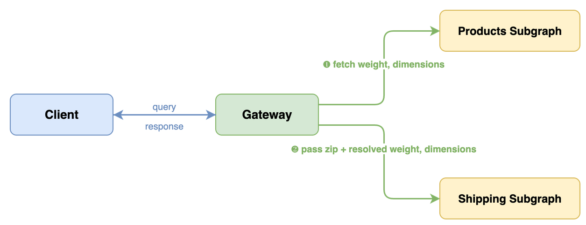

In traditional distributed systems, dependencies between services hide beneath the surface. A service assumes another service provides certain fields, responds in a certain shape, or is available at a certain time. These assumptions are invisible: they live in code, not in contracts. You discover them when something breaks in production. A field gets renamed, a service changes its response format, or a new team removes data another team depended on without knowing.

Fusion makes these dependencies **declarative and validated at build time**. When a resolver in one subgraph needs data from another subgraph, it declares that dependency explicitly in the schema using directives like `@require`. The composition step validates that every declared dependency is satisfiable before any code reaches production: the required fields must exist, be reachable, and have compatible types. If a dependency cannot be satisfied, composition fails and tells you exactly what is missing and where.

This shifts cross-service data dependencies from hidden runtime failures to visible, validated build-time contracts.

This chapter covers the directives and attributes that make this work: `@require` for declaring resolver input dependencies, `@is` for mapping lookup arguments to entity fields, and `@provides` for declaring fields that a subgraph can resolve locally alongside an entity reference. If you completed the [Getting Started](/docs/fusion/v16/getting-started) tutorial or the [Adding a Subgraph](/docs/fusion/v16/adding-a-subgraph) guide, you already used `@require`. Here, you will focus on the full range of patterns and the syntax behind them.

## How Cross-Subgraph Data Dependencies Work

When a resolver declares a data requirement with `@require`, three things happen during composition and execution:

1. **Composition** reads the `@require` directive and removes the annotated argument from the composite schema. Clients never see it.
2. **Query planning** detects the dependency. The gateway plans an additional fetch to retrieve the required fields from whichever subgraph owns them.
3. **Execution** fetches the required data first, then passes it as a resolver argument when invoking the downstream subgraph.

The resolver receives the data as if it were a normal argument. It does not know or care where the data came from.



The client query includes only `zip` because that is a normal argument. The `weight` and dimension arguments are hidden from clients because they are annotated with `@require`. The gateway resolves them automatically from the Products subgraph before calling the Shipping subgraph.

## `@require`: Declaring Data Dependencies

Use `@require` on a resolver argument when that argument's value must come from fields owned by other subgraphs. The gateway resolves these values automatically during execution.

### Simple Scalar Requirements

The most common case: a resolver needs a single field from another subgraph.

**GraphQL schema**

```graphql
# Shipping subgraph
type Product {
  id: ID!
  shippingEstimate(zip: String!, weight: Float! @require(field: "weight")): Int!
}

type Query {
  productById(id: ID!): Product @lookup @internal
}
```

The `weight` field lives in the Products subgraph. The Shipping subgraph declares it as a requirement, and the gateway fetches it before calling the resolver.

**C# resolver**

```csharp
[ObjectType<Product>]
public static partial class ProductNode
{
    public static int GetShippingEstimate(
        [Parent] Product product,
        string zip,
        [Require("weight")] float weight)
        => ShippingCalculator.Estimate(zip, weight);
}
```

The `[Require("weight")]` attribute maps to `@require(field: "weight")` in the exported schema. The argument name in C# does not need to match the field name when you provide an explicit field path.

When the argument name matches the entity field name, you can omit the field path:

```csharp
public static int GetShippingEstimate(
    [Parent] Product product,
    string zip,
    [Require] float weight) // inferred: @require(field: "weight")
    => ShippingCalculator.Estimate(zip, weight);
```

**Composite schema (what clients see)**

```graphql
type Product {
  shippingEstimate(zip: String!): Int!
}
```

The `weight` argument is gone. Clients pass only `zip`. The gateway handles `weight` transparently.

### Complex Requirements with Input Objects

When a resolver needs multiple fields, you can gather them into a single input object argument using FieldSelectionMap syntax.

**GraphQL schema**

```graphql
# Shipping subgraph
type Product {
  id: ID!
  deliveryEstimate(
    zip: String!
    dimension: ProductDimensionInput!
      @require(
        field: "{ weight, length: dimensions.length, width: dimensions.width, height: dimensions.height }"
      )
  ): Int!
}

input ProductDimensionInput {
  weight: Float!
  length: Float!
  width: Float!
  height: Float!
}
```

The FieldSelectionMap inside `@require` tells the gateway how to reshape data from the Products subgraph into the `ProductDimensionInput` shape the resolver expects:

- `weight` maps directly (the input field name matches the entity field name)
- `length: dimensions.length` maps the `length` input field from the nested `dimensions.length` entity field

**C# resolver**

```csharp
[ObjectType<Product>]
public static partial class ProductNode
{
    public static int GetDeliveryEstimate(
        [Parent] Product product,
        string zip,
        [Require(
            """
            {
              weight,
              length: dimensions.length,
              width: dimensions.width,
              height: dimensions.height
            }
            """)]
        ProductDimensionInput dimension)
        => ShippingCalculator.Estimate(zip, dimension);
}
```

```csharp
public sealed class ProductDimensionInput
{
    public float Weight { get; init; }
    public float Length { get; init; }
    public float Width { get; init; }
    public float Height { get; init; }
}
```

**Composite schema (what clients see)**

```graphql
type Product {
  deliveryEstimate(zip: String!): Int!
}
```

The `dimension` requirement argument is hidden from clients. Clients see only `zip`; the gateway resolves the nested fields (`weight`, `length`, `width`, `height`) automatically.

### Multiple Scalar Requirements

You can annotate multiple arguments with `@require` on the same field. Each one declares an independent data dependency.

**GraphQL schema**

```graphql
# Inventory subgraph
type Product {
  id: ID!
  shippingEstimate(
    weight: Float! @require(field: "weight")
    price: Float! @require(field: "price")
  ): Int!
}
```

**C# resolver**

```csharp
[ObjectType<Product>]
public static partial class ProductNode
{
    public static int GetShippingEstimate(
        [Parent] Product product,
        [Require] float weight,
        [Require] float price)
        => weight > 500 || price > 1000
            ? ExpressShipping.Calculate(weight)
            : StandardShipping.Calculate(weight);
}
```

### Nested Field Paths

`@require` can reach into nested objects using dot notation.

**GraphQL schema**

```graphql
type Product {
  id: ID!
  taxEstimate(
    countryCode: String! @require(field: "seller.address.countryCode")
    price: Float! @require(field: "price")
  ): Float!
}
```

The gateway traverses `seller.address.countryCode` on the entity and passes the resolved value as the `countryCode` argument.

## `@is`: Mapping Lookup Arguments to Entity Fields

Use `@is` on lookup arguments when the argument name does not match the entity field it maps to. The [Entities and Lookups](/docs/fusion/v16/entities-and-lookups) page covers `@is` in the context of lookup definitions. This section summarizes the mapping patterns and shows the FieldSelectionMap syntax they share with `@require`.

### Simple Name Mapping

When a lookup argument has a different name than the entity field:

**GraphQL schema**

```graphql
type Query {
  product(productId: ID! @is(field: "id")): Product @lookup
}
```

**C# resolver**

```csharp
[QueryType]
public static partial class ProductQueries
{
    [Lookup]
    public static async Task<Product?> GetProductAsync(
        [Is(nameof(Product.Id))] int productId,
        IProductByIdDataLoader productById,
        CancellationToken cancellationToken)
        => await productById.LoadAsync(productId, cancellationToken);
}
```

If the argument name already matches the field name (e.g., `id` to `id`), you can omit `@is`.

### Nested Field Mapping

`@is` supports the same dot notation as `@require` for reaching into nested objects:

```graphql
type Query {
  product(
    tenantId: ID! @is(field: "tenant.id")
    sku: String! @is(field: "sku")
  ): Product @lookup
}
```

### Input Object Mapping

For composite keys, you can map an input object to multiple entity fields:

```graphql
input ProductKeyInput {
  tenantId: ID!
  sku: String!
}

type Query {
  product(
    key: ProductKeyInput! @is(field: "{ tenantId: tenant.id, sku }")
  ): Product @lookup
}
```

### Choice Mapping with `@oneOf`

When an entity can be looked up by different keys, use `@is` with the choice operator `|` and a `@oneOf` input:

```graphql
input UserByInput @oneOf {
  id: ID
  username: String
}

type Query {
  user(by: UserByInput! @is(field: "{ id } | { username }")): User @lookup
}
```

The gateway uses whichever key is available at planning time. See [Entities and Lookups: Multiple Lookups Per Entity](/docs/fusion/v16/entities-and-lookups#multiple-lookups-per-entity) for the full pattern.

## `@provides`: Declaring Locally Available Fields

Use `@provides` on a field that returns an entity when your subgraph can resolve specific subfields of that entity locally, without an additional round-trip to the owning subgraph.

### When `@provides` Helps

Consider a Reviews subgraph that stores the author's username alongside each review. The `User` entity is owned by the Accounts subgraph, but the Reviews subgraph already has the username in its database. Without `@provides`, the gateway would make a separate call to the Accounts subgraph to fetch `username` for every review author. With `@provides`, the gateway knows the Reviews subgraph can resolve `username` directly.

**GraphQL schema**

```graphql
# Reviews subgraph
type Review {
  id: ID!
  body: String!
  author: User @provides(fields: "username")
}

type User {
  id: ID!
  username: String! @external
}

type Query {
  reviewById(id: ID!): Review @lookup
}
```

The `@provides(fields: "username")` on `author` tells composition that when the gateway fetches `author` from the Reviews subgraph, it can also get `username` without calling the Accounts subgraph.

The `@external` on `username` declares that this field is defined and owned by another subgraph (Accounts), but the Reviews subgraph can resolve it locally in the context of `Review.author`.

**C# resolver**

```csharp
[ObjectType<Review>]
public static partial class ReviewNode
{
    [Provides("username")]
    public static User GetAuthor(
        [Parent(requires: nameof(Review.AuthorId))] Review review)
        => new User(review.AuthorId, review.AuthorUsername);
}
```

### Providing Multiple and Nested Fields

`@provides` accepts a field selection set, so you can declare multiple fields or nested fields:

```graphql
type Review {
  product: Product @provides(fields: "name price")
}
```

```graphql
type Review {
  product: Product @provides(fields: "sku variation { size color }")
}
```

### When to Use `@provides`

Use `@provides` when:

- Your subgraph stores denormalized data from another subgraph (e.g., a cached username)
- Avoiding the extra round-trip measurably improves performance
- The locally stored data is kept in sync with the owning subgraph

Do not use `@provides` as a substitute for proper entity ownership. If your subgraph is the authoritative source for a field, that field should be defined as a regular field, not as `@external` with `@provides`.

## `@external`: Referencing External Fields

Use `@external` on a field definition when your subgraph recognizes a field but does not own it. The field is defined and resolved by another subgraph. In Fusion v16, `@external` is primarily used together with `@provides` to declare fields your subgraph can return locally in a specific context (as shown above).

**GraphQL schema**

```graphql
# Reviews subgraph
type User {
  id: ID!
  username: String! @external
}
```

This tells composition: "I know `User` has a `username` field, but I don't own it. Another subgraph does."

Every `@external` field must be referenced by a `@provides` directive. An unused `@external` field causes an `EXTERNAL_UNUSED` composition error.

## FieldSelectionMap Syntax Reference

Both `@require` and `@is` use the FieldSelectionMap scalar for their `field` argument. This is a mini-language for describing how to map entity fields to argument shapes.

| Syntax           | Example                                | Meaning                                                          |
| ---------------- | -------------------------------------- | ---------------------------------------------------------------- |
| Simple path      | `"weight"`                             | Maps the `weight` field directly                                 |
| Nested path      | `"dimensions.weight"`                  | Traverses into `dimensions`, then selects `weight`               |
| Object selection | `"{ weight, height }"`                 | Selects multiple fields into an object shape                     |
| Mapped selection | `"{ w: dimensions.weight }"`           | Renames: maps entity's `dimensions.weight` to argument field `w` |
| Mixed selection  | `"{ weight, len: dimensions.length }"` | Combines direct and renamed mappings                             |
| Choice (union)   | `"{ id } \| { username }"`             | The gateway can use either `id` or `username`                    |

### When to Use Which Syntax

**Simple path.** Use when `@require` or `@is` maps one argument to one field.

```graphql
weight: Float! @require(field: "weight")
```

**Object selection.** Use when mapping multiple entity fields into a single input object argument.

```graphql
dimension: DimensionInput! @require(field: "{ weight, length, width, height }")
```

**Mapped selection.** Use when the input field names differ from the entity field names, or when you need to reach into nested fields.

```graphql
dimension: DimensionInput! @require(field: "{ w: weight, l: dimensions.length }")
```

**Choice.** Use with `@is` on `@oneOf` lookups where the entity can be identified by different keys.

```graphql
by: UserByInput! @is(field: "{ id } | { username }")
```

> For the full FieldSelectionMap grammar, see the [Composite Schemas specification](https://graphql.github.io/composite-schemas-spec/draft/#sec-Appendix-A-Specification-of-FieldSelectionMap-Scalar).

## Troubleshooting

### `REQUIRE_INVALID_FIELDS`: Referenced field does not exist

```text
Error: The @require directive on argument "weight" references field "weight"
which does not exist on type "Product".
```

The field path in `@require(field: "...")` points to a field that does not exist on the entity type after composition. Check that the field name matches exactly (GraphQL field names, not C# property names) and that the owning subgraph is included in composition.

### `IS_INVALID_FIELDS`: Lookup argument mapping is invalid

The `@is(field: "...")` path does not match a valid field on the lookup's return type. Verify that the path uses GraphQL field names and that nested paths (like `tenant.id`) match the actual type structure.

### Required argument still visible in composite schema

If a `@require` argument appears in the composite schema when it should not, check that:

- The `@require` directive is on the argument, not on the field
- The `field` value is a valid FieldSelectionMap (invalid syntax triggers composition errors like `REQUIRE_INVALID_SYNTAX` or `IS_INVALID_SYNTAX`)

### `EXTERNAL_UNUSED`: External field is not referenced

Every `@external` field must be referenced in a `@provides` directive. Remove unused `@external` declarations or add the corresponding `@provides`.

## Next Steps

- **Need entity identity and lookup patterns?** See [Entities and Lookups](/docs/fusion/v16/entities-and-lookups) for the full guide to keys, public vs. internal lookups, and composite keys.
- **Need field ownership and merging rules?** See [Composition](/docs/fusion/v16/composition) for how `@shareable`, `@inaccessible`, and composition validation work.
- **Want to see `@require` in a full walkthrough?** The [Adding a Subgraph](/docs/fusion/v16/adding-a-subgraph) guide builds a Shipping subgraph that uses `@require` to fetch product dimensions from another subgraph.
- **Need the directive and attribute quick reference?** See the [Attribute and Directive Reference](/docs/fusion/v16/attribute-and-directive-reference).
