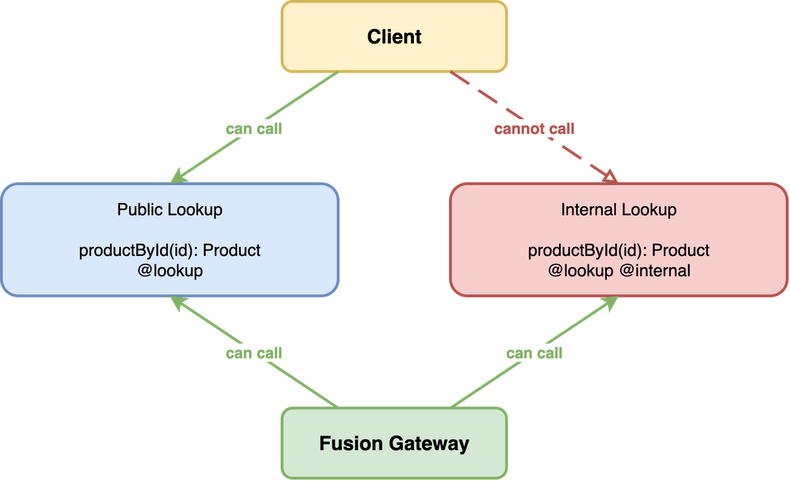

Entities are the mechanism that makes distributed GraphQL work. They are types with stable keys that can be referenced and resolved across subgraphs. For example, the Products subgraph defines the `Product` type, and the Reviews subgraph contributes the `reviews` field to `Product`. The Accounts subgraph defines the `User` type, and other subgraphs can contribute additional fields to `User`. Without entities, each subgraph would be an isolated API. With entities, those subgraphs compose into one unified API.

This page explains entity resolution in more detail: how entities are defined and how lookups resolve them across subgraphs. If you completed the [Getting Started](/docs/fusion/v16/getting-started) tutorial, you already used these concepts. Here, you will focus on the mechanics and patterns behind them.

## What Makes a Type an Entity

A type is not an entity because it appears in multiple subgraphs. It is an entity because it has stable key-based identity. An entity is a type with one or more key fields that uniquely identify an instance across multiple subgraphs. Those key fields form the contract between subgraphs: one subgraph can return an entity reference by key, and another subgraph can use that key to resolve additional fields for the same instance.

In practice, two requirements matter:

1. **Entity identity:** one or more key fields uniquely identify each instance, like `id` or `sku`.
2. **Entity resolution:** at least one lookup is available so the gateway can resolve references by key.

```graphql
# Products subgraph
type Product {
  id: ID!
  name: String!
}

type Query {
  productById(id: ID!): Product @lookup
}
```

Another subgraph can reuse the same key and contribute fields.

```graphql
# Reviews subgraph
type Product {
  id: ID!
  reviews: [Review!]!
}

type Query {
  productById(id: ID!): Product @lookup @internal
}
```

In these examples, `id` is the key and `@lookup` defines how `Product` is resolved by that key. The Reviews lookup is internal, so clients cannot call it directly, but the gateway can use it to enter the Reviews subgraph and resolve `reviews`.

## Lookups

A lookup is a query field that resolves an entity by its key. The gateway uses lookups to fetch additional fields for entities. Depending on the requested fields and available routes, it can use any subgraph that provides those fields and a compatible lookup path. Without a lookup, the gateway has no way to enter a subgraph and resolve an entity.

### Public Lookups

A public lookup serves two purposes: clients can call it directly as a query field, and the gateway uses it for entity resolution behind the scenes.

**GraphQL schema**

```graphql
type Query {
  productById(id: ID!): Product @lookup
}
```

The `@lookup` directive marks `productById` as a lookup for `Product`. Because the argument is named `id`, composition maps it to the `Product.id` key field. Cross-subgraph transitions depend on this mapping: the source subgraph must provide the key, and the target subgraph must expose a lookup that accepts that key.

Lookups must return nullable entity types. In GraphQL, that means `Product` instead of `Product!`. In C#, use a nullable return type like `Product?`. This allows unresolved keys to return `null` and helps avoid cascading failures when one or more subgraphs cannot provide additional fields for an entity.

In Hot Chocolate, the `@lookup` directive is represented by the `[Lookup]` attribute.

**C# resolver**

```csharp
[QueryType]
public static partial class ProductQueries
{
    [Lookup]
    public static async Task<Product?> GetProductByIdAsync(
        int id,
        IProductByIdDataLoader productById,
        CancellationToken cancellationToken)
        => await productById.LoadAsync(id, cancellationToken);
}
```

If the argument name does not match a field name on the type, the `@is` directive must be used to map the argument to the key field.

```graphql
type Query {
  product(productId: ID! @is(field: "id")): Product @lookup
}
```

In Hot Chocolate, you can use the `[Is]` attribute with `nameof`.

```csharp
[QueryType]
public static partial class ProductQueries
{
    [Lookup]
    public static async Task<Product?> GetProductAsync(
        [Is(nameof(Product.Id))] int productId,
        IProductByIdDataLoader productById,
        CancellationToken cancellationToken)
        => await productById.LoadAsync(productId, cancellationToken);
}
```

### Internal Lookups

An internal lookup is hidden from the composite schema. Clients cannot call it directly. It exists only for the gateway to use during entity resolution.

**GraphQL schema**

```graphql
type Query {
  productById(id: ID!): Product @internal @lookup
}
```

The `@internal` directive tells the composition to exclude this lookup from the public composite schema. The gateway can still use it when it needs to enter the Reviews subgraph to resolve `Product.reviews`, but clients never see or call it.

**C# resolver**

```csharp
[QueryType]
public static partial class ProductQueries
{
    [Lookup, Internal]
    public static Product? GetProductById([ID<Product>] int id)
        => new(id);
}
```

You can also group internal lookups under a dedicated internal root field. This keeps internal routing entry points in one place and avoids repeating `@internal` on every lookup field.

**GraphQL schema (grouped internal lookups)**

```graphql
type Query {
  internalLookups: InternalLookups @internal
}

type InternalLookups @internal {
  productByTenantAndSku(tenantId: ID!, sku: String!): Product @lookup
}
```

**C# declaration**

```csharp
[QueryType]
public static partial class Query
{
    [Internal]
    public static InternalLookups GetInternalLookups { get; } = new();
}

[Internal, ObjectType]
public partial class InternalLookups
{
    [Lookup]
    public Product? GetProductByTenantAndSku(int tenantId, string sku)
        => ProductRepository.GetByTenantAndSku(tenantId, sku);
}
```

In this pattern, clients cannot access `internalLookups` from the composite schema, but the gateway can still use nested `@lookup` fields for internal transitions.

### When to Use Internal vs. Public Lookups



Use a **public lookup** when:

- Your subgraph is the primary owner of the entity. For example, the Products subgraph owns `Product`, and the Accounts subgraph owns `User`.
- Clients should be able to query for this entity directly from your subgraph
- The lookup validates that the entity exists and returns `null` if it does not

Use an **internal lookup** when:

- Your subgraph extends an entity and merely contributes extra fields to it, for example the Reviews subgraph adds the `reviews` field to the `Product` entity.
- You do not want clients to enter your subgraph through this lookup
- The lookup just constructs a stub. It does not validate the existence of the entity.

For cross-subgraph resolution to work, a subgraph that contributes fields to an entity must expose a compatible lookup path for that entity. This can be a direct lookup field or a nested lookup under an internal root object. If no lookup path exists, transitions into that subgraph are unsatisfiable.

### Multiple Lookups Per Entity

An entity can have multiple lookups, even in the same subgraph. This is useful when an entity can be identified by different keys. It is especially helpful when different subgraphs reference the same entity through different keys, for example `User.id` in one place and `User.username` in another. By providing both lookups, the gateway can transition into the target subgraph from either reference shape.

**GraphQL schema**

```graphql
type Query {
  userById(id: ID!): User @lookup
  userByUsername(username: String!): User @lookup
}
```

**C# resolver**

```csharp
[QueryType]
public static partial class UserQueries
{
    [Lookup]
    public static async Task<User?> GetUserById(
        int id,
        IUserByIdDataLoader userById,
        CancellationToken cancellationToken)
        => await userById.LoadAsync(id, cancellationToken);

    [Lookup]
    public static async Task<User?> GetUserByUsername(
        string username,
        IUserByNameDataLoader userByName,
        CancellationToken cancellationToken)
        => await userByName.LoadAsync(username, cancellationToken);
}
```

The Accounts subgraph defines two lookups for `User`: one by `id` and one by `username`. The gateway can resolve a User reference using whichever key is available. If another subgraph references a User by username, the gateway uses `GetUserByUsername`.

With more modern GraphQL servers you can also use the finder pattern with the `@oneOf` directive.

```graphql
type Query {
  user(by: UserByInput! @is(field: "{ id } | { username }")): User @lookup
}

input UserByInput @oneOf {
  id: ID
  username: String
}
```

In this case we use the `@is` directive with the choice operator `|` to signal to Fusion that it can use this lookup either with the `id` or the `username` as a key.

### Composite Keys

Some entities are identified by a combination of fields instead of a single field. In that case, the lookup arguments together form the key.

**GraphQL schema**

```graphql
# Inventory subgraph
type Product {
  tenantId: ID!
  sku: String!
  inStock: Boolean!
}

type Query {
  productByTenantAndSku(tenantId: ID!, sku: String!): Product @lookup
}
```

**C# resolver**

```csharp
[QueryType]
public static partial class ProductQueries
{
    [Lookup]
    public static Product? GetProductByTenantAndSku(
        int tenantId,
        string sku)
        => ProductRepository.GetByTenantAndSku(tenantId, sku);
}
```

Here, `tenantId` and `sku` are both required to identify `Product`. During planning, Fusion can transition to this lookup only when both key values are available.

If the lookup arguments do not match entity field names directly, you can map them with the `@is` directive and even pull up fields.

**GraphQL schema with per-argument mapping**

```graphql
type Product {
  sku: String!
  inStock: Boolean!
  tenant: Tenant
}

type Tenant {
  id: ID!
}

type Query {
  product(
    tenantId: ID! @is(field: "tenant.id")
    sku: String! @is(field: "sku")
  ): Product @lookup
}
```

**GraphQL schema with input-object mapping**

```graphql
type Product {
  sku: String!
  inStock: Boolean!
  tenant: Tenant
}

type Tenant {
  id: ID!
}

input ProductKeyInput {
  tenantId: ID!
  sku: String!
}

type Query {
  product(
    key: ProductKeyInput! @is(field: "{ tenantId: tenant.id, sku }")
  ): Product @lookup
}
```

Both variants describe the same composite key. The first maps each argument explicitly. The second maps the input object fields in one selection map.

> The FieldSelectionMap syntax from the Composite Schemas specification supports more advanced argument-to-field mappings for lookups. For the full grammar and examples, see the [Composite Schemas specification](https://graphql.github.io/composite-schemas-spec/draft/#sec-Appendix-A-Specification-of-FieldSelectionMap-Scalar).

## Explicit Key Declaration

In most cases, you do not need to declare entity keys explicitly. The composition engine infers keys from your lookup fields.

Sometimes you need or want to declare the key explicitly. Use the `@key` directive when:

- You want to be explicit about which fields form the key on the entity itself
- You want to declare key identity on a type independently of local lookup inference

**GraphQL schema**

```graphql
type Product @key(fields: "id") {
  id: ID!
}
```

**C# type declaration**

```csharp
[EntityKey("id")]
public sealed record Product([property: ID<Product>] int Id);
```

The `@key(fields: "id")` directive explicitly declares that `Product` is identified by the `id` field. This is useful when key identity should be declared explicitly instead of inferred from lookup arguments.

`@key` declares identity. It does not replace lookup paths. If a subgraph contributes fields and needs to be entered during planning, it still needs a compatible lookup route.

The `fields` value uses GraphQL field names, not C# member names.

An entity can have multiple keys. Each `@key` directive on a type represents one key.

**GraphQL schema with scalar composite key**

```graphql
type Product @key(fields: "id") @key(fields: "sku category") {
  id: ID!
  sku: String
  category: String
}
```

**GraphQL schema with nested composite key**

```graphql
type Product @key(fields: "id") @key(fields: "sku tenant { id }") {
  id: ID!
  sku: String
  tenant: Tenant
}

type Tenant {
  id: ID!
}
```

## GraphQL Global Object Identification

If your subgraphs implement GraphQL Global Object Identification, with a `node` field on `Query` and a `Node` interface, you already have a strong entity identity contract. You can build on this by using `node` as a lookup and treating types that implement `Node` as entities.

**GraphQL schema**

```graphql
type Query {
  node(id: ID!): Node @lookup
}

interface Node @key(fields: "id") {
  id: ID!
}
```

If you are using Hot Chocolate as a subgraph, set `MarkNodeFieldAsLookup` and Hot Chocolate will mark the generated `node` field as a lookup automatically.

**C# configuration**

```csharp
builder
    .AddGraphQL()
    .AddGlobalObjectIdentification(o => o.MarkNodeFieldAsLookup = true);
```

> If GraphQL Global Object Identification is enabled at the gateway level, every entity resolvable through the `node` field becomes a public entry point. Use explicit internal lookups for entities you do not want exposed as public entry points.

## Next Steps

- **Need field ownership and sharing contracts?** See [Field Ownership and Sharing](/docs/fusion/v16/field-ownership-and-sharing).
- **Need argument mapping and cross-subgraph dependencies?** See [Data Requirements](/docs/fusion/v16/data-requirements-and-mapping) for `@is`, `@require`, and FieldSelectionMap patterns.
- **Need runtime performance guidance?** See Hot Chocolate docs for DataLoader and batching patterns used inside lookup resolvers.
- **Ready to go to production?** See [Authentication and Authorization](/docs/fusion/v16/authentication-and-authorization) for securing your gateway and subgraphs, or [Deployment and CI/CD](/docs/fusion/v16/deployment-and-ci-cd) for setting up independent subgraph deployments.
