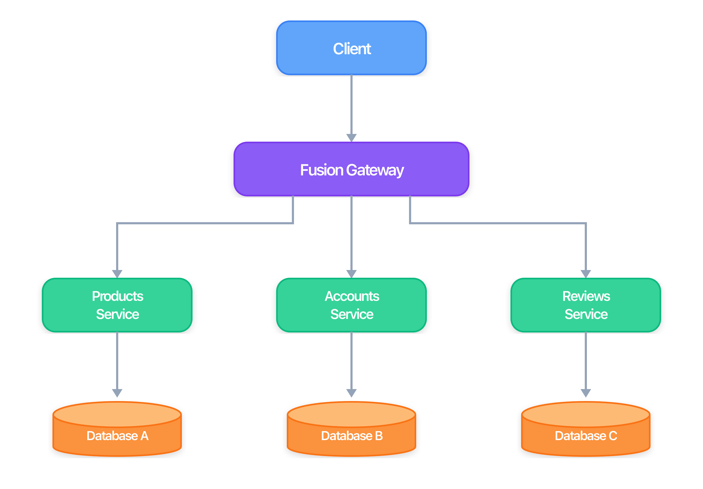

Fusion lets you split one GraphQL API into multiple smaller services, without changing how clients consume it. Clients still send queries to one endpoint, and Fusion combines data from all services into one response. Teams can deploy independently, and contract conflicts are caught during build time.

# What Is Fusion

Fusion is ChilliCream's API gateway for exposing one GraphQL API over multiple upstream services. Those upstream services can be GraphQL, OpenAPI-based REST, or gRPC. Each service owns its contract and implementation. Fusion composes those contracts at build time, and the gateway orchestrates execution at runtime. Fusion implements the GraphQL Composite Schemas specification (draft), an open standard being developed under the GraphQL Foundation.

The architecture has three parts:



**Subgraphs** are the upstream services behind the Fusion gateway: GraphQL services, OpenAPI-based REST services, and gRPC services. Each subgraph owns part of the API surface and implementation logic, and can be developed and deployed independently.

A **source schema** is the contract document for a subgraph, such as a GraphQL schema, an OpenAPI document, or a gRPC/protobuf definition.

**Composition** processes all source schemas and produces a Fusion archive (`.far`) that contains the composite schema and gateway configuration.

The **gateway** receives client requests, determines which subgraphs to call, executes those calls, and merges the results.

The result: clients send one request to one endpoint and receive one unified response, while Fusion handles routing and aggregation across upstream services.

The following query touches three services, but the client doesn't know or care about this implementation detail.

<!-- prettier-ignore-start -->
```graphql
query {
  products(first: 5) {
    nodes {
      name          # from Products service
      price         # from Products service
      reviews {     # from Reviews service
        stars
        author {
          username  # from Accounts service
        }
      }
    }
  }
}
```
<!-- prettier-ignore-end -->

## Three Things That Make Fusion Different

A \*_lookup_ is a central concept in Fusion it specifies how an entity can be resolved by a stable key. This concept event transcends the federation use case and is useful on its own in the standard client/server communication.

**Lookups use standard Query fields.** For GraphQL subgraphs, when the gateway needs to resolve an entity, it calls a normal Query field annotated with `@lookup` directive. You can call the same field yourself in testing, debug it with standard tools, and see exactly what it returns. There is no hidden internal protocol you need to implement its simply GraphQL.

```graphql
type Query {
  productById(id: ID!): Product @lookup
}
```

If you are using Hot Chocolate, the composite schema specification is supported by default, simply add the `[Lookup]` attribute to your resolver and you are ready to go.

```csharp
[QueryType]
public static partial class ProductQueries
{
    [Lookup]
    public static async Task<Product?> GetProductById(
        [ID] int id,
        IProductByIdDataLoader productById,
        CancellationToken cancellationToken)
        => await productById.LoadAsync(id, cancellationToken);
}
```

**Composition catches errors at build time.** When you run `nitro fusion compose`, the composition engine validates source schemas against each other. Type conflicts, missing fields, and incompatible enums are caught in CI before deployment.

**No special runtime for GraphQL subgraphs.** The [GraphQL Composite Schemas specification](https://graphql.github.io/composite-schemas-spec/draft/) is designed so a standard GraphQL server can already act as a compatible subgraph. In a common HotChocolate setup, subgraphs remain normal HotChocolate servers with regular resolvers, without a separate distributed-runtime package or vendor-specific protocol layer.

# Key Terminology

| Term                 | Definition                                                                                                                                               |
| -------------------- | -------------------------------------------------------------------------------------------------------------------------------------------------------- |
| **Subgraph**         | An upstream service behind the Fusion gateway. A subgraph can be a GraphQL service, an OpenAPI-based REST service, or a gRPC service.                    |
| **Source schema**    | The contract document published by one subgraph (for example a GraphQL schema, OpenAPI document, or gRPC/protobuf definition).                           |
| **Composite schema** | The unified, client-facing GraphQL schema produced during composition. Clients query this schema as if it were a single API.                             |
| **Gateway**          | The public entry point for client requests. It receives queries against the composite schema, routes requests across subgraphs, and assembles responses. |
| **Entity**           | A type with a stable key that can be referenced across GraphQL subgraphs.                                                                                |
| **Lookup**           | A Query field annotated with a `@lookup` directive that resolves an entity by key in that subgraph.                                                      |
| **Composition**      | The offline step that validates source schemas and produces the composite schema and gateway configuration. Runs via the Nitro CLI or Aspire.            |

# When to Use Fusion

Fusion adds operational complexity, including a gateway process, a composition step in your build pipeline, and distributed debugging. That complexity pays off in specific situations:

- **Multiple teams need to ship independently.** If different teams own different parts of your API (e.g., a product catalog team and a reviews team), Fusion lets each team deploy on their own schedule without coordinating schema changes through a shared codebase.

- **You need to scale services differently.** Your product search might need 10 instances while your user profile service needs 2. With separate services, you scale each one based on its actual load.

- **Your domain has clear boundaries.** If your data naturally splits into distinct areas (accounts, products, orders, reviews), separate services map well to those boundaries. Each service owns its data store and its API contract.

- **You want build-time validation of distributed contracts.** Composition catches conflicts between source schemas before deployment. Your CI pipeline can validate that a change in one service does not break the composed API.

# When NOT to Use Fusion

Fusion is not the right choice for every project. Evaluate whether the additional complexity is justified:

- **One team, one service.** If one team owns the entire API and deploys it as a single unit, a standard Hot Chocolate server is simpler and has lower operational overhead. You likely do not need a gateway, a composition pipeline, or distributed tracing.

- **A small or early-stage API.** If your API has a handful of types and modest traffic, a distributed gateway setup often adds more complexity than value. Start with a monolith and split later when needed. Hot Chocolate supports an incremental path from monolith to modular monolith to distributed architecture.

- **No clear domain boundaries.** If your types are deeply intertwined and most queries touch most of the schema, splitting into many services can create more cross-service calls than it removes. Fusion works best when services are relatively self-contained and have clear data contracts.

- **Your team is just getting started with GraphQL.** Learn GraphQL and Hot Chocolate first. Get comfortable with types, resolvers, DataLoaders, and the execution pipeline. Fusion adds concepts on top of that foundation and is easier to adopt once the basics are understood.

The cost of premature distribution is real: more services to deploy, more infrastructure to monitor, and harder debugging when something goes wrong. Start simple, and add Fusion when the pain of a monolith outweighs the cost of distribution.

# Migrating from a Monolith

If you already have a HotChocolate server, you can adopt Fusion incrementally.

**Start with one upstream service.** Point the Fusion gateway at your existing HotChocolate server as the only subgraph. Composition works with one source schema. Your clients connect to the gateway instead of directly to your server, but behavior stays the same.

**Add services incrementally.** When a new team or domain needs its own service, add another subgraph. The new service can extend types from the original service with entity stubs where needed. Composition merges both source schemas, and the gateway handles cross-service execution automatically. Your original service does not need a rewrite.

**Clients see no difference.** Whether you have one subgraph or ten, clients still call one endpoint and keep the same query surface. You can split your monolith over weeks or months without breaking the client contract.

The key insight: this is not a rewrite. It is a gradual process. You move types and fields to new services over time, and the gateway smooths over the transition.

# Next Steps

Where you go from here depends on what you need:

- **"I want to build something."** Start with the [Getting Started](/docs/fusion/v16/getting-started) tutorial. You will create two services and a gateway from scratch.

- **"I want to add another service to an existing project."** Go to [Adding a Subgraph](/docs/fusion/v16/adding-a-subgraph). It covers creating a new service (subgraph) that extends existing entity types.

- **"I'm migrating from another distributed GraphQL framework."** Read [Coming from Apollo Federation](/docs/fusion/v16/coming-from-apollo-federation) or [Migrating from Schema Stitching](/docs/fusion/v16/migrating-from-schema-stitching). These guides map familiar concepts to Fusion equivalents and walk through a migration.

- **"I need to deploy this."** See [Deployment & CI/CD](/docs/fusion/v16/deployment-and-ci-cd) for pipeline setup, schema management, and gateway configuration.
