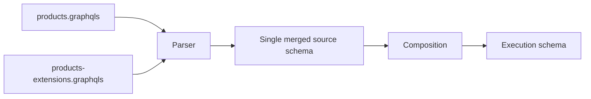

Some source schemas are not yours to edit, or you want to keep them free of Fusion-specific annotations. Fusion still needs [directives](/docs/fusion/v16/directives-reference) like `@lookup`, `@internal`, and `@inaccessible` on those schemas to compose your graph correctly. A **source schema extensions document** solves this. It is a separate SDL file you author yourself, layered over the base schema at parse time, that adds Fusion-specific annotations without modifying a single character of the base. Your original schema stays clean, and the directives the gateway needs to plan distributed queries land in a file you fully control.

## How It Works

Both documents (the base schema and its extensions) are parsed sequentially into the same schema model. Extensions written with `extend type X` merge into the canonical `type X` definition during parsing. By the time composition runs, your extensions are indistinguishable from directives written directly on the base schema. Composition never sees the `extend` syntax: the parser has already folded everything into one source schema.



## A Realistic Example

Suppose you compose a federated graph from several services. One of them is a Products service that exposes `products.graphqls` as its source schema, and you want to keep that file free of Fusion-specific annotations. You need to mark `productById` as a lookup, expose a second lookup that Reviews uses for hydration without making it part of the public surface, hide an internal `warehouseLocationCode` field, and add a derived `stockStatus` field that depends on the warehouse code.

### The Base Schema

```graphql
type Query {
  productById(id: ID!): Product
  productByCode(code: String!): Product
  searchProducts(query: String!): [Product!]!
}

type Product {
  id: ID!
  name: String!
  description: String
  price: Money!
  warehouseLocationCode: String
}

type Money {
  amount: Int!
  currency: String!
}
```

There is not a single Fusion annotation in this file. It can change without forcing edits to your Fusion-specific configuration. Every Fusion-specific decision lives in the next document.

### The Extensions Document

```graphql
extend type Query {
  productById(id: ID!): Product @lookup
  productByCode(code: String!): Product @lookup @internal
}

extend type Product {
  warehouseLocationCode: String @inaccessible
  stockStatus(
    warehouseLocationCode: String @require(field: "warehouseLocationCode")
  ): StockStatus!
}

enum StockStatus {
  IN_STOCK
  OUT_OF_STOCK
  LIMITED
}
```

What each block does:

- `extend type Query { productById(id: ID!): Product @lookup }` promotes an existing field to a lookup. The field signature must match the base exactly (same name, same arguments, same return type) so the extension targets the existing field rather than declaring a new one.
- `extend type Query { productByCode(code: String!): Product @lookup @internal }` is also a lookup, but `@internal` keeps it out of the public surface. The gateway uses it to enter the Products subgraph when resolving cross-subgraph references, while clients never see it. See [Entities and Lookups](/docs/fusion/v16/entities-and-lookups) for the public versus internal lookup distinction.
- `extend type Product { warehouseLocationCode: String @inaccessible }` applies a directive to an existing field. The field type repeats the base declaration; only the directive is the new contribution. Hidden fields can still be referenced by `@require` dependencies in other source schemas. See [Schema Exposure and Evolution](/docs/fusion/v16/schema-exposure-and-evolution).
- `extend type Product { stockStatus(warehouseLocationCode: ... @require(...)): StockStatus! }` adds a brand new field with a hidden resolver argument. `@require(field: "warehouseLocationCode")` tells the gateway to populate the argument from the existing `warehouseLocationCode` field, and the argument is removed from the public surface so clients see `stockStatus: StockStatus!` with no arguments. Adding a field via extensions still requires that field to be resolvable at runtime by the underlying subgraph implementation: the extensions document only declares the field, it does not provide the resolver. See [Data Requirements](/docs/fusion/v16/data-requirements-and-mapping) for `@require` semantics.
- `enum StockStatus { ... }` introduces a new type. Extensions can declare types the base schema does not, because extensions are valid SDL documents in their own right.

### The Merged Result

After parsing, the source schema looks like this from composition's perspective:

```graphql
type Query {
  productById(id: ID!): Product @lookup
  productByCode(code: String!): Product @lookup @internal
  searchProducts(query: String!): [Product!]!
}

type Product {
  id: ID!
  name: String!
  description: String
  price: Money!
  warehouseLocationCode: String @inaccessible
  stockStatus(
    warehouseLocationCode: String @require(field: "warehouseLocationCode")
  ): StockStatus!
}

enum StockStatus {
  IN_STOCK
  OUT_OF_STOCK
  LIMITED
}
```

This is the same shape you would have if you had hand-edited the base schema. The difference is purely in how you got there: two files, parsed in order, with the second contributing only the deltas.

## What You Can Do with an Extensions Document

**Apply directives to existing fields.** This is the most common use. Directives commonly applied this way include `@lookup`, `@internal`, `@inaccessible`, `@shareable`, `@external`, `@provides`, `@override`, `@deprecated`, and `@requiresOptIn`. For the semantics of each, see [Entities and Lookups](/docs/fusion/v16/entities-and-lookups), [Field Ownership](/docs/fusion/v16/field-ownership-and-sharing), and [Schema Exposure and Evolution](/docs/fusion/v16/schema-exposure-and-evolution).

```graphql
extend type Product {
  internalSku: String @inaccessible
}
```

**Apply directives to field arguments.** Some directives, notably `@require`, are defined on argument definitions and attach to arguments rather than fields. See [Data Requirements](/docs/fusion/v16/data-requirements-and-mapping) for the full pattern.

```graphql
extend type Product {
  shippingEstimate(weight: Float @require(field: "weight")): Int!
}
```

**Apply directives to types themselves.**

```graphql
extend type LegacyOrder @inaccessible
```

**Add new fields to existing types.** The new field needs a runtime resolver in the subgraph for the gateway to actually fetch it. Declaring the field in extensions only adds it to the source schema model.

```graphql
extend type Product {
  displayName: String!
}
```

**Introduce new types or enums the base schema does not declare.** Rare, but supported, because extensions are valid SDL documents in their own right and the parser merges them into the same schema model.

```graphql
enum StockStatus {
  IN_STOCK
  OUT_OF_STOCK
  LIMITED
}
```

## Using Extensions

### File Convention

Place the extensions file alongside the base schema using the `{name}-extensions.graphqls` naming convention. The Fusion CLI loads it automatically. There is no extra flag and no configuration entry to add.

```text
schemas/
  products.graphqls
  products-extensions.graphqls
  reviews.graphqls
  reviews-extensions.graphqls
```

When `nitro fusion compose` runs, each base schema and its matching extensions document are parsed together into a single source schema before composition starts.

### Inside the Fusion Archive

The archive preserves both files separately. The base schema is stored at `source-schemas/{name}/schema.graphqls`, and the extensions document is stored at `source-schemas/{name}/schema-extensions.graphqls`.

The base schema is stored exactly as supplied. Fusion does not fold the extensions into it. This matters because recomposition (when a subgraph's schema changes and the archive is rebuilt) needs the extensions document to reapply your annotations on top of the new base. Without it, the directive layer would be lost on every regeneration. Keeping the two files distinct in the archive is what makes "the base schema stays untouched" hold end-to-end, not only in your repo but in every downstream consumer.

## Behavior Reference

| Situation                                                       | Behavior                                                                                   |
| --------------------------------------------------------------- | ------------------------------------------------------------------------------------------ |
| `extend type X` references a type not in the base schema        | The type is implicitly created.                                                            |
| Extension declares a field that already exists on the base type | Directives merge onto the existing field. A signature mismatch is a parsing error.         |
| Extension declares the same field twice in one document         | Parsing fails with a duplicate field error.                                                |
| Extension applies a directive the schema does not define        | Implicitly created at parse time. Fusion's built-in directives do not need to be declared. |
| Non-repeatable directive applied twice to the same target       | Parsing fails with a non-repeatable directive error.                                       |

## Troubleshooting

**My directive did not apply.** Check that the extension's field signature matches the base field's name, arguments, and return type exactly. A signature mismatch is treated as a different field, so the directive lands somewhere you did not intend or triggers an unrelated error.

**Composition reports the field is already defined.** You wrote a bare `type X` redeclaration where you meant `extend type X`, and the field was duplicated. Add the `extend` keyword.

**I want to apply a directive that the schema does not import.** No action needed. Extensions accept undefined directives at parse time, and Fusion resolves its built-in directives during composition.

## Next Steps

- [Composition](/docs/fusion/v16/composition): what happens after extensions are folded in.
- [Adding a Subgraph](/docs/fusion/v16/adding-a-subgraph): the typical entry point that may use extensions.
- [Schema Exposure and Evolution](/docs/fusion/v16/schema-exposure-and-evolution): directives commonly applied via extensions.
