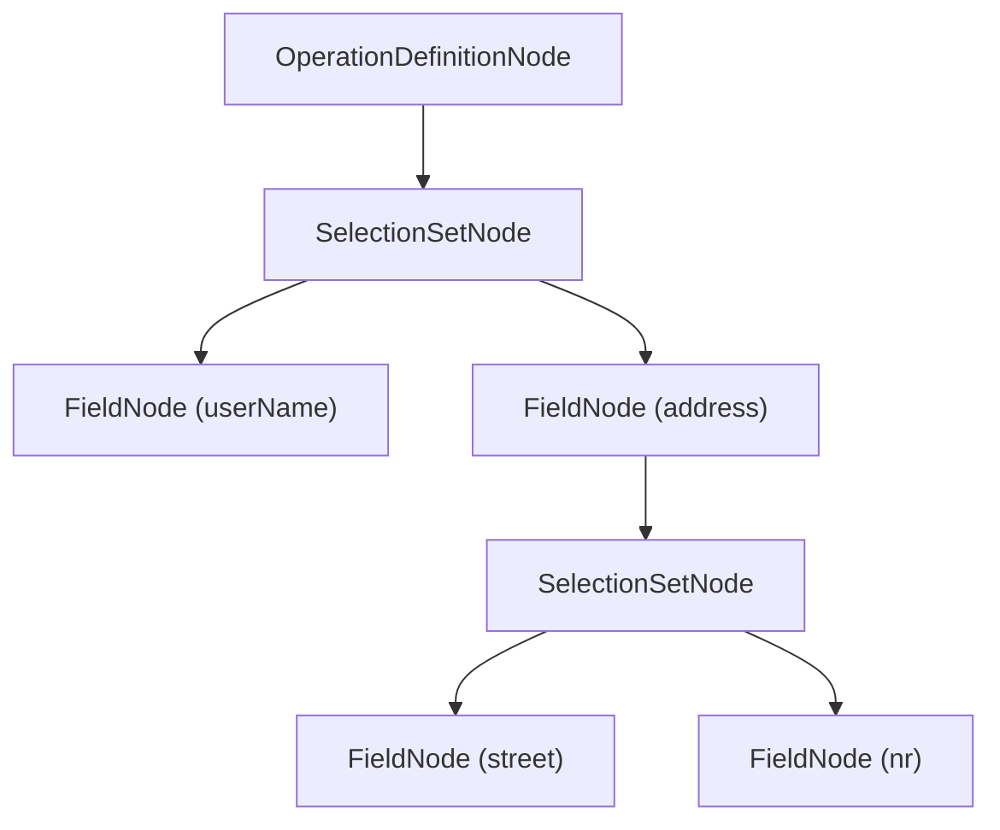

# Abstract Syntax Tree (AST)

Hot Chocolate seems to focus solely around `ObjectType`, `InputType` et al. These types work as an interface to configure the _GraphQL_ schema. This schema is used to parse and validate incoming requests. Under the hood, every `query`, `mutation` or `subscription` request is parsed into a so-called abstract syntax tree. Each node of this tree denotes a part of the incoming _GraphQL_ query.

```graphql
query Users {
  userName
  address {
    street
    nr
  }
}
```



---

# Syntax Node

Every node in a syntax tree implements `ISyntaxNode`.

> 💡 The `ToString` method of a syntax node prints the corresponding _GraphQL_ syntax.

This interface defines the `NodeKind` of the node.

**Node Kinds:**

| Name                      | Description (Spec Link)                                                                                                                                                 | Context          | Example                         |
| ------------------------- | ----------------------------------------------------------------------------------------------------------------------------------------------------------------------- | ---------------- | ------------------------------- |
| Name                      | [All names. e.g. Field, Argument ... ](http://spec.graphql.org/June2018/#sec-Names)                                                                                     | Both             | foo                             |
| NamedType                 | [Denotes a reference to a type](https://spec.graphql.org/June2018/#NamedType)                                                                                           | Both             | Foo                             |
| ListType                  | [Definition of a list](https://spec.graphql.org/June2018/#ListType)                                                                                                     | Both             | \[Foo]                          |
| NonNullType               | [Definition of type that cannot be null](https://spec.graphql.org/June2018/#NonNullType)                                                                                | Both             | Foo!                            |
| Argument                  | [Representation of an argument. Has a _Name_ and a _Value_](https://spec.graphql.org/June2018/#sec-Language.Arguments)                                                  | Both             | foo: "bar"                      |
| Directive                 | [Denotes a directive ](https://spec.graphql.org/June2018/#sec-Language.Directives)                                                                                      | Query            | @foo                            |
| Document                  | [Describes a complete file or request a _GraphQL_ service operates on.](http://spec.graphql.org/June2018/#sec-Language.Document)                                        | Query&nbsp;(out) |                                 |
| OperationDefinition       | [Describes a graphql operation like `query` `mutation` or `subscription`](http://spec.graphql.org/June2018/#sec-Language.Document)                                      | Query&nbsp;(out) | query Foo {}                    |
| VariableDefinition        | [The variables defined by an operation](http://spec.graphql.org/June2018/#VariableDefinitions)                                                                          | Query&nbsp;(out) | (\$foo: String)                 |
| Variable                  | [A variable](https://spec.graphql.org/June2018/#sec-Language.Variables)                                                                                                 | Query&nbsp;(out) | \$foo                           |
| SelectionSet              | [specifies a selection of _Field_, _FragmentSpread_ or _InlineFragment_](http://spec.graphql.org/June2018/#sec-Selection-Sets)                                          | Query&nbsp;(out) | {foo bar}                       |
| Field                     | [Describes a field as a part of a selection set](http://spec.graphql.org/June2018/#sec-Language.Fields)                                                                 | Query&nbsp;(out) | foo                             |
| FragmentSpread            | [Denotes a spread of a `FragemntDefinition`](https://spec.graphql.org/June2018/#FragmentSpread)                                                                         | Query&nbsp;(out) | ...f1                           |
| InlineFragment            | [Denotes an inline fragment](https://spec.graphql.org/June2018/#sec-Inline-Fragments)                                                                                   | Query&nbsp;(out) | ... on Foo { bar}               |
| FragmentDefinition        | [Defines the definition of a fragment](https://spec.graphql.org/June2018/#FragmentDefinition)                                                                           | Query&nbsp;(out) | fragment f1 on Foo {}           |
| IntValue                  | [Denotes a `int` value](https://spec.graphql.org/June2018/#sec-Int-Value)                                                                                               | Query&nbsp;(in)  | 1                               |
| StringValue               | [ Denotes a `string` value](https://spec.graphql.org/June2018/#sec-String-Value)                                                                                        | Query&nbsp;(in)  | "bar"                           |
| BooleanValue              | [Denotes a `boolean` value ](https://spec.graphql.org/June2018/#sec-Boolean-Value)                                                                                      | Query&nbsp;(in)  | true                            |
| NullValue                 | [Denotes a `null` value ](https://spec.graphql.org/June2018/#sec-Null-Value)                                                                                            | Query&nbsp;(in)  | null                            |
| EnumValue                 | [Denotes a `enum` value ](https://spec.graphql.org/June2018/#sec-Enum-Value)                                                                                            | Query&nbsp;(in)  | FOO                             |
| FloatValue                | [Denotes a _Float_ value](https://spec.graphql.org/June2018/#sec-Float-Value)                                                                                           | Query&nbsp;(in)  | 0.2                             |
| ListValue                 | [Denotes a _List_ value](https://spec.graphql.org/June2018/#sec-List-Value)                                                                                             | Query&nbsp;(in)  | \["string"]                     |
| ObjectValue               | [Denotes a _ObjectValue_ value ](https://spec.graphql.org/June2018/#sec-Input-Object-Values)                                                                            | Query&nbsp;(in)  | {foo: "bar" }                   |
| ObjectField               | [Denotes a field of am input object type](https://spec.graphql.org/June2018/#ObjectField)                                                                               | Query&nbsp;(in)  | foo: "bar"                      |
| SchemaDefinition          | [Definition of a schema](https://spec.graphql.org/June2018/#sec-Schema)                                                                                                 | Schema           | schmea {}                       |
| OperationTypeDefinition   | [This defines one of the root operations `Query`, `Mutation` or `Subscription` on the schema-definiton](https://spec.graphql.org/June2018/#RootOperationTypeDefinition) | Schema           | query:FooQuery                  |
| ScalarTypeDefinition      | [Definition of a scalar ](https://spec.graphql.org/June2018/#sec-Scalars)                                                                                               | Schema           | scalar JSON                     |
| ObjectTypeDefinition      | [Definition of an object type](https://spec.graphql.org/June2018/#sec-Objects)                                                                                          | Schema           | type Foo{}                      |
| FieldDefinition           | [Definition of a field](https://spec.graphql.org/June2018/#FieldDefinition)                                                                                             | Schema           | bar:String                      |
| InputValueDefinition      | [Definition of a input value of an argument](https://spec.graphql.org/June2018/#sec-Field-Arguments)                                                                    | Schema           | x: Float                        |
| InterfaceTypeDefinition   | [Definition of an interface](https://spec.graphql.org/June2018/#sec-Interfaces)                                                                                         | Schema           | interface NamedEntity {}        |
| UnionTypeDefinition       | [Definition of an union](https://spec.graphql.org/June2018/#sec-Unions)                                                                                                 | Schema           | union Ex = Foo \| Bar           |
| EnumTypeDefinition        | [Definition of an enum](https://spec.graphql.org/June2018/#sec-Enums)                                                                                                   | Schema           | enum Foo {BAR}                  |
| EnumValueDefinition       | [Definition of an enum value](https://spec.graphql.org/June2018/#sec-Enum)                                                                                              | Schema           | BAR                             |
| InputObjectTypeDefinition | [Definition of an input type definition](https://spec.graphql.org/June2018/#sec-Input-Objects)                                                                          | Schema           | input FooInput {}               |
| SchemaExtension           | [Definition of a schema extension](https://spec.graphql.org/June2018/#sec-Schema-Extension)                                                                             | Schema           | extend schema {}                |
| ScalarTypeExtension       | [Definition of a scalar extension](https://spec.graphql.org/June2018/#sec-Scalar-Extensions)                                                                            | Schema           | extend scalar Foo @bar          |
| ObjectTypeExtension       | [Definition of an object type extension](https://spec.graphql.org/June2018/#sec-Object-Extensions)                                                                      | Schema           | extend type Foo { name}         |
| InterfaceTypeExtension    | [Definition of an interface type extension](https://spec.graphql.org/June2018/#sec-Interface-Extensions)                                                                | Schema           | extend interface NamedEntity {} |
| UnionTypeExtension        | [Definition of an union type extension](https://spec.graphql.org/June2018/#sec-Union-Extensions)                                                                        | Schema           | extend union Ex = Foo{}         |
| EnumTypeExtension         | [Definition of an enum type extension](https://spec.graphql.org/June2018/#sec-Enum-Extensions)                                                                          | Schema           | extend enum foo{}               |
| InputObjectTypeExtension  | [Definition of an input types](https://spec.graphql.org/June2018/#sec-Input-Object-Extensions)                                                                          | Schema           | input foo {}                    |
| DirectiveDefinition       | [Definition of a directive](https://spec.graphql.org/June2018/#sec-Type-System.Directives)                                                                              | Schema           | directive @foo on               |
