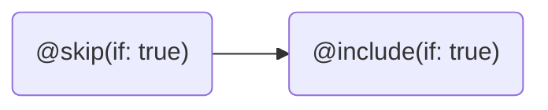

Here we will learn what GraphQL directives are and how we can build custom directives.

# Introduction

Directives provide a way to add metadata for client tools such as code generators or IDEs or alternate a GraphQL server's runtime execution and type validation behavior. There are two kinds of directives, executable directives to extend GraphQL documents and type-system directives to extend SDL types. Typically, any GraphQL server implementation should provide the following directives `@skip`, `@include`, and `@deprecated`. `@skip` and `@include`, for example, are executable directives used in GraphQL documents, whereas `@deprecated` is a type-system directive used in SDL to inform client tools that a particular part such as a field is deprecated.

## Structure

Directives consist of a name and a list of arguments that contain zero or more arguments. `@skip`, for example, has the name **skip** and a mandatory argument named **if**. Also, `@skip` carries a piece of hidden information only examinable in SDL, namely the location, which specifies where a directive is applicable. Let's take a look at the SDL of the `@skip` directive.

```sdl
directive @skip(if: Boolean!) on
    | FIELD
    | FRAGMENT_SPREAD
    | INLINE_FRAGMENT
```

The `directive` keyword in SDL indicates that we're dealing with a directive type declaration. The `@` sign also indicates that this is a directive but more from a usage perspective. The word `skip` represents the directive's name followed by a pair of parentheses that includes a list of arguments, consisting, in our case, of one argument named `if` of type non-nullable boolean (means it's required). The `on` keyword indicates the location where or at which part a directive is applicable, followed by a list of exact locations separated by pipes `|`. In the case of `@skip`, we can see that we're dealing with an executable directive because this directive is only applicable to fields, fragment-spreads, and inline-fragments that only exist in GraphQL documents and not in SDL.

## Usage

Let's say we have a GraphQL document and want to exclude details under certain circumstances; it would probably look something like this.

```graphql
query me($excludeDetails: Boolean!) {
  me {
    id
    name
    ...Details @skip(if: $excludeDetails)
  }
}

fragment Details on User {
  mobileNumber
  phoneNumber
}
```

With `@skip`, we've successfully altered the GraphQL's runtime execution behavior. If `$excludeDetails` is set to `true`, the execution engine will exclude the fields `mobileNumber` and `phoneNumber`; the response would look like this.

```json
{
  "data": {
    "me": {
      "id": "VXNlcgox",
      "name": "Henry"
    }
  }
}
```

Now that we know how to use directives in GraphQL, let's head over to the next section, which is about one crucial aspect of directives.

### Order Matters

**Directives' order is significant** because the execution is in **sequential order**, which means one after the other. If we have something like the following example, we can see how directives can affect each other.

```graphql
query me {
  me {
    name @skip(if: true) @include(if: true)
  }
}
```

Since we excluded the field `name` first, `@include` does not affect the field `name` anymore. We then just get an empty `me` object in return.

```json
{
  "data": {
    "me": {}
  }
}
```

In our example, the sequential order looks like this.



> **Note:** We will have a deep dive on directives' order in the [Middleware](#middleware) section.

Now that we have a basic understanding of what directives are, how they work, and what we can do with them, let's have fun and create a custom directive.

# Custom Directives

To create a directive, we need to create a new class that inherits from `DirectiveType` and also to override the `Configure` methods. Okay, here is a simple example.

```csharp
public class MyDirective
    : DirectiveType
{
    protected override void Configure(IDirectiveTypeDescriptor descriptor)
    {
        descriptor.Name("my");
        descriptor.Location(DirectiveLocation.Field);
    }
}
```

Before we can use our custom directive, we need to register it to the GraphQL schema. When using the HotChocolate .Net template, we just go to the `ConfigureServices` method, located in the `Startup.cs` file.

```csharp
services
    .AddGraphQLServer()
    .AddQueryType<Query>()
    .AddDirectiveType<MyDirectiveType>();
```

Let's recap! We have registered a new directive named `my` without any arguments and limited the usage to fields only. A GraphQL document with our new directive could look like this.

```graphql
query foo {
  bar @my
}
```

## Repeatable Directives

By default, directives are not repeatable, which means directives are unique and can be applied once at a specific location. For example, if we use the `my` directive twice at the field `bar`, we will encounter a validation error. So the following GraphQL document results in an error if the directive is not repeatable.

```graphql
query foo {
  bar @my @my
}
```

To make our directive repeatable, we need to add just one line code to the existing `Configure` method.

```csharp
public class MyDirective
    : DirectiveType
{
    protected override void Configure(IDirectiveTypeDescriptor descriptor)
    {
        descriptor.Name("my");
        descriptor.Location(DirectiveLocation.Field);
        descriptor.Repeatable();
    }
}
```

## Typed Arguments

Directive can have arguments that can be used to make them more flexible. So, if we had a directive like the following:

```csharp
public class MyDirective
    : DirectiveType
{
    protected override void Configure(IDirectiveTypeDescriptor descriptor)
    {
        descriptor.Name("my");
        descriptor.Argument("name").Type<NonNullType<StringType>>();
        descriptor.Location(DirectiveLocation.Object);
    }
}
```

We could associate the `MyDirective` with an object like this:

```csharp
public class FooType
    : ObjectType
{
    protected override void Configure(IObjectTypeDescriptor descriptor)
    {
        descriptor.Name("Foo");
        descriptor.Directive("my", new StringValue("bar"));
        ...
    }
}
```

Adding directives just with their name is not type safe and could lead to runtime errors which can be avoided by using our generic variant of the directive type. The generic directive type declares the .NET type that represents the directive instance.

```csharp
public class MyDirectiveType
    : DirectiveType<MyDirective>
{
    protected override void Configure(IDirectiveTypeDescriptor descriptor)
    {
        descriptor.Name("my");
        ...
    }
}

public class MyDirective
{
    public string Name { get; set; }
}
```

The generic directive type works similar to the generic input object type. The directive descriptor will automatically try to discover any properties and expose those as arguments.

So, with our new directive in place we could now add it to our object type like the following:

```csharp
public class FooType
    : ObjectType
{
    protected override void Configure(IObjectTypeDescriptor descriptor)
    {
        descriptor.Name("Foo");
        descriptor.Directive(new MyDirective { Name = "bar" });
        ...
    }
}
```

Since, the directive instance that we have added to our type is now a strong .NET type we do not have to fear changes to the directive structure or its name anymore.

## Middleware

What makes directive with Hot Chocolate very useful is the ability to associate a middleware with it. A middleware can alternate the result or even produce the result of a field. A directive middleware is only added to a field middleware pipeline when the directive was annotated to the object definition, the field definition or the field.

Moreover, of the directive is repeatable the middleware will be added multiple times to the middleware allowing to build a real pipeline with it.

In order to add a middleware to a directive you could declare it with the descriptor as a delegate.

```csharp
public class MyDirectiveType
    : DirectiveType<MyDirective>
{
    protected override void Configure(IDirectiveTypeDescriptor descriptor)
    {
        descriptor.Name("my");
        descriptor.Location(DirectiveLocation.Object);
        descriptor.Use(next => context =>
        {
            context.Result = "Bar";
            return next.Invoke(context);
        })
    }
}

public class MyDirective
{
    public string Name { get; set; }
}
```

Directives with middleware or executable directives can be put on object types and on their field definitions or on the field selection in a query. Executable directives on an object type will replace the field resolver of every field of the annotated object type.

### Order

In GraphQL the directive order is significant and with our middleware we use the order of directives to create a resolver pipeline through which the result flows.

The resolver pipeline consists of a sequence of directive delegates, called one after the other.

Each delegate can perform operations before and after the next delegate. A delegate can also decide to not pass a resolver request to the next delegate, which is called short-circuiting the resolver pipeline. Short-circuiting is often desirable because it avoids unnecessary work.

The order of middleware pipeline is defined by the order of the directives. Since, executable directives will flow from the object type to its field definitions the directives of the type would be called first in the order that they were annotated.

```sdl
type Query {
  foo: Bar
}

type Bar @a @b {
  baz: String @c @d
}
```

So, the directives in the above example would be called in the following order `a, b, c, d`.

If there were more directives in the query, they would be appended to the directives from the type.

```graphql
{
  foo {
    baz @e @f
  }
}
```

So, now the order would be like the following: `a, b, c, d, e, f`.

Every middleware can execute the original resolver function by calling `ResolveAsync()` on the `IDirectiveContext`.
