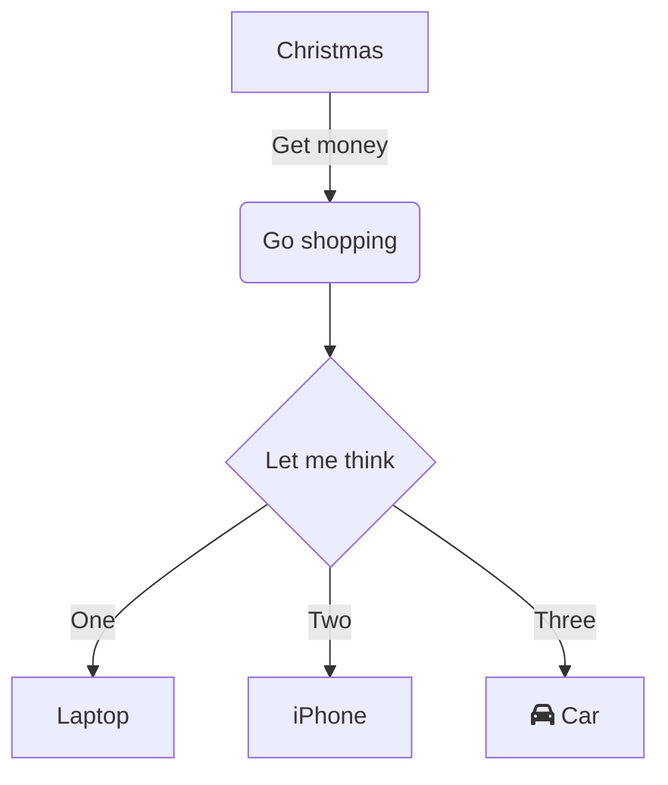

The schema in GraphQL specifies the capabilities of the API and defines how clients can request the data. It is often seen as a contract between the server and client. Generally, a schema is simply a collection of GraphQL types and GraphQL directives.

Further, the schema specifies the root types that are available. Each root type in GraphQL represents a certain operation type. In GraphQL we have the following operations that you can specify.

| Operation    | Description                                                                                                                                       |
| ------------ | ------------------------------------------------------------------------------------------------------------------------------------------------- |
| Query        | The query operation type represents side-effect free read operations.                                                                             |
| Mutation     | The mutation operation type represents all the operations that have side-effect. So, essentially everything that changes something in your server |
| Subscription | The subscription operation represent real-time events a consumer can subscribe to.                                                                |

The mutation and subscription operation are optional; The query operation type on the other hand is obligatory.

# Declaring a Schema

In Hot Chocolate a schema is defined by adding a GraphQL server configuration to a `IServiceCollection` and adding types to it. The following example adds a GraphQL server and adds a

```csharp
public void ConfigureServices(IServiceCollection services)
{
    services
        .AddGraphQLServer()
        .AddQueryType<Query>();
}

public class Query
{
    public string Hello() => "World";
}
```

The above schema will result in the following GraphQL SDL.

```sdl
schema {
  query: Query
}

type Query {
  hello: String
}
```

With the schema builder we can define what types our schema will have and how data is resolved.

There are basically two ways to define a schema, with code or with the GraphQL SDL. We can mix and match code and SDL and are not bound to stick just to one specific way to define our schema.

In schema-first we could create a simple hello world schema like the following:

```csharp
ISchema schema = SchemaBuilder.New()
    .AddDocumentFromString("type Query { hello: String }")
    .AddResolver("Query", "hello", "World")
    .Create();
```

In code-first we can again choose two approaches and again we can mix and match them. The first approach is to define the GraphQL types via POCOs and infer the GraphQL schema type structure with conventions.

With conventions we could create our above schema like the following:

```csharp
public class Query
{
    public string Hello() => "World";
}

ISchema schema = SchemaBuilder.New()
    .AddQueryType<Query>()
    .Create();
```

Hot Chocolate provides a collection of conventions and attributes to express a schema with POCOs. In many cases the default conventions should be enough, but from version 9 on we have centralised these conventions into two classes. If you do not like our default conventions or if you want to bring your own set of custom attributes, then you can overwrite or extend the default conventions.

> If you want to read more about conventions head over [here](/docs/hotchocolate/v10/schema/conventions).

The second way to express a schema in code-first is to declare schema types. Schema types allow us to exactly express the structure and properties of our schema:

```csharp
public class QueryType
    : ObjectType
{
    protected override void Configure(IObjectTypeDescriptor descriptor)
    {
        descriptor.Field("hello").Resolver("World");
    }
}

ISchema schema = SchemaBuilder.New()
    .AddQueryType<QueryType>()
    .Create();
```

We could also use our generic variant in order to have the best of both worlds:

```csharp
public class QueryType
    : ObjectType<Query>
{
    protected override void Configure(IObjectTypeDescriptor<Query> descriptor)
    {
        descriptor.Field("foo").Resolver("bar");
    }
}

public class Query
{
    public string Hello() => "World";
}

ISchema schema = SchemaBuilder.New()
    .AddQueryType<QueryType>()
    .Create();
```

The above example would yield the following schema:

```sdl
type Query {
  hello: String
  foo: String
}
```

Hot Chocolate will always try to figure the provided schema out, that means that we will infer the fields from the provided types. Also, we can extend those types by declaring further fields. As with everything we can opt out of this behavior.

> In order to see more about what capabilities our ObjectType has head over [here](/docs/hotchocolate/v10/schema/object-type).

As I mentioned earlier, we can mix and match our approach and also extend schema-first fields with code-first:

```csharp
public class QueryTypeExtension
    : ObjectTypeExtension
{
    protected override void Configure(IObjectTypeDescriptor descriptor)
    {
        descriptor.Field("foo").Resolver("bar");
    }
}

ISchema schema = SchemaBuilder.New()
    .AddDocumentFromString("type Query { hello: String }")
    .AddResolver("Query", "hello", "World")
    .AddType<QueryTypeExtension>()
    .Create();
```

The above example would again yield the following schema:

```sdl
type Query {
  hello: String
  foo: String
}
```

This is very useful with schema stitching, since this allows us to consume remote schemas and extend them with code-first.

# Binding Types

Types in a schema can be bound to a specific .NET type. When the schema builder infers schema types from .NET types it will basically lookup to which schema type a .NET type can be bound. For instance a `string` will be bound to a `StringType`.

We can also bind additional types to a single schema type. For instance we can bind the `System.Guid` to our `StringType`.

```csharp
ISchema schema = SchemaBuilder.New()
    ...
    .BindClrType<Guid, StringType>()
    .Create();
```

You can also rebind scalars with this, so instead of the default `int` to `IntType` binding we could bind that as well to our `StringType`.

```csharp
ISchema schema = SchemaBuilder.New()
    ...
    .BindClrType<int, StringType>()
    .Create();
```

# Overwriting Schema Properties

Like with any type in Hot Chocolate we can inherit from schema in order to provide further logic and details. If we for instance wanted to provide a schema description or decorate the schema with directives, we could do that like the following:

```csharp
public class MySchema
    : Schema
{
    protected override void Configure(ISchemaDescriptor descriptor)
    {
        descriptor.Description("This is my schema description that can be accessed by introspection");
    }
}

ISchema schema = SchemaBuilder.New()
    .AddDocumentFromString("type Query { hello: String }")
    .AddResolver("Query", "hello", "World")
    .SetSchema<MySchema>()
    .Create();
```

# Make it Executable

The schema object that we create with the `SchemaBuilder` describes the set of possible data we can query. In order to actually query data of that schema we have to make it executable.

```csharp
IQueryExecutor executor = schema.MakeExecutable();
```

We can create multiple executors on a single schema and define different execution rules on the executor.

In most cases we will not need to know about this fact since most of the time the schema is hosted in ASP.NET and the middleware will take care of making it executable. But it is worth knowing it in case we want to write a unit test, host a query executor in a different environment than ASP.NET, or change the behavior of the executor.

---

Use this section as an introduction to explain what a reader can expect of this document.

# Headlines

Use headlines to separate a document into several sections. First level headlines will appear in the left hand navigation. This will help the reader to quickly skip sections or jump to a particular section.

# Use Diagrams

Use [mermaid diagrams](https://mermaid-js.github.io/mermaid) to help a reader understand complex problems. Jump over to the [mermaid playground](https://mermaid-js.github.io/mermaid-live-editor) to test your diagrams.



# Use Code Examples

A code example is another tool to help readers following the document and understanding the problem. Here is an list of code blocks that are used often with the ChilliCream GraphQL platform.

Use `sdl` to describe GraphQL schemas.

```sdl
type Author {
  name: String!
}
```

Use `graphql` to describe GraphQL operations.

```graphql
query {
  author(id: 1) {
    name
  }
}
```

Use `json` for everything JSON related for example a GraphQL result.

```json
{
  "data": {
    "author": {
      "name": "ChilliCream"
    }
  }
}
```

Use `sql` for SQL queries.

```sql
SELECT id FROM Authors WHERE id = 1
```

Use `csharp` for C# code.

```csharp
public interface Author
{
    int Id { get; }

    string Name { get; }
}
```

# Use Images

When using images make sure it's a PNG file which is at least 800 pixels wide.

# Use Tables

When using tables make sure you always use titles.

| Name        | Description        |
| ----------- | ------------------ |
| ChilliCream | A GraphQL platform |
