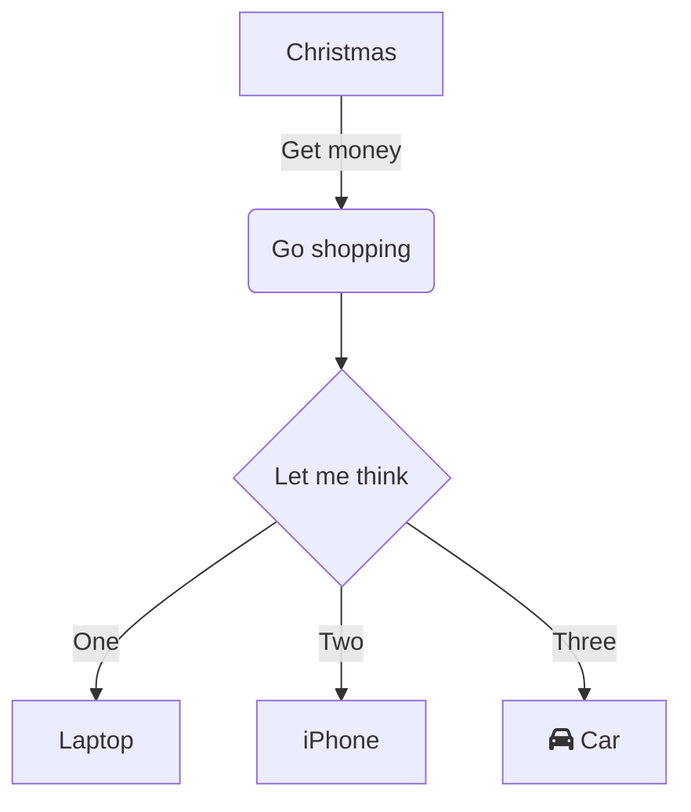

Use this section as an introduction to explain what a reader can expect of this document.

# Headlines

## Sub

### Sub2

Use headlines to separate a document into several sections. First level headlines will appear in the left hand navigation. This will help the reader to quickly skip sections or jump to a particular section.

# Use Diagrams

Use [mermaid diagrams](https://mermaid-js.github.io/mermaid) to help a reader understand complex problems. Jump over to the [mermaid playground](https://mermaid-js.github.io/mermaid-live-editor) to test your diagrams.



# Use Code Examples

A code example is another tool to help readers following the document and understanding the problem. Here is an list of code blocks that are used often with the ChilliCream GraphQL platform.

Use `sdl` to describe GraphQL schemas.

```sdl
type Author {
  name: String!
}
```

Use `graphql` to describe GraphQL operations.

```graphql
query {
  author(id: 1) {
    name
  }
}
```

Use `json` for everything JSON related for example a GraphQL result.

```json
{
  "data": {
    "author": {
      "name": "ChilliCream"
    }
  }
}
```

Use `sql` for SQL queries.

```sql
SELECT id FROM Authors WHERE id = 1
```

Use `csharp` for C# code.

```csharp
public interface Author
{
    int Id { get; }

    string Name { get; }
}
```

# Use Images

When using images make sure it's a PNG file which is at least 800 pixels wide.

# Use Tables

When using tables make sure you always use titles.

| Name        | Description        |
| ----------- | ------------------ |
| ChilliCream | A GraphQL platform |
