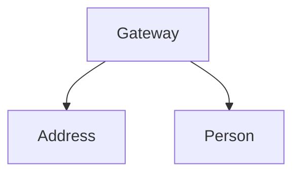
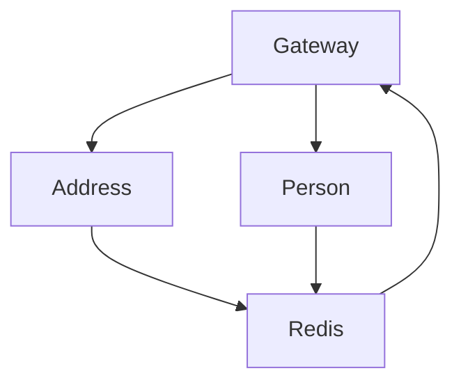

The strongly typed nature of a GraphQL schema makes it ideal for distribution.
It is possible to have specialized services that expose a GraphQL schema and bundle them together on a gateway.
There are two common approaches to schema distribution: schema stitching and federated schemas.

Both approaches allow us to integrate services into one schema by folding types into one another and even renaming or removing parts.
You can also extend types and delegate resolvers to a specific backend service.

With this, we can create a consistent GraphQL schema that hides the implementation details of our backend services and provides the consumer of our endpoint with the capability to fetch the data they need with one call, no under- or over-fetching and most importantly no repeated fetching

Every HotChocolate GraphQL server can be used for schema stitching or federations. 
You can also use both approaches on the same gateway.
You can for example stitch third-party services and use federations for domain services.

_Schema of the Person Service_

```sdl
type Query {
  persons: Person
}

type Person {
  id: ID!
  name: String!
}
```

_Schema of the Address Service_

```sdl
type Query {
  addressOfPerson(persondId: ID!): Address
}

type Address {
  street: String!
  city: String!
}
```

_Gateway Service_

```sdl
type Query {
  persons: Person
}

type Person {
  id: ID!
  name: String!
  address: Address
}

type Address {
  street: String!
  city: String!
}
```

# Schema Stitching

In the scenario of schema stitching, the configuration of the gateway schema is on the gateway itself.
The gateway pulls the schema from the downstream services and can be extended with SDL. 
The benefit of this approach is that no configuration on the downstream services is needed. 
With this approach, it is possible to also stitch thrid party GraphQL services.

Gateway:

```sdl
extend type Person {
  address: Address @delegate(schema: "Address", path:"addressOfPerson(personId: $fields:Id"))
}
```



# Federated Schema

The major difference between schema federation and schema stitching is where the extensions are stored. 
In the federated approach, the schema extensions are defined on the federated service. 
The domain services push the schema on a cache (like Redis). 
The gateway is subscribed to changed from this cache and can hot reload the schema if the configuration of a domain service changes.
It is also possible to set up federations in a pull setup. 
In this setup, the downstream services expose a field on their schema to fetch the stitching information. 
The gateway then fetches the federation information from the downstream service on startup. 
With this setup, you do not need a Redis instance, but lose the ability to hot-reload the schema on a change of the downstream service.

The benefit of this approach is that the domain services define where they extend the Gateway schema. 
This might first seem odd and you could argue that the domain service should not have any knowledge of the gateway schema.
Though in practice many companies see this as a feature rather than a limitation. 
As the gateway schema grows, the configuration of the schema on the gateway with schema stitching will become more and more complex.
A change to a downstream service requires also a change to the gateway. This makes development and also deployment a lot more complex. 
If teams have sovereignty over different domain services, these teams can work completely independently when you use federations.


Address Service:

```sdl
extend type Person {
  address: Address @delegate(schema: "Address", path:"addressOfPerson(personId: $fields:Id"))
}
```



# A real world example

To showcase how schema stitching works and what the problems are let us assume we have a service like Twitter, where a user can post messages.

Moreover, let us assume we have three teams working on internal micro-/domain-services that handle certain aspects of that service.

The first service is handling the message stream and has the following schema:

```sdl
type Query {
  messages(userId: ID!): [Message!]
  message(messageId: ID!): Message
}

type Mutation {
  newMessage(input: NewMessageInput!): NewMessagePayload!
}

type Message {
  id: ID!
  text: String!
  createdBy: ID!
  createdAt: DateTime!
  tags: [String!]
}

type NewMessageInput {
  text: String!
  tags: [String!]
}

type NewMessagePayload {
  message: Message
}
```

The second service is handling the users of the services and has the following schema:
```sdl
type Query {
  user(userId: ID!): User!
  users: [User!]
}

type Mutation {
  newUser(input: NewUserInput!): NewUserPayload!
  resetPassword(input: ResetPasswordInput!): ResetPasswordPayload!
}

type NewUserInput {
  username: String!
  password: String!
}

type ResetPasswordInput {
  username: String!
  password: String!
}

type NewUserPayload {
  user: User
}

type ResetPasswordPayload {
  user: User
}

type User {
  id: ID!
  username: String!
}
```

Last but not least we have a third service handling the message analytics. In our example case we keep it simple and our analytics service just tracks three different counters per message. The schema for this service looks like the following:

```sdl
type Query {
  analytics(messageId: ID!, type: CounterType!): MessageAnalytics
}

type MessageAnalytics {
  id: ID!
  messageId: ID!
  count: Int!
  type: CounterType!
}

enum CounterType {
  VIEWS
  LIKES
  REPLIES
}
```

With those three separate schemas our UI team would have to fetch from multiple endpoints.

Even worse for our UI team, in order to build a stream view that shows the message text and the name of the user who posted the message, they would have to first fetch all the messages and could only then fetch the names of the users.

This is actually one of the very things GraphQL tries to solve.

With schema stitching or federations the services can be bundled together into one schema:
```sdl
type Query {
  me: User!
  messages(userId: ID!): [Message!]
  message(messageId: ID!): Message
  user(userId: ID!): User!
  users: [User!]
}

type Mutation {
  newMessage(input: NewMessageInput!): NewMessagePayload!
  newUser(input: NewUserInput!): NewUserPayload!
  resetPassword(input: ResetPasswordInput!): ResetPasswordPayload!
}

type Message {
  id: ID!
  text: String!
  createdBy: User
  createdById: ID!
  createdAt: DateTime!
  tags: [String!]
  views: Int!
  likes: Int!
  replies: Int!
}

type NewMessageInput {
  text: String!
  tags: [String!]
}

type NewMessagePayload {
  message: Message
}

type NewUserInput {
  username: String!
  password: String!
}

type ResetPasswordInput {
  username: String!
  password: String!
}

type NewUserPayload {
  user: User
}

type ResetPasswordPayload {
  user: User
}

type User {
  id: ID!
  username: String!
  messages: [Message!]
}
```
