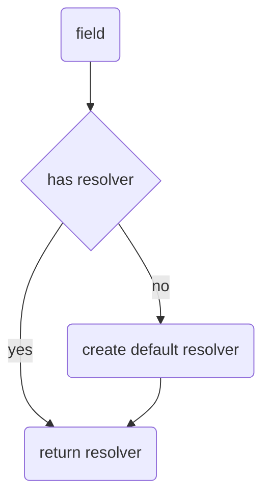
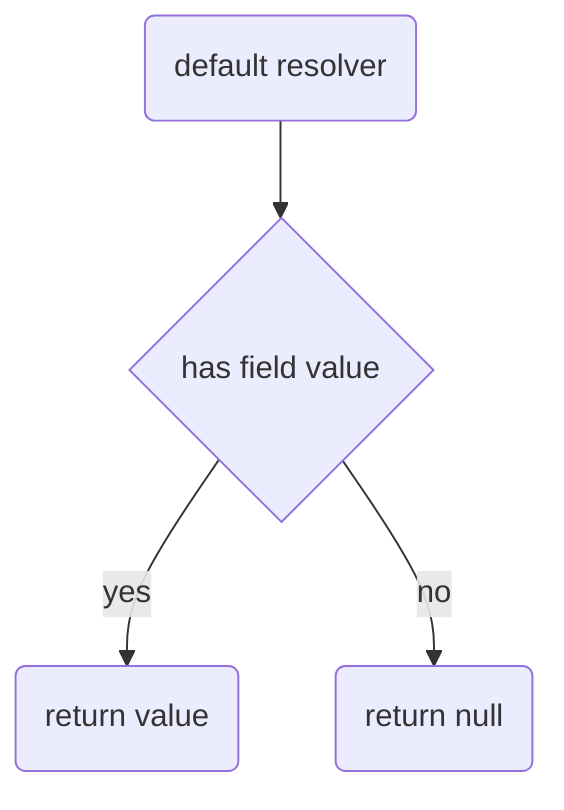
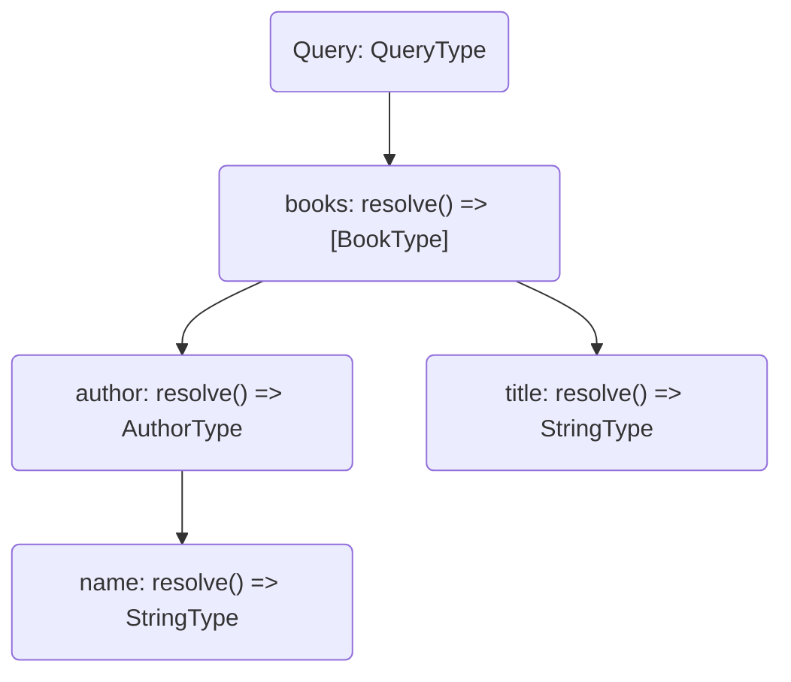

# Defining a resolver

# Resolver chain

# Resolver arguments

# Dependency Injection

# Resolver Pipeline

# Error handling

When it comes to fetching data in a GraphQL server you will always end up with a resolver.
A resolver is a generic function that fetches data from an arbitrary data source for a particular field.
This means every field has it's own resolver function in order to fetch data. Even if there wasn't a resolver defined for one field, HotChocolate will create a default resolver for this particular field behind the scenes.



Let's take a look inside the default resolver.



Imagine we have a GraphQL query like the following, which fetches a collection of books that contains the book's title and the author's name.

```graphql
query {
  books {
    author {
      name
    }
    title
  }
}
```

Then a GraphQL server would transform this query into the following resolver tree.



# Defining a resolver
