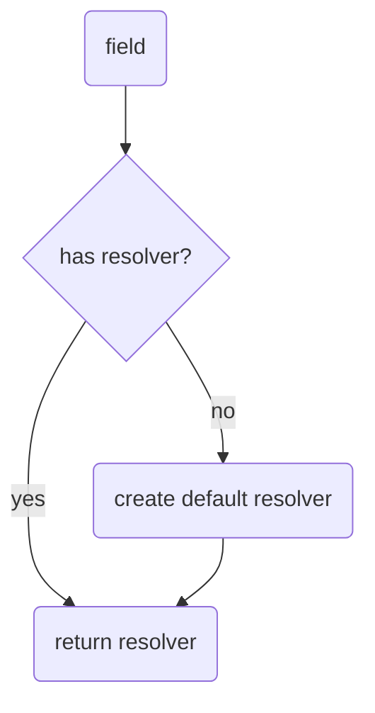
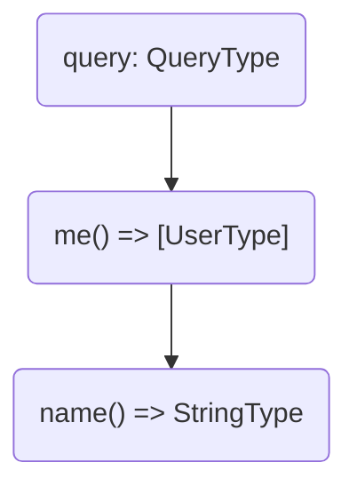
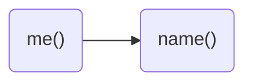

When it comes to fetching data in a GraphQL server you will always end up with a resolver.
**A resolver is a generic function that fetches data from an arbitrary data source for a particular field.**
This means every field has it's own individual resolver function in order to fetch or select data. Even if there isn't a resolver defined for one field, Hot Chocolate will create a default resolver for this particular field behind the scenes.



In Hot Chocolate a default resolver is a compiled function for a specific field that accesses a property of its parent value which matches with the field name. As an example, in case we have a parent value of type `User` which has a field called `name`, the compiled default resolver for the field `name` would look like the following.

```csharp
var resolver = (User parent) => parent.Name;
```

It's not exactly how it's implemented in Hot Chocolate, but it serves here basically as a simplified illustration. The key takeaway is that there is always a resolver for every field in place.

> **Note:** The parent value represents the inner value of the parent resolver or in case of a root resolver the root value which represents the value of one of the root types (query, mutation or subscription). It has nothing to do with the result type of a resolver and is specific to the business logic of a resolver.

## Resolver Tree

A resolver tree is a projection of a GraphQL operation which is prepared for execution. The execution engine takes the resolver tree and simply follows the path of resolvers from top to down. For better understanding let's imagine we have a simple GraphQL query like the following, where we select the name of the currently logged-in user.

```graphql
query {
  me {
    name
  }
}
```

In Hot Chocolate this query results in the following resolver tree.



A resolver tree is in the end nothing else than a resolver chain where each branch can be executed in parallel.



Okay, let's dissect a little further here. A resolver chain starts always with one or many root resolver, which is in our case `me()` and then just follows the path along. In our scenario it means the next resolver would be `name()` which is also the last resolver in our chain. So as soon as `me` has fetched the user profile of the currently logged-in user, Hot Chocolate will immediately start executing the next resolver and feeding in the previous object value which is also called parent or parent value in spec language. Let's say the parent value looks like this.

```csharp
var parent = new User
{
  Id = "user-1",
  Name = "ChilliCream",
  ...
}
```

Then the `name()` resolver can just access the `Name` property of the parent value and simply return it. As soon as all resolvers has been completed, the execution engine would then return the following GraphQL result provided that everything went successful.

```json
{
  "data": {
    "me": {
      "name": "ChilliCream"
    }
  }
}
```

Nice, now that we know what resolvers are and how they work in a bigger picture, how can we actually start writing one. Let's jump to the next section and find out.

# Defining a resolver

# Resolver chains

# Resolver Arguments

# DI and stuff

# Resolver Pipeline

# Error Handling
