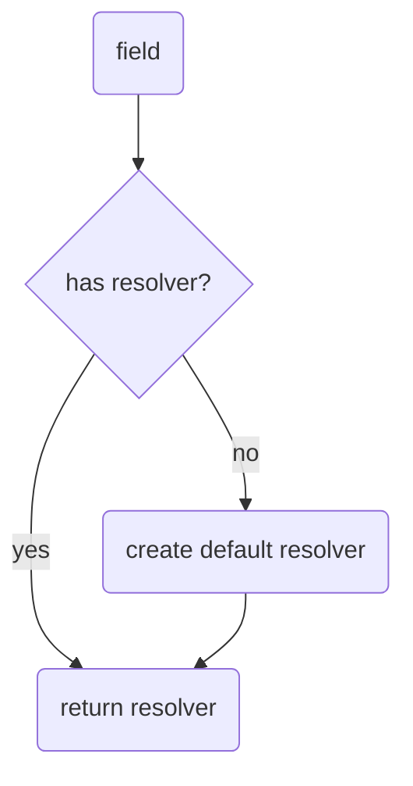
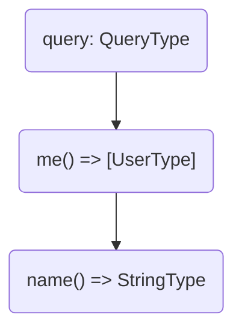
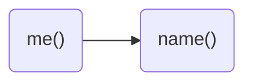

# Introduction

When it comes to fetching data in a GraphQL server you will always end up with a resolver.
**A resolver is a generic function that fetches data from an arbitrary data source for a particular field.**
This means every field has it's own individual resolver function in order to fetch or select data. Even if there isn't a resolver defined for one field, Hot Chocolate will create a default resolver for this particular field behind the scenes.



In Hot Chocolate a default resolver is a compiled function for a specific field that accesses a property of its parent value which matches with the field name. As an example, in case we have a parent value of type `User` which has a field called `name`, the compiled default resolver for the field `name` would look like the following.

```csharp
var resolver = (User parent) => parent.Name;
```

It's not exactly how it's implemented in Hot Chocolate, but it serves here basically as a simplified illustration. The key takeaway is that there is always a resolver for every field in place.

> **Note:** The parent value represents the inner value of the parent resolver or in case of a root resolver the root value which represents the value of one of the root types (query, mutation or subscription). It has nothing to do with the result type of a resolver and is specific to the business logic of a resolver.

## Resolver Tree

A resolver tree is a projection of a GraphQL operation which is prepared for execution. The execution engine takes the resolver tree and simply follows the path of resolvers from top to down. For better understanding let's imagine we have a simple GraphQL query like the following, where we select the name of the currently logged-in user.

```graphql
query {
  me {
    name
  }
}
```

In Hot Chocolate this query results in the following resolver tree.



A resolver tree is in the end nothing else than a resolver chain where each branch can be executed in parallel.



Okay, let's dissect a little further here. A resolver chain starts always with one or many root resolver, which is in our case `me()` and then just follows the path along. In our scenario it means the next resolver would be `name()` which is also the last resolver in our chain. So as soon as `me` has fetched the user profile of the currently logged-in user, Hot Chocolate will immediately start executing the next resolver and feeding in the previous object value which is also called parent or parent value in spec language. Let's say the parent value looks like this.

```csharp
var parent = new User
{
  Id = "user-1",
  Name = "ChilliCream",
  ...
}
```

Then the `name()` resolver can just access the `Name` property of the parent value and simply return it. As soon as all resolvers have been completed, the execution engine would then return the following GraphQL result provided that everything went successful.

```json
{
  "data": {
    "me": {
      "name": "ChilliCream"
    }
  }
}
```

Nice, now that we know what resolvers are and how they work in a bigger picture, how can we actually start writing one. Let's jump to the next section and find out.

# Defining a resolver

A resolver in Hot Chocolate is basically a function that takes 0 or many arguments and returns one value. The simplest resolver to write is a resolver that takes 0 arguments and returns just a value type (e.g. a string).

> **Note:** Every single code examples is always shown in three different coding approaches with the same outcome. Annotation-based (previously known as pure code-first), code-first and schema-first. If you would like to learn more about the different coding approaches Hot Chocolate offers, click on [Coding Approaches](/docs/hotchocolate/api-reference/coding-approaches).

## Annotation-based example

```csharp
// Query.cs
public class Query
{
    public string Say() => "Hello World!";
}

// Startup.cs
public class Startup
{
    public void ConfigureServices(IServiceCollection services)
    {
        services
            .AddRouting()
            .AddGraphQLServer()
            .AddQueryType<Query>();
    }

    // Omitted code for brevity
}
```

## Code-first example

```csharp
// Query.cs
public class Query
{
    public string Say() => "Hello World!";
}

// QueryType.cs
public class QueryType
    : ObjectType<Query>
{
    protected override void Configure(
        IObjectTypeDescriptor<Query> descriptor)
    {
        descriptor
            .Field(f => f.Say())
            .Type<NonNullType<StringType>>();
    }
}

// Startup.cs
public class Startup
{
    public void ConfigureServices(IServiceCollection services)
    {
        services
            .AddRouting()
            .AddGraphQLServer()
            .AddQueryType<QueryType>();
    }

    // Omitted code for brevity
}
```

## Schema-first example

```csharp
// Query.cs
public class Query
{
    public string Say() => "Hello World!";
}

// Startup.cs
public class Startup
{
    public void ConfigureServices(IServiceCollection services)
    {
        services
            .AddRouting()
            .AddGraphQLServer()
            .AddDocumentFromString(@"
                type Query {
                    say: String!
                }
            ")
            .BindComplexType<Query>();
    }

    // Omitted code for brevity
}
```

When comparing all three code examples side by side we can see very quickly that all of them have the `Query` type in common. As a matter of fact the `Query` type is actually identical in all three examples. Regardless, the `Query` type contains a method named `Say` which is our resolver in fact, the most important bit here. The `Say` method will be translated into the `say` field on the schema side as soon as Hot Chocolate has been started and initialized. As a side note all three approaches will result into the same `SDL`.

```sdl
type Query {
  say: String!
}
```

Let's get back to where our examples and the coding approaches differentiate respectively. The `Startup` class which contains the service configuration that slightly differs in each example. In the **annotation-based** example we just bind the `Query` type to our GraphQL schema. Easy, quick and without writing any GraphQL specific binding code. Hot Chocolate will do the hard part and infer everything from the type itself. In the **code-first** example we bind a meta type `QueryType`, which contains the GraphQL configuration for the `Query` type, to the GraphQL schema. Instead of inferring the GraphQL type Hot Chocolate will take our specific GraphQL configuration and creates the GraphQL schema out of it. In the **schema-first** example we provide Hot Chocolate the `SDL` directly and Hot Chocolate will match that to our resolver. Now that you know how to define a resolver in all three approaches it's time to learn how to pass arguments and stuff like that into a resolver. Let's head to the next section.

# Resolver Arguments

A resolver argument, not to be confused with a field argument in GraphQL, can be a field argument value, a DI service, state or context.

# Naming Rules

- How should we name things
- How is a method name translated

# Best Practices

# Resolver Pipeline

# Error Handling
