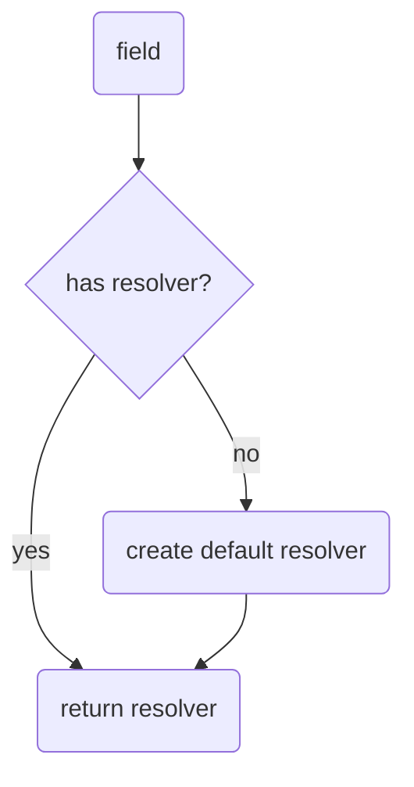
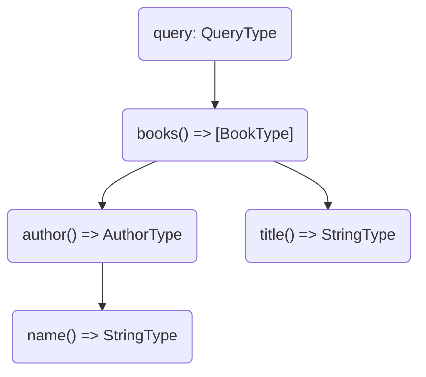
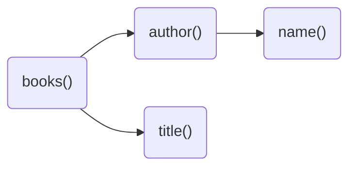

When it comes to fetching data in a GraphQL server you will always end up with a resolver.
**A resolver is a generic function that fetches data from an arbitrary data source for a particular field.**
This means every field has it's own individual resolver function in order to fetch data. Even if there isn't a resolver defined for one field, HotChocolate will create a default resolver for this particular field behind the scenes.



In HotChocolate a default resolver is a compiled function for a specific field that accesses a property of its parent object which matches with the field name. As an example, in case we have a parent object of type `Author` which has a field called `name`, the compiled default resolver for the field `name` would look like the following.

```csharp
var resolver = (parent: Author) => parent.Name;
```

It's not exactly how it looks in HotChocolate but it serves here just as a simplified illustration. The key takeaway is that there is always a resolver for every field in place. This brings us to our next topic.

## Resolver Tree

A resolver tree is a projection of a GraphQL operation which is prepared for execution. The execution engine takes the resolver tree and just follow the path of resolvers from top to down. For better understanding let's imagine we have a GraphQL query like the following, which fetches a collection of books that contains the book's title and the author's name.

```graphql
query {
  books {
    author {
      name
    }
    title
  }
}
```

HotChocolate will transform this query into the following resolver tree.



A resolver tree is in the end nothing else than a resolver chain where each branch can be executed in parallel.



```json
{
  "data": {
    "books": [
      {
        "title": "Book 1",
        "author": {
          "name": "Author 1"
        }
      },
      {
        "title": "Book 2",
        "author": {
          "name": "Author 1"
        }
      }
    ]
  }
}
```

# Defining a resolver
