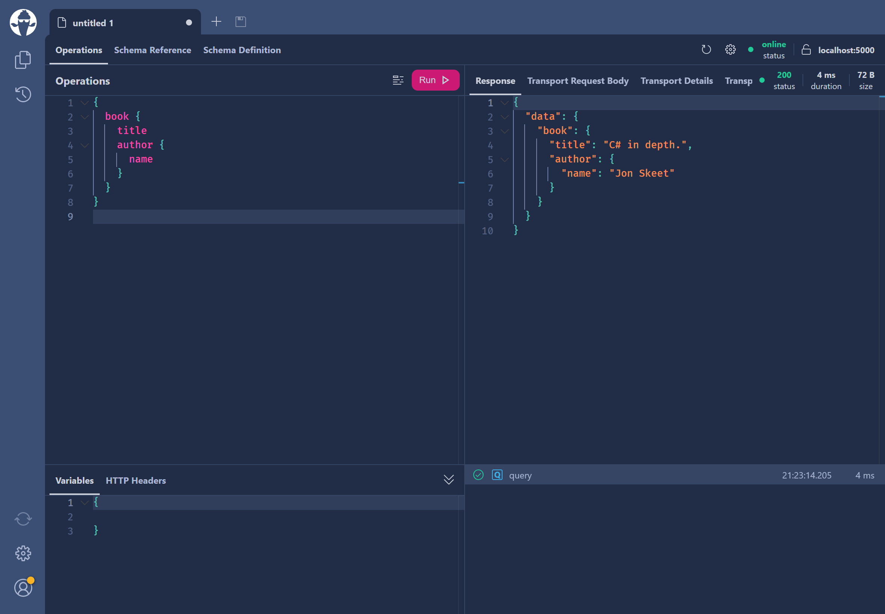

import { ApiChoiceTabs } from "../../components/mdx/api-choice-tabs"
import { InputChoiceTabs } from "../../components/mdx/input-choice-tabs"

TODO

# Setup

There are two ways to setup a Hot Chocolate GraphQL server. Either you use our official template or you integrate Hot Chocolate into an existing project manually. While the from scratch approach certainly takes a bit longer, ultimately the setup is really straight forward and fast in both cases.

Keep reading if you want to use our template or jump ahead to the [from scratch section](#from-scratch).

## Using our template

We offer some templates for Hot Chocolate to help you get a GraphQL server up and running in a matter of seconds.

#### 1. Install the templates

The `HotChocolate.Templates` collection can be installed like the following.

```bash
dotnet new -i HotChocolate.Templates
```

These templates are kept up to date by us with the latest .NET and Hot Chocolate features. We are for example making use of _Implicit Usings_ added with .NET 6 to provide the most common Hot Chocolate namespaces implicitly.

> Note: Our templates have to be updated manually. To update just re-execute the above command. We recommend doing so every time Hot Chocolate releases a new major version.

#### 2. Create a new project using a template

Once you have installed our templates you can use them to bootstrap your next ASP.NET Core project with Hot Chocolate.

<InputChoiceTabs>
<InputChoiceTabs.CLI>

```bash
dotnet new graphql -n Demo
```

This will create a new directory called "Demo" containing your project's files.

You can now open the "Demo" directory or the "Demo.csproj" file in your favorite code editor.

</InputChoiceTabs.CLI>
<InputChoiceTabs.VisualStudio>

Create a new project from within Visual Studio using the "HotChocolate GraphQL Server" template.

[Learn how you can create a new project within Visual Studio](https://docs.microsoft.com/visualstudio/ide/create-new-project)

</InputChoiceTabs.VisualStudio>
</InputChoiceTabs>

Now that you have your project ready, let's look at executing your first GraphQL query with Hot Chocolate.

[Learn how to execute your first GraphQL query](#executing-a-query)

## From scratch

Of course you can also integrate Hot Chocolate into an existing ASP.NET Core application. If you have already created an ASP.NET Core project you can skip step 1.

#### 1. Create a new ASP.NET Core project

<InputChoiceTabs>
<InputChoiceTabs.CLI>

```bash
dotnet new web -n Demo
```

This will create a new directory called "Demo" containing your project's files.

You can now open the "Demo" directory or the "Demo.csproj" file in your favorite code editor.

</InputChoiceTabs.CLI>
<InputChoiceTabs.VisualStudio>

Create a new project from within Visual Studio using the "ASP.NET Core Empty" template.

[Learn how you can create a new project within Visual Studio](https://docs.microsoft.com/visualstudio/ide/create-new-project)

</InputChoiceTabs.VisualStudio>
</InputChoiceTabs>

#### 2. Add the HotChocolate.AspNetCore package

This package includes everything that's needed to get your GraphQL server up and running.

<InputChoiceTabs>
<InputChoiceTabs.CLI>

```bash
dotnet add package HotChocolate.AspNetCore
```

</InputChoiceTabs.CLI>
<InputChoiceTabs.VisualStudio>

You can add the `HotChocolate.AspNetCore` package using the NuGet Package Manager within Visual Studio.

[Learn how you can use the NuGet Package Manager to install a package](https://docs.microsoft.com/nuget/quickstart/install-and-use-a-package-in-visual-studio#nuget-package-manager)

</InputChoiceTabs.VisualStudio>
</InputChoiceTabs>

> ⚠ Note: Additional `HotChocolate.*` packages need to have the same version.

#### 3. Defining the schema

Next, we want to create a GraphQL schema. The GraphQL schema defines which data we expose and how consumers can interact with said data.

For starters we can define two object types (models) that we want to expose through our schema.

```csharp
public class Book
{
    public string Title { get; set; }

    public Author Author { get; set; }
}

public class Author
{
    public string Name { get; set; }
}
```

#### 4. Adding a Query type

Now that we have defined our models, we need to define a `Query` type that is used to query for the models we've just defined.

```csharp
public class Query
{
    public Book GetBook() =>
        new Book
        {
            Title = "C# in depth.",
            Author = new Author
            {
                Name = "Jon Skeet"
            }
        };
}
```

#### 5. Adding GraphQL services

Next, we need to add the services required by Hot Chocolate to our Dependency Injection container.

<ApiChoiceTabs>
<ApiChoiceTabs.MinimalApis>

```csharp
var builder = WebApplication.CreateBuilder(args);

builder.Services
    .AddGraphQLServer()
    .AddQueryType<Query>();
```

</ApiChoiceTabs.MinimalApis>
<ApiChoiceTabs.Regular>

```csharp
public void ConfigureServices(IServiceCollection services)
{
    services
        .AddGraphQLServer()
        .AddQueryType<Query>();
}
```

</ApiChoiceTabs.Regular>
</ApiChoiceTabs>

The `AddGraphQLServer` returns an `IRequestExecutorBuilder` which is the main way to configure our GraphQL server. In the above example we are specifying the Query type that should be exposed by our GraphQL server.

#### 6. Mapping the GraphQL endpoint

Now that we've added the necessary services, we need to expose our GraphQL server at an endpoint. Hot Chocolate comes with an ASP.NET Core middleware that is used to serve up the GraphQL server.

<ApiChoiceTabs>
<ApiChoiceTabs.MinimalApis>

```csharp
var app = builder.Build();

app.MapGraphQL();

app.Run();
```

</ApiChoiceTabs.MinimalApis>
<ApiChoiceTabs.Regular>

```csharp
public void Configure(IApplicationBuilder app, IWebHostEnvironment env)
{
    app.UseRouting();

    app.UseEndpoints(endpoints =>
    {
        endpoints.MapGraphQL();
    });
}
```

</ApiChoiceTabs.Regular>
</ApiChoiceTabs>

And this is it - you have successfully setup a Hot Chocolate GraphQL server! 🚀

# Executing a query

In order to isue a query against your newly built GraphQL server, we first have to run it.

<InputChoiceTabs>
<InputChoiceTabs.CLI>

```bash
dotnet run
```

</InputChoiceTabs.CLI>
<InputChoiceTabs.VisualStudio>

The Project can be started by either pressing `Ctrl + F5` or clicking the green "Debug" button in the Visual Studio toolbar.


</InputChoiceTabs.VisualStudio>
</InputChoiceTabs>

If you have setup everything correctly you should be able to naviagte to <a href="http://localhost:5000/graphql" target="_blank" rel="noopener noreferrer">http://localhost:5000/graphql</a> and be greeted by our GraphQL IDE [Banana Cake Pop](/docs/bananacakepop)


Next click on "Create document". You will be presented with a settings dialog for this new tab, pictured below. Make sure the "Schema Endpoint" input field has the correct URL under which your GraphQL endpoint is available. If it is correct you can just go ahead and click the "Apply" button in the bottom right.


Now you should be seeing an editor like the one pictured below. If your GraphQL server has been correctly setup you should be seeing a green "online" in the top right corner of the editor.


The view is split into four panes. The top left pane is where you enter the queries you wish to send to the GraphQL server - the result will be displayed in the top right pane. Variables and headers can be modified in the bottom left pane and recent queries can be viewed in the bottom right pane.

Okay, so let's send a query to your GraphQL server. Paste the below query into the top left pane of the editor:

```graphql
{
  book {
    title
    author {
      name
    }
  }
}
```

To execute the query, simply press the "Run" button. The result should be displayed as JSON in the top right pane as shown below:



You can also view and browse the schema from within Banana Cake Pop. Click on the "Schema Reference" tab next to "Operations" in order to browse the schema. There's also a "Schema Definition" tab, pictured below, which shows the schema using the raw SDL (Schema Definition Language).


Congratulations, you've built your first Hot Chocolate GraphQL server and sent a query using the Banana Cake Pop GraphQL IDE 🎉🚀

# Additional resources

Now that you've setup a basic GraphQL server, what should be your next steps?

If this is your first time using GraphQL, we recommend [this guide](https://graphql.org/learn/) that walks you through the basic concepts of GraphQL.

If you want to get an overview of Hot Chocolate's features, we recommend reading the _Overview_ pages in each section of the documentation. They can be found in the sidebar to your left.

For a guided tutorial that explains how you can setup your GraphQL server beyond this basic example, checkout [our workshop](https://github.com/ChilliCream/graphql-workshop). Here we will dive deeper into several topics around Hot Chocolate and GraphQL in general.

You can also jump straight into our documentation and learn more about<br/>[Defining a GraphQL schema](/docs/hotchocolate/defining-a-schema).
