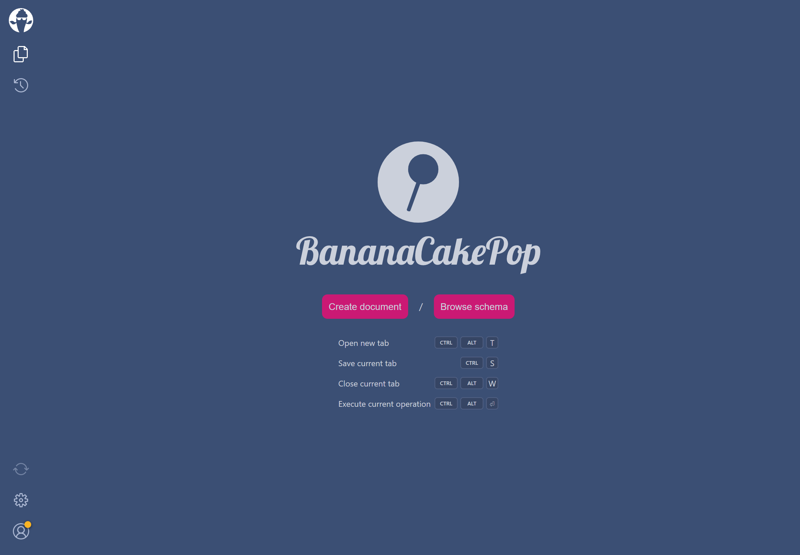

import { ApiChoiceTabs } from "../../components/mdx/api-choice-tabs"
import { InputChoiceTabs } from "../../components/mdx/input-choice-tabs"

TODO

# Setup

TODO

## Using our template

TODO

#### 1. Install the templates

The `HotChocolate.Templates` collection can be installed like the following.

```bash
dotnet new -i HotChocolate.Templates
```

These templates are kept up to date by us with the latest .NET and Hot Chocolate features. We are for example making use of _Implicit Usings_ added with .NET 6 to provide the most common Hot Chocolate namespaces implicitly.

> Note: Our templates have to be updated manually. To update just re-execute the above command. We recommend doing so after Hot Chocolate releases a new major version.

#### 2. Create a new project using a template

<InputChoiceTabs>
<InputChoiceTabs.CLI>

```bash
dotnet new graphql -n Demo
```

</InputChoiceTabs.CLI>
<InputChoiceTabs.VisualStudio>

TODO

</InputChoiceTabs.VisualStudio>
</InputChoiceTabs>

## From scratch

If you do not want to use the template or you have to integrate Hot Chocolate into an existing ASP.NET Core application, you can setup a functioning GraphQL server in a few simple steps. If you have already setup an ASP.NET Core project you can skip step 1.

#### 1. Create a new ASP.NET Core project

<InputChoiceTabs>
<InputChoiceTabs.CLI>

```bash
dotnet new web -n Demo
```

This will create a new directory called "Demo" containing your project's files.

</InputChoiceTabs.CLI>
<InputChoiceTabs.VisualStudio>

<!-- todo: verify template name -->

In Visual Studio you can create a new ASP.NET Core project using the "Web" template.

[Learn how you can create a new project within Visual Studio](https://docs.microsoft.com/visualstudio/ide/create-new-project)

</InputChoiceTabs.VisualStudio>
</InputChoiceTabs>

After you have successfully created the project you can go ahead and open it in your favorite Code Editor.

#### 2. Add the HotChocolate.AspNetCore package

This package includes everything that's needed to get your GraphQL server up and running.

<InputChoiceTabs>
<InputChoiceTabs.CLI>

```bash
dotnet add package HotChocolate.AspNetCore
```

</InputChoiceTabs.CLI>
<InputChoiceTabs.VisualStudio>

You can add the `HotChocolate.AspNetCore` package using the NuGet Package Manager within Visual Studio.

[Learn how you can use the NuGet Package Manager to install a package](https://docs.microsoft.com/nuget/quickstart/install-and-use-a-package-in-visual-studio#nuget-package-manager)

</InputChoiceTabs.VisualStudio>
</InputChoiceTabs>

#### 3. Adding some object types

TODO

#### 4. Adding a Query type

TODO

#### 5. Adding GraphQL services

We need to add the services required by Hot Chocolate to operate a GraphQL server to our Dependency Injection container.

<ApiChoiceTabs>
<ApiChoiceTabs.MinimalApis>

TODO

</ApiChoiceTabs.MinimalApis>
<ApiChoiceTabs.Regular>

```csharp
public void ConfigureServices(IServiceCollection services)
{
    services
        .AddGraphQLServer()
        .AddQueryType<Query>();
}
```

</ApiChoiceTabs.Regular>
</ApiChoiceTabs>

The `AddGraphQLServer` returns an `IRequestExecutorBuilder` which is the main way to configure our GraphQL server. In the above example we are specifying which Query type should be exposed by our GraphQL server.

#### 6. Mapping the GraphQL endpoint

Now that we've added the necessary services, we need to expose our GraphQL server at an endpoint. Hot Chocolate comes with an ASP.NET Core middleware that is used to serve up the GraphQL server.

<ApiChoiceTabs>
<ApiChoiceTabs.MinimalApis>

TODO

</ApiChoiceTabs.MinimalApis>
<ApiChoiceTabs.Regular>

```csharp
public void Configure(IApplicationBuilder app, IWebHostEnvironment env)
{
    app.UseRouting();

    app.UseEndpoints(endpoints =>
    {
        endpoints.MapGraphQL();
    });
}
```

</ApiChoiceTabs.Regular>
</ApiChoiceTabs>

And this is it - you have successfully built your first GraphQL server! 🚀

# Executing a query

TODO

<!--
todo:
versions need to be the same
services refer to the service collection
 -->

# Additional resources

Now that you've setup a basic GraphQL server using Hot Chocolate, what should be your next steps?

If this is your first time using GraphQL, we recommend [this guide](https://graphql.org/learn/) that walks you through the basic concepts of GraphQL.

If you want to get an overview of Hot Chocolate's features, we recommend reading the _Overview_ pages in each section of the documentation. They can be found in the sidebar to your left.

For a guided tutorial that explains how you can setup your GraphQL server beyond this basic example, checkout [our workshop](https://github.com/ChilliCream/graphql-workshop). Here we will dive deeper into several topics around Hot Chocolate and GraphQL in general.

You can also jump straight into our documentation and learn more about<br/>[Defining a GraphQL schema](/docs/hotchocolate/defining-a-schema).

<!--

# Step 2: Create a GraphQL schema

Next, we want to create a GraphQL schema. The GraphQL schema defines how we expose data to our consumers. To define the schema, open your favorite C# editor and let us get started.

1. Add a new class `Author`.

```csharp
namespace Demo
{
    public class Author
    {
        public string Name { get; set; }
    }
}
```

2. Add a new class `Book`.

```csharp
namespace Demo
{
    public class Book
    {
        public string Title { get; set; }

        public Author Author { get; set; }
    }
}
```

With these two classes we have a nice and simple model that we can use to build our GraphQL schema. We now need to define a query root type. The query root type exposes all the possible queries that a user can drill into. A query root type can be defined in the same way we defined our models.

3. Add a new class `Query`.

```csharp
namespace Demo
{
    public class Query
    {
        public Book GetBook() =>
            new Book
            {
                Title = "C# in depth.",
                Author = new Author
                {
                    Name = "Jon Skeet"
                }
            };
    }
}
```

Now, we have all the parts to create a valid GraphQL schema. Let us now head over to the `Startup.cs` and configure our GraphQL schema.

4. Add the GraphQL schema to the service configuration by adding the following code to the `ConfigureServices` method in the `Startup.cs`.

```csharp
public void ConfigureServices(IServiceCollection services)
{
    services
        .AddGraphQLServer()
        .AddQueryType<Query>();
}
```

5. Lastly, we need something to execute our code; for this, we will head over to the `Configure` method of our `Startup.cs` and add `MapGraphQL` to `UseEndpoints`.

```csharp
public void Configure(IApplicationBuilder app, IWebHostEnvironment env)
{
    app
        .UseRouting()
        .UseEndpoints(endpoints =>
        {
            endpoints.MapGraphQL();
        });
}
```

# Step 3: Execute a GraphQL query

Now that your server is finished let us try it out by executing a simple GraphQL query.

1. Start your GraphQL server.

```bash
dotnet run --project ./Demo
```

2. Open your browser and head over to `http://localhost:5000/graphql` to open our built-in GraphQL IDE [Banana Cake Pop](/docs/bananacakepop).



3. Next, click on the `Book` icon in the left-hand navigation bar to explore the server's GraphQL schema. If this is the first time you are running the demo, you will need to enter `http://localhost:5000/graphql` as the schema endpoint URI. In the schema explorer, we can see that we have one query root field exposed. By clicking on the field, we can drill into the schema structure.


4. Head back to the query tab and execute your first GraphQL query by clicking the play button.

```graphql
{
  book {
    title
    author {
      name
    }
  }
}
```


# Summary

In this guide, we have learned how to set up a simple GraphQL server project and define a GraphQL schema with .NET.

Moreover, we explored our GraphQL schema with our GraphQL IDE Banana Cake Pop and executed a simple query to test our server.

If you want to dive deeper, you can start with our [GraphQL tutorial](https://github.com/ChilliCream/graphql-workshop) to get into several topics around GraphQL and Hot Chocolate.

Further, you can learn more about defining GraphQL schemas in .NET [here](/docs/hotchocolate/defining-a-schema). -->
