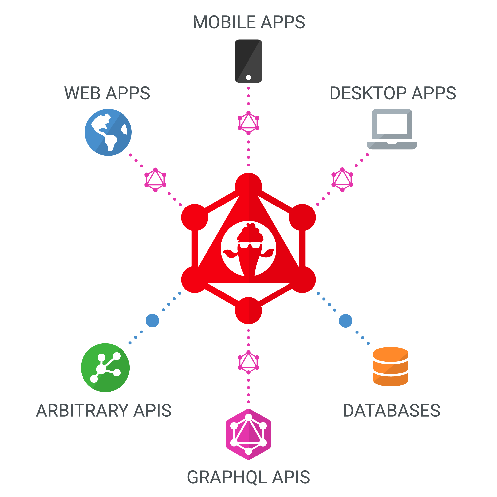

Hot Chocolate is an open-source GraphQL server that is compliant with the newest GraphQL 2020 spec, which makes Hot Chocolate compatible to all GraphQL compliant clients like Strawberry Shake, Relay, Apollo Client, and various other clients and tools.

Hot Chocolate takes the complexity away from building a fully-fledged GraphQL server and lets you focus on delivering the next big thing.

You can use Hot Chocolate Server as:

- Stand-alone ASP.NET Core GraphQL Server.
- Serverless Azure Function or Amazon Lambda that serves up a  GraphQL server.
- GraphQL Gateway for a federated data graph that pulls all your data sources together to create the one source of truth.

Hot Chocolate is easy to setup and takes the clutter away.

Hot Chocolate is very easy to set up and takes the clutter away from writing GraphQL schemas. We update Hot Chocolate continuously and implement new spec features as they hit draft status. This lets you pick up new GraphQL features incrementally to open up new development opportunities for your ideas.

Let's [get started](getting-started.md) with Hot Chocolate!
