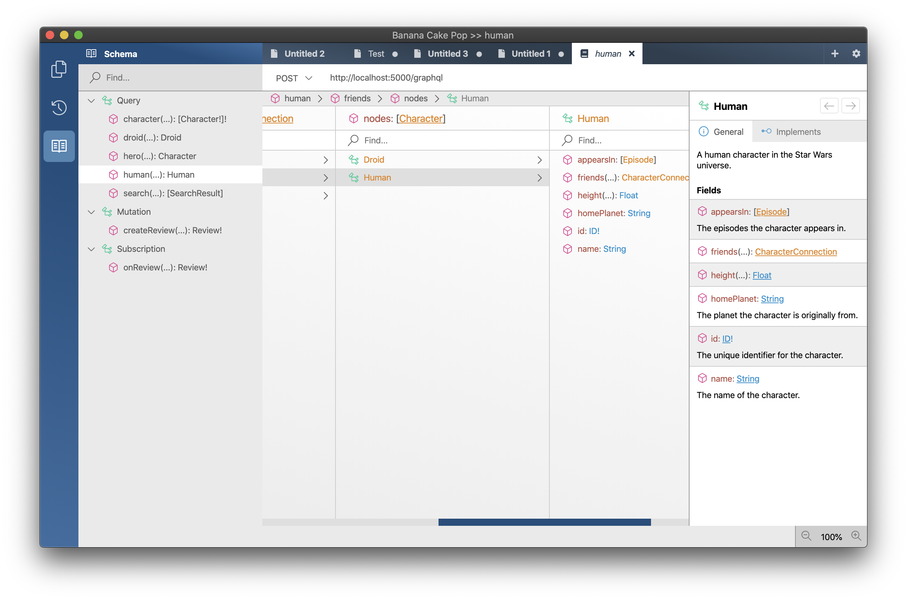

Hot Chocolate is a .NET GraphQL platform that can help you build a GraphQL layer over your existing and new infrastructure.

Our API will let you start very quickly with pre-built templates that let you start in seconds.

# Features

Here you will find a list of the most interesting features of Hot Chocolate.

## Code-First approach

Use your favorite .NET language to define your schema.

> Make sure to add the following usings to your project in order to get the `Execute` extension method:
> using HotChocolate;
> using HotChocolate.Execution;

```csharp
public class Query
{
    public string Hello() => "World!";
}

var schema = SchemaBuilder.New()
    .AddQueryType<Query>()
    .Create();

var executor = schema.MakeExecutable();

Console.WriteLine(executor.Execute("{ hello }").ToJson());
```

[Learn more](/docs/hotchocolate/v10/code-first)

## Schema-First approach

Use the GraphQL schema definition language to define your schema and bind simple methods or whole types to it.

> Make sure to add the following usings to your project in order to get the `Execute` extension method:
> using HotChocolate;
> using HotChocolate.Execution;

```csharp
public class QueryResolver
{
   public string Hello() => "World!";
}

var schema = SchemaBuilder.New()
    .AddDocumentFromString("type Query { hello: String! }")
    .BindResolver<QueryResolver>(c => c
      .To("Query")
      .Resolve("hello")
      .With(r => r.Hello())
    )
    .Create();

var executor = schema.MakeExecutable();

Console.WriteLine(executor.Execute("{ hello }").ToJson());
```

[Learn more](/docs/hotchocolate/v10/schema-first)

## Mix it all together

With the Hot Chocolate `SchemaBuilder` you can declare types however you want. Define a type schema-first and extend that same type with code-first.

> Make sure to add the following usings to your project in order to get the `Execute` extension method:
> using HotChocolate;
> using HotChocolate.Execution;

**What ever makes you happy!**

```csharp
public class QueryResolver
{
   public string Hello() => "World!";
}

public class QueryTypeExtension
   : ObjectTypeExtension
{
     protected override void Configure(IObjectTypeDescriptor descriptor)
     {
      descriptor.Name("Query");
      // descriptor.Field("hello").Resolver(() => "World");
      descriptor.Field("hello").ResolveWith<QueryResolver>(e=>e.Hello());
     }
}

var schema = SchemaBuilder.New()
    .AddDocumentFromString("type Query { hello: String! }")
    .AddType<QueryTypeExtension>()
    .BindResolver<QueryResolver>()
    .Create();

var executor = schema.MakeExecutable();

Console.WriteLine(executor.Execute("{ hello foo }").ToJson());
```

[Learn more](/docs/hotchocolate/v10/schema)

## Support for Custom Scalars

We provide built-in support for GraphQL defined Scalar Types. Moreover, you can also define your own scalar types to make your schemas even richer.

[Learn more](/docs/hotchocolate/v10/schema/custom-scalar-types)

## Support for DataLoader

We have baked-in support for data loaders which makes batching and caching for faster query requests a breeze.

```csharp
public class PersonResolvers
{
   public Task<Person> GetPerson(string id, IResolverContext context, [Service]IPersonRepository repository)
   {
     return context.BatchDataLoader<string, Person>(
         "personByIdBatch",
         repository.GetPersonBatchAsync)
         .LoadAsync(id);
   }
}
```

[Learn more](/docs/hotchocolate/v10/data-fetching)

## Support for Custom Directives

Implement your own directives and change the execution behaviour of your types.

```sdl
type Query {
  employee(employeeId: String!): Employee
  @httpGet(url: "http://someserver/persons/$employeeId")
}

type Employee @json {
  name: String
  address: String
}
```

[Learn more](/docs/hotchocolate/v10/schema/directives)

## Built-in Authorization Directives

Use ASP.NET Core policies on your fields to enable field base authorization.

```sdl
type Query {
  employee(employeeId: String!): Employee
}

type Employee @authorize(policy: "Everyone") {
  name: String
  address: String @authorize(policy: "HumanResources")
}
```

```csharp
public class QueryType : ObjectType<Query>
{
    protected override void Configure(IObjectTypeDescriptor<Query> descriptor)
    {
      descriptor.Authorize("Everyone");
      descriptor.Field(t => t.Hello()).Authorize("HumanResources");
    }
}
```

[Learn more](/docs/hotchocolate/v10/security#authorization)

## Built-in Support for Filters

We support database filters that offer you rich query capabilities through your GraphQL API.

```csharp
public class QueryType : ObjectType<Query>
{
    protected override void Configure(IObjectTypeDescriptor<Query> descriptor)
    {
      descriptor.Field(t => t.GetPersons()).UseFiltering();
    }
}
```

```graphql
query filterPersons {
  persons(
    where: { OR: [{ name_contains: "foo" }, { name_starts_with: "bar" }] }
  ) {
    name
    friends {
      name
    }
  }
}
```

[Learn more](/docs/hotchocolate/v10/data-fetching/filters)

## Built-in Support for Relay Paging

Our paging support is just plug-and-play :)

```csharp
public class QueryType : ObjectType<Query>
{
    protected override void Configure(IObjectTypeDescriptor<Query> descriptor)
    {
      descriptor.Field(t => t.GetPersons()).UsePaging<PersonType>();
    }
}
```

```graphql
query filterPersons {
  persons(first: 10) {
    edges {
      node {
        name
      }
    }
  }
}
```

[Learn more](/docs/hotchocolate/v10/data-fetching/pagination)

## Support for GraphQL Subscriptions

Subscriptions allow GraphQL clients to observe specific events and receive updates from the server in real-time.

[Learn more](/docs/hotchocolate/v10/execution-engine/subscriptions)

## Schema Stitching

Schema stitching will give you the capability to build small GraphQL services and stitch them together into one rich schema. This gives you flexibility in your development process and confidence once you are ready to deploy. Update only parts of your schema without the need to deploy always everything.

[Learn more](/docs/hotchocolate/v10/stitching)

## Batching

Hot Chocolate supports operation and request batching.

`POST /graphql?batchOperations=[StoryComments, NewsFeed]`

```graphql
query NewsFeed {
  feed {
    stories {
      id @export(as: "ids")
      actor
      message
    }
  }
}

query StoryComments {
  stories(ids: $ids) {
    comments {
      actor
      message
    }
  }
}
```

[Learn more](/docs/hotchocolate/v10/execution-engine/batching)

## GraphQL Server

We support ASP.NET Core and ASP.NET Framework and constantly update these implementations. Hosting our GraphQL server with one of there frameworks is as easy as eating pie :)

Furthermore, you can host Hot Chocolate as an Azure Function or AWS Lambda.

[Learn more](/docs/hotchocolate/v10/server)

## dotnet CLI Templates

In order to get you even faster started we are providing templates for the dotnet CLI which lets you setup a .NET GraphQL server in less than 10 seconds.

[Learn more](/docs/hotchocolate/v10/advanced/dotnet-cli)

## We provide awesome tooling so you can test your server.



[Learn more](/docs/bananacakepop)
