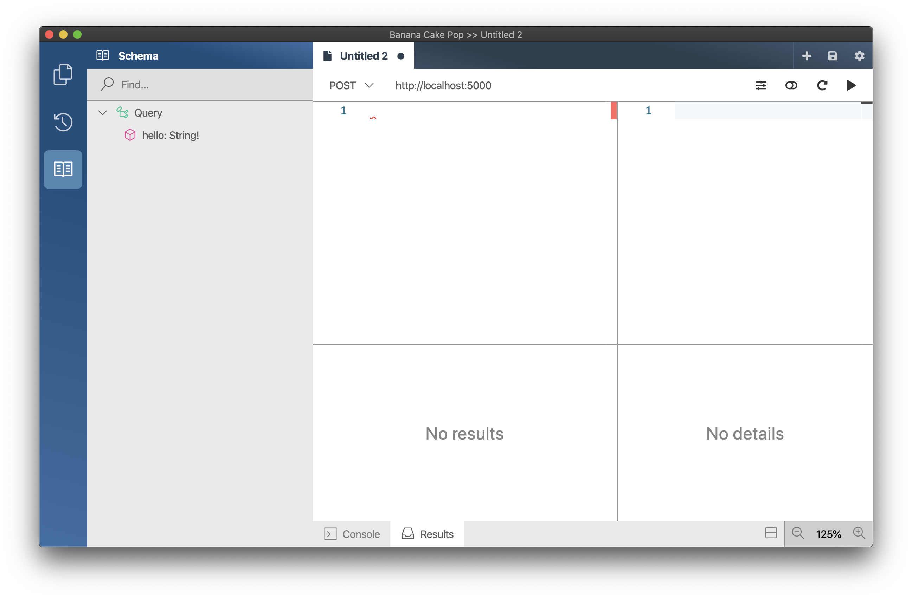
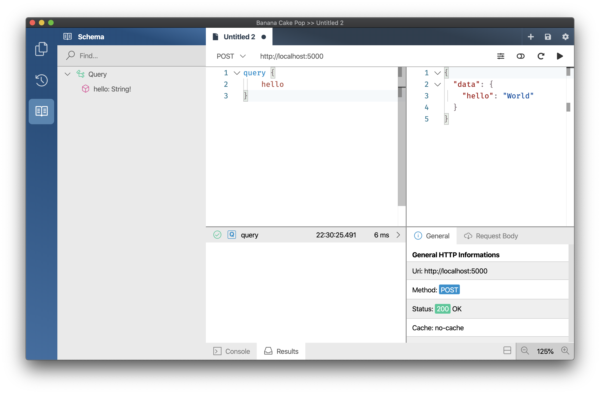

In this section, you will setup the project for your GraphQL server and implement your first GraphQL query. In the end, we’ll talk theory for a bit and learn about the GraphQL schema.

# Creating the project

The quickest way to create a GraphQL server with Hot Chocolate is to use our server template. But in this tutorial you will build a Hot Chocolate GraphQL server from the ground up in order to learn how the components interconnect.

Open your terminal, navigate to a location of your choice and run the following commands:

```bash
mkdir twitter-service
cd twitter-service
mkdir src
cd src
```

This creates a directory for our GraphQL server project and adds the `src` directory which will hold the code files.
Next up you will have to create a solution file and a server project.

In your terminal run the following command to create the solution file and create a minimal ASP.NET server project:

```bash
dotnet new web -n Server

cd ..
dotnet new sln -n Demo
dotnet sln add src/Server
```

Now that we have created our server project lets add Hot Chocolate.

Get back in your terminal and run the following command to add the _HotChocolate.AspNetCore_ package:

```bash
dotnet add src/Server package HotChocolate.AspNetCore
dotnet restore
```

The _HotChocolate.AspNetCore_ package contains the ASP.NET core middleware for hot chocolate and also includes the Hot Chocolate query engine as a dependency. This package basically provides all we need to get started.

# Configuring the GraphQL server

So, in order to configure our server lets open the `src/Server/Startup.cs` and rewrite the `ConfigureServices` method like the following:

```csharp
public void ConfigureServices(IServiceCollection services)
{
    services.AddGraphQL(
        // we will add our config here later
    );
}
```

`AddGraphQL` adds an executable schema to our services and this makes it available to our middleware.

In order to create a valid schema we need to have at least a query type. So, lets introduce a new class called `Query` that shall contain one Property `Hello` which shall return the `string` `world`.

Create a new file `src/Server/Query.cs` and add the following code:

```csharp
namespace Server
{
    public class Query
    {
        public string Hello => "World";
    }
}
```

Now lets register this type as our query type with the GraphQL schema.

```csharp
public void ConfigureServices(IServiceCollection services)
{
    services.AddGraphQL(
        SchemaBuilder.New()
            .AddQueryType<Query>());
}
```

With this we have finally a valid schema that we could now serve up with our middleware. In order to run our server we now just have to add the middleware.

For that replace the `Configure` method in `src/Server/Startup.cs` with the following code:

```csharp
public void Configure(IApplicationBuilder app, IHostingEnvironment env)
{
    if (env.IsDevelopment())
    {
        app.UseDeveloperExceptionPage();
    }

    app.UseGraphQL();
}
```

`app.UseGraphQL()` adds our middleware to the server and will by default use the schema that we have setup with our dependency injection.

# Testing the server

Now that we have a simple server let us test it, for this we will use the `dotnet watch` command.

The `watch` command will compile and run our server. Every time a code file changes the `watch` command will recompile our server so we do not have to worry about compiling all the time. The server will per default be hosted on `http://localhost:5000`.

```bash
dotnet watch --project src/Server/ run
```

In order to write queries and execute them we need a tool that helps us with that. For this we have create a GraphQL IDE called Banana Cake Pop.

You can download Banana Cake Pop [here](/docs/bananacakepop).

Once you have installed Banana Cake Pop open it.

Each GraphQL schema is made up of types that describe the data that you can fetch, mutate or subscribe to. The type structure of a GraphQL schema can be queried like any other data of a GraphQL schema, this allows tools like Banana Cake Pop to provide code completion and a way to explore a GraphQL schema in order to get a sense of the API that we are using.

In order to explore the schema click on the **book** button on the left-hand side of Banana Cake Pop. The schema documentation is auto-generated based on your schema definition and displays all API operations and types of your schema. We can now see that our schema has a root type `Query` which has one field `hello` that returns a `String`.



Let us write our first _GraphQL_ query and test if our server works like expected.

OK, lets write our first query and see if our GraphQL server works properly. Paste the following query into the left-hand panel of Banana Cake Pop and hit the play button on the top right.

```graphql
query {
  hello
}
```

The server should return the following JSON result.

```json
{
  "data": {
    "hello": "World"
  }
}
```



The GraphQL schema describes all the data that a server has to offer. The GraphQL query describes the data that we want to fetch from a GraphQL server. The result that the server returns closely aligns with the request that we have sent. This puts the consumer of a GraphQL API in the driver seat since he/she decides what data is needed.

# Operations

There are three operation types that define three different ways we can interact with a GraphQL server:

- Query
  The query is the most common way to interact with a GraphQL server. Queries are basically read-only requests that are side-effect free. If you compare that to _REST_ it is basically a `GET` request. It is important that queries are side-effect free since resolvers are potentially executed in parallel.

- Mutation
  Mutations are used to change data on the server. So, every time we want to add, change, or delete data we use a mutation. If you compare that to _REST_ it is basically all that you would do with `PUT`, `PATCH`, `POST` and `DELETE`. This makes GraphQL very easy since we do not have to think what verb we should use. By definition mutations are causing side-effects on our server, that is why GraphQL prescribes to execution top level fields of a mutation request serially. We will look into mutations more deeply later.

- Subscription
  Subscriptions in GraphQL represent events. We can basically subscribe to events that our GraphQL server exposes, the GraphQL server will then push a message to us whenever this event was trigger. We also will look deeper into subscriptions later.

# Nullability

GraphQL like C# 8 has a concept of nullable and non-nullable types. Hot Chocolate can easily infer the nullability context from C# 8 when you have enabled nullable reference types.

You can do so by adding a _MSBuild_ property or by adding pre-processor directives on a per file base.

Enable it for the whole project:

```xml
<Project Sdk="Microsoft.NET.Sdk.Web">

  <PropertyGroup>
    <TargetFramework>netcoreapp3.1</TargetFramework>
    <Nullable>enable</Nullable>
  </PropertyGroup>

  <ItemGroup>
    <PackageReference Include="HotChocolate.AspNetCore" Version="10.3.2" />
  </ItemGroup>

</Project>
```

Enable it just for a specific files:

```csharp
#nullable enable

namespace Server
{
    public class Query
    {
        public string Hello => "World";
    }
}
```

With nullable reference types enabled the inferred schema will be inferred like the following:

```sdl
type Query {
  hello: String!
}
```

In GraphQL types are by default nullable and non-nullable types are marked with an exclamation mark.

If a type is marked as non-nullable in GraphQL the server will guarantee to us that we never will get null for that field even if the programmer did a mistake.

So, if we would change our `Query` type to return null ...

```csharp
namespace Server
{
    public class Query
    {
        public string Hello => null;
    }
}
```

... and we re-ran our query we would get the following result:

```json
{
  "errors": [
    {
      "message": "Cannot return null for non-nullable field.",
      "locations": [
        {
          "line": 2,
          "column": 3
        }
      ],
      "path": ["hello"],
      "extensions": {
        "code": "EXEC_NON_NULL_VIOLATION"
      }
    }
  ]
}
```

The server would create an error result and remove the violating field from the result. With this we have a guarantee that structurally our result will be correct and we do not need to write null checks for fields that the server tells us will never be null.

# Schema Design

We wanted to build a twitter-service but so far we only have a simple hello world. Let us build up some types that shell make up our models.

First we need our base model that represents the tweet. Let us stay simple here and just call the type `Tweet`.

```csharp
public class Tweet
{
    public Tweet(
        Guid id,
        string text,
        Guid authorId,
        DateTime published,
        Guid[] likes)
    {
        Id = id;
        Text = text;
        AuthorId = authorId;
        Published = published;
        Likes = likes;
    }

    public Guid Id { get; }
    public string Text { get; }
    public Guid AuthorId { get; }
    public Guid[] Likes { get; }
    public DateTime Published { get; }
}

public class User
{
    public User(Guid id, string name)
    {
        Id = id;
        Name = name;
    }

    public Guid Id { get; }
    public string Name { get; }
}
```
