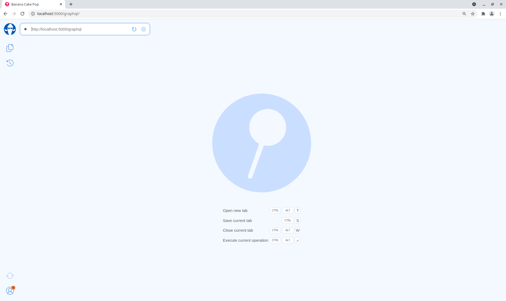
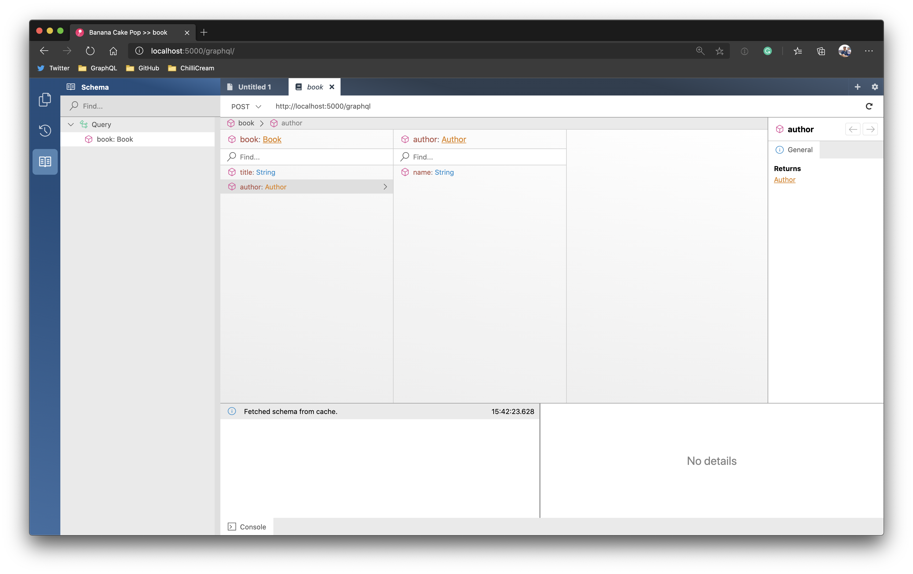
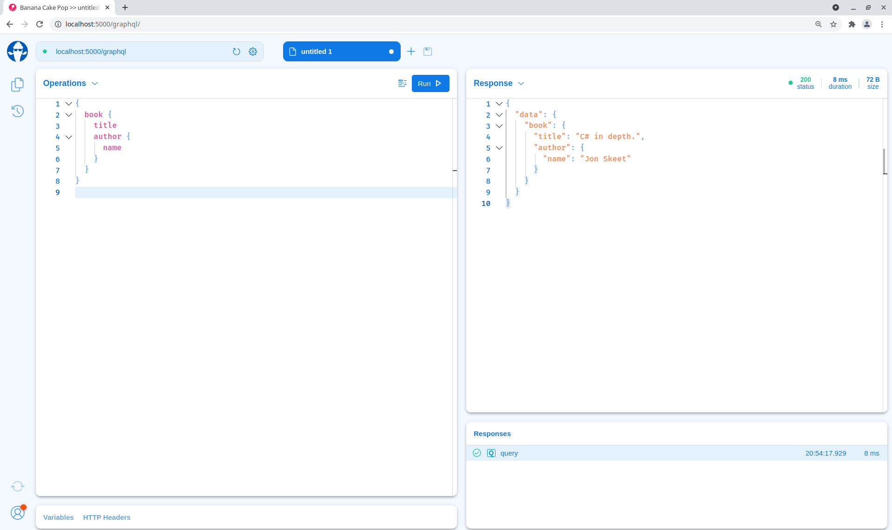

In this tutorial, we will walk you through the basics of creating a GraphQL server with Hot Chocolate. If you want to dig deeper into Hot Chocolate, we have our [GraphQL workshop](https://github.com/ChilliCream/graphql-workshop), which touches on topics like schema design, DataLoader, and many more things.

In this tutorial, we will teach you how to:

- Set up a GraphQL server.
- Define a GraphQL schema.
- Query your GraphQL server.

# Step 1: Create a GraphQL server project

Open your preferred terminal and select a directory where you want to add the code of this tutorial.

1. Create an empty ASP.NET Core server project.

```bash
dotnet new web -n Demo
```

2. Add the `HotChocolate.AspNetCore` package.

```bash
dotnet add ./Demo package HotChocolate.AspNetCore
```

# Step 2: Create a GraphQL schema

Next, we want to create a GraphQL schema. The GraphQL schema defines how we expose data to our consumers. To define the schema, open your favorite C# editor and let us get started.

1. Add a new class `Author`.

```csharp
namespace Demo
{
    public class Author
    {
        public string Name { get; set; }
    }
}
```

2. Add a new class `Book`.

```csharp
namespace Demo
{
    public class Book
    {
        public string Title { get; set; }

        public Author Author { get; set; }
    }
}
```

With these two classes we have a nice and simple model that we can use to build our GraphQL schema. We now need to define a query root type. The query root type exposes all the possible queries that a user can drill into. A query root type can be defined in the same way we defined our models.

3. Add a new class `Query`.

```csharp
namespace Demo
{
    public class Query
    {
        public Book GetBook() =>
            new Book
            {
                Title = "C# in depth.",
                Author = new Author
                {
                    Name = "Jon Skeet"
                }
            };
    }
}
```

Now, we have all the parts to create a valid GraphQL schema. Let us now head over to the `Startup.cs` and configure our GraphQL schema.

4. Add the GraphQL schema to the service configuration by adding the following code to the `ConfigureServices` method in the `Startup.cs`.

```csharp
public void ConfigureServices(IServiceCollection services)
{
    services
        .AddGraphQLServer()
        .AddQueryType<Query>();
}
```

5. Lastly, we need something to execute our code; for this, we will head over to the `Configure` method of our `Startup.cs` and add `MapGraphQL` to `UseEndpoints`.

```csharp
public void Configure(IApplicationBuilder app, IWebHostEnvironment env)
{
    app
        .UseRouting()
        .UseEndpoints(endpoints =>
        {
            endpoints.MapGraphQL();
        });
}
```

We also offer a template, which includes the configurations we have just made. Install the template like the following:

```bash
dotnet new -i HotChocolate.Templates.Server
```

Now we can use the following to bootstrap our future GraphQL servers:

```bash
dotnet new graphql
```

# Step 3: Execute a GraphQL query

Now that your server is finished let us try it out by executing a simple GraphQL query.

1. Start your GraphQL server.

```bash
dotnet run --project ./Demo
```

2. Open your browser and head over to `http://localhost:5000/graphql` to open our built-in GraphQL IDE [Banana Cake Pop](/products/bananacakepop).



3. Next, click on the `Book` icon in the left-hand navigation bar to explore the server's GraphQL schema. If this is the first time you are running the demo, you will need to enter `http://localhost:5000/graphql` as the schema endpoint URI. In the schema explorer, we can see that we have one query root field exposed. By clicking on the field, we can drill into the schema structure.



4. Head back to the query tab and execute your first GraphQL query by clicking the play button.

```graphql
{
  book {
    title
    author {
      name
    }
  }
}
```



# Summary

In this guide, we have learned how to set up a simple GraphQL server project and define a GraphQL schema with .NET.

Moreover, we explored our GraphQL schema with our GraphQL IDE Banana Cake Pop and executed a simple query to test our server.

If you want to dive deeper, you can start with our [GraphQL tutorial](https://github.com/ChilliCream/graphql-workshop) to get into several topics around GraphQL and Hot Chocolate.

Further, you can learn more about defining GraphQL schemas in .NET [here](/docs/hotchocolate/v11/defining-a-schema).
