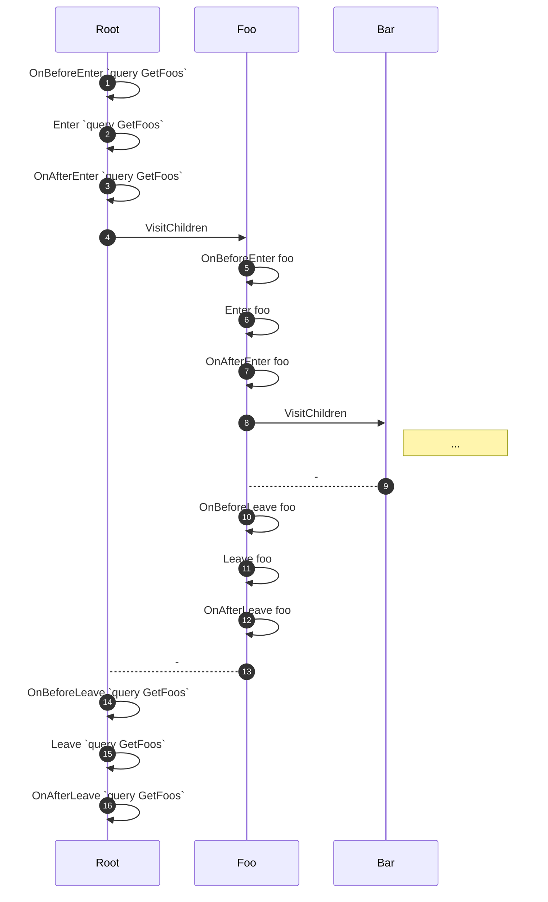

Hot Chocolate creates an abstract syntax tree for every incoming request.
The execution engine evaluates this syntax tree in many different ways. Validation is a good example.
Every incoming request has to be validated. The execution engine has to be sure that the semantics of the requested document are correct.
A set of rules is applied to the syntax tree, to find potential semantic flaws.

Usually, you do not have to access the _AST_ directly. The AST only becomes significant, when you want to change execution behavior based on the structure of the query.
For example features like _Filtering_, _Sorting_, or _Selection_ analyze the incoming query and generate expressions based on it.

Hot Chocolate provides you with different APIs that support you to traverse these trees.
The `SyntaxWalker` is a visitor that has built-in all the logic to _walk down a syntax tree_.

The `SyntaxWalker` is completely stateless. All the state is on a context object that is passed along.
The type of the context is denoted by the generic argument `TContext` in `SyntaxWalker<TContext>`.

---

# Visitation

To start the visitation of a _GraphQL_ syntax tree, you have to pass the node and the context that the visitation should start from to the visitor's `Visit` method.
On its way down the syntax tree, the visitor _enters_ a node. The visitor then gets the children of the current node and _enters_ its children.
Once the visitor reached a leaf node, it starts walking back up the tree and _leaves_ all the nodes.
The visitor provides virtual `Enter` and `Leave` methods for all _GraphQL_ AST nodes.
These methods are called from the visitor as it _enters_ or _leaves_ a node.

The syntax walker provides a few methods in addition to the `Enter` and `Leave` methods.
For these two methods, there are convenience methods that are called right _before_ and _after_ the method call.
Namely, `OnBeforeEnter`, `OnAfterEnter`, `OnBeforeLeave`, `OnAfterLeave`.
These methods can modify the current `TContext`.
These _before_ and _after_ methods are good places to initialize state that is used in the main _enter_ or _leave_ method.
e.g. before entering a `FieldNode`, you may want to peek the latest type from the context
and get the instance of the `ObjectField` corresponding to `FieldNode` of this type.
You may also want to push this type onto the context to then use it in the `Enter` method.

> **⚠️ NOTE:** In the following sequence diagram the participants do **NOT** represent any object instances. Furthermore, many steps are hidden in this example. The visualization below should just provide you visual insight on the order of the methods being called.

```graphql
query GetFoos {
  foo {
    bar
  }
}
```



1. We start walking down the tree and _enter_. <br/> 
2. Call `OnBeforeEnter(OperationDefinitionNode node, TContext context)`
3. Call `Enter(OperationDefinitionNode node, TContext context)`
4. Call `OnAfterEnter(OperationDefinitionNode node, TContext context)`
5. Call `VisitChildren(OperationDefinitionNode node, TContext context)`
6. Call `OnBeforeEnter(ObjectFieldNode node, TContext context)`
7. Call `Enter(ObjectFieldNode node, TContext context)`
8. Call `OnAfterEnter(ObjectFieldNode node, TContext context)`
9. Call `VisitChildren(ObjectFieldNode node, TContext context)`
10. We walk back up the tree and _leave_
11. Call `OnBeforeLeave(ObjectFieldNode node, TContext context)`
12. Call `Leave(ObjectFieldNode node, TContext context)`
13. Call `OnAfterLeave(ObjectFieldNode node, TContext context)`
14. We walk back up the tree and _leave_.
15. Call `OnBeforeLeave(OperationDefinitionNode node, TContext context)`
16. Call `Leave(OperationDefinitionNode node, TContext context)`
17. Call `OnAfterLeave(OperationDefinitionNode node, TContext context)`

---

# Visitor Actions

The _Enter_ and _Leave_ methods return visitor actions. These methods control the visitor's next step in the visitation.
Visitor actions can be used to _skip_ further visitation and step back up, or to _continue_ and walk the current branch of the tree further down.

## Continue

Returning `Continue` from the `Enter` or `Leave` methods indicates that the visitation shall continue on the current branch.

In the following example `Continue` is returned from the onEnter method. The visitor calls `VisitChildren` and continues by _entering_ the selection set.

```graphql {4}
query {
  foo {
    bar
    baz @onEnter(return: CONTINUE) {
      quux
    }
    qux
  }
}
```

## Skip

Returning `Skip` is returned from the `Enter` or `Leave` methods indicates that any further visitation on this node shall be stopped.

In the following example, `Skip` is returned from the onEnter method.
The visitor skips the field _baz_. It continues visitation by _entering_ the field _qux_:

```graphql {4}
query {
  foo {
    bar
    baz @onEnter(return: SKIP) {
      quux
    }
    qux
  }
}
```

## SkipAndLeave

Returning `SkipAndLeave` from the `Enter` method indicates that any further visitation on this node shall be stopped.
Instead of directly calling the next `Enter` method, the visitor calls the `Leave` method of the current node first.

In the following example `SkipAndLeave` is returned from the onEnter method.
The visitor skips the field _baz_. Before it continues visitation with the field _qux_ it _leaves_ the field _baz_ by calling `Leave`:

```graphql {4}
query {
  foo {
    bar
    baz @onEnter(return: SKIPANDLEAVE) {
      quux
    }
    qux
  }
}
```

## Break

Returning `Break` is from the `Enter` or `Leave` methods indicates that any further visitation on this branch shall be stopped.

In the following example `Break` is returned from the onEnter method. The visitor immediately starts walking back up.
The visitor calls the `Leave` on `foo` instead of visiting the selection set of _baz_ it skips _baz_ and _qux_.

```graphql {4}
query {
  foo {
    bar
    baz @onEnter(return: BREAK) {
      quux
    }
    qux
  }
}
```
