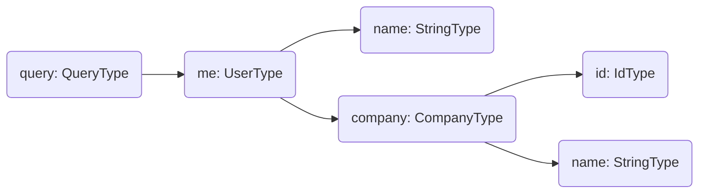

When it comes to fetching data in a GraphQL server, it will always come down to a resolver.

**A resolver is a generic function that fetches data from an arbitrary data source for a particular field.**

We can think of each field in our query as a method of the previous type which returns the next type.

## Resolver Tree

A resolver tree is a projection of a GraphQL operation that is prepared for execution.

For better understanding, let's imagine we have a simple GraphQL query like the following, where we select some fields of the currently logged-in user.

```graphql
query {
  me {
    name
    company {
      id
      name
    }
  }
}
```

In Hot Chocolate, this query results in the following resolver tree.



This tree will be traversed by the execution engine, starting with one or more root resolvers. In the above example the `me` field represents the only root resolver.

Field resolvers that are sub-selections of a field, can only be executed after a value has been resolved for their _parent_ field. In the case of the above example this means that the `name` and `company` resolvers can only run, after the `me` resolver has finished. Resolvers of field sub-selections can and will be executed in parallel.

**Because of this it is important that resolvers, with the exception of top level mutation field resolvers, do not contain side-effects, since their execution order may vary.**

The execution of a request finishes, once each resolver of the selected fields has produced a result.

_This is of course an oversimplification that differs from the actual implementation._

# Defining a Resolver

Resolvers can be defined in a way that should feel very familiar to C# developers, especially in the implementation-first approach.

## Properties

Hot Chocolate automatically converts properties with a public get accessor to a resolver that simply returns its value.

Properties are also covered in detail by the [object type documentation](/docs/hotchocolate/v13/defining-a-schema/object-types).

## Regular Resolver

A regular resolver is just a simple method, which returns a value.

<ExampleTabs>
<Implementation>

```csharp
public class Query
{
    public string Foo() => "Bar";
}

public class Startup
{
    public void ConfigureServices(IServiceCollection services)
    {
        services
            .AddGraphQLServer()
            .AddQueryType<Query>();
    }
}
```

</Implementation>
<Code>

```csharp
public class Query
{
    public string Foo() => "Bar";
}

public class QueryType: ObjectType<Query>
{
    protected override void Configure(IObjectTypeDescriptor<Query> descriptor)
    {
        descriptor
            .Field(f => f.Foo())
            .Type<NonNullType<StringType>>();
    }
}

public class Startup
{
    public void ConfigureServices(IServiceCollection services)
    {
        services
            .AddGraphQLServer()
            .AddQueryType<QueryType>();
    }
}
```

We can also provide a resolver delegate by using the `Resolve` method.

```csharp
descriptor
    .Field("foo")
    .Resolve(context =>
    {
        return "Bar";
    });
```

</Code>
<Schema>

```csharp
public class Query
{
    public string Foo() => "Bar";
}

public class Startup
{
    public void ConfigureServices(IServiceCollection services)
    {
        services
            .AddGraphQLServer()
            .AddDocumentFromString(@"
                type Query {
                    foo: String!
                }
            ")
            .BindRuntimeType<Query>();
    }
}
```

We can also add a resolver by calling `AddResolver()` on the `IRequestExecutorBuilder`.

```csharp
services
    .AddGraphQLServer()
    .AddDocumentFromString(@"
        type Query {
          foo: String!
        }
    ")
    .AddResolver("Query", "foo", (context) => "Bar");
```

</Schema>
</ExampleTabs>

## Async Resolver

Most data fetching operations, like calling a service or communicating with a database, will be asynchronous.

In Hot Chocolate, we can simply mark our resolver methods and delegates as `async` or return a `Task<T>` and it becomes an async-capable resolver.

We can also add a `CancellationToken` argument to our resolver. Hot Chocolate will automatically cancel this token if the request has been aborted.

```csharp
public class Query
{
    public async Task<string> Foo(CancellationToken ct)
    {
        // Omitted code for brevity
    }
}
```

When using a delegate resolver, the `CancellationToken` is passed as second argument to the delegate.

```csharp
descriptor
    .Field("foo")
    .Resolve((context, ct) =>
    {
        // Omitted code for brevity
    });
```

The `CancellationToken` can also be accessed through the `IResolverContext`.

```csharp
descriptor
    .Field("foo")
    .Resolve(context =>
    {
        CancellationToken ct = context.RequestAborted;

        // Omitted code for brevity
    });
```

## ResolveWith

Thus far we have looked at two ways to specify resolvers in code-first:

- Add new methods to the CLR type, e.g. the `T` type of `ObjectType<T>`
- Add new fields to the schema type in the form of delegates

  ```csharp
  descriptor.Field("foo").Resolve(context => )
  ```

But there's a third way. We can describe our field using the `descriptor`, but instead of a resolver delegate, we can point to a method on another class, responsible for resolving this field.

```csharp
public class FooResolvers
{
    public string GetFoo(string arg, [Service] FooService service)
    {
        // Omitted code for brevity
    }
}

public class QueryType : ObjectType
{
    protected override void Configure(IObjectTypeDescriptor descriptor)
    {
        descriptor
            .Field("foo")
            .Argument("arg", a => a.Type<NonNullType<StringType>>())
            .ResolveWith<FooResolvers>(r => r.GetFoo(default, default));
    }
}
```

# Arguments

We can access arguments we defined for our resolver like regular arguments of a function.

There are also specific arguments that will be automatically populated by Hot Chocolate when the resolver is executed. These include [Dependency injection services](#injecting-services), [DataLoaders](/docs/hotchocolate/v13/fetching-data/dataloader), state, or even context like a [_parent_](#accessing-parent-values) value.

[Learn more about arguments](/docs/hotchocolate/v13/defining-a-schema/arguments)

# Injecting Services

Let's assume we have created a `UserService` and registered it as a service.

```csharp
var builder = WebApplication.CreateBuilder(args);

builder.Services.AddSingleton<UserService>()

builder.Services
    .AddGraphQLServer()
    .AddQueryType<Query>();
```

We can now access it like the following in our resolvers.

```csharp
public class Query
{
    public List<User> GetUsers([Service] UserService userService)
        => userService.GetUsers();
}
```

[Learn more about dependency injection](/docs/hotchocolate/v13/server/dependency-injection)

# Accessing the HttpContext

The [IHttpContextAccessor](https://docs.microsoft.com/dotnet/api/microsoft.aspnetcore.http.ihttpcontextaccessor) allows us to access the [HttpContext](https://docs.microsoft.com/dotnet/api/microsoft.aspnetcore.http.httpcontext) of the current request from within our resolvers. This is useful, if we for example need to set a header or cookie.

First we need to add the `IHttpContextAccessor` as a service.

```csharp
public class Startup
{
    public void ConfigureServices(IServiceCollection services)
    {
        services.AddHttpContextAccessor();

        // Omitted code for brevity
    }
}
```

After this we can inject it into our resolvers and make use of the the `HttpContext` property.

```csharp
public string Foo(string id, [Service] IHttpContextAccessor httpContextAccessor)
{
    if (httpContextAccessor.HttpContext is not null)
    {
        // Omitted code for brevity
    }
}
```

# Accessing parent values

The resolver of each field on a type has access to the value that was resolved for said type.

Let's look at an example. We have the following schema.

```sdl
type Query {
  me: User!;
}

type User {
  id: ID!;
  friends: [User!]!;
}
```

The `User` schema type is represented by an `User` CLR type. The `id` field is an actual property on this CLR type.

```csharp
public class User
{
    public string Id { get; set; }
}
```

`friends` on the other hand is a resolver i.e. method we defined. It depends on the user's `Id` property to compute its result.
From the point of view of this `friends` resolver, the `User` CLR type is its _parent_.

We can access this so called _parent_ value like the following.

<ExampleTabs>
<Implementation>

In the implementation-first approach we can just access the properties using the `this` keyword.

```csharp
public class User
{
    public string Id { get; set; }

    public List<User> GetFriends()
    {
        var currentUserId = this.Id;

        // Omitted code for brevity
    }
}
```

There's also a `[Parent]` attribute that injects the parent into the resolver.

```csharp
public class User
{
    public string Id { get; set; }

    public List<User> GetFriends([Parent] User parent)
    {
        // Omitted code for brevity
    }
}
```

This is especially useful when using [type extensions](/docs/hotchocolate/v13/defining-a-schema/extending-types).

</Implementation>
<Code>

```csharp
public class User
{
    public string Id { get; set; }

    public List<User> GetFriends([Parent] User parent)
    {
        // Omitted code for brevity
    }
}
```

When using the `Resolve` method, we can access the parent through the `IResolverContext`.

```csharp
public class User
{
    public string Id { get; set; }
}

public class UserType : ObjectType<User>
{
    protected override void Configure(IObjectTypeDescriptor<User> descriptor)
    {
        descriptor
            .Field("friends")
            .Resolve(context =>
            {
                User parent = context.Parent<User>();

                // Omitted code for brevity
            });
    }
}
```

</Code>
<Schema>

```csharp
public class User
{
    public string Id { get; set; }

    public List<User> GetFriends([Parent] User parent)
    {
        // Omitted code for brevity
    }
}
```

When using `AddResolver()`, we can access the parent through the `IResolverContext`.

```csharp
services
    .AddGraphQLServer()
    .AddDocumentFromString(@"
        type User {
          friends: [User!]!
        }
    ")
    .AddResolver("User", "friends", (context) =>
    {
        User parent = context.Parent<User>();

        // Omitted code for brevity
    });
```

</Schema>
</ExampleTabs>
