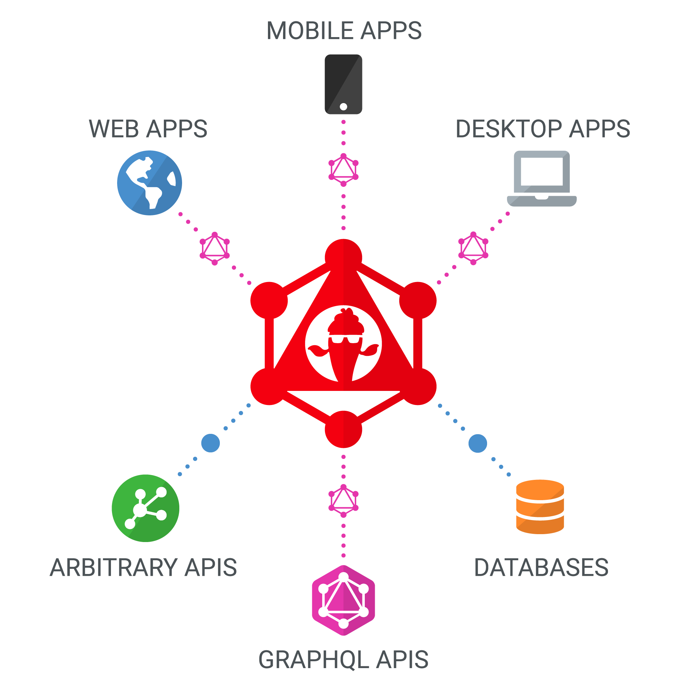

Hot Chocolate is an open-source GraphQL server for the [Microsoft .NET platform](https://dotnet.microsoft.com/) that is compliant with the newest [GraphQL October 2021 spec + Drafts](https://spec.graphql.org/), which makes Hot Chocolate compatible to all GraphQL compliant clients like [Strawberry Shake](/docs/strawberryshake/v14), [Relay](https://relay.dev/), [Apollo Client](https://www.apollographql.com/docs/react/), and [various other GraphQL clients and tools](https://graphql.org/code).

Hot Chocolate takes the complexity away from building a fully-fledged GraphQL server and lets you focus on delivering the next big thing.

You can use Hot Chocolate Server as:

- Stand-alone [ASP.NET Core](https://learn.microsoft.com/aspnet/core) GraphQL Server.
- Serverless [Azure Function](https://azure.microsoft.com/products/functions) or [AWS Lambda](https://aws.amazon.com/lambda) that serves up a GraphQL server.
- [GraphQL Gateway](/docs/hotchocolate/v13/distributed-schema) for a federated data graph that pulls all your data sources together to create the one source of truth.

Hot Chocolate is very easy to set up and takes the clutter away from writing GraphQL schemas. We update Hot Chocolate continuously and implement new spec features as they hit draft status. This lets you pick up new GraphQL features incrementally to open up new development opportunities for your ideas.

Let's [get started](/docs/hotchocolate/v14/get-started-with-graphql-in-net-core) with Hot Chocolate!

Join us on [YouTube](https://youtube.chillicream.com) for Hot Chocolate deep dives.
