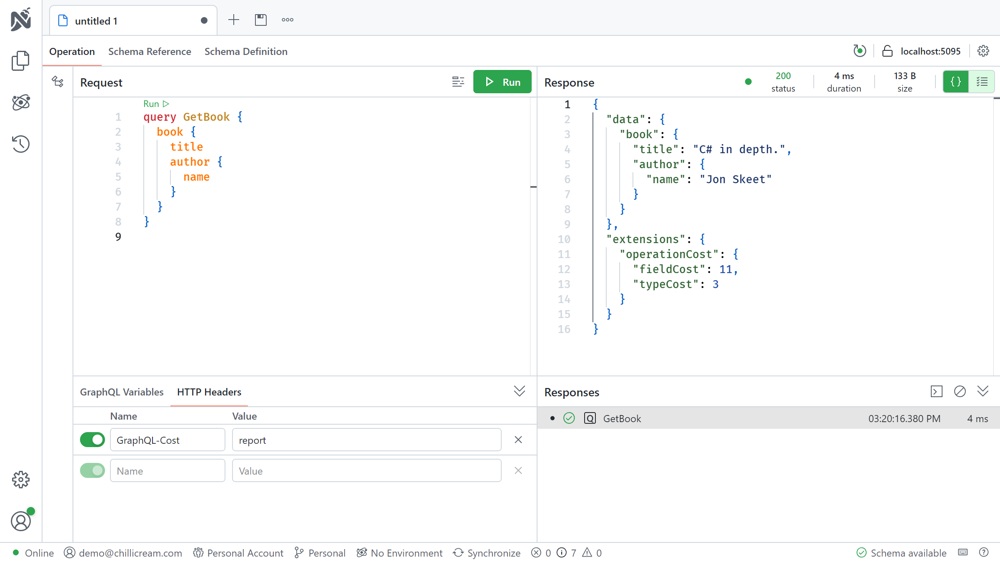

import { List, Panel, Tab, Tabs } from "../../../../components/mdx/tabs";

<Video videoId="R6Rq4kU_GfM" />

Cost analysis is a useful tool to make your API more secure. With Hot Chocolate, static cost analysis is built in, and is based on the draft [IBM Cost Analysis specification](https://ibm.github.io/graphql-specs/cost-spec.html).

# Directives

## Cost directive

The purpose of the `@cost` directive is to define a weight for GraphQL types, fields, and arguments. Static analysis can use these weights when calculating the overall cost of a query or response.

The `weight` argument defines what value to add to the overall cost for every
appearance, or possible appearance, of a type, field, argument, etc.

The `@cost` directive can be applied to argument definitions, enums, field definitions, input field definitions, object types, and scalars.

## List Size directive

The purpose of the `@listSize` directive is to either inform the static analysis about the size of returned lists (if that information is statically available), or to point the analysis to where to find that information.

- The `assumedSize` argument can be used to statically define the maximum length of a list returned by a field.
- The `slicingArguments` argument can be used to define which of the field's arguments with numeric type are slicing arguments, so that their value determines the size of the list returned by that field. It may specify a list of multiple slicing arguments.
- The `sizedFields` argument can be used to define that the value of the `assumedSize` argument or of a slicing argument does not affect the size of a list returned by a field itself, but that of a list returned by one of its sub-fields.
- The `requireOneSlicingArgument` argument can be used to inform the static analysis that it should expect that exactly one of the defined slicing arguments is present in a query. If that is not the case (i.e., if none or multiple slicing arguments are present), the static analysis will throw an error.

The `@listSize` directive can only be applied to field definitions.

# Defaults

By default, Hot Chocolate will apply a cost weight of `10` to async resolvers, `1` to composite types, and `0` to scalar fields.

Filtering and sorting field arguments and operations also have default cost weights, as shown in their respective [Options](#options) section below.

Finally, resolvers using pagination will have list size settings applied automatically:

<Tabs defaultValue={"connection"}>
  <List>
    <Tab value="connection">Connection</Tab>
    <Tab value="offset">Offset</Tab>
  </List>

  <Panel value="connection">

  ```graphql
  books(first: Int, after: String, last: Int, before: String): BooksConnection
    @listSize(
      assumedSize: 50
      slicingArguments: ["first", "last"]
      sizedFields: ["edges", "nodes"]
    )
    @cost(weight: "10")
  ```

  </Panel>
  <Panel value="offset">

  ```graphql
  books(skip: Int, take: Int): BooksCollectionSegment
    @listSize(
      assumedSize: 50
      slicingArguments: ["take"]
      sizedFields: ["items"]
    )
    @cost(weight: "10")
  ```

  </Panel>
</Tabs>

# Applying a cost weight

<ExampleTabs>

<Implementation>

When using an implementation-first approach, apply the `Cost` attribute to the query resolver.

```csharp
[QueryType]
public static class Query
{
    [Cost(100)]
    public static Book GetBook() => new("C# in depth.", new Author("Jon Skeet"));
}
```

</Implementation>

<Code>

When using a code-first implementation, invoke the `Cost` method on the `IObjectFieldDescriptor`.

```csharp
public sealed class QueryType : ObjectType
{
    protected override void Configure(IObjectTypeDescriptor descriptor)
    {
        descriptor.Name(OperationTypeNames.Query);

        descriptor
            .Field("book")
            .Resolve(_ => new Book("C# in depth.", new Author("Jon Skeet")))
            .Cost(100);
    }
}
```

</Code>

<Schema>

When using a schema-first implementation, apply the `@cost` directive to the field.

```csharp
builder.Services
    .AddGraphQLServer()
    .AddDocumentFromString(
        """
        type Query {
            book: Book @cost(weight: "100")
        }

        type Book {
            title: String!
            author: Author!
        }

        type Author {
            name: String!
        }
        """)
    .BindRuntimeType<Query>();

public sealed class Query
{
    public Book GetBook() => new("C# in depth.", new Author("Jon Skeet"));
}
```

</Schema>

</ExampleTabs>

# Applying list size settings

<ExampleTabs>

<Implementation>

When using an implementation-first approach, apply the `ListSize` attribute to a query resolver returning a list of items.

```csharp
[QueryType]
public static class Query
{
    [ListSize(
        AssumedSize = 100,
        SlicingArguments = ["first", "last"],
        SizedFields = ["edges", "nodes"],
        RequireOneSlicingArgument = false)]
    public static IEnumerable<Book> GetBooks()
        => [new("C# in depth.", new Author("Jon Skeet"))];
}
```

</Implementation>

<Code>

When using a code-first implementation, invoke the `ListSize` method on the `IObjectFieldDescriptor`.

```csharp
public sealed class QueryType : ObjectType
{
    protected override void Configure(IObjectTypeDescriptor descriptor)
    {
        descriptor.Name(OperationTypeNames.Query);

        descriptor
            .Field("books")
            .Resolve<IEnumerable<Book>>(
                _ => [new Book("C# in depth.", new Author("Jon Skeet"))])
            .ListSize(
                assumedSize: 100,
                slicingArguments: ["first", "last"],
                sizedFields: ["edges", "nodes"],
                requireOneSlicingArgument: false);
    }
}
```

</Code>

<Schema>

When using a schema-first implementation, apply the `@listSize` directive to a field returning a list of items.

```csharp
builder.Services
    .AddGraphQLServer()
    .AddDocumentFromString(
        """
        type Query {
            books: [Book!]!
                @listSize(
                    assumedSize: 100,
                    slicingArguments: ["first", "last"],
                    sizedFields: ["edges", "nodes"],
                    requireOneSlicingArgument: false
                )
        }

        type Book {
            title: String!
            author: Author!
        }

        type Author {
            name: String!
        }
        """)
    .BindRuntimeType<Query>();

public sealed class Query
{
    public IEnumerable<Book> GetBooks()
        => [new("C# in depth.", new Author("Jon Skeet"))];
}
```

</Schema>

</ExampleTabs>

# Cost metrics

Cost metrics include two properties, `FieldCost` and `TypeCost`:

- `FieldCost` represents the execution impact on the server.
- `TypeCost` represents the data impact on the server (instantiated objects).

## Accessing cost metrics

To access the cost metrics via the `IResolverContext` or `IMiddlewareContext`, use the context data key `WellKnownContextData.CostMetrics`:

<Tabs defaultValue={"resolver"}>
  <List>
    <Tab value="resolver">Resolver</Tab>
    <Tab value="middleware">Middleware</Tab>
  </List>

  <Panel value="resolver">

  ```csharp
  public static Book GetBook(IResolverContext resolverContext)
  {
      const string key = WellKnownContextData.CostMetrics;
      var costMetrics = (CostMetrics)resolverContext.ContextData[key]!;

      double fieldCost = costMetrics.FieldCost;
      double typeCost = costMetrics.TypeCost;

      // ...
  }
  ```

  </Panel>
  <Panel value="middleware">

  ```csharp
  public static class MyMiddlewareObjectFieldDescriptorExtension
  {
      public static IObjectFieldDescriptor UseMyMiddleware(
          this IObjectFieldDescriptor descriptor)
      {
          return descriptor
              .Use(next => async context =>
              {
                  const string key = WellKnownContextData.CostMetrics;
                  var costMetrics = (CostMetrics)context.ContextData[key]!;

                  double fieldCost = costMetrics.FieldCost;
                  double typeCost = costMetrics.TypeCost;

                  await next(context);
              });
      }
  }
  ```

  </Panel>
</Tabs>

## Reporting cost metrics

To output the cost metrics, set an HTTP header named `GraphQL-Cost` with one of the following values:

| Value      | Description                                                            |
|------------|------------------------------------------------------------------------|
| `report`   | The request is executed, and the costs are reported in the response.   |
| `validate` | The costs are reported in the response, without executing the request. |

> Note: When using `validate`, Nitro will currently _not_ display the response in the `Response` pane. Until this is fixed, you can inspect the response body in the request log.



# Cost calculation examples

## Field cost

<Tabs defaultValue={"object"}>
  <List>
    <Tab value="object">Object</Tab>
    <Tab value="connection">Connection</Tab>
  </List>

  <Panel value="object">

  ```graphql
  query {
    book {     # 10 (async resolver)
      title    # 0  (scalar)
      author { # 1  (composite type)
        name   # 0  (scalar)
      }
    }
  }

  # Field cost: 11
  ```

  </Panel>
  <Panel value="connection">

  ```graphql
  query {
    books(first: 50) { # 10 (async resolver)
      edges {          # 1  (composite type)
        node {         # 50 (1 [composite type] x 50 items)
          title        # 0  (scalar)
          author {     # 50 (1 [composite type] x 50 items)
            name       # 0  (scalar)
          }
        }
      }
    }
  }

  # Field cost: 111
  ```

  </Panel>
</Tabs>

## Type cost

<Tabs defaultValue={"object"}>
  <List>
    <Tab value="object">Object</Tab>
    <Tab value="connection">Connection</Tab>
  </List>

  <Panel value="object">

  ```graphql
  query {      # 1 Query
    book {     # 1 Book
      title
      author { # 1 Author
        name
      }
    }
  }

  # Type cost: 3
  ```

  </Panel>
  <Panel value="connection">

  ```graphql
  query {              # 1  Query
    books(first: 50) { # 50 BooksConnections
      edges {          # 1  BooksEdge
        node {         # 50 Books
          title
          author {     # 50 Authors
            name
          }
        }
      }
    }
  }

  # Type cost: 152
  ```

  </Panel>
</Tabs>

# Options

## Cost options

Options for cost analysis.

| Option              | Description                                                   | Default |
|---------------------|---------------------------------------------------------------|---------|
| MaxFieldCost        | Gets or sets the maximum allowed field cost.                  | 1_000   |
| MaxTypeCost         | Gets or sets the maximum allowed type cost.                   | 1_000   |
| EnforceCostLimits   | Defines if the analyzer shall enforce cost limits.            | true    |
| ApplyCostDefaults   | Defines if cost defaults shall be applied to the schema.      | true    |
| DefaultResolverCost | Gets or sets the default cost for an async resolver pipeline. | 10.0    |

Modifying cost options:

```csharp
builder.Services
    .AddGraphQLServer()
    .ModifyCostOptions(options =>
    {
        options.MaxFieldCost = 1_000;
        options.MaxTypeCost = 1_000;
        options.EnforceCostLimits = true;
        options.ApplyCostDefaults = true;
        options.DefaultResolverCost = 10.0;
    });
```

## Filtering cost options

Represents the cost options for filtering.

| Option                              | Description                                                                | Default |
|-------------------------------------|----------------------------------------------------------------------------|---------|
| DefaultFilterArgumentCost           | Gets or sets the default cost for a filter argument.                       | 10.0    |
| DefaultFilterOperationCost          | Gets or sets the default cost for a filter operation.                      | 10.0    |
| DefaultExpensiveFilterOperationCost | Gets or sets the default cost for an expensive filter argument.            | 20.0    |
| VariableMultiplier                  | Gets or sets a multiplier when a variable is used for the filter argument. | 5       |

Modifying filtering cost options:

```csharp
builder.Services
    .AddGraphQLServer()
    .ModifyCostOptions(options =>
    {
        options.Filtering.DefaultFilterArgumentCost = 10.0;
        options.Filtering.DefaultFilterOperationCost = 10.0;
        options.Filtering.DefaultExpensiveFilterOperationCost = 20.0;
        options.Filtering.VariableMultiplier = 5;
    });
```

## Sorting cost options

Represents the cost options for sorting.

| Option                   | Description                                                            | Default |
|--------------------------|------------------------------------------------------------------------|---------|
| DefaultSortArgumentCost  | Gets or sets the default cost for a sort argument.                     | 10.0    |
| DefaultSortOperationCost | Gets or sets the default cost for a sort operation.                    | 10.0    |
| VariableMultiplier       | Gets or sets multiplier when a variable is used for the sort argument. | 5       |

Modifying sorting cost options:

```csharp
builder.Services
    .AddGraphQLServer()
    .ModifyCostOptions(options =>
    {
        options.Sorting.DefaultSortArgumentCost = 10.0;
        options.Sorting.DefaultSortOperationCost = 10.0;
        options.Sorting.VariableMultiplier = 5;
    });
```

# Disabling cost limit enforcement

While we generally don't recommended disabling the enforcement of cost limits, you may wish to do so if you're using other methods to restrict operation complexity. If that's the case, simply set the `EnforceCostLimits` option to `false`:

```csharp
builder.Services
    .AddGraphQLServer()
    .ModifyCostOptions(o => o.EnforceCostLimits = false)
```
