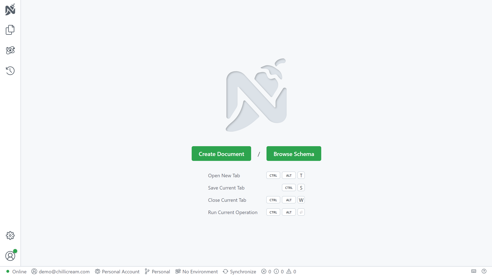
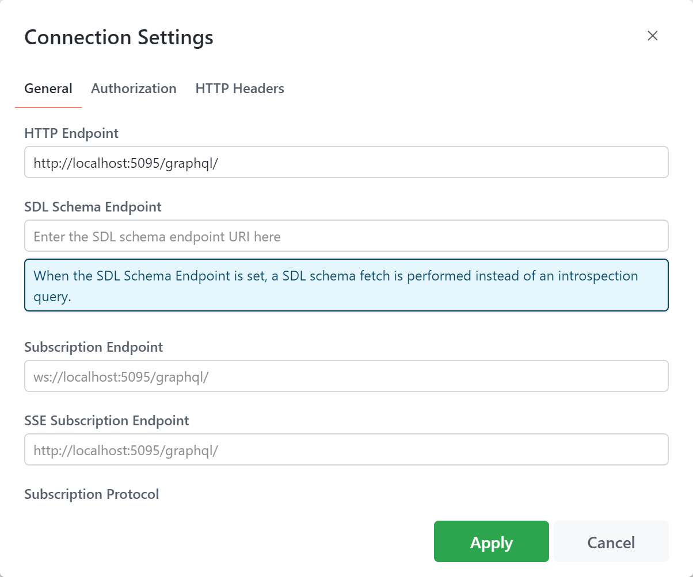
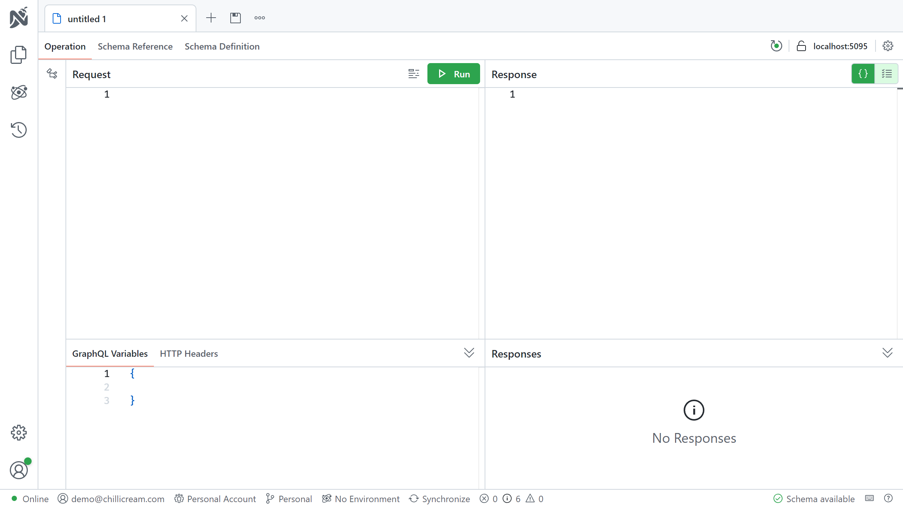
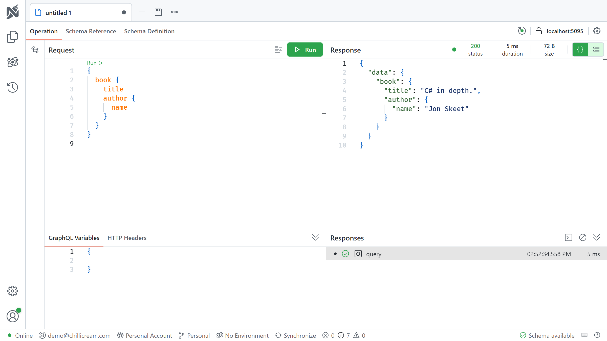
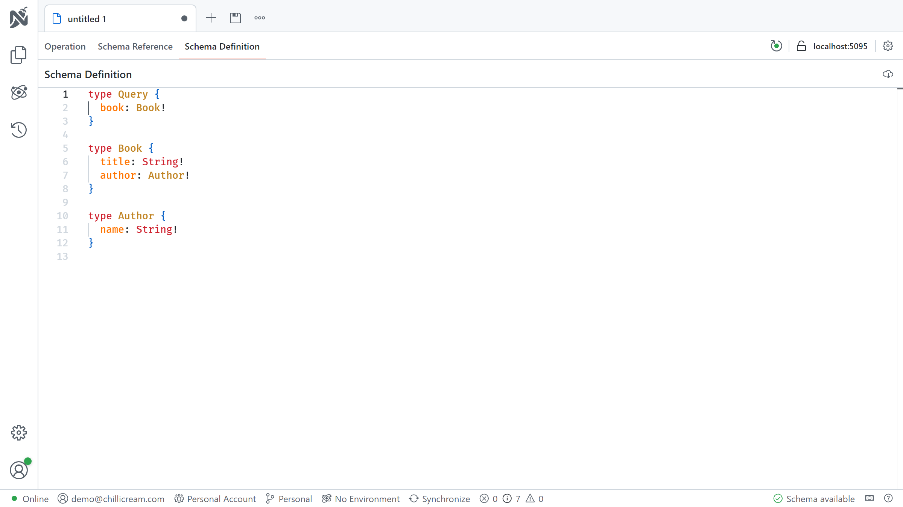

import { InputChoiceTabs } from "../../../components/mdx/input-choice-tabs"

# Setup

## Install the Hot Chocolate templates

Hot Chocolate provides a set of templates that can be used to quickly get started. Run the following command to install the templates:

```bash
dotnet new install HotChocolate.Templates
```

These templates are kept up to date with the latest .NET and Hot Chocolate features.

## Create a new Hot Chocolate GraphQL server project

Once you have installed the templates you can use them to bootstrap your next ASP.NET Core project with Hot Chocolate.

<InputChoiceTabs>
<InputChoiceTabs.CLI>

```bash
dotnet new graphql --name GettingStarted
```

This will create a new directory named `GettingStarted` containing your project's files. You can open the directory or the `GettingStarted.csproj` file in your favorite code editor.

</InputChoiceTabs.CLI>
<InputChoiceTabs.VisualStudio>

Create a new project from within Visual Studio using the `GraphQL Server` template.

[Learn how you can create a new project within Visual Studio](https://docs.microsoft.com/visualstudio/ide/create-new-project)

</InputChoiceTabs.VisualStudio>
</InputChoiceTabs>

# Exploring the template files

## Types

The `Types` directory defines the types that our GraphQL schema should contain. These types and their fields define what consumers can query from our GraphQL API.

We define two object types that we want to expose through our schema.

```csharp
public record Author(string Name);
```

```csharp
public record Book(string Title, Author Author);
```

> Note: Regular classes may also be used to define object types.

We also define a `Query` type that exposes the types above through a field.

```csharp
[QueryType]
public static class Query
{
    public static Book GetBook()
        => new Book("C# in depth.", new Author("Jon Skeet"));
}
```

The field in question is named `GetBook`, but the name will be shortened to just `book` in the resulting schema.

The `QueryType` attribute marks a class as an extension of the `query` operation type.

## Program

In the `Program.cs` file, we start by adding the services required by Hot Chocolate to our dependency injection container.

```csharp
builder.Services
    .AddGraphQLServer()
```

`AddGraphQLServer` returns an `IRequestExecutorBuilder`, which has many extension methods, similar to an `IServiceCollection`, that can be used to configure the GraphQL server.

We then call `AddTypes`, a source-generated extension method that automatically registers all types in the assembly.

> Note: The name of the `AddTypes` method is based on the assembly name by default, but can be set using the `[Module]` assembly attribute, as seen in `ModuleInfo.cs`.

Next, we call `app.MapGraphQL()` to expose our GraphQL server at an endpoint with the default path `/graphql`. Hot Chocolate comes with an ASP.NET Core middleware that is used to serve up the GraphQL server.

Finally, we call `app.RunWithGraphQLCommands(args)` to start the server.

And that is it – you have successfully set up a Hot Chocolate GraphQL server! 🚀

# Executing a query

First off we have to run the project.

<InputChoiceTabs>
<InputChoiceTabs.CLI>

```bash
dotnet run --no-hot-reload
```

</InputChoiceTabs.CLI>
<InputChoiceTabs.VisualStudio>

The project can be started by either pressing `Ctrl + F5` or clicking the green `Debug` button in the Visual Studio toolbar.

</InputChoiceTabs.VisualStudio>
</InputChoiceTabs>

If you have set everything up correctly, you should be able to open <a href="http://localhost:5095/graphql" target="_blank" rel="noopener noreferrer">http://localhost:5095/graphql</a> in your browser and be greeted by our GraphQL IDE [Nitro](/products/nitro).



Next, click on `Create Document`. You will be presented with a settings dialog for this new tab, pictured below. Make sure the `HTTP Endpoint` input field has the correct URL under which your GraphQL endpoint is available. If it is correct you can just go ahead and click the `Apply` button.



Now you should be seeing an editor like the one pictured below. If your GraphQL server has been correctly set up you should see `Schema available` at the bottom right of the editor.



The view is split into five panes.

1. `Builder`
    - This is where you build operations with a visual editor.
1. `Request`
    - This is where you enter operations that you wish to send to the GraphQL server.
1. `Response`
    - This is where results will be displayed.
1. `GraphQL Variables / HTTP Headers`
    - This is where you modify variables and headers.
1. `Responses`
    - This is where you view recent queries.

Let's send a query to your GraphQL server. Paste the below query into the `Request` pane of the editor:

```graphql
{
  book {
    title
    author {
      name
    }
  }
}
```

To execute the query, simply press the `Run` button. The result should be displayed as JSON in the `Response` pane as shown below:



You can also view and browse the schema from within Nitro. Click on the `Schema Reference` tab next to `Operation` in order to browse the schema. There's also a `Schema Definition` tab, pictured below, which shows the schema using the raw SDL (Schema Definition Language).



Congratulations, you've built your first Hot Chocolate GraphQL server and sent a query using the Nitro GraphQL IDE. 🎉🚀

# Additional resources

Now that you've set up a basic GraphQL server, what should your next steps be?

If this is your first time using GraphQL, we recommend [this guide](https://graphql.org/learn/) that walks you through the basic concepts of GraphQL.

If you want to get an overview of Hot Chocolate's features, we recommend reading the _Overview_ pages in each section of the documentation. They can be found in the sidebar to your left.

For a guided tutorial that explains how you can set up your GraphQL server beyond this basic example, check out [our workshop](https://github.com/ChilliCream/graphql-workshop). Here we will dive deeper into several topics around Hot Chocolate and GraphQL in general.

You can also jump straight into our documentation and learn more about [Defining a GraphQL schema](/docs/hotchocolate/v15/defining-a-schema).
