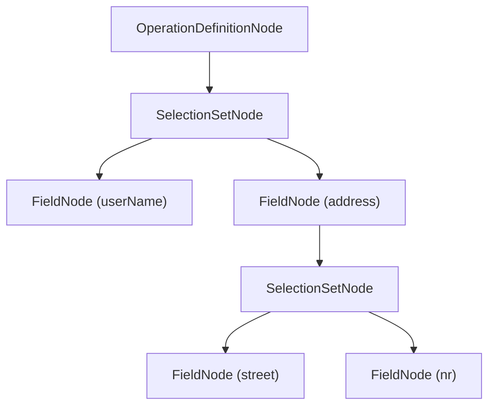

# Abstract Syntax Tree (AST)

Hot Chocolate parses every incoming GraphQL request into an abstract syntax tree (AST). Each node in this tree represents a part of the incoming GraphQL query. The type system (`ObjectType`, `InputType`, etc.) configures the schema, and the AST represents parsed queries and schema documents.

```graphql
query Users {
  userName
  address {
    street
    nr
  }
}
```



---

# Syntax Node

Every node in the syntax tree implements `ISyntaxNode`.

> The `ToString` method of a syntax node prints the corresponding GraphQL syntax.

The interface defines the `NodeKind` of the node.

**Node Kinds:**

| Name                      | Description (Spec Link)                                                                                                    | Context          | Example                         |
| ------------------------- | -------------------------------------------------------------------------------------------------------------------------- | ---------------- | ------------------------------- |
| Name                      | [All names, e.g., Field, Argument](https://spec.graphql.org/September2025/#sec-Names)                                      | Both             | foo                             |
| NamedType                 | [Reference to a type](https://spec.graphql.org/September2025/#NamedType)                                                   | Both             | Foo                             |
| ListType                  | [Definition of a list](https://spec.graphql.org/September2025/#ListType)                                                   | Both             | \[Foo]                          |
| NonNullType               | [Definition of a non-null type](https://spec.graphql.org/September2025/#NonNullType)                                       | Both             | Foo!                            |
| Argument                  | [An argument with a Name and Value](https://spec.graphql.org/September2025/#sec-Language.Arguments)                        | Both             | foo: "bar"                      |
| Directive                 | [A directive](https://spec.graphql.org/September2025/#sec-Language.Directives)                                             | Query            | @foo                            |
| Document                  | [A complete file or request](https://spec.graphql.org/September2025/#sec-Document)                                         | Query&nbsp;(out) |                                 |
| OperationDefinition       | [A query, mutation, or subscription operation](https://spec.graphql.org/September2025/#OperationDefinition)                | Query&nbsp;(out) | query Foo {}                    |
| VariableDefinition        | [Variables defined by an operation](https://spec.graphql.org/September2025/#VariablesDefinition)                           | Query&nbsp;(out) | (\$foo: String)                 |
| Variable                  | [A variable](https://spec.graphql.org/September2025/#sec-Language.Variables)                                               | Query&nbsp;(out) | \$foo                           |
| SelectionSet              | [A set of Field, FragmentSpread, or InlineFragment selections](https://spec.graphql.org/September2025/#sec-Selection-Sets) | Query&nbsp;(out) | {foo bar}                       |
| Field                     | [A field in a selection set](https://spec.graphql.org/September2025/#sec-Language.Fields)                                  | Query&nbsp;(out) | foo                             |
| FragmentSpread            | [A spread of a FragmentDefinition](https://spec.graphql.org/September2025/#FragmentSpread)                                 | Query&nbsp;(out) | ...f1                           |
| InlineFragment            | [An inline fragment](https://spec.graphql.org/September2025/#sec-Inline-Fragments)                                         | Query&nbsp;(out) | ... on Foo { bar}               |
| FragmentDefinition        | [A fragment definition](https://spec.graphql.org/September2025/#FragmentDefinition)                                        | Query&nbsp;(out) | fragment f1 on Foo {}           |
| IntValue                  | [An int value](https://spec.graphql.org/September2025/#sec-Int-Value)                                                      | Query&nbsp;(in)  | 1                               |
| StringValue               | [A string value](https://spec.graphql.org/September2025/#sec-String-Value)                                                 | Query&nbsp;(in)  | "bar"                           |
| BooleanValue              | [A boolean value](https://spec.graphql.org/September2025/#sec-Boolean-Value)                                               | Query&nbsp;(in)  | true                            |
| NullValue                 | [A null value](https://spec.graphql.org/September2025/#sec-Null-Value)                                                     | Query&nbsp;(in)  | null                            |
| EnumValue                 | [An enum value](https://spec.graphql.org/September2025/#sec-Enum-Value)                                                    | Query&nbsp;(in)  | FOO                             |
| FloatValue                | [A float value](https://spec.graphql.org/September2025/#sec-Float-Value)                                                   | Query&nbsp;(in)  | 0.2                             |
| ListValue                 | [A list value](https://spec.graphql.org/September2025/#sec-List-Value)                                                     | Query&nbsp;(in)  | \["string"]                     |
| ObjectValue               | [An object value](https://spec.graphql.org/September2025/#sec-Input-Object-Values)                                         | Query&nbsp;(in)  | {foo: "bar" }                   |
| ObjectField               | [A field of an input object type](https://spec.graphql.org/September2025/#ObjectField)                                     | Query&nbsp;(in)  | foo: "bar"                      |
| SchemaDefinition          | [Schema definition](https://spec.graphql.org/September2025/#sec-Schema)                                                    | Schema           | schema {}                       |
| OperationTypeDefinition   | [Root operation type definition](https://spec.graphql.org/September2025/#RootOperationTypeDefinition)                      | Schema           | query:FooQuery                  |
| ScalarTypeDefinition      | [Scalar definition](https://spec.graphql.org/September2025/#sec-Scalars)                                                   | Schema           | scalar JSON                     |
| ObjectTypeDefinition      | [Object type definition](https://spec.graphql.org/September2025/#sec-Objects)                                              | Schema           | type Foo{}                      |
| FieldDefinition           | [Field definition](https://spec.graphql.org/September2025/#FieldDefinition)                                                | Schema           | bar:String                      |
| InputValueDefinition      | [Input value definition](https://spec.graphql.org/September2025/#sec-Field-Arguments)                                      | Schema           | x: Float                        |
| InterfaceTypeDefinition   | [Interface definition](https://spec.graphql.org/September2025/#sec-Interfaces)                                             | Schema           | interface NamedEntity {}        |
| UnionTypeDefinition       | [Union definition](https://spec.graphql.org/September2025/#sec-Unions)                                                     | Schema           | union Ex = Foo \| Bar           |
| EnumTypeDefinition        | [Enum definition](https://spec.graphql.org/September2025/#sec-Enums)                                                       | Schema           | enum Foo {BAR}                  |
| EnumValueDefinition       | [Enum value definition](https://spec.graphql.org/September2025/#EnumValueDefinition)                                       | Schema           | BAR                             |
| InputObjectTypeDefinition | [Input type definition](https://spec.graphql.org/September2025/#sec-Input-Objects)                                         | Schema           | input FooInput {}               |
| SchemaExtension           | [Schema extension](https://spec.graphql.org/September2025/#sec-Schema-Extension)                                           | Schema           | extend schema {}                |
| ScalarTypeExtension       | [Scalar extension](https://spec.graphql.org/September2025/#sec-Scalar-Extensions)                                          | Schema           | extend scalar Foo @bar          |
| ObjectTypeExtension       | [Object type extension](https://spec.graphql.org/September2025/#sec-Object-Extensions)                                     | Schema           | extend type Foo { name}         |
| InterfaceTypeExtension    | [Interface type extension](https://spec.graphql.org/September2025/#sec-Interface-Extensions)                               | Schema           | extend interface NamedEntity {} |
| UnionTypeExtension        | [Union type extension](https://spec.graphql.org/September2025/#sec-Union-Extensions)                                       | Schema           | extend union Ex = Foo{}         |
| EnumTypeExtension         | [Enum type extension](https://spec.graphql.org/September2025/#sec-Enum-Extensions)                                         | Schema           | extend enum foo{}               |
| InputObjectTypeExtension  | [Input type extension](https://spec.graphql.org/September2025/#sec-Input-Object-Extensions)                                | Schema           | input foo {}                    |
| DirectiveDefinition       | [Directive definition](https://spec.graphql.org/September2025/#sec-Type-System.Directives)                                 | Schema           | directive @foo on               |

# Next Steps

- [Visitors](/docs/hotchocolate/v16/api-reference/visitors) for traversing the AST
- [Extending filtering](/docs/hotchocolate/v16/api-reference/extending-filtering) for building custom filter logic from AST nodes
