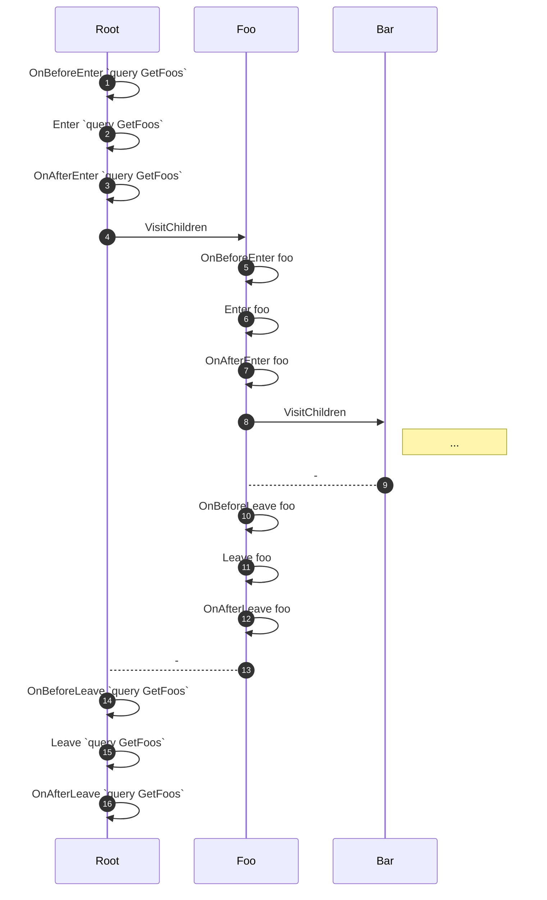

Hot Chocolate creates an abstract syntax tree (AST) for every incoming request. The execution engine evaluates this tree in many ways. Validation is a good example: a set of rules is applied to the tree to find semantic flaws.

You typically do not need to access the AST directly. The AST becomes relevant when you need to change execution behavior based on query structure. Features like filtering, sorting, and selection analyze the incoming query and generate expressions from it.

Hot Chocolate provides the `SyntaxWalker` to traverse these trees. It has built-in logic to walk down a syntax tree.

The `SyntaxWalker` is stateless. All state lives on a context object passed along during traversal. The generic argument `TContext` of `SyntaxWalker<TContext>` denotes the type of that context.

To start visitation, pass the node and context to the visitor's `Visit` method.

---

# Visitation

On the way down the tree, the visitor _enters_ each node, gets its children, and _enters_ them. When it reaches a leaf node, it walks back up and _leaves_ all the nodes. The visitor provides virtual `Enter` and `Leave` methods for all GraphQL AST node types.

In addition to `Enter` and `Leave`, there are convenience methods called immediately before and after: `OnBeforeEnter`, `OnAfterEnter`, `OnBeforeLeave`, `OnAfterLeave`. These methods can modify the current `TContext`. They are useful for initializing state. For example, before entering a `FieldNode`, you might peek at the latest type from the context, look up the corresponding `ObjectField`, and push it onto the context for use in the `Enter` method.

> In the sequence diagram below, the participants do **not** represent object instances. Many steps are hidden. The visualization shows the order of method calls.

```graphql
query GetFoos {
  foo {
    bar
  }
}
```



1. Start walking down the tree. Call `OnBeforeEnter(OperationDefinitionNode node, TContext context)`.
2. Call `Enter(OperationDefinitionNode node, TContext context)`.
3. Call `OnAfterEnter(OperationDefinitionNode node, TContext context)`.
4. Call `VisitChildren(OperationDefinitionNode node, TContext context)`.
5. Call `OnBeforeEnter(ObjectFieldNode node, TContext context)`.
6. Call `Enter(ObjectFieldNode node, TContext context)`.
7. Call `OnAfterEnter(ObjectFieldNode node, TContext context)`.
8. Call `VisitChildren(ObjectFieldNode node, TContext context)`.
9. Walk back up the tree.
10. Call `OnBeforeLeave(ObjectFieldNode node, TContext context)`.
11. Call `Leave(ObjectFieldNode node, TContext context)`.
12. Call `OnAfterLeave(ObjectFieldNode node, TContext context)`.
13. Continue walking up.
14. Call `OnBeforeLeave(OperationDefinitionNode node, TContext context)`.
15. Call `Leave(OperationDefinitionNode node, TContext context)`.
16. Call `OnAfterLeave(OperationDefinitionNode node, TContext context)`.

---

# Visitor Actions

The `Enter` and `Leave` methods return visitor actions that control the next step.

## Continue

If `Continue` is returned, visitation on the current branch continues. The visitor calls `VisitChildren` and enters the next node.

```graphql {4}
query {
  foo {
    bar
    baz @onEnter(return: CONTINUE) {
      quux
    }
    qux
  }
}
```

## Skip

If `Skip` is returned, further visitation on this node stops. The visitor skips the node and continues with the next sibling.

```graphql {4}
query {
  foo {
    bar
    baz @onEnter(return: SKIP) {
      quux
    }
    qux
  }
}
```

## SkipAndLeave

If `SkipAndLeave` is returned from `Enter`, further visitation on this node stops. The visitor calls the `Leave` method for the current node before continuing with the next sibling.

```graphql {4}
query {
  foo {
    bar
    baz @onEnter(return: SKIPANDLEAVE) {
      quux
    }
    qux
  }
}
```

## Break

If `Break` is returned, further visitation on the entire branch stops. The visitor walks back up immediately. For example, returning `Break` from `baz` causes the visitor to skip `baz` and `qux` and call `Leave` on `foo`.

```graphql {4}
query {
  foo {
    bar
    baz @onEnter(return: BREAK) {
      quux
    }
    qux
  }
}
```

# Troubleshooting

**Visitor does not enter child nodes**
Verify that the `Enter` method returns `Continue`. Returning `Skip` or `Break` prevents traversal of child nodes.

**State is lost between nodes**
The `SyntaxWalker` is stateless. All state must be stored on the `TContext` object. Verify that you push and pop state correctly in `OnBeforeEnter` and `OnAfterLeave`.

# Next Steps

- [Language reference](/docs/hotchocolate/v16/api-reference/language) for AST node types
- [Extending filtering](/docs/hotchocolate/v16/api-reference/extending-filtering) for building custom filter handlers using visitors

<!-- spell-checker:ignore SKIPANDLEAVE -->
