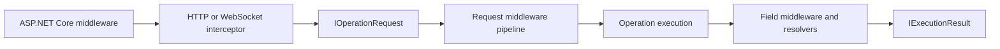

Request middleware operates within the Hot Chocolate execution engine. It receives a `RequestContext`, performs work at the request level, and either invokes the next `RequestDelegate` or returns an execution result.

Use request middleware when you need to make a single decision about a GraphQL operation after the transport has created an `IOperationRequest`, but before any field resolvers are executed.



Most applications use the built-in pipeline and add a small middleware at a specific point. Placement is important because each stage adds more request data, and each wrapper can control behavior such as diagnostics, exception handling, timeout management, and concurrency gating.

# Choose the right hook

| Need                                                                                             | Use                                                      | Runs with                 | Avoid using it for                                                         |
| ------------------------------------------------------------------------------------------------ | -------------------------------------------------------- | ------------------------- | -------------------------------------------------------------------------- |
| Routing, CORS, authentication middleware, request body limits, or HTTP response formatting       | ASP.NET Core middleware or endpoint options              | `HttpContext`             | GraphQL document or operation decisions                                    |
| Read HTTP headers, socket connection data, files, or claims while building the operation request | `IHttpRequestInterceptor` or `ISocketSessionInterceptor` | `OperationRequestBuilder` | Work that depends on validation, operation selection, or coerced variables |
| Make one GraphQL request-level decision inside execution                                         | Request middleware                                       | `RequestContext`          | Per-field resolver behavior                                                |
| Run behavior for every selected field                                                            | Field middleware                                         | `IMiddlewareContext`      | Request-level parsing, validation, or operation gates                      |
| Observe execution for telemetry                                                                  | Diagnostic listeners                                     | Diagnostic event payloads | Replacing built-in instrumentation                                         |
| Rewrite errors after Hot Chocolate creates them                                                  | Error filters                                            | `IError`                  | Request control flow                                                       |
| Enrich `RequestContext` before the pipeline without ordering                                     | `IRequestContextEnricher`                                | `RequestContext`          | Logic that must run before or after a named middleware                     |

# The default request pipeline

If you do not configure a custom pipeline, Hot Chocolate provides a default request pipeline. Add middleware relative to these keys rather than replacing the entire pipeline, unless you are building an advanced execution feature.

| Order | Middleware key                                                   | What it prepares or controls                                                                                         |
| ----- | ---------------------------------------------------------------- | -------------------------------------------------------------------------------------------------------------------- |
| 1     | `WellKnownRequestMiddleware.InstrumentationMiddleware`           | Request diagnostic scope and events.                                                                                 |
| 2     | `WellKnownRequestMiddleware.ExceptionMiddleware`                 | Converts downstream `GraphQLException`, `OperationCanceledException`, and other exceptions to GraphQL error results. |
| 3     | `WellKnownRequestMiddleware.TimeoutMiddleware`                   | Execution timeout behavior.                                                                                          |
| 4     | `WellKnownRequestMiddleware.DocumentCacheMiddleware`             | Parsed document cache lookup.                                                                                        |
| 5     | `WellKnownRequestMiddleware.DocumentParserMiddleware`            | Source text parsing and document metadata.                                                                           |
| 6     | `WellKnownRequestMiddleware.DocumentValidationMiddleware`        | Document validation against the schema.                                                                              |
| 7     | `WellKnownRequestMiddleware.OperationCacheMiddleware`            | Prepared operation cache lookup.                                                                                     |
| 8     | `WellKnownRequestMiddleware.OperationResolverMiddleware`         | Operation selection and compilation.                                                                                 |
| 9     | `WellKnownRequestMiddleware.SkipWarmupExecutionMiddleware`       | Warmup request short-circuiting.                                                                                     |
| 10    | `WellKnownRequestMiddleware.OperationVariableCoercionMiddleware` | Variable coercion for the selected operation.                                                                        |
| 11    | `WellKnownRequestMiddleware.ConcurrencyGateMiddleware`           | Concurrent execution gating.                                                                                         |
| 12    | `WellKnownRequestMiddleware.OperationExecutionMiddleware`        | Operation execution and result creation.                                                                             |

Features such as persisted operations and automatic persisted operations insert additional middleware after document cache lookup and before parsing. Authorization, cost analysis, query caching, and Fusion planning also add their own keys.

# Working with `RequestContext`

Hot Chocolate uses the public abstract `RequestContext` class. Do not use older `IRequestContext` examples.

| Property                | Use it for                                                                | Placement notes                                                             |
| ----------------------- | ------------------------------------------------------------------------- | --------------------------------------------------------------------------- |
| `Request`               | The `IOperationRequest` created by the transport.                         | Available when request middleware starts.                                   |
| `RequestServices`       | Request-scoped services.                                                  | Resolve scoped services here rather than storing them in middleware fields. |
| `ContextData`           | Mutable request/global state.                                             | State from `OperationRequestBuilder.SetGlobalState` is visible here.        |
| `OperationDocumentInfo` | Document id, hash, parsed document, and cache/persisted/validation flags. | Document data is useful after document cache or parser stages.              |
| `VariableValues`        | Coerced variable value sets.                                              | Use after `OperationVariableCoercionMiddleware`.                            |
| `Result`                | The final result or an intentional short-circuit result.                  | A completed pipeline must set a result.                                     |
| `RequestAborted`        | Request cancellation.                                                     | Pass it to async work that supports cancellation.                           |
| `Features`              | Feature collection for extensions.                                        | Prefer typed feature objects over stringly typed feature state.             |
| `RequestIndex`          | The index in a batched request.                                           | Useful for diagnostics and per-operation correlation.                       |

`RequestContext` instances are pooled by the executor. Do not store the context, pass it to background work, or keep references to values that have a lifetime beyond request completion.

# Adding delegate-based middleware

To add middleware, use `UseRequest` on `IRequestExecutorBuilder`.

```csharp
using HotChocolate.Execution;

builder.Services
    .AddGraphQLServer()
    .UseRequest(next => async context =>
    {
        // Runs before downstream middleware.
        context.ContextData["CustomFlag"] = true;

        await next(context);

        // Runs after downstream middleware completes.
    });
```

The delegate receives the next `RequestDelegate`. Since the request delegate returns a `ValueTask`, await it before running any post-processing logic.

If you do not specify a position, middleware is appended to the pipeline. In the default pipeline, this means it runs after operation execution, which is too late for state needed by resolvers or pre-execution policy checks. For most request-level behavior, position the middleware with `before` or `after`.

```csharp
builder.Services
    .AddGraphQLServer()
    .UseRequest(
        next => async context =>
        {
            context.RequestAborted.ThrowIfCancellationRequested();
            context.ContextData["ParsedDocumentSeen"] = true;

            await next(context);
        },
        key: "Example.AfterParser",
        after: WellKnownRequestMiddleware.DocumentParserMiddleware);
```

# Adding class-based middleware

Class-based middleware is helpful when you have dependencies or enough logic to warrant a dedicated class.

```csharp
using HotChocolate.Execution;
using Microsoft.Extensions.DependencyInjection;

public sealed class TenantGateMiddleware
{
    private readonly RequestDelegate _next;

    public TenantGateMiddleware(RequestDelegate next)
    {
        _next = next;
    }

    public async ValueTask InvokeAsync(RequestContext context)
    {
        var tenantPolicy = context.RequestServices.GetRequiredService<ITenantPolicy>();

        if (!context.ContextData.TryGetValue(TenantState.Keys.TenantId, out var value) ||
            value is not string tenantId ||
            !await tenantPolicy.IsAllowedAsync(tenantId, context.RequestAborted))
        {
            context.Result = OperationResult.FromError(
                ErrorBuilder.New()
                    .SetMessage("The tenant is not allowed for this request.")
                    .SetCode("TENANT_NOT_ALLOWED")
                    .Build());
            return;
        }

        await _next(context);
    }
}
```

Register the middleware with a key and an anchor:

```csharp
builder.Services
    .AddGraphQLServer()
    .UseRequest<TenantGateMiddleware>(
        key: "Example.TenantGate",
        after: WellKnownRequestMiddleware.DocumentValidationMiddleware);
```

Do not store per-request data in instance fields. Middleware instances can outlive a single request, so request data should be kept in `RequestContext`, scoped services, or values passed through the current call.

# Positioning middleware with keys

`UseRequest` accepts these positioning arguments:

| Argument        | Meaning                                                                                 |
| --------------- | --------------------------------------------------------------------------------------- |
| `key`           | A unique identifier for your middleware.                                                |
| `before`        | Insert before the middleware with this key.                                             |
| `after`         | Insert after the middleware with this key.                                              |
| `allowMultiple` | When `false`, a duplicate positioned middleware key is skipped. The default is `false`. |

Keep these rules in mind:

- Use either `before` or `after`, not both.
- A positioned middleware with `allowMultiple: false` requires a non-null `key`.
- If the anchor key is missing, executor configuration will throw.
- A duplicate key is skipped unless you set `allowMultiple: true`.

Choose the anchor based on the data you need:

| Need                                                 | Place the middleware                                                    |
| ---------------------------------------------------- | ----------------------------------------------------------------------- |
| Parsed document metadata                             | `after: WellKnownRequestMiddleware.DocumentParserMiddleware`            |
| Validated document                                   | `after: WellKnownRequestMiddleware.DocumentValidationMiddleware`        |
| Selected and compiled operation                      | `after: WellKnownRequestMiddleware.OperationResolverMiddleware`         |
| Coerced variables                                    | `after: WellKnownRequestMiddleware.OperationVariableCoercionMiddleware` |
| Run before resolvers                                 | `before: WellKnownRequestMiddleware.OperationExecutionMiddleware`       |
| Be covered by built-in exception conversion          | `after: WellKnownRequestMiddleware.ExceptionMiddleware`                 |
| Be inside the request diagnostic scope               | `after: WellKnownRequestMiddleware.InstrumentationMiddleware`           |
| Avoid consuming an execution gate slot               | `before: WellKnownRequestMiddleware.ConcurrencyGateMiddleware`          |
| Measure time spent waiting for the execution gate    | `before: WellKnownRequestMiddleware.ConcurrencyGateMiddleware`          |
| Measure only operation execution work after the gate | `after: WellKnownRequestMiddleware.ConcurrencyGateMiddleware`           |

# Short-circuiting a request

To intentionally stop the pipeline, set `context.Result` and return without calling `next(context)`.

```csharp
builder.Services
    .AddGraphQLServer()
    .UseRequest(
        next => async context =>
        {
            if (!context.ContextData.ContainsKey(TenantState.Keys.TenantId))
            {
                context.Result = OperationResult.FromError(
                    ErrorBuilder.New()
                        .SetMessage("A tenant id is required.")
                        .SetCode("TENANT_REQUIRED")
                        .Build());
                return;
            }

            await next(context);
        },
        key: "Example.RequireTenant",
        before: WellKnownRequestMiddleware.OperationExecutionMiddleware);
```

Use this pattern for expected policy denials or application-specific gates. Throw a `GraphQLException` when an exception path is more appropriate and your middleware is downstream of `ExceptionMiddleware`. Middleware placed before `ExceptionMiddleware` is outside the built-in exception conversion scope.

If your middleware neither calls `next(context)` nor sets `context.Result`, the executor cannot return a valid execution result.

# Sharing request state

Use an interceptor when state comes from the transport. The interceptor creates or enriches the operation request, and request middleware then reads the value from `context.ContextData`.

```csharp
using HotChocolate.AspNetCore;
using HotChocolate.Execution;
using Microsoft.AspNetCore.Http;

public static class TenantState
{
    public static class Keys
    {
        public const string TenantId = "TenantId";
    }
}

public sealed class TenantHttpRequestInterceptor : DefaultHttpRequestInterceptor
{
    public override ValueTask OnCreateAsync(
        HttpContext context,
        IRequestExecutor requestExecutor,
        OperationRequestBuilder requestBuilder,
        CancellationToken cancellationToken)
    {
        if (context.Request.Headers.TryGetValue("X-Tenant-Id", out var values))
        {
            requestBuilder.SetGlobalState(TenantState.Keys.TenantId, values.ToString());
        }

        return base.OnCreateAsync(context, requestExecutor, requestBuilder, cancellationToken);
    }
}
```

Register the interceptor and middleware on the same executor builder:

```csharp
builder.Services
    .AddGraphQLServer()
    .AddHttpRequestInterceptor<TenantHttpRequestInterceptor>()
    .UseRequest<TenantGateMiddleware>(
        key: "Example.TenantGate",
        after: WellKnownRequestMiddleware.DocumentValidationMiddleware);
```

Use constants for state keys, store typed values, and avoid putting owned resources or scoped service instances into global state. Resolvers can consume global state with resolver APIs such as `[GlobalState]`. See the global state page for resolver-side patterns.

Use `SetGlobalState`, `AddGlobalState`, `TryAddGlobalState`, and `RemoveGlobalState` on `OperationRequestBuilder`. Older examples that use `SetProperty` or `TryAddProperty` are not current request-building APIs.

# Adding app-specific timing or correlation

Request middleware can add application-specific logging around a custom segment. For general telemetry, prefer diagnostic listeners through `AddDiagnosticEventListener` because they observe the built-in execution events.

```csharp
builder.Services
    .AddGraphQLServer()
    .UseRequest(
        next => async context =>
        {
            var logger = context.RequestServices.GetRequiredService<ILoggerFactory>()
                .CreateLogger("GraphQL.Correlation");

            var correlationId = context.ContextData.TryGetValue("CorrelationId", out var value)
                ? value?.ToString()
                : null;

            using var scope = logger.BeginScope(new Dictionary<string, object?>
            {
                ["GraphQLRequestIndex"] = context.RequestIndex,
                ["CorrelationId"] = correlationId
            });

            var started = TimeProvider.System.GetTimestamp();
            await next(context);
            var elapsed = TimeProvider.System.GetElapsedTime(started);

            logger.LogInformation("GraphQL request segment completed in {ElapsedMs} ms.", elapsed.TotalMilliseconds);
        },
        key: "Example.CorrelationLogging",
        before: WellKnownRequestMiddleware.OperationExecutionMiddleware);
```

This example is intentionally placed inside instrumentation and before execution. Move it after `ConcurrencyGateMiddleware` if you want to exclude time spent waiting for execution capacity.

# Troubleshooting

| Symptom                                                        | Check                                                                                                                  |
| -------------------------------------------------------------- | ---------------------------------------------------------------------------------------------------------------------- |
| `IRequestContext` is not found.                                | Use `RequestContext`.                                                                                                  |
| `SetProperty` or `TryAddProperty` is not found.                | Use `SetGlobalState`, `AddGlobalState`, `TryAddGlobalState`, or `RemoveGlobalState`.                                   |
| Middleware never runs.                                         | Confirm it is registered on the active `IRequestExecutorBuilder` and was not skipped by duplicate key behavior.        |
| Middleware runs after resolvers.                               | Unpositioned middleware is appended. Insert before `OperationExecutionMiddleware`.                                     |
| The anchor key is not found.                                   | Check the active pipeline and use a `WellKnownRequestMiddleware` constant that exists in that pipeline.                |
| `OperationDocumentInfo.Document` is missing or not useful yet. | Place the middleware after `DocumentParserMiddleware`; account for persisted operation paths.                          |
| The document has not been validated.                           | Place the middleware after `DocumentValidationMiddleware`.                                                             |
| `VariableValues` is empty or incomplete.                       | Place the middleware after `OperationVariableCoercionMiddleware`.                                                      |
| Exceptions are not converted to GraphQL errors.                | Place the middleware after `ExceptionMiddleware` or set `context.Result` yourself.                                     |
| The executor reports that no result was produced.              | Your middleware returned without calling `next(context)` and without setting `context.Result`.                         |
| Scoped services behave incorrectly.                            | Resolve them from `context.RequestServices` during `InvokeAsync`.                                                      |
| State is visible in middleware but missing in resolvers.       | Run the middleware before operation execution and use resolver global-state APIs.                                      |
| Warmup requests trigger custom logic.                          | Place the middleware after or before `SkipWarmupExecutionMiddleware` based on whether warmup requests should reach it. |

# Next steps

- [Execution pipeline](/docs/hotchocolate/v16/build/execution-engine/pipeline) for the full execution flow.
- [Field middleware](/docs/hotchocolate/v16/build/execution-engine/field-middleware) for per-field resolver behavior.
- [HTTP and WebSocket interceptors](/docs/hotchocolate/v16/build/server-configuration/interceptors) for transport-level request creation.
- [Global state](/docs/hotchocolate/v16/build/server-configuration/global-state) for sharing state with resolvers.
- [Instrumentation](/docs/hotchocolate/v16/build/observability) for diagnostics and telemetry.
- [Error handling](/docs/hotchocolate/v16/build/errors) for errors and filters.
- [Authorization](/docs/hotchocolate/v16/build/security/authorization), [request limits](/docs/hotchocolate/v16/build/security/execution-depth-and-limits), and [cost analysis](/docs/hotchocolate/v16/build/security/cost-analysis) for built-in request gates.
- [Trusted documents](/docs/hotchocolate/v16/build/security/trusted-documents) and [automatic persisted operations](/docs/hotchocolate/v16/build/performance/automatic-persisted-operations) for alternate request pipeline variants.
