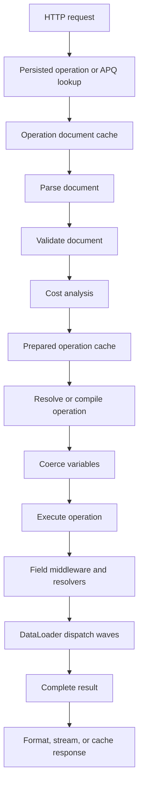

Hot Chocolate is designed for high-throughput GraphQL execution. However, performance improvements are most effective when they address the actual bottleneck. Use this page to learn how to measure request cost, select the right optimization, and find links to detailed guidance for each area.

# Identify the Bottleneck

Begin with data. A slow GraphQL request may spend time in various stages: HTTP transport, persisted operation lookup, document parsing, validation, cost analysis, operation preparation, variable coercion, resolver execution, DataLoader dispatch, database access, serialization, or network delivery.

If you are unsure where the slowdown occurs, add instrumentation before adjusting any settings:

```csharp
builder
    .AddGraphQL()
    .AddTypes()
    .AddInstrumentation();
```

Next, connect OpenTelemetry to Hot Chocolate's instrumentation. This setup provides traces for GraphQL requests, fields, and DataLoader spans. Only enable detailed scopes for the specific investigation, as extra instrumentation can introduce overhead.

Read next: [Instrumentation](/docs/hotchocolate/v16/build/observability) and [Execution engine](/docs/hotchocolate/v16/build/execution-engine).

# Choose a Performance Strategy

Use the table below to match common symptoms with likely bottlenecks and recommended solutions. Each link leads to a page with more details.

| Symptom                                                       | Likely Cost Center                 | First Step                                          | Expected Result                                                | Read Next                                                                                                                                                            |
| ------------------------------------------------------------- | ---------------------------------- | --------------------------------------------------- | -------------------------------------------------------------- | -------------------------------------------------------------------------------------------------------------------------------------------------------------------- |
| First request after deployment is slow                        | Schema and executor initialization | Keep eager initialization and add warmup tasks      | The executor and hot operation shapes are ready before traffic | [Warmup](/docs/hotchocolate/v16/build/performance/warmup)                                                                                                            |
| Repeated known operations spend time in parsing or validation | Document and operation preparation | Persisted operations, APQ, and operation caches     | Known operations reuse parsed and prepared work                | [Persisted operations](/docs/hotchocolate/v16/build/security/trusted-documents), [APQ](/docs/hotchocolate/v16/build/performance/automatic-persisted-operations)      |
| Clients resend large operation text                           | Request payload size               | Persisted operations or APQ                         | Clients send an operation ID or hash instead of full text      | [Trusted documents](/docs/hotchocolate/v16/build/security/trusted-documents)                                                                                         |
| Public query responses repeat                                 | HTTP response caching              | Cache-control metadata and deterministic GET routes | Browsers, proxies, or CDNs can reuse safe query responses      | [Cache control](/docs/hotchocolate/v16/build/performance/cache-control)                                                                                              |
| Nested resolvers issue many similar backend calls             | N+1 data access                    | DataLoader                                          | Keys are batched and deduplicated within one request           | [DataLoader](/docs/hotchocolate/v16/build/dataloader)                                                                                                                |
| Database returns too many rows or columns                     | Query shape                        | Paging, projections, filtering, and sorting         | More work is pushed to the data source                         | [Pagination](/docs/hotchocolate/v16/build/pagination), [Filtering, sorting, and projections](/docs/hotchocolate/v16/build/filtering-sorting-projections)             |
| Several independent operations use separate HTTP calls        | Client round trips                 | HTTP batching with a bounded `MaxBatchSize`         | Fewer HTTP round trips                                         | [Batching](/docs/hotchocolate/v16/build/performance/batching)                                                                                                        |
| Expensive operations can harm shared capacity                 | Resource guardrails                | Cost analysis, request limits, and page-size limits | Work is rejected before it reaches resolvers                   | [Cost analysis](/docs/hotchocolate/v16/build/security/cost-analysis), [Execution depth and limits](/docs/hotchocolate/v16/build/security/execution-depth-and-limits) |

# Understand Request Lifecycle Cost

Each request passes through several cost centers. The most effective optimizations target a specific step in this process.



Key points:

- The operation document cache holds parsed and validated documents for each schema. The default size is `256`, with a minimum of `16`.
- The prepared operation cache stores compiled operations per schema. The default size is `256`, with a minimum of `16`.
- Warmup can initialize the executor and prefill document and operation cache entries.
- The DataLoader cache is scoped to a single GraphQL request.
- HTTP response caching occurs outside resolver execution and relies on deterministic routes and cache-control headers.

# Reduce Startup and First-Request Latency

By default, Hot Chocolate eagerly builds the schema. With `LazyInitialization` set to `false`, schema errors are surfaced at startup, and the request executor is ready before the server begins handling requests.

If your first live requests also require hot document and operation cache entries, use warmup tasks:

```csharp
builder
    .AddGraphQL()
    .AddTypes()
    .AddWarmupTask(async (executor, ct) =>
    {
        var request = OperationRequestBuilder.New()
            .SetDocument("""
                query GetProducts {
                    products(first: 10) {
                        nodes {
                            id
                            name
                        }
                    }
                }
                """)
            .SetOperationName("GetProducts")
            .MarkAsWarmupRequest()
            .Build();

        await executor.ExecuteAsync(request, ct);
    });
```

Warmup requests that use `MarkAsWarmupRequest()` do not execute resolvers, which prevents startup side effects. These requests also skip security checks such as persisted operation enforcement. Do not use warmup as proof that a normal production request will be accepted.

If clients provide an operation name, include it in the warmup request. The operation name is part of the prepared operation cache key.

Read next: [Warmup](/docs/hotchocolate/v16/build/performance/warmup).

# Reuse Repeated Operation Work

Hot Chocolate provides three related features that help avoid repeated work. These are often confused, so here is a summary:

| Feature                    | Scope              | What It Saves                                  | Main Use                                                  |
| -------------------------- | ------------------ | ---------------------------------------------- | --------------------------------------------------------- |
| Operation document cache   | Per schema         | Repeated parsing and cacheable validation work | Dynamic requests that repeat the same document            |
| Prepared operation cache   | Per schema         | Repeated operation preparation and compilation | Hot operations with stable document ID and operation name |
| Operation document storage | Configured storage | Fetching known documents by ID or hash         | Persisted operations and APQ                              |

Increase the built-in cache sizes if your hot working set is larger than the defaults:

```csharp
builder
    .AddGraphQL()
    .ModifyOptions(options =>
    {
        options.OperationDocumentCacheSize = 1024;
        options.PreparedOperationCacheSize = 1024;
    });
```

Use persisted operations when client operations are known before deployment:

```csharp
builder
    .AddGraphQL()
    .AddTypes()
    .AddSha256DocumentHashProvider(HashFormat.Hex)
    .UsePersistedOperationPipeline()
    .AddFileSystemOperationDocumentStorage("./persisted_operations");
```

Use Automatic Persisted Operations (APQ) when clients need to register documents at runtime:

```csharp
builder.Services.AddMemoryCache();

builder
    .AddGraphQL()
    .AddTypes()
    .AddSha256DocumentHashProvider(HashFormat.Hex)
    .UseAutomaticPersistedOperationPipeline()
    .AddInMemoryOperationDocumentStorage();
```

APQ has a first-use miss. If the server does not recognize a hash, it returns a not-found error. The client then sends a second request with the full document. After the document is stored, future requests can use only the hash.

Read next: [Persisted operations](/docs/hotchocolate/v16/build/security/trusted-documents) and [Automatic persisted operations](/docs/hotchocolate/v16/build/performance/automatic-persisted-operations).

# Use Caching at the Right Layer

Caching is not a single feature. Choose the cache that matches the work you want to avoid.

| Cache                      | Lifetime                              | Avoids                            | Notes                                      |
| -------------------------- | ------------------------------------- | --------------------------------- | ------------------------------------------ |
| Operation document cache   | Per schema                            | Parsing and cacheable validation  | Controlled by `OperationDocumentCacheSize` |
| Prepared operation cache   | Per schema                            | Operation preparation             | Controlled by `PreparedOperationCacheSize` |
| DataLoader cache           | One request                           | Duplicate key loads               | Not shared across requests                 |
| Operation document storage | Storage-dependent                     | Sending or parsing full documents | Used by persisted operations and APQ       |
| HTTP response cache        | Browser, proxy, CDN, or server policy | Re-executing safe query responses | Requires cache-control metadata            |

To enable HTTP response caching, mark cacheable query fields and add cache-control support:

```csharp
using HotChocolate.Caching;

builder
    .AddGraphQL()
    .AddTypes()
    .UseQueryCache()
    .AddCacheControl();

[QueryType]
public static partial class ProductQueries
{
    [CacheControl(300, SharedMaxAge = 900)]
    public static Product? GetProductById(int id)
    {
        return ProductRepository.GetById(id);
    }
}
```

Cache-control applies to query responses. Mutations, subscriptions, introspection, responses with GraphQL errors, and responses without cache metadata do not produce reusable HTTP cache headers.

Read next: [Cache control](/docs/hotchocolate/v16/build/performance/cache-control).

# Reduce Data-Fetching Cost

Most GraphQL performance improvements come from optimizing data access. Keep resolvers focused, return provider-supported query shapes for collections, and use DataLoader for related data by key.

## Use DataLoader for N+1 Fields

```csharp
internal static class BrandDataLoaders
{
    [DataLoader]
    public static async Task<Dictionary<int, Brand>> GetBrandByIdAsync(
        IReadOnlyList<int> ids,
        CatalogContext db,
        CancellationToken ct)
    {
        return await db.Brands
            .Where(brand => ids.Contains(brand.Id))
            .ToDictionaryAsync(brand => brand.Id, ct);
    }
}

[ObjectType<Product>]
public static partial class ProductNode
{
    public static async Task<Brand?> GetBrandAsync(
        [Parent] Product product,
        IBrandByIdDataLoader brandById,
        CancellationToken ct)
    {
        return await brandById.LoadAsync(product.BrandId, ct);
    }
}
```

DataLoader batches keys between resolver waves and deduplicates repeated keys within a single request. Complex execution may still result in more than one backend batch, but each batch should be much smaller than issuing one call per parent object.

Read next: [DataLoader](/docs/hotchocolate/v16/build/dataloader).

## Push Collection Work to the Data Source

```csharp
builder.Services.AddDbContext<CatalogContext>();

builder
    .AddGraphQL()
    .AddTypes()
    .AddProjections()
    .AddFiltering()
    .AddSorting()
    .ModifyPagingOptions(options =>
    {
        options.MaxPageSize = 100;
        options.RequirePagingBoundaries = true;
    });

[QueryType]
public static partial class ProductQueries
{
    [UsePaging]
    [UseProjection]
    [UseFiltering]
    [UseSorting]
    public static IQueryable<Product> GetProducts(CatalogContext db)
    {
        return db.Products;
    }
}
```

When combining middleware, use this order:

1. `UsePaging`
2. `UseProjection`
3. `UseFiltering`
4. `UseSorting`

Keep these projection constraints in mind:

- Projections require public setters on projected properties.
- Do not combine `QueryContext<T>` with `[UseProjection]` on the same field. The HC0099 analyzer will warn about this conflict.
- Projections cannot apply pagination over relationships. Apply filtering and sorting to nested collections if needed.
- Materializing an `IQueryable<T>` before middleware runs moves work into memory.

Read next: [Filtering, sorting, and projections](/docs/hotchocolate/v16/build/filtering-sorting-projections), [Pagination](/docs/hotchocolate/v16/build/pagination), and [Fetching from databases](/docs/hotchocolate/v16/_leagcy/resolvers-and-data/fetching-from-databases).

# Reduce Network and Response Cost

Persisted operations and APQ help reduce request size. Cache-control minimizes repeated response work. HTTP batching decreases the number of client round trips.

HTTP batching is off by default. Enable only the modes your clients require, and always set a maximum batch size:

```csharp
builder
    .AddGraphQL()
    .ModifyServerOptions(options =>
    {
        options.Batching =
            AllowedBatching.VariableBatching |
            AllowedBatching.RequestBatching;

        options.MaxBatchSize = 100;
    });
```

Fusion subgraphs enable batching by default. For standalone servers, leave it disabled unless your clients use it intentionally.

HTTP batching and DataLoader serve different purposes. HTTP batching combines multiple GraphQL operations into a single HTTP request, while DataLoader batches backend key loads during resolver execution.

For large responses, consider transport features such as `@defer`, `@stream`, multipart responses, Server-Sent Events, or JSON Lines if the client can process incremental results.

Read next: [Batching](/docs/hotchocolate/v16/build/performance/batching) and [HTTP transport](/docs/hotchocolate/v16/build/server-configuration/http-transport).

# Protect Shared Resources

Performance also involves rejecting work that should not be processed. Cost analysis estimates the shape of an operation before resolver execution and rejects requests that exceed your configured budgets.

```csharp
builder
    .AddGraphQL()
    .AddTypes()
    .ModifyCostOptions(options =>
    {
        options.MaxFieldCost = 5_000;
        options.MaxTypeCost = 5_000;
        options.EnforceCostLimits = true;
    })
    .ModifyPagingOptions(options =>
    {
        options.MaxPageSize = 50;
        options.RequirePagingBoundaries = true;
    });
```

Use `[Cost]` for expensive fields and `[ListSize]` for list fields whose size cannot be determined from paging metadata. Set request limits for parser size, validation depth, fragment visits, timeouts, concurrent executions, and batching.

Read next: [Cost analysis](/docs/hotchocolate/v16/build/security/cost-analysis), [Execution depth and limits](/docs/hotchocolate/v16/build/security/execution-depth-and-limits), and [Request limits](/docs/hotchocolate/v16/build/security/execution-depth-and-limits).

# Resolver Performance Checklist

Use this checklist if traces indicate that resolver execution is the main source of latency.

- Keep resolvers focused: read GraphQL inputs, call an application service or DataLoader, and return the result.
- Pass `CancellationToken` to database, HTTP, and queue calls.
- Do not block async work with `.Result`, `.Wait()`, or synchronous I/O.
- Avoid per-request mutable state on GraphQL type instances.
- Prevent side effects in query resolvers that depend on sibling field order.
- Prefer provider-side paging, filtering, sorting, and projection before materializing data.
- Use DataLoader for related data by key.
- Use batch resolvers when a field can be resolved for many parents without reusable key caching.
- Do not log full documents or large result payloads on every request.
- Move expensive diagnostic work to background processing.

Read next: [Resolvers](/docs/hotchocolate/v16/build/resolvers) and [Field middleware](/docs/hotchocolate/v16/build/execution-engine/field-middleware).

# Production Checklist

Before putting a server into production, review the following:

- [ ] Instrument representative traffic and identify the slowest operation shapes.
- [ ] Keep eager initialization unless startup constraints require lazy initialization.
- [ ] Warm up representative operations after schema creation.
- [ ] Size operation caches for the hot operation set.
- [ ] Use persisted operations or APQ when clients repeat known documents.
- [ ] Use cache-control only for safe query responses with the correct public or private scope.
- [ ] Bound every large collection with paging.
- [ ] Verify middleware order for paging, projections, filtering, and sorting.
- [ ] Use DataLoader for N+1 fields.
- [ ] Set cost budgets and request limits for public or multi-tenant APIs.
- [ ] Keep HTTP batching disabled unless clients need it, and set `MaxBatchSize` if enabled.
- [ ] Review instrumentation scopes and diagnostic handlers for overhead.
- [ ] Test the largest expected operations with `GraphQL-Cost: report`.

# Troubleshoot Common Surprises

| Surprise                                        | Likely Cause                                                          | What to Check                                                  |
| ----------------------------------------------- | --------------------------------------------------------------------- | -------------------------------------------------------------- |
| Warmup did not enforce persisted operations     | Warmup requests skip security measures                                | Test with normal HTTP requests, not warmup requests            |
| Warmup did not hit the prepared operation cache | Operation name differs                                                | Include the same operation name clients send                   |
| APQ is slower on first use                      | Unknown hash path needs a second request                              | Confirm later hash-only requests hit storage                   |
| Cache sizes seem ineffective                    | Caches are per schema and have minimum size `16`                      | Check schema count and hot operation count                     |
| Batching did not fix N+1 queries                | HTTP batching and DataLoader work at different layers                 | Add DataLoader to nested key-based fields                      |
| Projection is ignored                           | Data was materialized too early or property setters are missing       | Return `IQueryable<T>` and use public setters                  |
| HC0099 appears                                  | `QueryContext<T>` and `[UseProjection]` are combined                  | Pick one projection path for the field                         |
| Cost analysis rejects valid client operations   | Page size or field weights exceed budget                              | Use `GraphQL-Cost: report`, tune budgets, or reduce page sizes |
| Tracing increases latency                       | Too many scopes or expensive handlers                                 | Reduce scopes and move work out of synchronous handlers        |
| HTTP cache does not store responses             | Missing deterministic GET route, cache metadata, or error-free result | Review cache-control headers and response errors               |

# Next Steps

| Task                               | Start Here                                                                                                                                                                                                                                                              |
| ---------------------------------- | ----------------------------------------------------------------------------------------------------------------------------------------------------------------------------------------------------------------------------------------------------------------------- |
| Measure slow requests              | [Instrumentation](/docs/hotchocolate/v16/build/observability), [Execution engine](/docs/hotchocolate/v16/build/execution-engine)                                                                                                                                        |
| Reduce cold-start impact           | [Warmup](/docs/hotchocolate/v16/build/performance/warmup)                                                                                                                                                                                                               |
| Reduce repeated operation overhead | [Persisted operations](/docs/hotchocolate/v16/build/security/trusted-documents), [Automatic persisted operations](/docs/hotchocolate/v16/build/performance/automatic-persisted-operations), [Options](/docs/hotchocolate/v16/build/server-configuration/schema-options) |
| Remove N+1 data access             | [DataLoader](/docs/hotchocolate/v16/build/dataloader)                                                                                                                                                                                                                   |
| Push work to the database          | [Pagination](/docs/hotchocolate/v16/build/pagination), [Filtering, sorting, and projections](/docs/hotchocolate/v16/build/filtering-sorting-projections)                                                                                                                |
| Reduce response or transport cost  | [Cache control](/docs/hotchocolate/v16/build/performance/cache-control), [Batching](/docs/hotchocolate/v16/build/performance/batching), [HTTP transport](/docs/hotchocolate/v16/build/server-configuration/http-transport)                                              |
| Protect server capacity            | [Cost analysis](/docs/hotchocolate/v16/build/security/cost-analysis), [Execution depth and limits](/docs/hotchocolate/v16/build/security/execution-depth-and-limits)                                                                                                    |
