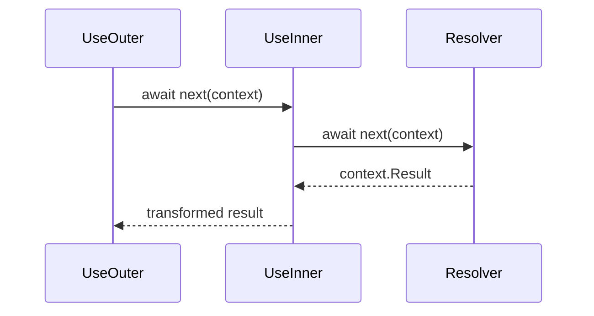

Field middleware is reusable logic that wraps one GraphQL field resolver. Use it when the same field execution behavior should apply to many fields, such as transforming a result, measuring resolver time, normalizing arguments, or enforcing a field-specific rule.

A resolver produces the field value. Field middleware runs around that resolver and can:

- run code before the resolver,
- call the next middleware or resolver,
- inspect or replace the result after the resolver,
- report field errors,
- stop the field pipeline and provide a result itself.

Use request middleware for whole-operation behavior, transport concerns, document preparation, or execution-wide policies. Keep field-specific data fetching and business rules in resolvers.

# Understand the field pipeline

Hot Chocolate builds a pipeline for each field. The public delegates are:

```csharp
public delegate FieldDelegate FieldMiddleware(FieldDelegate next);

public delegate ValueTask FieldDelegate(IMiddlewareContext context);
```

Each middleware receives the next field delegate. The resolver is the final step in the pipeline unless an earlier middleware provides a result or skips the rest of the chain.



Declaration order and result flow are different. Middleware is invoked in declaration order, then the result flows back in reverse order.

This is why data middleware is declared in this order:

```csharp
descriptor
    .Field(t => t.GetProducts(default!))
    .UsePaging()
    .UseProjection()
    .UseFiltering()
    .UseSorting()
    .Resolve(context => context.Service<CatalogContext>().Products);
```

The resolver result reaches sorting, filtering, projection, and paging as it returns through the pipeline. The same rule applies to attributes:

```csharp
[UsePaging]
[UseProjection]
[UseFiltering]
[UseSorting]
public static IQueryable<Product> GetProducts(CatalogContext db)
{
    return db.Products;
}
```

# Add middleware to one field

Use `IObjectFieldDescriptor.Use(...)` when one field needs custom middleware.

```csharp
using HotChocolate.Resolvers;
using HotChocolate.Types;

public sealed class QueryType : ObjectType
{
    protected override void Configure(IObjectTypeDescriptor descriptor)
    {
        descriptor
            .Field("brandName")
            .Type<NonNullType<StringType>>()
            .Use(next => async context =>
            {
                await next(context);

                if (context.Result is string value)
                {
                    context.Result = value.ToUpperInvariant();
                }
            })
            .Resolve(_ => "ChilliCream");
    }
}
```

The middleware reads `context.Result` after `await next(context)` because the resolver and any later middleware have finished at that point.

Expected result:

```graphql
{
  brandName
}
```

```json
{
  "data": {
    "brandName": "CHILLICREAM"
  }
}
```

# Reuse middleware with a descriptor extension

Wrap reusable middleware in an extension method. Prefix the method with `Use` to signal that it adds middleware to the field pipeline.

```csharp
using HotChocolate.Types;

public static class ToUpperObjectFieldDescriptorExtensions
{
    public static IObjectFieldDescriptor UseToUpper(
        this IObjectFieldDescriptor descriptor)
    {
        return descriptor.Use(next => async context =>
        {
            await next(context);

            if (context.Result is string value)
            {
                context.Result = value.ToUpperInvariant();
            }
        });
    }
}
```

Use the extension on any code-first field:

```csharp
public sealed class QueryType : ObjectType
{
    protected override void Configure(IObjectTypeDescriptor descriptor)
    {
        descriptor
            .Field("brandName")
            .Type<NonNullType<StringType>>()
            .UseToUpper()
            .Resolve(_ => "ChilliCream");
    }
}
```

# Add class-based middleware

Use a class when the middleware has more than a few lines, needs constructor configuration, or should be tested in isolation.

```csharp
using HotChocolate.Resolvers;

public sealed class ToUpperMiddleware
{
    private readonly FieldDelegate _next;

    public ToUpperMiddleware(FieldDelegate next)
    {
        _next = next;
    }

    public async ValueTask InvokeAsync(IMiddlewareContext context)
    {
        await _next(context);

        if (context.Result is string value)
        {
            context.Result = value.ToUpperInvariant();
        }
    }
}
```

Register it with `Use<TMiddleware>()`:

```csharp
descriptor
    .Field("brandName")
    .Use<ToUpperMiddleware>()
    .Resolve(_ => "ChilliCream");
```

A class middleware method must be named `Invoke` or `InvokeAsync`. It can return `ValueTask` or `Task`.

Class middleware instances are created for the compiled field pipeline and can be reused. Do not store per-request or per-field mutable state on the middleware instance. Keep instance state immutable or thread-safe.

For services that are scoped to execution, use method injection or `context.Service<T>()` inside `InvokeAsync`:

```csharp
public sealed class AuditFieldMiddleware
{
    private readonly FieldDelegate _next;

    public AuditFieldMiddleware(FieldDelegate next)
    {
        _next = next;
    }

    public async ValueTask InvokeAsync(
        IMiddlewareContext context,
        FieldAuditLog auditLog)
    {
        await auditLog.StartAsync(context.Path, context.RequestAborted);
        await _next(context);
        await auditLog.StopAsync(context.Path, context.RequestAborted);
    }
}
```

If a field needs a configuration value, use the factory overload:

```csharp
descriptor
    .Field("brandName")
    .Use((services, next) =>
        new PrefixMiddleware(next, "public", services.GetRequiredService<ILogger<PrefixMiddleware>>()));
```

# Apply middleware with an attribute

Implementation-first schemas usually apply reusable field middleware through descriptor attributes. The attribute configures the same descriptor APIs used by code-first types.

```csharp
using System.Reflection;
using System.Runtime.CompilerServices;
using HotChocolate.Types;
using HotChocolate.Types.Descriptors;

public sealed class UseToUpperAttribute : ObjectFieldDescriptorAttribute
{
    public UseToUpperAttribute([CallerLineNumber] int order = 0)
    {
        Order = order;
    }

    protected override void OnConfigure(
        IDescriptorContext context,
        IObjectFieldDescriptor descriptor,
        MemberInfo? member)
    {
        descriptor.UseToUpper();
    }
}
```

Apply the attribute to a resolver or property:

```csharp
[QueryType]
public static partial class BrandQueries
{
    [UseToUpper]
    public static string GetBrandName()
    {
        return "ChilliCream";
    }
}
```

C# does not guarantee attribute order by source location. Hot Chocolate descriptor attributes use the `Order` property. The `[CallerLineNumber]` pattern above keeps middleware attributes in the order you write them. If you derive from a middleware attribute, keep the `order` parameter and assign `Order`.

# Use the middleware context

`IMiddlewareContext` extends `IResolverContext`, so middleware can use the same runtime data that resolvers use.

| Need           | API                                                                                      |
| -------------- | ---------------------------------------------------------------------------------------- |
| Parent value   | `Parent<T>()`                                                                            |
| Arguments      | `ArgumentValue<T>()`, `ArgumentOptional<T>()`                                            |
| Services       | `Service<T>()`, `Services`, `RequestServices`                                            |
| Cancellation   | `RequestAborted`                                                                         |
| Field identity | `Path`, `ResponseName`, `Selection`                                                      |
| Result         | `Result`, `IsResultModified`, `ValueType`                                                |
| Errors         | `ReportError(...)`, `HasErrors`                                                          |
| State          | `SetLocalState(...)`, `GetLocalState<T>()`, `SetScopedState(...)`, `GetScopedState<T>()` |

Use `RequestAborted` for I/O work:

```csharp
public async ValueTask InvokeAsync(IMiddlewareContext context, PriceService prices)
{
    await prices.WarmCacheAsync(context.RequestAborted);
    await _next(context);
}
```

# Work with results safely

Read or replace `context.Result` after `await next(context)` for result transformations:

```csharp
return descriptor.Use(next => async context =>
{
    await next(context);

    if (context.Result is Product product && product.IsDiscontinued)
    {
        context.Result = null;
    }
});
```

To stop the pipeline, set a result and do not call `next(context)`:

```csharp
return descriptor.Use(next => context =>
{
    if (!context.ArgumentValue<bool>("includePrivate"))
    {
        context.Result = Array.Empty<Product>();
        return default;
    }

    return next(context);
});
```

When middleware does not call `next(context)`, later middleware and the resolver do not run for that field. This can bypass authorization, data middleware, instrumentation, or result formatting that would have appeared later in the pipeline.

If middleware sets `context.Result` before calling `next(context)`, later middleware still runs, but the default resolver middleware sees `IsResultModified` and does not invoke the resolver. Use that pattern only when you intentionally provide the resolver result early.

# Report field errors

Use `ReportError` for non-terminating field errors when you still want Hot Chocolate to continue completing the response.

```csharp
return descriptor.Use(next => context =>
{
    var id = context.ArgumentValue<int>("id");

    if (id <= 0)
    {
        context.ReportError(
            ErrorBuilder.New()
                .SetMessage("The product id must be greater than zero.")
                .SetCode("PRODUCT_ID_INVALID")
                .SetPath(context.Path)
                .Build());

        context.Result = null;
        return default;
    }

    return next(context);
});
```

Throw `GraphQLException` when the middleware cannot continue. Use error filters for global error formatting rather than field middleware.

# Share state with later middleware or child fields

Use local state for data that belongs to the current field pipeline. It is available to later middleware and the resolver for the same field.

```csharp
return descriptor.Use(next => async context =>
{
    var originalName = context.ArgumentValue<string>("name");
    context.SetLocalState("originalName", originalName);

    await next(context);

    var storedName = context.GetLocalState<string>("originalName");
});
```

Use scoped state for data that should flow to child selections.

```csharp
return descriptor.Use(next => async context =>
{
    context.SetScopedState("tenantId", context.ArgumentValue<string>("tenantId"));
    await next(context);
});
```

Prefer services for shared application state. Do not use field context data as a mutable request-global store.

# Combine custom and built-in middleware

Many Hot Chocolate features are field middleware or add field middleware during schema creation:

- Paging: `[UsePaging]` and `.UsePaging()`.
- Projections: `[UseProjection]` and `.UseProjection()`.
- Filtering: `[UseFiltering]` and `.UseFiltering()`.
- Sorting: `[UseSorting]` and `.UseSorting()`.
- Single-item projection helpers: `[UseFirstOrDefault]`, `[UseSingleOrDefault]`, `.UseFirstOrDefault()`, and `.UseSingleOrDefault()`.
- Authorization: `[Authorize]` and `.Authorize(...)`.

Keep the common data middleware order:

```csharp
[UsePaging]
[UseProjection]
[UseFiltering]
[UseSorting]
public static IQueryable<Product> GetProducts(CatalogContext db)
{
    return db.Products;
}
```

For single-item helpers, place `UseFirstOrDefault` or `UseSingleOrDefault` before projection, filtering, and sorting, following the projection examples.

Place custom middleware by intent:

- Put argument normalization or early blocking before data middleware.
- Put final result transformation outside the middleware that should produce the value you want to transform.
- Avoid placing custom middleware between paging, projection, filtering, and sorting unless you have tested that interaction.

Hot Chocolate v16 validates the known data middleware pipeline by default through `SchemaOptions.ValidatePipelineOrder`. It detects duplicate known data middleware and invalid order for `UseDbContext`, `UsePaging`, `UseProjection`, `UseFiltering`, and `UseSorting`.

Authorization can run before or after the resolver depending on `ApplyPolicy`. Unauthorized fields usually complete as `null` and include GraphQL errors. Configure GraphQL authorization with Hot Chocolate authorization APIs, not ASP.NET Core MVC attributes on GraphQL fields.

# Follow async and performance guidelines

Field middleware runs for every selected field instance. Keep it small and allocation-aware.

- Await `next(context)` once unless you are intentionally short-circuiting.
- Do not block on asynchronous work with `.Result` or `.Wait()`.
- Pass `context.RequestAborted` to I/O APIs.
- Avoid reflection, repeated service lookups, and per-result allocations in hot paths.
- Keep delegate captures small.
- Keep class middleware stateless or thread-safe.
- Use built-in data middleware to shape `IQueryable<T>` or provider-specific executable values instead of materializing collections in custom middleware.

# Troubleshoot field middleware

## My resolver does not run

A previous middleware may have skipped `next(context)`. A previous middleware may also have assigned `context.Result` before calling `next(context)`, which marks the result as modified and causes the default resolver step to skip the resolver.

## My result transformation does not run

Check whether an earlier middleware short-circuited the pipeline. Also verify that your transformation runs after `await next(context)`.

## Paging, projections, filtering, or sorting behave incorrectly

Use the documented order: `UsePaging`, `UseProjection`, `UseFiltering`, `UseSorting`. Check for duplicate data middleware on the same field and read any `ValidatePipelineOrder` schema errors.

## My attribute middleware runs in a surprising order

Use the `[CallerLineNumber] int order = 0` constructor pattern and assign `Order`. Avoid hiding the `order` argument in derived middleware attributes.

## Authorization is not working

Use `HotChocolate.Authorization.AuthorizeAttribute` or `.Authorize(...)`. Ensure the schema registers authorization and the ASP.NET Core pipeline authenticates requests before GraphQL executes.

## Errors look different than expected

Use `ReportError` for non-terminating field errors. Throw `GraphQLException` for execution failures that should be surfaced as GraphQL errors. Use error filters for global formatting.

# Choose the right extension point

| Task                                                    | Use                               |
| ------------------------------------------------------- | --------------------------------- |
| Produce a field value from domain data                  | Resolver                          |
| Reuse behavior around selected fields                   | Field middleware                  |
| Package field middleware for code-first types           | Descriptor extension              |
| Package field middleware for implementation-first types | Descriptor attribute              |
| Block or enrich an entire operation request             | Request middleware or interceptor |
| Format errors globally                                  | Error filter                      |
| Avoid N+1 data access                                   | DataLoader or batch resolver      |

# Next steps

- Review resolver signatures for arguments, services, parent values, cancellation, and result shapes.
- Review the execution pipeline to decide between request middleware and field middleware.
- Review pagination, projections, filtering, and sorting before combining data middleware.
- Review authorization and error handling before reporting or transforming field errors.
