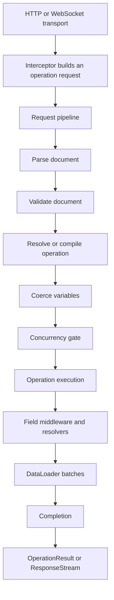

Hot Chocolate v16 turns a GraphQL operation into a result through two nested pipelines:

- the **request pipeline**, which runs once for an operation request, and
- the **field pipeline**, which runs for every selected field during operation execution.

Use this page to trace a request, choose the right extension point, and know where to go when execution behavior is unexpected.



The diagram is a map of the boundaries. The executor can interleave resolver work, waiting, batching, completion, incremental delivery, and subscription events.

# Follow one request

This page uses one products and brands query:

```graphql
query GetProducts($first: Int!) {
  products(first: $first) {
    nodes {
      name
      brand {
        name
      }
    }
  }
}
```

A request for this operation moves through these stages:

1. The HTTP or WebSocket transport reads the protocol message.
2. An interceptor can add headers, claims, tenant data, request services, or global state while building the operation request.
3. Request middleware checks the document cache or parses source text.
4. Validation checks the document against the schema.
5. The operation cache returns a prepared operation, or Hot Chocolate compiles the validated document into executable selection data.
6. Variables are coerced against the selected operation.
7. The concurrency gate controls active executions for the schema.
8. Operation execution enqueues resolver work.
9. Field middleware wraps each selected field resolver.
10. DataLoaders collect keys and dispatch batches while resolver work is waiting.
11. Completion assembles values and errors into an `OperationResult`. Incremental operations and subscriptions can return a `ResponseStream`.

Keep this rule in mind: if your code runs once for the operation, think request pipeline. If it runs for a selected field, think field pipeline. If it adapts an HTTP or WebSocket message before execution, think interceptor.

# Keep the execution layers separate

## Transport and interceptors

The transport owns protocol work such as HTTP method handling, content negotiation, WebSocket messages, request body parsing, batching envelopes, and response serialization.

Use interceptors for work that depends on the network request but should be available to execution:

```csharp
using HotChocolate;
using HotChocolate.AspNetCore;
using HotChocolate.Execution;
using Microsoft.AspNetCore.Http;

public static class GraphQLStateKeys
{
    public const string TenantId = "TenantId";
}

public sealed class TenantHttpRequestInterceptor : DefaultHttpRequestInterceptor
{
    public override async ValueTask OnCreateAsync(
        HttpContext context,
        IRequestExecutor requestExecutor,
        OperationRequestBuilder requestBuilder,
        CancellationToken cancellationToken)
    {
        await base.OnCreateAsync(
            context,
            requestExecutor,
            requestBuilder,
            cancellationToken);

        var tenantId = context.Request.Headers["X-Tenant-Id"]
            .FirstOrDefault();

        if (string.IsNullOrWhiteSpace(tenantId))
        {
            throw new GraphQLException(
                ErrorBuilder.New()
                    .SetMessage("The X-Tenant-Id header is required.")
                    .SetCode("TENANT_REQUIRED")
                    .Build());
        }

        requestBuilder.SetGlobalState(GraphQLStateKeys.TenantId, tenantId);
    }
}
```

Register the interceptor with the GraphQL server:

```csharp
builder
    .AddGraphQL()
    .AddTypes()
    .AddHttpRequestInterceptor<TenantHttpRequestInterceptor>();
```

Resolvers can read that value through global state APIs instead of depending on HTTP APIs.

## Request pipeline

The request pipeline runs once per operation request and passes a `RequestContext` through request middleware. It owns parsing, validation, operation lookup, operation compilation, variable coercion, timeout handling, exception handling, concurrency gating, and operation execution.

Request middleware can call the next delegate, inspect state after it returns, or short-circuit by setting `context.Result` and returning.

```csharp
using HotChocolate.Execution;

builder
    .AddGraphQL()
    .UseRequest(
        middleware: next => async context =>
        {
            context.RequestAborted.ThrowIfCancellationRequested();

            await next(context);
        },
        key: "Contoso.GraphQL.AfterValidation",
        after: WellKnownRequestMiddleware.DocumentValidationMiddleware);
```

Use request middleware for behavior that wraps the whole operation. Do not use it for per-field transformations.

## Field pipeline

The field pipeline runs for each selected field. Field middleware receives an `IMiddlewareContext`, runs before or after `await next(context)`, can report field errors, can set `context.Result`, and can stop the rest of the field pipeline by not calling `next`.

```csharp
using HotChocolate.Types;

public static class ObjectFieldDescriptorExtensions
{
    public static IObjectFieldDescriptor UseToUpper(
        this IObjectFieldDescriptor descriptor)
    {
        return descriptor.Use(next => async context =>
        {
            await next(context);

            if (context.Result is string value)
            {
                context.Result = value.ToUpperInvariant();
            }
        });
    }
}
```

Apply it to a field:

```csharp
public sealed class QueryType : ObjectType
{
    protected override void Configure(IObjectTypeDescriptor descriptor)
    {
        descriptor
            .Field("brandName")
            .Type<NonNullType<StringType>>()
            .UseToUpper()
            .Resolve(_ => "ChilliCream");
    }
}
```

Query:

```graphql
{
  brandName
}
```

Result:

```json
{
  "data": {
    "brandName": "CHILLICREAM"
  }
}
```

# Read the default v16 request pipeline

Hot Chocolate adds this core request pipeline when you do not replace it.

| Order | Middleware key                                                   | Responsibility                                                                   |
| ----- | ---------------------------------------------------------------- | -------------------------------------------------------------------------------- |
| 1     | `WellKnownRequestMiddleware.InstrumentationMiddleware`           | Opens request diagnostic scopes and events.                                      |
| 2     | `WellKnownRequestMiddleware.ExceptionMiddleware`                 | Converts uncaught request exceptions inside its scope to GraphQL error results.  |
| 3     | `WellKnownRequestMiddleware.TimeoutMiddleware`                   | Applies request timeout and cancellation behavior.                               |
| 4     | `WellKnownRequestMiddleware.DocumentCacheMiddleware`             | Reuses parsed documents when possible.                                           |
| 5     | `WellKnownRequestMiddleware.DocumentParserMiddleware`            | Parses source text or accepts a parsed document, then records document metadata. |
| 6     | `WellKnownRequestMiddleware.DocumentValidationMiddleware`        | Validates the document against the schema and request features.                  |
| 7     | `WellKnownRequestMiddleware.OperationCacheMiddleware`            | Reuses prepared operations and coalesces identical in-flight compilations.       |
| 8     | `WellKnownRequestMiddleware.OperationResolverMiddleware`         | Selects the requested operation and compiles it on cache miss.                   |
| 9     | `WellKnownRequestMiddleware.SkipWarmupExecutionMiddleware`       | Stops warmup requests before resolver execution.                                 |
| 10    | `WellKnownRequestMiddleware.OperationVariableCoercionMiddleware` | Coerces operation variable values.                                               |
| 11    | `WellKnownRequestMiddleware.ConcurrencyGateMiddleware`           | Limits concurrent operation execution for the schema.                            |
| 12    | `WellKnownRequestMiddleware.OperationExecutionMiddleware`        | Executes queries, mutations, subscriptions, and variable batches.                |

Optional features add more middleware:

- Persisted operations and automatic persisted operations add document lookup and not-found behavior before parsing and validation.
- Authorization prepares before validation and authorizes after validation.
- Cost analysis runs after validation.
- Query cache and cache control features add cache-aware behavior after timeout.
- Fusion gateway planning uses separate keys for gateway execution.

For keyed insertion examples, see [Request middleware](/docs/hotchocolate/v16/build2/execution-engine/request-middleware) and [Well-known middleware keys](/docs/hotchocolate/v16/build2/execution-engine/well-known-middleware-keys).

# Know what `RequestContext` carries

`RequestContext` is the public request-scoped context type that flows through request middleware. It is not the resolver context.

| Property                | Use it for                                                                                                 |
| ----------------------- | ---------------------------------------------------------------------------------------------------------- |
| `Schema`                | Schema metadata for the current executor.                                                                  |
| `ExecutorVersion`       | Executor identity for diagnostics and caches.                                                              |
| `Request`               | The `IOperationRequest` created by the transport.                                                          |
| `RequestServices`       | Request-scoped dependency injection.                                                                       |
| `OperationDocumentInfo` | Parsed document, document id or hash, operation count, cache flags, persisted flags, and validation state. |
| `RequestAborted`        | Request cancellation. Pass it to asynchronous APIs.                                                        |
| `RequestIndex`          | The operation index inside a batched operation request.                                                    |
| `VariableValues`        | Coerced variable collections after variable coercion.                                                      |
| `Result`                | The result assigned by request middleware or operation execution.                                          |
| `Features`              | Typed extension features for advanced integrations.                                                        |
| `ContextData`           | Request-pipeline state and global state for the operation.                                                 |

Use the right context API for the lifetime you need:

| API                            | Lifetime                                         | Use it for                                                                                       |
| ------------------------------ | ------------------------------------------------ | ------------------------------------------------------------------------------------------------ |
| `RequestContext`               | One operation request item                       | Request middleware, request diagnostics, enrichers, and execution integrations.                  |
| `IResolverContext`             | One field resolver invocation                    | Arguments, parent value, selected field, resolver services, resolver errors, and resolver state. |
| `HttpContext`                  | One ASP.NET Core request or WebSocket connection | HTTP headers, cookies, endpoint data, and response metadata.                                     |
| `IExecutionResult.ContextData` | Result lifetime                                  | Server-side result metadata and cleanup coordination.                                            |

Most resolver code should not use `RequestContext`. Add request facts through interceptors or request builders, then read them in resolvers through global state, resolver parameters, or `IResolverContext`.

# Separate operation compilation from resolver compilation

Two compilation steps have similar names but different lifetimes.

| Concept               | When it happens                      | What it produces                                | Why you care                                                                                                                              |
| --------------------- | ------------------------------------ | ----------------------------------------------- | ----------------------------------------------------------------------------------------------------------------------------------------- |
| Resolver compilation  | Schema and type initialization       | Optimized field delegates and parameter binding | Explains C# resolver signatures, service injection, `[Parent]`, `CancellationToken`, `IResolverContext`, and generated DataLoaders.       |
| Operation compilation | Request time on operation-cache miss | Executable operation and selection sets         | Explains the validation-to-execution handoff, fragment handling, selection collection, include or skip pruning, and operation optimizers. |

Changing request middleware does not change how resolver parameters bind. Resolver compiler customization does not change document parsing, operation caching, or operation planning. For resolver authoring details, see [Resolver compiler](/docs/hotchocolate/v16/build2/execution-engine/resolver-compiler).

# Understand operation execution

After variables are coerced and the concurrency gate admits the request, operation execution creates an operation context and starts resolver work.

```text
root query task: products
  -> product nodes are available
  -> child field tasks: name, brand
  -> brand resolvers call DataLoader.LoadAsync
  -> scheduler waits, DataLoader dispatches
  -> brand resolver tasks resume
  -> completion writes values and errors
```

Important execution rules:

- Root query fields can run concurrently.
- Top-level mutation fields run serially. Child fields follow normal execution rules after each mutation step produces data.
- Subscriptions produce event streams.
- Incremental delivery can return a `ResponseStream` instead of one final `OperationResult`.
- Variable batch requests can share scheduling so DataLoader batching remains effective across variable sets.
- The scheduler coordinates resolver tasks, completion, and DataLoader dispatch. Do not depend on a specific thread, exact task order, batch age, or lock behavior.

# Place DataLoader batching in the flow

DataLoader is the bridge between resolver scheduling and efficient keyed data access.

```csharp
[ObjectType<Product>]
public static partial class ProductNode
{
    public static Task<Brand> GetBrandAsync(
        [Parent] Product product,
        IBrandByIdDataLoader brandById,
        CancellationToken cancellationToken)
        => brandById.LoadAsync(product.BrandId, cancellationToken);
}
```

When the example query asks for `brand` on five products, the execution engine can run those child resolvers in the same execution wave:

```text
Product.brand resolver keys: [1, 2, 1, 3, 2]
DataLoader dispatch keys:    [1, 2, 3]
Repeated keys resume from the request-scoped DataLoader cache.
```

The placement is:

1. A resolver calls `LoadAsync(key)`.
2. The DataLoader queues the key in the current request scope and returns a task.
3. Resolver work that awaits that task pauses.
4. When resolver work is waiting and batches are pending, the scheduler signals batch dispatch.
5. Batch results complete DataLoader tasks and resolver work resumes.

For DataLoader definitions and source generation, see [DataLoader](/docs/hotchocolate/v16/resolvers-and-data/dataloader).

# Handle errors, cancellation, and completion

Different failures stop at different layers:

| Failure                      | Where it occurs                              | Result behavior                                                                                                          |
| ---------------------------- | -------------------------------------------- | ------------------------------------------------------------------------------------------------------------------------ |
| Syntax error                 | Document parsing                             | Execution stops and the response contains errors.                                                                        |
| Validation error             | Document validation                          | Resolver execution does not start.                                                                                       |
| Variable coercion error      | Variable coercion                            | Operation execution does not start.                                                                                      |
| Request exception            | Request middleware inside exception handling | Exception middleware converts it to a GraphQL error result when it is in scope.                                          |
| Authorization or cost denial | Optional request middleware                  | Middleware can short-circuit with an error result before operation execution.                                            |
| Resolver error               | Field execution                              | The response can contain partial `data`, top-level `errors`, and null propagation according to GraphQL type nullability. |
| Domain error                 | Resolver or mutation model                   | Prefer schema result types or mutation conventions when the error is part of normal domain flow.                         |

Cancellation flows through `RequestContext.RequestAborted` and resolver `CancellationToken` parameters. Pass the token to I/O APIs. Do not start background work that keeps `RequestContext` or `IResolverContext` after the request completes.

Completion runs after resolver work and DataLoader batches finish for the current result. It coerces CLR values to GraphQL response values, records field errors, applies null propagation, and builds the `OperationResult` or response stream.

For error APIs, see [Errors](/docs/hotchocolate/v16/api-reference/errors) and [Error handling](/docs/hotchocolate/v16/guides/error-handling).

# Observe execution safely

Diagnostics make the pipeline visible without changing control flow.

| Stage               | Diagnostic events to look for                                      |
| ------------------- | ------------------------------------------------------------------ |
| Whole request       | `ExecuteRequest`, `RequestError`                                   |
| Parse               | `ParseDocument`, `SyntaxError`                                     |
| Validate            | `ValidateDocument`, `ValidationErrors`                             |
| Cost                | `AnalyzeOperationComplexity` and cost result events                |
| Compile             | `CompileOperation`                                                 |
| Variables           | `CoerceVariables`                                                  |
| Operation execution | `ExecuteOperation`, `StartProcessing`, `StopProcessing`, `RunTask` |
| Resolver            | `ResolveFieldValue`, `ResolverError`                               |
| DataLoader          | `ExecuteBatch`, `BatchResults`, `BatchError`, `BatchItemError`     |
| Cache               | Document and operation cache hit or add events                     |

`ResolveFieldValue` is off by default because it runs for resolver work. Enable it with `EnableResolveFieldValue` only when the extra per-field signal is worth the overhead.

Diagnostic listeners run synchronously during execution. Keep handlers lightweight and send expensive work to a background queue. For production tracing, prefer OpenTelemetry through the server instrumentation features.

See [Instrumentation](/docs/hotchocolate/v16/server/instrumentation) and [Performance](/docs/hotchocolate/v16/guides/performance).

# Choose the right customization point

| Goal                                                                | Use                                                                     | Why                                                                       |
| ------------------------------------------------------------------- | ----------------------------------------------------------------------- | ------------------------------------------------------------------------- |
| Add headers, claims, tenant data, global state, or request services | HTTP or socket interceptor                                              | The transport request is still being converted into an operation request. |
| Run logic once around parse, validation, variables, or execution    | Request middleware                                                      | It wraps the whole operation and receives `RequestContext`.               |
| Wrap a resolver or transform one field result                       | Field middleware                                                        | It runs per selected field and receives `IMiddlewareContext`.             |
| Avoid N+1 keyed child lookups                                       | DataLoader or batch resolver                                            | It coordinates with the scheduler and request cache.                      |
| Observe timings and errors                                          | Diagnostic listener or OpenTelemetry                                    | Observation should not control execution flow.                            |
| Limit request time, depth, cost, or concurrency                     | Request options, request limits, cost analysis, or concurrency settings | Built-in features already integrate with the request pipeline.            |
| Cache or require persisted documents                                | Persisted operation features                                            | They alter document lookup before parsing and validation.                 |

Prefer feature APIs when they exist. Use well-known middleware keys for advanced ordering scenarios and reusable execution extensions.

# Troubleshoot by symptom

## My middleware runs in the wrong order

First decide whether it is request middleware or field middleware. Request middleware uses `before` and `after` anchors with a unique key and `WellKnownRequestMiddleware` constants. Field middleware runs in declaration order, and result flow returns in reverse order.

Data middleware order matters. Declare paging, projection, filtering, and sorting in that order when you combine them.

## Parsing or validation happens more often than expected

Check document cache, operation cache, persisted operation setup, automatic persisted operation behavior, operation names, and validation rules that make an operation non-cacheable.

## Resolvers run concurrently or more often than expected

Query sibling fields can run concurrently. Top-level mutation fields run serially. Child fields run after their parent value exists. Avoid mutable request state on resolver objects because resolver work can overlap.

## DataLoader is not batching

Verify that child resolvers use the same generated DataLoader or batch resolver abstraction. Do not call the data source directly per parent before the DataLoader has a chance to collect keys.

## Errors show as null fields

Field resolver errors can null the affected field and propagate through non-null parent fields. Use typed domain results when the client should handle expected business outcomes as data.

## Authorization or cost checks run before my custom middleware

Check request middleware anchors. Authorization prepares before validation and authorizes after validation. Cost analysis runs after validation.

## Instrumentation slowed down requests

Keep diagnostic handlers small. Avoid per-field `ResolveFieldValue` events unless you need that signal for a focused investigation.

## Warmup requests do not execute resolvers

`SkipWarmupExecutionMiddleware` stops warmup requests after preparation. Use warmup to prepare schema and operation caches, not to run application resolver side effects.

# Go deeper

- Trace every stage: [Execution pipeline](/docs/hotchocolate/v16/build2/execution-engine/pipeline)
- Add or position request middleware: [Request middleware](/docs/hotchocolate/v16/build2/execution-engine/request-middleware)
- Pass and inspect request-scoped state: [Request context](/docs/hotchocolate/v16/build2/execution-engine/request-context)
- Write selected-field behavior: [Field middleware](/docs/hotchocolate/v16/build2/execution-engine/field-middleware)
- Understand resolver delegates and parameter binding: [Resolver compiler](/docs/hotchocolate/v16/build2/execution-engine/resolver-compiler)
- Use advanced ordering constants: [Well-known middleware keys](/docs/hotchocolate/v16/build2/execution-engine/well-known-middleware-keys)
- Avoid N+1 data access: [DataLoader](/docs/hotchocolate/v16/resolvers-and-data/dataloader)
- Tune execution: [Performance](/docs/hotchocolate/v16/guides/performance), [Request limits](/docs/hotchocolate/v16/securing-your-api/request-limits), and [Cost analysis](/docs/hotchocolate/v16/securing-your-api/cost-analysis)
