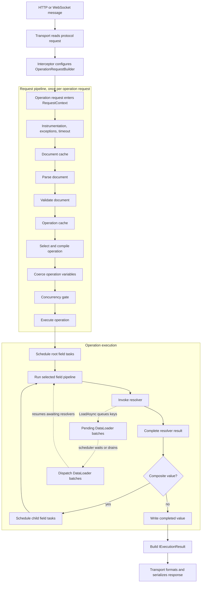
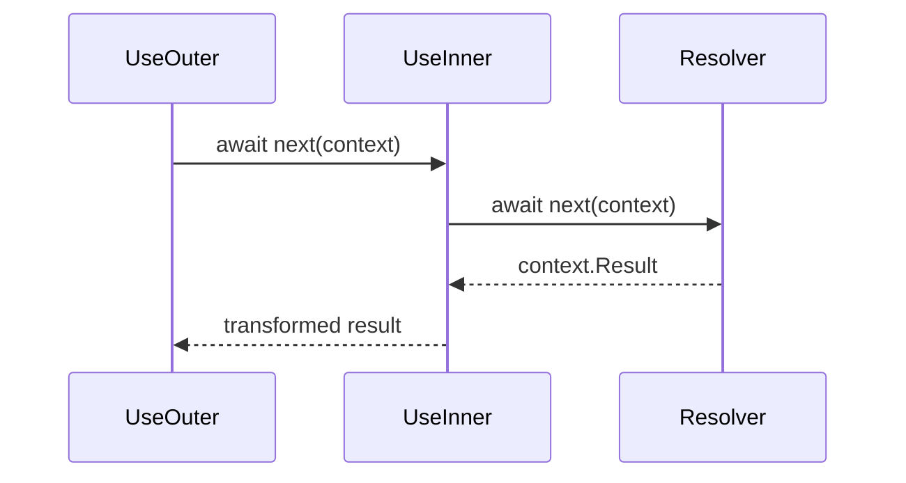

Hot Chocolate executes a GraphQL request across three boundaries:

1. The transport reads an HTTP or WebSocket message and creates an operation request.
2. The request pipeline prepares the document, operation, variables, and execution context.
3. Operation execution runs field middleware, resolvers, DataLoaders, completion, and error collection until it can return an execution result.

This page follows one request through those boundaries so you can decide where your code should integrate.

# The short version

Use this query as the running example:

```graphql
query GetProducts($first: Int!) {
  products(first: $first) {
    nodes {
      name
      brand {
        name
      }
    }
  }
}
```

The request moves through these stages:

1. The HTTP or WebSocket transport reads the protocol message.
2. An interceptor configures an `OperationRequestBuilder`.
3. The request enters the execution engine as an `IOperationRequest` on `RequestContext`.
4. Request middleware retrieves or parses the GraphQL document.
5. Request middleware validates the document.
6. Request middleware selects the named operation and gets a compiled operation from cache or compilation.
7. Request middleware coerces operation variables.
8. Operation execution schedules root field tasks.
9. Each selected field runs its field middleware and resolver pipeline.
10. Resolvers can queue DataLoader keys. The scheduler dispatches pending batches when current work drains or when it waits.
11. Values are completed according to GraphQL types, child fields are scheduled for composite values, and errors are collected.
12. The execution engine returns an `IExecutionResult` to the transport.
13. The transport formats and serializes the response.



The diagram is a teaching map. The scheduler may interleave parallel work, serial work, waiting, deferred work, and batching. Use the map to identify boundaries, not to infer exact task ordering.

# Understand the transport boundary

The transport owns protocol work. For HTTP, that includes method handling, content type checks, body parsing, `Accept` negotiation, batching envelopes, status codes, and response writing. For WebSocket, that includes socket messages and session behavior.

Before execution begins, interceptors can adapt the request:

- Read headers, claims, tenant values, files, and request services.
- Configure `OperationRequestBuilder`.
- Add global state or features that resolvers and middleware can read.
- Inspect or replace results in result interceptor hooks.

Execution begins when an `IOperationRequest` is assigned to `RequestContext.Request` and enters the request pipeline. Serialization happens later, after the execution engine has produced an `IExecutionResult`.

# Follow the default request pipeline

The public `RequestContext` type carries request state through request middleware. It includes the schema, operation request, request services, cancellation token, context data, features, document metadata, coerced variables, and result.

The default core request pipeline runs in this order:

| Order | Middleware                            | What it does                                                            | What can stop later stages                                   |
| ----- | ------------------------------------- | ----------------------------------------------------------------------- | ------------------------------------------------------------ |
| 1     | `InstrumentationMiddleware`           | Raises execution diagnostic events around the request.                  | Diagnostic code can throw, so keep handlers safe and fast.   |
| 2     | `ExceptionMiddleware`                 | Converts uncaught exceptions inside its scope to GraphQL error results. | An exception becomes an error result.                        |
| 3     | `TimeoutMiddleware`                   | Links request cancellation with execution timeout settings.             | A timeout can produce a request timeout result.              |
| 4     | `DocumentCacheMiddleware`             | Looks up a parsed document by id or hash.                               | A cache hit can skip parsing work.                           |
| 5     | `DocumentParserMiddleware`            | Parses source text or accepts a pre-parsed document.                    | Syntax errors produce GraphQL errors.                        |
| 6     | `DocumentValidationMiddleware`        | Validates the executable document against the schema.                   | Validation errors stop resolver execution.                   |
| 7     | `OperationCacheMiddleware`            | Looks up a prepared operation.                                          | A cache hit can skip compilation work.                       |
| 8     | `OperationResolverMiddleware`         | Selects the named operation and compiles executable selection data.     | Missing or ambiguous operation names stop execution.         |
| 9     | `SkipWarmupExecutionMiddleware`       | Stops warmup requests after preparation.                                | Warmup requests do not execute resolvers.                    |
| 10    | `OperationVariableCoercionMiddleware` | Coerces request variable values for the selected operation.             | Missing or invalid variables stop execution.                 |
| 11    | `ConcurrencyGateMiddleware`           | Controls concurrent operation execution according to executor settings. | Requests may wait for capacity or observe cancellation.      |
| 12    | `OperationExecutionMiddleware`        | Executes queries, mutations, subscriptions, or variable batches.        | Operation kind and request type guards can reject execution. |

Configured features can add optional middleware. Persisted operations and automatic persisted operations add lookup and not-found behavior before parsing and validation. Authorization, cost analysis, query cache, and Fusion planning are feature-specific branches, not part of the core default list.

## Document cache and parsing

A request can enter with source text, a document id or hash, or a pre-parsed operation document. The document cache can provide parsed document metadata. If the parser runs, it records document metadata in `OperationDocumentInfo`:

| Property         | Meaning                                                     |
| ---------------- | ----------------------------------------------------------- |
| `Document`       | The parsed GraphQL document.                                |
| `Id`             | The document identifier.                                    |
| `Hash`           | The document hash.                                          |
| `OperationCount` | The number of operation definitions.                        |
| `IsCached`       | Whether the document came from the document cache.          |
| `IsPersisted`    | Whether the document came from persisted operation storage. |
| `IsValidated`    | Whether validation is already known to have succeeded.      |

Syntax errors produce GraphQL errors and the request does not reach validation or resolvers.

## Validation

Validation checks the parsed executable document against the schema. For the example query, validation confirms that `products`, `nodes`, `name`, and `brand` exist, that selections are legal, and that `$first` can be used for the `first` argument.

Validation errors produce an operation result with errors. Resolver methods do not run.

## Operation selection and compilation

After validation, Hot Chocolate selects which operation definition to run. If a document contains more than one operation, the request must provide an operation name. For the example, `GetProducts` is selected.

The operation cache can reuse prepared operation data. If the cache does not contain the operation, compilation creates executable operation and selection data from the validated document.

Operation compilation is request preparation. It is separate from resolver compilation and schema setup.

## Variable coercion

Operation variables are coerced after operation selection because the selected operation defines the variable types. For the example query, `$first` must be present and coercible to `Int!`.

Invalid variables stop before operation execution. Field argument values that contain variables can still be coerced while a resolver task executes, because argument coercion belongs to the selected field context.

## Operation execution

Operation execution receives the compiled operation, coerced variables, request services, root values, cancellation token, and DataLoader batch dispatcher. It checks the operation kind and request type, then routes work:

- Queries and mutations use query execution infrastructure.
- Subscriptions use subscription execution infrastructure.
- Variable batching can execute multiple variable sets and return a batch result.
- Response streams are returned for streaming cases when configured by the operation and transport.

Operation execution owns the scheduler that runs resolver tasks and coordinates DataLoader dispatch.

# Run selected fields

Operation execution schedules root field tasks. Each selected field has a resolver pipeline:

1. Field middleware runs in declaration order before the resolver.
2. The resolver returns or assigns a result through `IMiddlewareContext.Result`.
3. Result processing flows back through middleware in reverse order.
4. Completion converts the result into GraphQL response data.
5. Composite values schedule child field tasks.



This order matters for built-in data middleware. For example, declare paging before filtering when you want filtering to process the resolver result before paging shapes the connection.

```csharp
descriptor
    .Field(t => t.GetProducts(default!, default!))
    .UsePaging()
    .UseFiltering()
    .Resolve(context =>
    {
        return context.Service<CatalogContext>().Products;
    });
```

## Add field middleware for selected-field behavior

Use field middleware when you need logic around selected fields, resolver execution, or field results.

```csharp
public static class ObjectFieldDescriptorExtensions
{
    public static IObjectFieldDescriptor UseFieldTiming(
        this IObjectFieldDescriptor descriptor)
    {
        return descriptor.Use(next => async context =>
        {
            var start = Stopwatch.GetTimestamp();

            await next(context);

            var elapsed = Stopwatch.GetElapsedTime(start);
            context.ScopedContextData = context.ScopedContextData.SetItem(
                "fieldTiming",
                elapsed);
        });
    }
}
```

Apply it to the fields that need this behavior:

```csharp
public sealed class ProductType : ObjectType<Product>
{
    protected override void Configure(IObjectTypeDescriptor<Product> descriptor)
    {
        descriptor
            .Field(t => t.Name)
            .UseFieldTiming();
    }
}
```

Use request middleware instead when your code needs to run once for the whole operation request.

# Coordinate resolvers and DataLoaders

Resolvers can be property resolvers, method resolvers, delegates, async methods, batch resolvers, generated resolvers, or field middleware that sets `context.Result`. A resolver can receive the parent value, arguments, services, request state, and cancellation token.

```csharp
[ObjectType<Product>]
public static partial class ProductNode
{
    public static async Task<Brand> GetBrandAsync(
        [Parent] Product product,
        IBrandByIdDataLoader brandById,
        CancellationToken ct)
    {
        return await brandById.LoadAsync(product.BrandId, ct);
    }
}
```

When several `brand` resolvers run for products in the same request, each resolver queues a key. The scheduler dispatches pending DataLoader batches when current work drains or when it must wait for pending work. Awaiting resolvers resume after the batch result is available.

```text
Wave 1: products resolver returns Product objects
Wave 2: brand resolvers call brandById.LoadAsync(product.BrandId)
Dispatch: scheduler sends one BrandById batch for pending brand ids
Resume: brand resolvers receive Brand objects and brand.name can complete
```

Use this wave model to reason about batching. It is not a guarantee of strict breadth-first execution. The scheduler can interleave work, wait for asynchronous tasks, run serial sections, and dispatch batches as needed.

DataLoader and batch resolver roles differ:

| Need                                               | Choose         | Why                                                                          |
| -------------------------------------------------- | -------------- | ---------------------------------------------------------------------------- |
| Reuse loaded data across fields in one request     | DataLoader     | It caches by key for the request and deduplicates keys.                      |
| Resolve one selected field for many parent objects | Batch resolver | Hot Chocolate collects parent objects for that field and calls one resolver. |

# Complete results and propagate nulls

Completion converts resolver output to GraphQL result data according to the field type:

- Scalars and enums are serialized as leaf values.
- Lists complete each item and enforce list nullability.
- Objects, interfaces, and unions resolve a runtime object shape and schedule child field tasks.
- Nullable fields can complete as `null`.
- Non-null fields that complete as `null` report an execution error.

Consider this schema shape:

```graphql
type Query {
  product(id: ID!): Product!
}

type Product {
  name: String!
  brand: Brand
}
```

If the `name` resolver throws or returns `null`, the `name: String!` field cannot be written as null. Hot Chocolate adds an error with a path such as `product.name`. Null then propagates to the nearest nullable boundary. In this schema, `product` is also non-null, so the response data may become `null` for the operation.

If `brand` is nullable and its resolver fails, the response can contain a partial result:

```json
{
  "data": {
    "product": {
      "name": "Coffee Grinder",
      "brand": null
    }
  },
  "errors": [
    {
      "message": "Could not load brand.",
      "path": ["product", "brand"]
    }
  ]
}
```

# Handle cancellation and errors

Cancellation flows from the transport through `RequestContext.RequestAborted`. Timeout middleware links that token with execution timeout settings. Resolvers and DataLoaders should accept `CancellationToken` and pass it to I/O APIs.

Errors can occur at different boundaries:

| Source                                | Where it happens                    | Do resolvers run?    | Result shape                                                                       |
| ------------------------------------- | ----------------------------------- | -------------------- | ---------------------------------------------------------------------------------- |
| HTTP content, body, or `Accept` error | Transport                           | No                   | Protocol-specific error response.                                                  |
| GraphQL syntax error                  | Document parser                     | No                   | GraphQL errors, no data.                                                           |
| Validation error                      | Document validation                 | No                   | GraphQL errors, no data.                                                           |
| Missing or ambiguous operation name   | Operation resolver                  | No                   | GraphQL errors, no data.                                                           |
| Invalid variables                     | Variable coercion                   | No                   | GraphQL errors, no data.                                                           |
| Request kind not allowed              | Operation execution guard           | No                   | GraphQL errors, no data.                                                           |
| Timeout or cancellation               | Timeout or execution                | Maybe                | Depends on timing and streaming behavior.                                          |
| Request middleware exception          | Request pipeline                    | Maybe                | Converted by exception middleware when inside its scope.                           |
| Resolver exception                    | Field execution                     | Other fields may run | Field error, field nulling, then null propagation.                                 |
| Resolver returns `IError`             | Field execution                     | Yes                  | Field error and null field result.                                                 |
| `IResolverContext.ReportError`        | Field execution                     | Yes                  | Non-terminating field error, field data can still be returned.                     |
| Field authorization failure           | Field execution or field middleware | Other fields may run | GraphQL errors and field nulling behavior depend on configuration and nullability. |

Endpoint authorization can reject a request before GraphQL execution. Request authorization middleware can reject an operation request. Field and type authorization run as part of field execution behavior.

# Choose the right extension point

| Task                                                        | Choose                                        | Why                                                                     |
| ----------------------------------------------------------- | --------------------------------------------- | ----------------------------------------------------------------------- |
| Read HTTP headers, user, tenant, files, or request services | Interceptor                                   | This data belongs to request creation before execution.                 |
| Add per-request global state                                | Interceptor or operation request builder      | The state travels with the operation request.                           |
| Block or enrich an operation before execution               | Request middleware                            | It runs once for the operation request.                                 |
| Run after validation but before execution                   | Keyed request middleware                      | You can anchor relative to validation, variable coercion, or execution. |
| Transform a selected field result                           | Field middleware                              | It wraps a field resolver and sees `IMiddlewareContext.Result`.         |
| Avoid N+1 across sibling resolvers                          | DataLoader                                    | It batches and caches by key in the request.                            |
| Batch one field across parent objects                       | Batch resolver                                | It is tied to one selected field.                                       |
| Measure timings, errors, cache hits, or DataLoader batches  | Diagnostics or OpenTelemetry                  | Observability should not control pipeline flow.                         |
| Change JSON formatting or HTTP status behavior              | Transport configuration or result interceptor | Serialization happens after execution.                                  |

# Insert request middleware at a stable point

Use `UseRequest` when your logic belongs to the whole operation request. Anchor it with `WellKnownRequestMiddleware` keys when ordering matters.

This tenant gate runs after parsing, validation, operation selection, and variable coercion, but before execution:

```csharp
builder
    .AddGraphQL()
    .UseRequest(
        middleware: next => async context =>
        {
            if (!context.ContextData.ContainsKey("tenantId"))
            {
                context.Result = OperationResult.FromError(
                    ErrorBuilder.New()
                        .SetMessage("A tenant is required.")
                        .SetCode("TENANT_REQUIRED")
                        .Build());
                return;
            }

            await next(context);
        },
        key: "TenantGate",
        before: WellKnownRequestMiddleware.OperationExecutionMiddleware);
```

Guidelines:

- Use stable keys from `WellKnownRequestMiddleware` for built-in anchors.
- Specify either `before` or `after`, not both.
- Provide your own key when you anchor custom middleware.
- Avoid long synchronous work in request middleware.
- Do not rely on optional middleware keys unless the feature that adds them is configured.

# Observe the pipeline

Register diagnostic listeners with `AddDiagnosticEventListener`:

```csharp
builder
    .AddGraphQL()
    .AddDiagnosticEventListener<MyExecutionEventListener>();

public sealed class MyExecutionEventListener : ExecutionDiagnosticEventListener
{
    public override IDisposable ExecuteRequest(RequestContext context)
    {
        return EmptyScope;
    }

    public override void ResolverError(IMiddlewareContext context, IError error)
    {
        var path = context.Path.ToString();
        // Send path and error code to your logging system.
    }
}
```

Useful event families include:

| Area                | Events to look for                                                                            |
| ------------------- | --------------------------------------------------------------------------------------------- |
| Transport           | `ExecuteHttpRequest`, `ParseHttpRequest`, `FormatHttpResponse`, WebSocket session events.     |
| Request preparation | `ExecuteRequest`, `ParseDocument`, `ValidateDocument`, `CompileOperation`, `CoerceVariables`. |
| Operation execution | `ExecuteOperation`, `StartProcessing`, `StopProcessing`, `RunTask`, `TaskError`.              |
| Field execution     | `ResolveFieldValue` when enabled, `ResolverError`.                                            |
| DataLoader          | `ExecuteBatch`, `BatchResults`, `BatchError`, `BatchItemError`.                               |

Diagnostic handlers run synchronously as part of request execution. Hand off expensive work to background infrastructure instead of doing it inline. `ResolveFieldValue` is disabled by default because per-field events add overhead.

# Consider performance implications

Pipeline placement affects performance:

- Prefer document caching, operation caching, persisted operations, and automatic persisted operations for repeated documents.
- Put policy checks as early as their inputs allow. For example, a header-only check belongs in an interceptor, while a selected-operation check belongs after operation selection.
- Keep request middleware, field middleware, and diagnostic handlers allocation-aware and asynchronous only when needed.
- Use DataLoader for repeated key-based data access during resolver fan-out.
- Pass cancellation tokens to database and network calls.
- Avoid blocking calls in resolvers. Blocking reduces scheduler throughput and delays DataLoader dispatch.
- Enable per-field diagnostic scopes only when you need that level of detail.

# Troubleshoot common pipeline surprises

## My resolver did not run

Check stages before operation execution: transport errors, syntax errors, validation errors, operation name errors, variable coercion errors, endpoint or request authorization, warmup requests, operation kind guards, and custom request middleware.

## My middleware runs too late

Confirm whether you wrote request middleware or field middleware. Request middleware runs once for the operation request. Field middleware runs per selected field. If request middleware ordering matters, anchor it with a `WellKnownRequestMiddleware` key.

## My field middleware order looks reversed

Invocation order and result flow move in opposite directions. Middleware declared first sees the request first, then sees the result last.

## My DataLoader did not batch

Confirm that the loads happen in the same GraphQL request, use the same DataLoader instance and options, and occur while the scheduler can collect pending keys. DataLoader caching is request-scoped.

## I got data and errors

That is valid GraphQL partial success. A field error can null that field while sibling fields still return data.

## One null removed a whole object

A non-null violation propagates to the nearest nullable boundary. If every parent field up to the root is non-null, the operation data can become `null`.

## My variable was valid, but a field argument failed

Operation variable coercion happens before execution. Field argument coercion happens in the context of the selected field and can fail later.

## My interceptor changes are missing

If you replace a default interceptor, call the base implementation when you want default behavior such as request services, claims, features, and files. Make sure you set state on the operation request that will be executed.

## My diagnostic listener changed behavior

Diagnostic listeners observe execution synchronously. Do not use them to control pipeline flow. Move control decisions into interceptors, request middleware, field middleware, or resolver code.

# Next steps

- Customize request creation with [interceptors](/docs/hotchocolate/v16/build2/server-configuration/interceptors) and [global state](/docs/hotchocolate/v16/build2/server-configuration/global-state).
- Customize selected fields with [field middleware](/docs/hotchocolate/v16/execution-engine/field-middleware).
- Write resolver methods with [resolver signatures](/docs/hotchocolate/v16/build2/resolvers/resolver-signature) and [resolver result handling](/docs/hotchocolate/v16/build2/resolvers/resolver-result-handling).
- Fetch related data with [DataLoader](/docs/hotchocolate/v16/build2/dataloader) and the [DataLoader attribute](/docs/hotchocolate/v16/build2/dataloader/dataloader-attribute).
- Configure protocol behavior with [HTTP transport](/docs/hotchocolate/v16/build2/server-configuration/http-transport), [WebSocket transport](/docs/hotchocolate/v16/build2/server-configuration/websocket-transport), and batching.
- Observe production behavior with [instrumentation](/docs/hotchocolate/v16/server/instrumentation) and OpenTelemetry.
- Review [errors](/docs/hotchocolate/v16/api-reference/errors), [error handling](/docs/hotchocolate/v16/guides/error-handling), and [lists and non-null](/docs/hotchocolate/v16/build2/schema-elements/lists-and-non-null) when you need precise error and null behavior.
