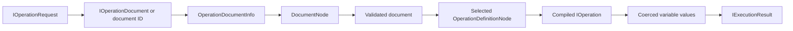

Hot Chocolate turns a GraphQL operation document into a compiled operation before any resolver runs. This page follows that handoff in v16 so you can place request middleware correctly, build executor requests in tests, understand persisted-operation behavior, and choose the correct API when you inspect execution state.

The page is about executable GraphQL operation documents. It is not about resolver-returned `IExecutable<T>`, which is the data-source abstraction used by filtering, sorting, projections, and integrations.

```graphql
query GetProduct($id: ID!) {
  product(id: $id) {
    name
  }
}
```

The same words appear in several execution APIs:

| Name                      | Represents                                                         | Main use                                       |
| ------------------------- | ------------------------------------------------------------------ | ---------------------------------------------- |
| `IOperationDocument`      | Request input that contains source text or a parsed `DocumentNode` | Send a document into the executor              |
| `DocumentNode`            | Parsed GraphQL syntax tree                                         | Inspect or visit the AST                       |
| `OperationDefinitionNode` | One query, mutation, or subscription definition in a document      | Select the operation by name                   |
| `IOperation`              | Schema-bound compiled operation                                    | Execute and inspect compiled selections        |
| `IExecutionResult`        | Result of execution                                                | Return data, errors, streams, or batches       |
| `IExecutable<T>`          | Resolver data-source abstraction                                   | Defer database query execution from a resolver |

# Mental model

Think of one request as a sequence of increasingly specific shapes:

1. Source text, parsed AST, or persisted operation document ID.
2. `IOperationRequest`, usually built by `OperationRequestBuilder`.
3. `OperationDocumentInfo`, the request-context metadata for the document.
4. `DocumentNode`, the parsed AST.
5. Validated document state.
6. Selected `OperationDefinitionNode`.
7. Compiled `IOperation`.
8. Coerced `IVariableValueCollection` values.
9. `IExecutionResult` output.



`DocumentNode` is syntax. It can contain operation definitions, fragments, directives, variables, and other parsed nodes. `IOperation` is the selected, validated, schema-bound, compiled representation used by the execution engine. Fragments and repeated fields are no longer separate syntax branches at that point, they have been compiled into selection sets that resolvers can execute.

# Build operation requests

Use `OperationRequestBuilder` when you call `IRequestExecutor` directly, write integration tests, or configure a request in an interceptor.

```csharp
using HotChocolate.Execution;

var request = OperationRequestBuilder.New()
    .SetDocument(
        """
        query GetProduct($id: ID!) {
          product(id: $id) {
            name
          }
        }
        """)
    .SetOperationName("GetProduct")
    .SetVariableValues(new Dictionary<string, object?>
    {
        ["id"] = "42"
    })
    .Build();

var result = await executor.ExecuteAsync(request);
```

`SetDocument(string)` stores source text as `OperationDocumentSourceText`. The parser middleware still needs to parse it.

When parser behavior is not part of the test, you can pass a parsed AST. The parser middleware reads the existing `DocumentNode` instead of parsing source text again.

```csharp
using HotChocolate.Execution;
using HotChocolate.Language;

var document = Utf8GraphQLParser.Parse(
    """
    query GetProduct($id: ID!) {
      product(id: $id) {
        name
      }
    }
    """);

var request = OperationRequestBuilder.New()
    .SetDocument(document)
    .SetOperationName("GetProduct")
    .SetVariableValues(new Dictionary<string, object?>
    {
        ["id"] = "42"
    })
    .Build();
```

For persisted-operation paths, create a request from the document ID. In common APQ and trusted-document setups, the ID is the document hash. Hot Chocolate still treats the ID and hash as separate values because storage keys and the configured hash provider can differ.

```csharp
using System.Text.Json;
using HotChocolate.Execution;
using HotChocolate.Language;

var request = OperationRequest.FromId(
    new OperationDocumentId("0c95d31ca29272475bf837f944f4e513"),
    operationName: "GetProduct",
    variableValues: JsonDocument.Parse("""{ "id": "42" }"""));
```

`OperationRequestBuilder.Build()` requires either a document or a non-empty `OperationDocumentId`. Object-shaped variables execute once. Array-shaped variables passed through the builder create a `VariableBatchRequest`; execution can return an `OperationResultBatch`.

# Pipeline state

Middleware placement determines which values are available. The default v16 server pipeline includes these document and operation phases in order.

| Stage                    | Built-in middleware or extension point                               | State produced or consumed                                                                                            |
| ------------------------ | -------------------------------------------------------------------- | --------------------------------------------------------------------------------------------------------------------- |
| Request created          | HTTP or WebSocket interceptor, direct executor call                  | `IOperationRequest.Document`, `DocumentId`, `DocumentHash`, `OperationName`, raw JSON variables                       |
| Document cache           | `DocumentCacheMiddleware`                                            | `OperationDocumentInfo.Document`, `Id`, `Hash`, `IsCached`, `IsPersisted`, `IsValidated` when a cached entry is found |
| Persisted lookup         | `ReadPersistedOperationMiddleware` or APQ middleware when configured | The request can be hydrated from `IOperationDocumentStorage` when the document cache did not already find it          |
| Parse                    | `DocumentParserMiddleware`                                           | `DocumentNode`; hash computed or reused; missing ID defaults to the hash value                                        |
| Validate                 | `DocumentValidationMiddleware`                                       | `IsValidated`; validation errors become an `OperationResult`                                                          |
| Prepared operation cache | `OperationCacheMiddleware`                                           | Compiled `Operation` can be loaded from `IPreparedOperationCache`                                                     |
| Resolve and compile      | `OperationResolverMiddleware`                                        | Selected and compiled `IOperation`                                                                                    |
| Warmup check             | `SkipWarmupExecutionMiddleware`                                      | Warmup requests can stop before variable coercion and execution                                                       |
| Coerce variables         | `OperationVariableCoercionMiddleware`                                | `RequestContext.VariableValues` as `ImmutableArray<IVariableValueCollection>`                                         |
| Execute                  | `OperationExecutionMiddleware`                                       | `IExecutionResult`, often `OperationResult`, `OperationResultBatch`, or `IResponseStream`                             |

Optional middleware such as authorization, cost analysis, persisted operations, and Fusion can add phases or stop the pipeline before later state exists.

# Key types

| Type                                     | Namespace                           | Populated by                              | Represents                                      |
| ---------------------------------------- | ----------------------------------- | ----------------------------------------- | ----------------------------------------------- |
| `OperationRequestBuilder`                | `HotChocolate.Execution`            | Application code, interceptors, tests     | Fluent builder for `IOperationRequest`          |
| `IOperationRequest` / `OperationRequest` | `HotChocolate.Execution`            | Builder or `OperationRequest.FromId(...)` | One executable request item                     |
| `VariableBatchRequest`                   | `HotChocolate.Execution`            | Builder when variables are an array       | One document with multiple variable sets        |
| `IOperationDocument`                     | `HotChocolate.Execution`            | Builder, persisted storage                | Source text or parsed document abstraction      |
| `OperationDocumentSourceText`            | `HotChocolate.Execution`            | `SetDocument(string)`                     | Source text that must be parsed                 |
| `OperationDocument`                      | `HotChocolate.Execution`            | `SetDocument(DocumentNode)`               | Already parsed syntax document                  |
| `IOperationDocumentNodeProvider`         | `HotChocolate.Execution`            | `OperationDocument`                       | Provides a `DocumentNode`                       |
| `OperationDocumentId`                    | `HotChocolate.Language`             | Request, parser, persisted pipeline       | Document lookup key                             |
| `OperationDocumentHash`                  | `HotChocolate.Language`             | Request or hash provider                  | Hash of the operation document bytes            |
| `DocumentNode`                           | `HotChocolate.Language`             | Parser or parsed document request         | AST root                                        |
| `OperationDefinitionNode`                | `HotChocolate.Language`             | Parser                                    | One query, mutation, or subscription definition |
| `FragmentDefinitionNode`                 | `HotChocolate.Language`             | Parser                                    | Named fragment syntax                           |
| `OperationDocumentInfo`                  | `HotChocolate.Execution`            | Request pipeline                          | Document metadata on `RequestContext`           |
| `RequestContext`                         | `HotChocolate.Execution`            | Executor                                  | Per-request pipeline state                      |
| `IOperation`                             | `HotChocolate.Execution`            | Operation resolver or cache               | Compiled executable operation                   |
| `Operation`                              | `HotChocolate.Execution.Processing` | Operation compiler                        | Concrete compiled operation used internally     |
| `ISelectionSet` / `ISelection`           | `HotChocolate.Execution`            | Operation compiler                        | Compiled schema-bound selections                |
| `IVariableValueCollection`               | `HotChocolate.Execution`            | Variable coercion middleware              | Coerced variables for one execution             |
| `IDocumentCache`                         | `HotChocolate.Language`             | Executor services                         | Parsed and validated document cache             |
| `IPreparedOperationCache`                | `HotChocolate.Execution.Caching`    | Executor services                         | Compiled operation cache                        |
| `IOperationDocumentStorage`              | `HotChocolate.PersistedOperations`  | Persisted-operation packages              | External storage for operation documents        |
| `IExecutionResult`                       | `HotChocolate.Execution`            | Execution middleware                      | Execution output                                |

# Operation documents and AST nodes

`IOperationDocument` is the input abstraction accepted by `IOperationRequest`. It can wrap source text or a parsed `DocumentNode`.

A `DocumentNode` can contain several definition kinds. For execution, the important definitions are:

- `OperationDefinitionNode`, one query, mutation, or subscription.
- `FragmentDefinitionNode`, named reusable selection syntax.
- Inline fragments, which live inside selection sets.

The language model can also represent schema documents. The execution pipeline expects an operation document. Use syntax visitors when you need raw AST analysis, and run that work after parsing but before validation when your policy is about source shape.

```csharp
using HotChocolate.Language;
using HotChocolate.Language.Visitors;

public sealed class OperationNameCollector : SyntaxWalker<HashSet<string>>
{
    protected override ISyntaxVisitorAction Enter(
        OperationDefinitionNode node,
        HashSet<string> names)
    {
        if (node.Name is not null)
        {
            names.Add(node.Name.Value);
        }

        return Continue;
    }
}
```

# Operation selection

Hot Chocolate validates the document and then resolves the concrete operation requested by `IOperationRequest.OperationName`.

| Request shape                                        | Selection result           |
| ---------------------------------------------------- | -------------------------- |
| One operation and no `OperationName`                 | That operation is selected |
| Multiple operations and no `OperationName`           | Selection fails            |
| `OperationName` matches an operation definition name | That operation is selected |
| `OperationName` does not match                       | Selection fails            |

Validation also checks document rules such as operation-name uniqueness and anonymous-operation constraints. Operation resolution still performs the request-specific selection so the same document can compile to different operations for different names. The operation name participates in the prepared operation cache key.

# Validation and compilation

Parsing creates syntax. Validation checks the parsed document against the schema and the GraphQL validation rules. `DocumentValidationMiddleware` requires a parsed document and a document ID. When validation succeeds, it sets `OperationDocumentInfo.IsValidated`. When validation fails, it assigns an `OperationResult` with validation-error context data and stops the pipeline.

`OperationResolverMiddleware` compiles only when `OperationDocumentInfo.Document` exists and `IsValidated` is `true`. The compiler:

- selects the operation definition for the request operation name,
- rewrites statically excluded selections,
- resolves the schema root operation type,
- expands fragments and collects fields,
- creates compiled selection sets,
- tracks `@include`, `@skip`, `@defer`, and incremental delivery state.

Normal application code should let the request pipeline compile operations. Use `IRequestExecutor.ExecuteAsync(...)` with an `IOperationRequest` or source text instead of calling `OperationCompiler` directly unless you are building a framework-level integration.

# Compiled operations and selections

The public surface for a compiled operation is `IOperation`.

Important members include:

| Member                  | Meaning                                                        |
| ----------------------- | -------------------------------------------------------------- |
| `Id`                    | Internal operation cache ID                                    |
| `Hash`                  | Hash of the original operation document                        |
| `Name`                  | Selected operation name, or `null` for anonymous operations    |
| `Definition`            | Selected `OperationDefinitionNode`                             |
| `RootType`              | Schema root object type for query, mutation, or subscription   |
| `Schema`                | Schema used for compilation                                    |
| `RootSelectionSet`      | Compiled root selections                                       |
| `HasIncrementalParts`   | Whether the operation contains incremental delivery directives |
| `GetSelectionSet(...)`  | Gets compiled child selections for a selection and object type |
| `GetPossibleTypes(...)` | Gets possible object return types for a selection              |

Compiled selections are not the same as raw AST fields. A compiled `ISelection` is schema-bound and can represent multiple `FieldNode` syntax nodes after field merging. Use `ISelection.GetSyntaxNodes()` only when you need source locations, raw directives, or diagnostics tied to original field nodes.

# Prepared operation cache

`OperationCacheMiddleware` uses `IPreparedOperationCache` to store compiled `Operation` instances. The cache ID includes:

- schema name,
- executor version,
- document ID,
- operation name when present.

The executor version changes when a new request executor is created, so cached operations from an older executor do not match a newer executor. The default prepared operation cache is capacity based. There is no public per-operation invalidation method on `IPreparedOperationCache`; use executor rebuilds, cache capacity, and stable document IDs as the main invalidation controls.

Concurrent requests for the same operation ID are coalesced while compilation is in progress, so one request compiles and the others await the compiled operation.

# Variable coercion and results

Raw variables on `IOperationRequest` are JSON. Variable definitions live on `OperationDefinitionNode.VariableDefinitions`. After an operation has been compiled, `OperationVariableCoercionMiddleware` coerces raw JSON values against those definitions and stores the result on `RequestContext.VariableValues`.

The execution middleware then dispatches by operation kind:

- query and mutation produce an `OperationResult` for one variable set,
- variable batches can produce an `OperationResultBatch`,
- subscriptions and incremental delivery can produce an `IResponseStream` of `OperationResult` payloads.

# Request context and operation context

`RequestContext` is the extension point for request middleware and diagnostics. It carries the incoming `IOperationRequest`, `OperationDocumentInfo`, `VariableValues`, `Result`, `ContextData`, request services, and the feature collection.

`OperationContext` is an internal execution-engine context created after variable coercion for field execution. It holds the compiled `Operation`, one coerced variable collection, root value, scheduler state, and resolver task creation APIs. Do not design application code around `OperationContext`. Use request middleware, resolver parameters, or `IResolverContext` instead.

# Inspect document state in middleware

Place middleware after validation when you need a schema-checked document and document metadata.

```csharp
using HotChocolate.Execution;
using HotChocolate.Execution.Pipeline;

builder
    .AddGraphQL()
    .UseRequest(
        middleware: next => async context =>
        {
            var info = context.OperationDocumentInfo;

            if (info.Document is not null && info.IsValidated)
            {
                context.ContextData["DocumentSummary"] = new
                {
                    Id = info.Id.Value,
                    Hash = info.Hash.Value,
                    info.OperationCount,
                    info.IsCached,
                    info.IsPersisted
                };
            }

            await next(context);
        },
        key: "DocumentSummaryMiddleware",
        after: WellKnownRequestMiddleware.DocumentValidationMiddleware);
```

Use `context.TryGetOperationDocument(out var document, out var documentId)` when the middleware can run before a document exists. Do not mutate `OperationDocumentInfo.Document` after validation or compilation. If you need to transform a document, do so before validation and account for document cache identity.

# Inspect compiled operation state in middleware

Place middleware after operation resolution when you need compiled selections or operation metadata.

```csharp
using HotChocolate.Execution;
using HotChocolate.Execution.Pipeline;

builder
    .AddGraphQL()
    .UseRequest(
        middleware: next => async context =>
        {
            if (context.TryGetOperation(out var operation, out var operationId))
            {
                context.ContextData["OperationSummary"] = new
                {
                    Id = operationId,
                    Name = operation.Name ?? "anonymous",
                    Kind = operation.Definition.Operation.ToString(),
                    RootType = operation.RootType.Name,
                    operation.HasIncrementalParts
                };
            }

            await next(context);
        },
        key: "OperationSummaryMiddleware",
        after: WellKnownRequestMiddleware.OperationResolverMiddleware);
```

Use `GetOperation()` only when a missing operation is a programming error. Use `TryGetOperation(...)` when validation, persisted-operation lookup, authorization, warmup, or earlier middleware can stop the pipeline.

# Inspect operation data in resolvers

Resolvers can read the selected operation definition and compiled operation. Use this for diagnostics or rare field behavior that depends on operation metadata.

```csharp
using HotChocolate.Language;
using HotChocolate.Resolvers;

[QueryType]
public static partial class DiagnosticsQueries
{
    public static string GetOperationLabel(
        OperationDefinitionNode operation,
        IResolverContext context)
    {
        var name = operation.Name?.Value ?? "anonymous";
        var rootType = context.Operation.RootType.Name;
        var fieldCount = context.Operation.RootSelectionSet
            .GetSelections()
            .Count();

        return $"{operation.Operation}:{name}:{rootType}:{fieldCount}";
    }
}
```

`IResolverContext.Selection` is a compiled selection. It can map to multiple syntax nodes. Prefer compiled selection APIs for execution semantics. Use syntax nodes for raw directives, locations, and source-level diagnostics.

# Persisted and automatic persisted operations

Persisted operations and APQ change how a document enters the pipeline. They do not remove the later concepts of document metadata, operation selection, compilation, variable coercion, and execution.

Trusted document flow:

1. Client sends an operation document ID and variables.
2. The document cache runs first and may already contain a parsed, validated document for that ID.
3. If the document cache misses, persisted-operation middleware reads an `IOperationDocument` from `IOperationDocumentStorage` and hydrates `OperationDocumentInfo.Document`.
4. Validation, the prepared operation cache, operation resolver, variable coercion, and execution phases continue. The parser middleware is still in the pipeline, but it does not parse source text when a `DocumentNode` is already available.
5. `OperationDocumentInfo.IsPersisted` indicates that the document came from persisted storage. `IsCached` indicates that the parsed document came from `IDocumentCache`.

APQ flow:

1. Client sends a hash or ID without source text.
2. If storage does not contain the document, Hot Chocolate returns a not-found result.
3. Client sends the full document plus the same hash or ID.
4. Hot Chocolate stores the document and executes it.
5. Later requests can use the ID-only path.

Relevant v16 setup APIs include:

```csharp
builder
    .AddGraphQL()
    .AddQueryType<Query>()
    .UsePersistedOperationPipeline();

builder
    .AddGraphQL()
    .AddQueryType<Query>()
    .UseAutomaticPersistedOperationPipeline()
    .AddInMemoryOperationDocumentStorage();
```

Storage packages add methods such as `AddFileSystemOperationDocumentStorage(...)`, `AddRedisOperationDocumentStorage(...)`, and `AddAzureBlobStorageOperationDocumentStorage(...)`. To allow selected dynamic requests when `OnlyAllowPersistedDocuments` is enabled, call `AllowNonPersistedOperation()` on `OperationRequestBuilder` in an interceptor.

# Execution plan concepts

In a standalone Hot Chocolate executor, the executable unit is the compiled `IOperation` and its compiled selection sets. There is no public core `OperationPlan` type for normal server execution.

The well-known middleware keys `OperationPlanCacheMiddleware` and `OperationPlanMiddleware`, and the `ExecutionContextData.IncludeOperationPlan` flag, are used by Fusion gateway execution. Treat those as gateway planning concepts, not as replacements for `IOperation` in regular server middleware or resolvers.

# Performance and invalidation

Use these rules when you tune document and operation execution:

- Keep document IDs stable. A changed ID produces a different document-cache and operation-cache path.
- Include `OperationName` for multi-operation documents. It avoids selection failures and scopes the prepared operation cache entry.
- Do not mutate parsed documents after validation. Cached and compiled state assumes the document identity remains stable.
- Prefer persisted operations for high-volume clients. They reduce request payload size and improve cache reuse.
- Rebuilding the request executor changes the executor version, so prepared operation cache IDs from the old executor no longer match.
- Keep AST visitors bounded. Raw syntax scans run before compilation and can affect every request unless they are limited or cached.
- Use `IRequestExecutor.ExecuteAsync(...)` and `OperationRequestBuilder` for tests. Direct compiler use bypasses pipeline behavior that most application tests need to cover.

# Extension scenarios

| Goal                                           | Recommended API                                                                       | Placement                                     |
| ---------------------------------------------- | ------------------------------------------------------------------------------------- | --------------------------------------------- |
| Add tenant, user, or correlation state         | HTTP or WebSocket interceptor, `OperationRequestBuilder.SetGlobalState(...)`          | Before executor creates `RequestContext`      |
| Reject a document based on raw syntax          | `SyntaxWalker<TContext>` or validation rule                                           | After parse, before or during validation      |
| Observe parsed and validated document metadata | Request middleware, `OperationDocumentInfo`                                           | After `DocumentValidationMiddleware`          |
| Observe selected compiled operation            | Request middleware, `TryGetOperation(...)`                                            | After `OperationResolverMiddleware`           |
| Observe coerced variables                      | Request middleware, `RequestContext.VariableValues`                                   | After `OperationVariableCoercionMiddleware`   |
| Add compile-time operation metadata            | `IOperationOptimizer`, `ISelectionSetOptimizer`, `AddOperationCompilerOptimizer(...)` | Schema services, during operation compilation |
| Execute a request in tests or background jobs  | `IRequestExecutor.ExecuteAsync(...)`                                                  | Public executor API                           |
| Return deferred database work from a resolver  | `IExecutable<T>`                                                                      | Resolver data-source layer                    |

Request executor APIs are the better choice when you want to execute GraphQL, run integration tests, exercise middleware, or reproduce client requests. Operation compiler and optimizer APIs are for framework-level integrations that need to participate in compilation.

# Troubleshooting

| Symptom                                                      | Likely cause                                                                             | Where to inspect                                                      |
| ------------------------------------------------------------ | ---------------------------------------------------------------------------------------- | --------------------------------------------------------------------- |
| Request creation fails because no document or ID is set      | `OperationRequestBuilder.Build()` requires a document or non-empty `OperationDocumentId` | Builder or interceptor                                                |
| Syntax errors are returned                                   | Source text could not be parsed                                                          | `DocumentParserMiddleware` result                                     |
| `OperationDocumentInfo.Document` is `null`                   | Middleware ran before persisted lookup or parsing, or lookup failed                      | Place after `DocumentParserMiddleware` or persisted middleware        |
| Document exists but `IsValidated` is `false`                 | Validation has not run or validation failed                                              | Place after `DocumentValidationMiddleware`; inspect `context.Result`  |
| Multiple operations exist but no operation name was supplied | Request omitted `OperationName`                                                          | Client request or `SetOperationName(...)`                             |
| Operation was not found                                      | Name does not match an operation definition, or ID points to another document            | Request operation name and document contents                          |
| Compiled operation is unavailable                            | Middleware ran before operation resolution, or an earlier phase stopped                  | Place after `OperationResolverMiddleware`; use `TryGetOperation(...)` |
| Variables are unavailable or not coerced                     | Middleware ran before variable coercion                                                  | Place after `OperationVariableCoercionMiddleware`                     |
| Resolver sees multiple syntax nodes for one selection        | v16 compiled selections merge compatible fields                                          | Use compiled `ISelection`; use syntax nodes for source facts          |
| Reader expected `IExecutable<T>` behavior                    | Naming collision with data-source executable API                                         | See the executable data-source API page                               |

# API quick reference

Request building:

- `OperationRequestBuilder.New()`
- `SetDocument(string)`
- `SetDocument(DocumentNode)`
- `SetDocumentId(...)`
- `SetDocumentHash(...)`
- `SetOperationName(...)`
- `SetVariableValues(...)`
- `Build()`
- `OperationRequest.FromId(...)`

Document metadata:

- `RequestContext.OperationDocumentInfo`
- `GetOperationDocumentId()`
- `IsOperationDocumentValid()`
- `IsPersistedOperationDocument()`
- `TryGetOperationDocument(...)`

Operation state:

- `TryGetOperation(...)`
- `GetOperation()`
- `TryGetOperationDefinition(...)`
- `TryGetOperationId(...)`
- `IOperation.Id`, `Hash`, `Name`, `Definition`, `RootType`, `Schema`, `RootSelectionSet`, `HasIncrementalParts`, `GetSelectionSet(...)`, `GetPossibleTypes(...)`

Caches and storage:

- `IDocumentCache`
- `IPreparedOperationCache`
- `IOperationDocumentStorage`

Results:

- `IExecutionResult`
- `OperationResult`
- `OperationResultBatch`
- `IResponseStream`

# Next steps

- [Request context](/docs/hotchocolate/v16/build2/execution-engine/request-context) for request state and middleware timing.
- [Request middleware](/docs/hotchocolate/v16/build2/execution-engine/request-middleware) for keyed pipeline placement.
- [Visitors](/docs/hotchocolate/v16/build2/execution-internals/visitors) for AST traversal and syntax analysis.
- [Persisted operations](/docs/hotchocolate/v16/build2/performance/persisted-operations) and [automatic persisted operations](/docs/hotchocolate/v16/build2/performance/automatic-persisted-operations) for storage setup.
- [Testing](/docs/hotchocolate/v16/guides/testing) for `IRequestExecutor` examples.
- [Executable data sources](/docs/hotchocolate/v16/api-reference/executable) for resolver-returned `IExecutable<T>`.
