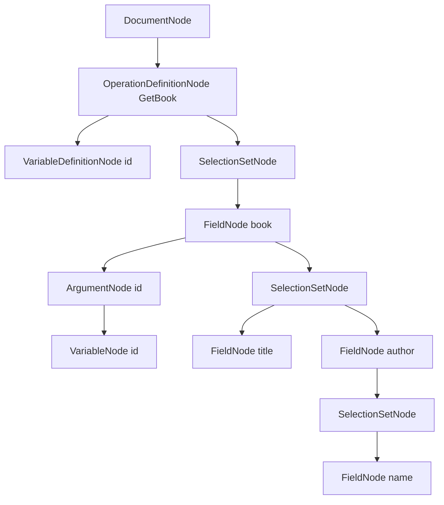
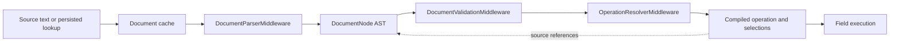

Hot Chocolate v16 parses GraphQL source text into syntax nodes before validation and execution. This page shows how to parse, inspect, print, traverse, and hand parsed documents to execution without confusing the syntax tree with runtime schema types or compiled execution selections.

Use the language and AST APIs when you build tooling around GraphQL documents, for example:

- adapter definitions that read operation documents from strings or files.
- persisted operation publishing, diagnostics, analyzers, or snapshot tests.
- request middleware that needs the parsed document before validation or execution.
- custom validation helpers that search operations for directives, fragments, or argument values.

Most resolver code should use higher-level APIs such as resolver parameters, `IResolverContext`, field middleware, selection APIs, schema definitions, or request middleware. AST traversal is for document-level tooling and framework extensions.

# The short version

A request that contains source text moves through these shapes:

1. Source text or UTF-8 bytes are parsed by `HotChocolate.Language.Utf8GraphQLParser.Parse`.
2. Parsing creates a `DocumentNode` and checks GraphQL syntax plus parser limits.
3. Validation checks the parsed document against the executable schema.
4. Operation compilation creates execution selections and an executable operation plan.
5. Field execution can keep source references, but compiled selections are not syntax nodes.

| Type                          | Namespace                | Use                                                                                                     |
| ----------------------------- | ------------------------ | ------------------------------------------------------------------------------------------------------- |
| `DocumentNode`                | `HotChocolate.Language`  | Root of the parsed GraphQL syntax tree. It can contain executable definitions and SDL definitions.      |
| `OperationDocument`           | `HotChocolate.Execution` | Wrapper for an already parsed operation document used by request and storage APIs.                      |
| `OperationDocumentSourceText` | `HotChocolate.Execution` | Wrapper for source text that still needs parsing.                                                       |
| `OperationDocumentInfo`       | `HotChocolate.Execution` | Request metadata for the parsed document, hash, ID, cache state, persisted state, and validation state. |
| Runtime schema definitions    | `HotChocolate.Types`     | Executable schema model. This is not the parsed SDL document.                                           |
| `IExecutable<T>`              | `HotChocolate` data APIs | Data-source abstraction used by resolvers and middleware. It is not a GraphQL operation document.       |

# Parse a GraphQL operation

Use `Utf8GraphQLParser.Parse` for complete GraphQL documents.

```csharp
using HotChocolate.Language;
using System.Linq;

const string sourceText = """
    query GetBook($id: ID!) {
      book(id: $id) {
        title
        author {
          name
        }
      }
    }
    """;

DocumentNode document = Utf8GraphQLParser.Parse(sourceText);

OperationDefinitionNode operation = document.Definitions
    .OfType<OperationDefinitionNode>()
    .Single();

string? operationName = operation.Name?.Value;
OperationType operationType = operation.Operation;
FieldNode rootField = operation.SelectionSet.Selections
    .OfType<FieldNode>()
    .Single();

Console.WriteLine($"{operationType} {operationName}: {rootField.Name.Value}");
```

`DocumentNode.Definitions` contains top-level definitions. Executable documents commonly contain `OperationDefinitionNode` and `FragmentDefinitionNode` instances. SDL documents contain type-system nodes such as `ObjectTypeDefinitionNode`, `SchemaDefinitionNode`, and directive definitions.

You can also parse UTF-8 input without first creating a string.

```csharp
using System.Buffers;
using System.Text;
using HotChocolate.Language;

byte[] bytes = Encoding.UTF8.GetBytes("query GetBooks { books { title } }");
DocumentNode fromBytes = Utf8GraphQLParser.Parse(bytes);

var sequence = new ReadOnlySequence<byte>(bytes);
DocumentNode fromSequence = Utf8GraphQLParser.Parse(sequence);
```

# Parse SDL as syntax

Parsing SDL gives you syntax nodes. It does not build or mutate the executable schema.

```csharp
using HotChocolate.Language;
using System.Linq;

DocumentNode schemaDocument = Utf8GraphQLParser.Parse("""
    type Query {
      books: [Book!]!
    }

    type Book {
      title: String!
    }
    """);

ObjectTypeDefinitionNode queryType = schemaDocument.Definitions
    .OfType<ObjectTypeDefinitionNode>()
    .Single(t => t.Name.Value == "Query");

Console.WriteLine(queryType.Kind); // SyntaxKind.ObjectTypeDefinition
```

A parsed `ObjectTypeDefinitionNode` represents text. A built schema uses runtime type definitions and can emit syntax through provider APIs, but changing the parsed SDL tree does not change a schema that has already been built.

# Parse syntax fragments

Use `Utf8GraphQLParser.Syntax` when your extension accepts a grammar fragment instead of a whole document. Fragment parsers still parse GraphQL grammar only. They do not validate the fragment against a schema.

```csharp
using HotChocolate.Language;

SelectionSetNode selectionSet = Utf8GraphQLParser.Syntax.ParseSelectionSet(
    "{ id name }");

FieldNode field = Utf8GraphQLParser.Syntax.ParseField(
    "book(id: 1) { title }");

IValueNode value = Utf8GraphQLParser.Syntax.ParseValueLiteral(
    "{ eq: \"abc\" }");

ITypeNode type = Utf8GraphQLParser.Syntax.ParseTypeReference(
    "[String!]!");

SchemaCoordinateNode coordinate = Utf8GraphQLParser.Syntax.ParseSchemaCoordinate(
    "Query.book(id:)");
```

Fragment parsers are useful for descriptor APIs, tests, adapters, and document transformations where the input is known to be one field, one selection set, one value, or one type reference.

# Understand the syntax tree

The operation from the first example produces this simplified tree:



Every syntax node implements `ISyntaxNode`.

| Member                                | Meaning                                                                           |
| ------------------------------------- | --------------------------------------------------------------------------------- |
| `SyntaxKind Kind`                     | Identifies the grammar construct, for example `SyntaxKind.Field`.                 |
| `Location? Location`                  | Source offset, line, and column when locations were preserved.                    |
| `IEnumerable<ISyntaxNode> GetNodes()` | Enumerates child syntax nodes.                                                    |
| `ToString()` and `ToString(bool)`     | Prints GraphQL text from the syntax tree. Prefer `Print` when formatting matters. |

Important node families:

| Family                   | Common nodes                                                                                                                                                                    |
| ------------------------ | ------------------------------------------------------------------------------------------------------------------------------------------------------------------------------- |
| Document and definitions | `DocumentNode`, `OperationDefinitionNode`, `FragmentDefinitionNode`, SDL definition nodes.                                                                                      |
| Selections               | `SelectionSetNode`, `FieldNode`, `FragmentSpreadNode`, `InlineFragmentNode`.                                                                                                    |
| Directives and arguments | `DirectiveNode`, `ArgumentNode`, `VariableDefinitionNode`, `VariableNode`.                                                                                                      |
| Values                   | `IValueNode`, `IntValueNode`, `FloatValueNode`, `StringValueNode`, `BooleanValueNode`, `NullValueNode`, `EnumValueNode`, `ListValueNode`, `ObjectValueNode`, `ObjectFieldNode`. |
| Type references          | `ITypeNode`, `NamedTypeNode`, `ListTypeNode`, `NonNullTypeNode`.                                                                                                                |
| Type-system syntax       | `SchemaDefinitionNode`, type definitions, type extensions, `DirectiveDefinitionNode`, `SchemaCoordinateNode`.                                                                   |

# Work with immutable syntax nodes

Syntax nodes are immutable-style objects. Public properties describe a parsed shape. To change a document, create new nodes, use `With...` helpers where available, or use `SyntaxRewriter`. The rewriter returns a new tree and can remove optional nodes by returning `null` when the syntax shape allows it.

```csharp
using HotChocolate.Language;
using HotChocolate.Language.Visitors;

DocumentNode document = Utf8GraphQLParser.Parse("query OldName { viewer { id } }");

var rewriter = SyntaxRewriter.Create(node =>
{
    if (node is OperationDefinitionNode operation &&
        operation.Name?.Value == "OldName")
    {
        return operation.WithName(new NameNode("NewName"));
    }

    return node;
});

DocumentNode rewritten = (DocumentNode)rewriter.Rewrite(document, null)!;
```

Rewriting does not validate the result. Validate rewritten executable documents before they reach execution, and be careful when rewriting request documents because that changes what the server runs.

# Locations and parser options

`Location` stores the source range for a syntax node:

- `Start` and `End` are character offsets.
- `Line` and `Column` are 1-indexed.
- `Location` can be `null` when parsing disabled locations or when a node was constructed manually.

```csharp
using HotChocolate.Language;
using System.Linq;

DocumentNode document = Utf8GraphQLParser.Parse("query { book { title } }");
FieldNode field = document.Definitions
    .OfType<OperationDefinitionNode>()
    .Single()
    .SelectionSet.Selections
    .OfType<FieldNode>()
    .Single();

if (field.Location is { } location)
{
    Console.WriteLine($"{field.Name.Value} starts at {location.Line}:{location.Column}");
}
```

Standalone parsing uses immutable `ParserOptions`.

```csharp
using HotChocolate.Language;

var options = new ParserOptions(
    noLocations: true,
    maxAllowedFields: 500,
    maxAllowedDirectives: 4,
    maxAllowedRecursionDepth: 100,
    maxAllowedNodes: 5_000,
    maxAllowedTokens: 20_000);

DocumentNode document = Utf8GraphQLParser.Parse(sourceText, options);
```

Server configuration uses request parser options through `ModifyParserOptions`.

```csharp
builder
    .AddGraphQL()
    .ModifyParserOptions(options =>
    {
        options.IncludeLocations = false;
        options.MaxAllowedFields = 500;
        options.MaxAllowedDirectives = 4;
        options.MaxAllowedRecursionDepth = 100;
        options.MaxAllowedNodes = 5_000;
        options.MaxAllowedTokens = 20_000;
    });
```

Parser limits are security relevant because parsing happens before validation. They apply to valid and invalid documents.

| Standalone `ParserOptions` | Default          | Notes                                                                    |
| -------------------------- | ---------------- | ------------------------------------------------------------------------ |
| `NoLocations`              | `false`          | Disables `Location` creation when `true`.                                |
| `MaxAllowedFields`         | `2048`           | Counts field selections in the document.                                 |
| `MaxAllowedDirectives`     | `4` per location | Applies to fields, operations, fragments, and other directive locations. |
| `MaxAllowedRecursionDepth` | `200`            | Protects parser recursion for nested syntax.                             |
| `MaxAllowedNodes`          | `int.MaxValue`   | Set a finite value for public endpoints.                                 |
| `MaxAllowedTokens`         | `int.MaxValue`   | Set a finite value for public endpoints.                                 |

`RequestParserOptions.IncludeLocations` maps to the standalone parser location setting in the opposite direction: `IncludeLocations = false` creates parser options with `NoLocations = true`.

# Print and serialize documents

Use `HotChocolate.Language.Utilities.SyntaxPrinter` extension methods when output format matters.

```csharp
using HotChocolate.Language;
using HotChocolate.Language.Utilities;
using System.IO;

DocumentNode document = Utf8GraphQLParser.Parse("query GetBooks { books { title } }");

string formatted = document.Print();
string compact = document.Print(indented: false);

await using Stream stream = File.Create("operation.graphql");
await document.PrintToAsync(stream, indented: false, cancellationToken);
```

`ToString()` delegates to syntax printing, but `Print` makes the formatting choice clear in examples and tooling.

`OperationDocument` wraps an already parsed `DocumentNode` for execution and storage APIs. Its binary methods write compact UTF-8 GraphQL.

```csharp
using HotChocolate.Execution;
using HotChocolate.Language;

DocumentNode document = Utf8GraphQLParser.Parse("query GetViewer { viewer { id } }");
var operationDocument = new OperationDocument(document);

ReadOnlySpan<byte> bytes = operationDocument.AsSpan();
byte[] ownedBytes = operationDocument.ToArray();
```

Printing preserves the parsed GraphQL structure, not the original ignored whitespace or comments. If exact source text, original comments, or a client-provided hash matters, store the original source text separately and use one consistent strategy for IDs.

Avoid logging full printed documents when they may contain sensitive literal values. Variables are usually separate from the operation text, but literal arguments can still contain data.

# Traverse a document

Use `SyntaxVisitor<TContext>` when you need to inspect a document recursively. The visitor action controls traversal:

| Action         | Effect                                                                       |
| -------------- | ---------------------------------------------------------------------------- |
| `Continue`     | Visit child nodes, then run leave behavior.                                  |
| `Skip`         | Do not visit child nodes and do not run leave behavior for the current node. |
| `SkipAndLeave` | Do not visit child nodes, but run leave behavior for the current node.       |
| `Break`        | Stop traversal and propagate the break up the visitor stack.                 |

This visitor collects fragment spreads.

```csharp
using HotChocolate.Language;
using HotChocolate.Language.Visitors;
using System;
using System.Collections.Generic;

public sealed class FragmentSpreadCollector : SyntaxVisitor<HashSet<string>>
{
    protected override ISyntaxVisitorAction Enter(
        ISyntaxNode node,
        HashSet<string> names)
    {
        if (node is FragmentSpreadNode spread)
        {
            names.Add(spread.Name.Value);
        }

        return Continue;
    }
}

DocumentNode document = Utf8GraphQLParser.Parse("""
    query GetBook {
      book(id: 1) {
        ...BookDetails
      }
    }

    fragment BookDetails on Book {
      title
    }
    """);

var names = new HashSet<string>(StringComparer.Ordinal);
new FragmentSpreadCollector().Visit(document, names);
```

Some child categories are opt-in. Directives, arguments, names, and descriptions are controlled by `SyntaxVisitorOptions`. Enable the relevant switch before searching for those nodes.

```csharp
using HotChocolate.Language;
using HotChocolate.Language.Visitors;

public sealed class DirectiveSearchContext
{
    public string? FoundDirective { get; set; }
}

public sealed class DeferStreamDirectiveFinder
    : SyntaxVisitor<DirectiveSearchContext>
{
    public DeferStreamDirectiveFinder()
        : base(new SyntaxVisitorOptions { VisitDirectives = true })
    {
    }

    protected override ISyntaxVisitorAction Enter(
        ISyntaxNode node,
        DirectiveSearchContext context)
    {
        if (node is DirectiveNode directive &&
            directive.Name.Value is "defer" or "stream")
        {
            context.FoundDirective = directive.Name.Value;
            return Break;
        }

        return Continue;
    }
}
```

Use navigator support when parent context matters, such as building SDL schema coordinates.

```csharp
using HotChocolate.Language;
using HotChocolate.Language.Visitors;
using System.Collections.Generic;

var coordinates = new List<string>();

var visitor = SyntaxVisitor.CreateWithNavigator<NavigatorContext>(
    enter: (node, context) =>
    {
        if (node is FieldDefinitionNode or InputValueDefinitionNode)
        {
            coordinates.Add(context.Navigator.CreateCoordinate().ToString());
        }

        return SyntaxVisitor.Continue;
    },
    options: new SyntaxVisitorOptions { VisitArguments = true });

DocumentNode schema = Utf8GraphQLParser.Parse("type Query { book(id: ID!): Book }");
visitor.Visit(schema, new NavigatorContext());
```

For transformations, use `SyntaxRewriter` rather than mutating nodes. For complex visitors, keep state in the context object instead of instance fields.

# Work with parsed documents in request middleware

Request middleware can inspect `RequestContext.OperationDocumentInfo.Document` after `DocumentParserMiddleware`. This is request-pipeline code, not resolver code.

```csharp
using HotChocolate.Execution;
using HotChocolate.Language;

builder.Services
    .AddGraphQLServer()
    .UseRequest(
        next => async context =>
        {
            DocumentNode? document = context.OperationDocumentInfo.Document;

            if (document is not null)
            {
                context.ContextData["OperationCount"] =
                    context.OperationDocumentInfo.OperationCount;
            }

            await next(context);
        },
        key: "Example.DocumentInspection",
        after: WellKnownRequestMiddleware.DocumentParserMiddleware);
```

Choose the middleware anchor by the data you need:

| Need                              | Place middleware                             |
| --------------------------------- | -------------------------------------------- |
| Parsed syntax and parser metadata | After `DocumentParserMiddleware`.            |
| Schema validation state           | After `DocumentValidationMiddleware`.        |
| Selected and compiled operation   | After `OperationResolverMiddleware`.         |
| Coerced variables                 | After `OperationVariableCoercionMiddleware`. |

Do not store `RequestContext` or syntax nodes from a pooled request for background work unless you also own the lifetime of everything they reference.

# Validation and execution handoff

The AST is the text shape. Validation is schema semantics. Operation compilation is execution shape.



Parsing rejects malformed GraphQL and documents that exceed parser limits. It does not know whether `book`, `title`, or a directive exists in your schema. Validation checks those schema rules. Operation compilation can merge selections and resolve fragments, so one v16 execution selection can correspond to more than one field syntax node. When resolver or middleware APIs expose selection syntax wrappers, inspect the underlying `FieldNode` through the current wrapper API.

# Syntax kinds quick reference

`ISyntaxNode.Kind` returns a `SyntaxKind` value. The enum covers executable documents, input values, type references, SDL definitions, SDL extensions, and schema coordinates.

| Family               | `SyntaxKind` values                                                                                                                                                                                                                                                                         | Primary node examples                                                              |
| -------------------- | ------------------------------------------------------------------------------------------------------------------------------------------------------------------------------------------------------------------------------------------------------------------------------------------- | ---------------------------------------------------------------------------------- |
| Common syntax        | `Name`, `Argument`, `Directive`, `NamedType`, `ListType`, `NonNullType`                                                                                                                                                                                                                     | `NameNode`, `ArgumentNode`, `DirectiveNode`, `ITypeNode`.                          |
| Executable documents | `Document`, `OperationDefinition`, `VariableDefinition`, `Variable`, `SelectionSet`, `Field`, `FragmentSpread`, `InlineFragment`, `FragmentDefinition`                                                                                                                                      | `DocumentNode`, `OperationDefinitionNode`, `FieldNode`, `FragmentDefinitionNode`.  |
| Input values         | `IntValue`, `FloatValue`, `StringValue`, `BooleanValue`, `NullValue`, `EnumValue`, `ListValue`, `ObjectValue`, `ObjectField`                                                                                                                                                                | `IValueNode`, `ObjectValueNode`, `ObjectFieldNode`.                                |
| SDL definitions      | `SchemaDefinition`, `OperationTypeDefinition`, `ScalarTypeDefinition`, `ObjectTypeDefinition`, `FieldDefinition`, `InputValueDefinition`, `InterfaceTypeDefinition`, `UnionTypeDefinition`, `EnumTypeDefinition`, `EnumValueDefinition`, `InputObjectTypeDefinition`, `DirectiveDefinition` | `ObjectTypeDefinitionNode`, `InputValueDefinitionNode`, `DirectiveDefinitionNode`. |
| SDL extensions       | `SchemaExtension`, `ScalarTypeExtension`, `ObjectTypeExtension`, `InterfaceTypeExtension`, `UnionTypeExtension`, `EnumTypeExtension`, `InputObjectTypeExtension`                                                                                                                            | Extension node types.                                                              |
| Coordinates          | `SchemaCoordinate`                                                                                                                                                                                                                                                                          | `SchemaCoordinateNode`.                                                            |

# Common extension scenarios

| Scenario                          | API starting point                                              | Notes                                                                                           |
| --------------------------------- | --------------------------------------------------------------- | ----------------------------------------------------------------------------------------------- |
| Adapter operation definitions     | `Utf8GraphQLParser.Parse`, `DocumentNode`, visitors             | Parse a known operation document, then derive inputs and selected fields.                       |
| Persisted or trusted documents    | `DocumentNode`, `SyntaxPrinter.Print`, `OperationDocument`      | Keep a stable source or printing strategy. Do not assume printed output matches original bytes. |
| Custom analyzers                  | `SyntaxVisitor<TContext>`, `SyntaxVisitorOptions`               | Find disallowed directives, external fragment spreads, or operation names before execution.     |
| Request policy middleware         | `OperationDocumentInfo.Document`                                | Anchor after parsing or validation depending on required state.                                 |
| Diagnostics                       | `ISyntaxNode.Location`                                          | Check for `null` before adding line and column data.                                            |
| Tests                             | `Utf8GraphQLParser.Parse`, `Print`                              | Parse generated GraphQL and snapshot the formatted or compact output.                           |
| Selection-sensitive data features | Higher-level filtering, sorting, projection, and selection APIs | Use framework extension points unless you are building those features.                          |

# Performance and safety notes

- Set finite parser limits for public endpoints. Invalid documents can consume parser CPU and memory before validation.
- Disable locations only when you do not need source line and column data for errors or diagnostics.
- Cache parsed documents or use persisted operation storage when the same documents are used often.
- Keep original source text when a registry, hash, signature, or audit trail depends on the submitted bytes.
- Prefer visitors with explicit `SyntaxVisitorOptions` over ad hoc recursive code for non-trivial traversal.
- Treat AST rewriting in the request pipeline as an advanced extension point because it changes the document that validation and execution see.

# Troubleshooting

| Symptom                                             | Likely cause                                                                                | Fix                                                                                                                                                |
| --------------------------------------------------- | ------------------------------------------------------------------------------------------- | -------------------------------------------------------------------------------------------------------------------------------------------------- |
| `SyntaxException` is thrown                         | The document is not valid GraphQL syntax, or a parser limit rejected it.                    | Check syntax first, then review `MaxAllowedFields`, `MaxAllowedDirectives`, `MaxAllowedRecursionDepth`, `MaxAllowedNodes`, and `MaxAllowedTokens`. |
| `Location` is `null`                                | Locations were disabled or the node was built manually.                                     | Enable locations for parser input, or handle `null` in diagnostics.                                                                                |
| A visitor does not find directives or arguments     | Those child categories are opt-in.                                                          | Set `VisitDirectives = true` or `VisitArguments = true` in `SyntaxVisitorOptions`.                                                                 |
| Printed GraphQL differs from submitted text         | Printing formats the parsed structure and omits ignored whitespace and comments.            | Store original source separately when exact text matters.                                                                                          |
| Parsed SDL changes do not affect the running schema | Parsed SDL nodes are syntax, not runtime schema definitions.                                | Build or rebuild the schema through schema APIs.                                                                                                   |
| Resolver selection syntax does not map to one field | v16 operation compilation can merge selections.                                             | Use current selection APIs and inspect the underlying `FieldNode` from wrapper objects where exposed.                                              |
| `IExecutable<T>` appears related                    | The name refers to a data-source abstraction.                                               | Use `OperationDocument`, `OperationDocumentSourceText`, or `DocumentNode` for GraphQL documents.                                                   |
| Empty input behaves differently by input type       | Empty byte spans and sequences produce an empty `DocumentNode`; empty strings are rejected. | Normalize upstream input before parsing if this distinction matters.                                                                               |

# Next steps

- [Execution pipeline](../execution-engine/pipeline.md) explains where parsing, validation, operation compilation, and execution run.
- [Request middleware](../execution-engine/request-middleware.md) covers safe placement for document inspection.
- [Execution depth and limits](../security/execution-depth-and-limits.md) covers parser, validation, execution, and transport limits.
- [Persisted operations](../performance/persisted-operations.md) and [trusted documents](../security/trusted-documents.md) cover operation storage and allow-list workflows.
- [Error builder](../errors/error-builder.md) shows how to create errors that can include source locations.
- [Schema elements](../schema-elements/index.md) covers runtime schema definitions.
- [Extending filtering](../filtering-sorting-projections/extending-filtering.md) shows a higher-level extension point that can analyze selection syntax.
