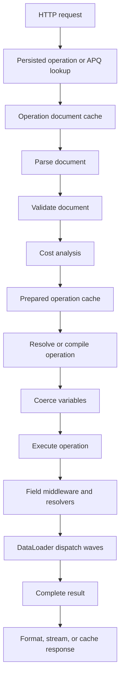

Hot Chocolate v16 is optimized for high-throughput GraphQL execution, but performance work pays off when it targets the current bottleneck. Use this page as the entry point for measuring request cost, choosing the right feature, and moving to the focused page that owns the details.

# Find the bottleneck first

Start with evidence. A slow GraphQL request can spend time in HTTP transport, persisted operation lookup, document parsing, validation, cost analysis, operation preparation, variable coercion, resolver execution, DataLoader dispatch, database work, serialization, or network delivery.

For unknown slowdowns, add instrumentation before changing settings:

```csharp
builder
    .AddGraphQL()
    .AddTypes()
    .AddInstrumentation();
```

Then connect OpenTelemetry with Hot Chocolate instrumentation so traces show GraphQL request, field, and DataLoader spans. Enable detailed scopes only for the investigation you need because additional instrumentation scopes add overhead.

Read next: [Instrumentation](/docs/hotchocolate/v16/server/instrumentation) and [Execution engine](/docs/hotchocolate/v16/build2/execution-engine).

# Choose a performance path

| Symptom                                                       | Likely cost center                 | Try first                                           | Expected result                                                | Read next                                                                                                                                                              |
| ------------------------------------------------------------- | ---------------------------------- | --------------------------------------------------- | -------------------------------------------------------------- | ---------------------------------------------------------------------------------------------------------------------------------------------------------------------- |
| First request after deployment is slow                        | Schema and executor initialization | Keep eager initialization and add warmup tasks      | The executor and hot operation shapes are ready before traffic | [Warmup](/docs/hotchocolate/v16/server/warmup)                                                                                                                         |
| Repeated known operations spend time in parsing or validation | Document and operation preparation | Persisted operations, APQ, and operation caches     | Known operations reuse parsed and prepared work                | [Persisted operations](/docs/hotchocolate/v16/performance/trusted-documents), [APQ](/docs/hotchocolate/v16/performance/automatic-persisted-operations)                 |
| Clients resend large operation text                           | Request payload size               | Persisted operations or APQ                         | Clients send an operation ID or hash instead of full text      | [Trusted documents](/docs/hotchocolate/v16/build2/security/trusted-documents)                                                                                          |
| Public query responses repeat                                 | HTTP response caching              | Cache-control metadata and deterministic GET routes | Browsers, proxies, or CDNs can reuse safe query responses      | [Cache control](/docs/hotchocolate/v16/server/cache-control)                                                                                                           |
| Nested resolvers issue many similar backend calls             | N+1 data access                    | DataLoader                                          | Keys are batched and deduplicated within one request           | [DataLoader](/docs/hotchocolate/v16/build2/dataloader)                                                                                                                 |
| Database returns too many rows or columns                     | Query shape                        | Paging, projections, filtering, and sorting         | More work is pushed to the data source                         | [Pagination](/docs/hotchocolate/v16/build2/pagination), [Filtering, sorting, and projections](/docs/hotchocolate/v16/build2/filtering-sorting-projections)             |
| Several independent operations use separate HTTP calls        | Client round trips                 | HTTP batching with a bounded `MaxBatchSize`         | Fewer HTTP round trips                                         | [Batching](/docs/hotchocolate/v16/server/batching)                                                                                                                     |
| Expensive operations can harm shared capacity                 | Resource guardrails                | Cost analysis, request limits, and page-size limits | Work is rejected before it reaches resolvers                   | [Cost analysis](/docs/hotchocolate/v16/build2/security/cost-analysis), [Execution depth and limits](/docs/hotchocolate/v16/build2/security/execution-depth-and-limits) |

# Understand request lifecycle cost

A request moves through several cost centers. Optimizations work best when they remove or reduce one specific step.



Key rules:

- The operation document cache stores parsed, validated documents per schema. Default size is `256`, minimum size is `16`.
- The prepared operation cache stores compiled operations per schema. Default size is `256`, minimum size is `16`.
- Warmup can initialize the executor and prefill representative document and operation cache entries.
- DataLoader cache is scoped to one GraphQL request.
- HTTP response caching is outside resolver execution. It depends on deterministic routes and cache-control headers.

# Reduce startup and first-request latency

Hot Chocolate v16 builds the schema eagerly by default. `LazyInitialization` is `false`, so schema errors appear at startup and the request executor is ready before the server accepts requests.

Use warmup tasks when the first live requests also need hot document and operation cache entries:

```csharp
builder
    .AddGraphQL()
    .AddTypes()
    .AddWarmupTask(async (executor, ct) =>
    {
        var request = OperationRequestBuilder.New()
            .SetDocument("""
                query GetProducts {
                    products(first: 10) {
                        nodes {
                            id
                            name
                        }
                    }
                }
                """)
            .SetOperationName("GetProducts")
            .MarkAsWarmupRequest()
            .Build();

        await executor.ExecuteAsync(request, ct);
    });
```

Warmup requests marked with `MarkAsWarmupRequest()` do not execute resolvers, which avoids startup side effects. They also skip security measures such as persisted operation enforcement, so do not use warmup as proof that a normal production request is allowed.

If clients send an operation name, include it in the warmup request because the operation name participates in prepared operation cache hits.

Read next: [Warmup](/docs/hotchocolate/v16/server/warmup).

# Reuse repeated operation work

Hot Chocolate has three related concepts that are often confused.

| Feature                    | Scope              | What it saves                                  | Main use                                                  |
| -------------------------- | ------------------ | ---------------------------------------------- | --------------------------------------------------------- |
| Operation document cache   | Per schema         | Repeated parsing and cacheable validation work | Dynamic requests that repeat the same document            |
| Prepared operation cache   | Per schema         | Repeated operation preparation and compilation | Hot operations with stable document ID and operation name |
| Operation document storage | Configured storage | Fetching known documents by ID or hash         | Persisted operations and APQ                              |

Tune built-in cache sizes when the hot working set is larger than the defaults:

```csharp
builder
    .AddGraphQL()
    .ModifyOptions(options =>
    {
        options.OperationDocumentCacheSize = 1024;
        options.PreparedOperationCacheSize = 1024;
    });
```

Use persisted operations when client operations are known before deployment:

```csharp
builder
    .AddGraphQL()
    .AddTypes()
    .AddSha256DocumentHashProvider(HashFormat.Hex)
    .UsePersistedOperationPipeline()
    .AddFileSystemOperationDocumentStorage("./persisted_operations");
```

Use Automatic Persisted Operations (APQ) when clients should register documents at runtime:

```csharp
builder.Services.AddMemoryCache();

builder
    .AddGraphQL()
    .AddTypes()
    .AddSha256DocumentHashProvider(HashFormat.Hex)
    .UseAutomaticPersistedOperationPipeline()
    .AddInMemoryOperationDocumentStorage();
```

APQ has a first-use miss path. If the server does not know a hash yet, it returns a not-found error and the client sends a second request with the full document. After storage succeeds, later requests can send only the hash.

Read next: [Persisted operations](/docs/hotchocolate/v16/performance/trusted-documents) and [Automatic persisted operations](/docs/hotchocolate/v16/performance/automatic-persisted-operations).

# Use caching at the right layer

Caching is not one feature. Pick the cache that matches the work you want to avoid.

| Cache                      | Lifetime                              | Avoids                            | Notes                                      |
| -------------------------- | ------------------------------------- | --------------------------------- | ------------------------------------------ |
| Operation document cache   | Per schema                            | Parsing and cacheable validation  | Controlled by `OperationDocumentCacheSize` |
| Prepared operation cache   | Per schema                            | Operation preparation             | Controlled by `PreparedOperationCacheSize` |
| DataLoader cache           | One request                           | Duplicate key loads               | Not shared across requests                 |
| Operation document storage | Storage-dependent                     | Sending or parsing full documents | Used by persisted operations and APQ       |
| HTTP response cache        | Browser, proxy, CDN, or server policy | Re-executing safe query responses | Requires cache-control metadata            |

For HTTP response caching, mark cacheable query fields and enable cache-control support:

```csharp
using HotChocolate.Caching;

builder
    .AddGraphQL()
    .AddTypes()
    .UseQueryCache()
    .AddCacheControl();

[QueryType]
public static partial class ProductQueries
{
    [CacheControl(300, SharedMaxAge = 900)]
    public static Product? GetProductById(int id)
    {
        return ProductRepository.GetById(id);
    }
}
```

Cache-control is for query responses. Mutations, subscriptions, introspection, responses with GraphQL errors, and responses without cache metadata do not produce reusable HTTP cache headers.

Read next: [Cache control](/docs/hotchocolate/v16/server/cache-control).

# Reduce data-fetching cost

Most GraphQL performance work happens in data access. Keep resolvers thin, return provider-supported query shapes for collections, and use DataLoader for related data by key.

## Use DataLoader for N+1 fields

```csharp
internal static class BrandDataLoaders
{
    [DataLoader]
    public static async Task<Dictionary<int, Brand>> GetBrandByIdAsync(
        IReadOnlyList<int> ids,
        CatalogContext db,
        CancellationToken ct)
    {
        return await db.Brands
            .Where(brand => ids.Contains(brand.Id))
            .ToDictionaryAsync(brand => brand.Id, ct);
    }
}

[ObjectType<Product>]
public static partial class ProductNode
{
    public static async Task<Brand?> GetBrandAsync(
        [Parent] Product product,
        IBrandByIdDataLoader brandById,
        CancellationToken ct)
    {
        return await brandById.LoadAsync(product.BrandId, ct);
    }
}
```

DataLoader batches keys between resolver waves and deduplicates repeated keys in the same request. Complex execution can still produce more than one backend batch, but each batch should be much smaller than one call per parent object.

Read next: [DataLoader](/docs/hotchocolate/v16/build2/dataloader).

## Push collection work to the data source

```csharp
builder.Services.AddDbContext<CatalogContext>();

builder
    .AddGraphQL()
    .AddTypes()
    .AddProjections()
    .AddFiltering()
    .AddSorting()
    .ModifyPagingOptions(options =>
    {
        options.MaxPageSize = 100;
        options.RequirePagingBoundaries = true;
    });

[QueryType]
public static partial class ProductQueries
{
    [UsePaging]
    [UseProjection]
    [UseFiltering]
    [UseSorting]
    public static IQueryable<Product> GetProducts(CatalogContext db)
    {
        return db.Products;
    }
}
```

Keep this order when combining middleware:

1. `UsePaging`
2. `UseProjection`
3. `UseFiltering`
4. `UseSorting`

Watch these projection constraints:

- Projections require public setters on projected properties.
- Do not combine `QueryContext<T>` with `[UseProjection]` on the same field. The HC0099 analyzer warns about this conflict.
- Projections cannot project pagination over relationships. Apply filtering and sorting to nested collections when that is the needed behavior.
- Materializing an `IQueryable<T>` before middleware runs moves work into memory.

Read next: [Filtering, sorting, and projections](/docs/hotchocolate/v16/build2/filtering-sorting-projections), [Pagination](/docs/hotchocolate/v16/build2/pagination), and [Fetching from databases](/docs/hotchocolate/v16/resolvers-and-data/fetching-from-databases).

# Reduce network and response cost

Persisted operations and APQ reduce request size. Cache-control reduces repeated response work. HTTP batching reduces client round trips.

HTTP batching is disabled by default. Enable only the modes your clients need and set a bounded size:

```csharp
builder
    .AddGraphQL()
    .ModifyServerOptions(options =>
    {
        options.Batching =
            AllowedBatching.VariableBatching |
            AllowedBatching.RequestBatching;

        options.MaxBatchSize = 100;
    });
```

Fusion subgraphs enable batching by default. For standalone servers, keep it off unless clients use it deliberately.

HTTP batching is not DataLoader. HTTP batching combines multiple GraphQL operations in one HTTP request. DataLoader batches backend key loads during resolver execution.

For large responses, use transport features such as `@defer`, `@stream`, multipart responses, Server-Sent Events, or JSON Lines when the client can process incremental results.

Read next: [Batching](/docs/hotchocolate/v16/server/batching) and [HTTP transport](/docs/hotchocolate/v16/server/http-transport).

# Protect shared resources

Performance also means rejecting work that should not run. Cost analysis estimates operation shape before resolver execution and rejects operations that exceed your budgets.

```csharp
builder
    .AddGraphQL()
    .AddTypes()
    .ModifyCostOptions(options =>
    {
        options.MaxFieldCost = 5_000;
        options.MaxTypeCost = 5_000;
        options.EnforceCostLimits = true;
    })
    .ModifyPagingOptions(options =>
    {
        options.MaxPageSize = 50;
        options.RequirePagingBoundaries = true;
    });
```

Use `[Cost]` for expensive fields and `[ListSize]` for list fields whose size cannot be inferred from paging metadata. Use request limits for parser size, validation depth, fragment visits, timeouts, concurrent executions, and batching limits.

Read next: [Cost analysis](/docs/hotchocolate/v16/build2/security/cost-analysis), [Execution depth and limits](/docs/hotchocolate/v16/build2/security/execution-depth-and-limits), and [Request limits](/docs/hotchocolate/v16/securing-your-api/request-limits).

# Resolver performance checklist

Use this checklist when traces point to resolver time.

- Keep resolvers small: read GraphQL inputs, call an application service or DataLoader, return the result.
- Pass `CancellationToken` to database, HTTP, and queue calls.
- Avoid blocking async work with `.Result`, `.Wait()`, or synchronous I/O.
- Avoid per-request mutable state on GraphQL type instances.
- Avoid side effects in query resolvers that depend on sibling field order.
- Prefer provider-side paging, filtering, sorting, and projection before data is materialized.
- Use DataLoader for related data by key.
- Use batch resolvers when one field can be resolved for many parents without reusable key caching.
- Avoid logging full documents or large result payloads on every request.
- Move expensive diagnostic work to background processing.

Read next: [Resolvers](/docs/hotchocolate/v16/build2/resolvers) and [Field middleware](/docs/hotchocolate/v16/build2/execution-engine/field-middleware).

# Production checklist

Before a v16 server takes production traffic:

- [ ] Instrument representative traffic and know the slowest operation shapes.
- [ ] Keep eager initialization unless a measured startup constraint requires lazy initialization.
- [ ] Warm representative operations after schema creation.
- [ ] Size operation caches for the hot operation set.
- [ ] Use persisted operations or APQ when clients repeat known documents.
- [ ] Use cache-control only for safe query responses with correct public or private scope.
- [ ] Bound every large collection with paging.
- [ ] Verify middleware order for paging, projections, filtering, and sorting.
- [ ] Use DataLoader for N+1 fields.
- [ ] Set cost budgets and request limits for public or multi-tenant APIs.
- [ ] Keep HTTP batching disabled unless clients need it, then set `MaxBatchSize`.
- [ ] Review instrumentation scopes and diagnostic handlers for overhead.
- [ ] Test the largest expected operations with `GraphQL-Cost: report`.

# Troubleshoot common surprises

| Surprise                                        | Likely cause                                                          | What to check                                                  |
| ----------------------------------------------- | --------------------------------------------------------------------- | -------------------------------------------------------------- |
| Warmup did not enforce persisted operations     | Warmup requests skip security measures                                | Test with normal HTTP requests, not warmup requests            |
| Warmup did not hit the prepared operation cache | Operation name differs                                                | Include the same operation name clients send                   |
| APQ is slower on first use                      | Unknown hash path needs a second request                              | Confirm later hash-only requests hit storage                   |
| Cache sizes seem ineffective                    | Caches are per schema and have minimum size `16`                      | Check schema count and hot operation count                     |
| Batching did not fix N+1 queries                | HTTP batching and DataLoader work at different layers                 | Add DataLoader to nested key-based fields                      |
| Projection is ignored                           | Data was materialized too early or property setters are missing       | Return `IQueryable<T>` and use public setters                  |
| HC0099 appears                                  | `QueryContext<T>` and `[UseProjection]` are combined                  | Pick one projection path for the field                         |
| Cost analysis rejects valid client operations   | Page size or field weights exceed budget                              | Use `GraphQL-Cost: report`, tune budgets, or reduce page sizes |
| Tracing increases latency                       | Too many scopes or expensive handlers                                 | Reduce scopes and move work out of synchronous handlers        |
| HTTP cache does not store responses             | Missing deterministic GET route, cache metadata, or error-free result | Review cache-control headers and response errors               |

# Next steps

| Job                                | Start here                                                                                                                                                                                                                                 |
| ---------------------------------- | ------------------------------------------------------------------------------------------------------------------------------------------------------------------------------------------------------------------------------------------ |
| Measure slow requests              | [Instrumentation](/docs/hotchocolate/v16/server/instrumentation), [Execution engine](/docs/hotchocolate/v16/build2/execution-engine)                                                                                                       |
| Reduce cold-start impact           | [Warmup](/docs/hotchocolate/v16/server/warmup)                                                                                                                                                                                             |
| Reduce repeated operation overhead | [Persisted operations](/docs/hotchocolate/v16/performance/trusted-documents), [Automatic persisted operations](/docs/hotchocolate/v16/performance/automatic-persisted-operations), [Options](/docs/hotchocolate/v16/api-reference/options) |
| Remove N+1 data access             | [DataLoader](/docs/hotchocolate/v16/build2/dataloader)                                                                                                                                                                                     |
| Push work to the database          | [Pagination](/docs/hotchocolate/v16/build2/pagination), [Filtering, sorting, and projections](/docs/hotchocolate/v16/build2/filtering-sorting-projections)                                                                                 |
| Reduce response or transport cost  | [Cache control](/docs/hotchocolate/v16/server/cache-control), [Batching](/docs/hotchocolate/v16/server/batching), [HTTP transport](/docs/hotchocolate/v16/server/http-transport)                                                           |
| Protect server capacity            | [Cost analysis](/docs/hotchocolate/v16/build2/security/cost-analysis), [Execution depth and limits](/docs/hotchocolate/v16/build2/security/execution-depth-and-limits)                                                                     |
