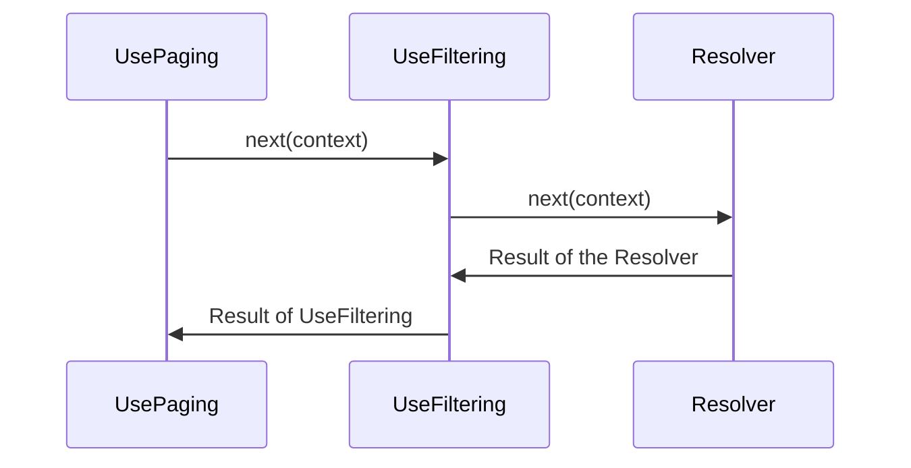

Field middleware is one of the fundamental components in Hot Chocolate. It allows you to create reusable logic that runs before or after a field resolver. Field middleware is composable: you can specify multiple middleware, and they execute in order. The field resolver is always the last element in the middleware chain.

Each field middleware only knows about the next element in the chain and can choose to:

- Execute logic before it
- Execute logic after all later components (including the field resolver) have run
- Skip the next component entirely

Each field middleware has access to an `IMiddlewareContext`. This interface extends `IResolverContext`, so you can use all of the `IResolverContext` APIs in your middleware, the same way you would in a resolver. The `IMiddlewareContext` also provides special properties like `Result`, which holds the resolver or middleware computed result.

# Middleware Order

If you have used Hot Chocolate's data middleware before, you may have encountered warnings about the order of middleware. The order matters because it determines the sequence in which the resolver result is processed.

Take `UsePaging` and `UseFiltering` for example: filtering must happen before pagination. That is why the correct declaration order is `UsePaging` before `UseFiltering`.

```csharp
descriptor
    .UsePaging()
    .UseFiltering()
    .Resolve(context =>
    {
        // Omitted code for brevity
    });
```

But this looks like the opposite order. The following diagram shows why it is correct:



The result of the resolver flows backward through the middleware. The middleware is first invoked in declaration order, but the result produced by the resolver travels back through the chain in reverse order.

# Defining Field Middleware

You can define field middleware either as a delegate or as a separate class. In both cases you gain access to a `FieldDelegate` (which invokes the next middleware) and the `IMiddlewareContext`.

By awaiting the `FieldDelegate`, you wait for all subsequent middleware and the field resolver to complete.

## Delegate-based middleware

Define a field middleware delegate using code-first APIs:

```csharp
public class QueryType : ObjectType
{
    protected override void Configure(IObjectTypeDescriptor descriptor)
    {
        descriptor
            .Field("example")
            .Use(next => async context =>
            {
                // Runs before the next middleware and the field resolver

                // Invoke the next middleware or the field resolver
                await next(context);

                // Runs after all later middleware and the field resolver
            })
            .Resolve(context =>
            {
                // Omitted for brevity
            });
    }
}
```

### Reusing the middleware delegate

The example above applies the middleware to a single field. To reuse it across multiple fields, create an extension method on `IObjectFieldDescriptor`:

```csharp
public static class MyMiddlewareObjectFieldDescriptorExtension
{
    public static IObjectFieldDescriptor UseMyMiddleware(
        this IObjectFieldDescriptor descriptor)
    {
        return descriptor
            .Use(next => async context =>
            {
                // Omitted code for brevity

                await next(context);

                // Omitted code for brevity
            });
    }
}
```

> We recommend prepending `Use` to your extension method name to indicate that it applies middleware.

You can now use this middleware across your schema:

```csharp
public class QueryType : ObjectType
{
    protected override void Configure(IObjectTypeDescriptor descriptor)
    {
        descriptor
            .Field("example")
            .UseMyMiddleware()
            .Resolve(context =>
            {
                // Omitted for brevity
            });
    }
}
```

## Class-based middleware

If you prefer a class over a delegate, create a dedicated middleware class:

```csharp
public class MyMiddleware
{
    private readonly FieldDelegate _next;

    public MyMiddleware(FieldDelegate next)
    {
        _next = next;
    }

    // This method must be called InvokeAsync or Invoke
    public async Task InvokeAsync(IMiddlewareContext context)
    {
        // Runs before the next middleware and the field resolver

        await _next(context);

        // Runs after all later middleware and the field resolver
    }
}
```

You can inject services through the constructor (for singletons) or as parameters on the `InvokeAsync` method (for scoped or transient services):

```csharp
public class MyMiddleware
{
    private readonly FieldDelegate _next;
    private readonly IMySingletonService _singletonService;

    public MyMiddleware(FieldDelegate next, IMySingletonService singletonService)
    {
        _next = next;
        _singletonService = singletonService;
    }

    public async Task InvokeAsync(IMiddlewareContext context,
        IMyScopedService scopedService)
    {
        // Omitted code for brevity
    }
}
```

The ability to add additional arguments to the `InvokeAsync` method is the reason there is no interface or base class for field middleware.

### Applying class-based middleware

Apply the class-based middleware to a field using `Use<T>()`:

```csharp
public class QueryType : ObjectType
{
    protected override void Configure(IObjectTypeDescriptor descriptor)
    {
        descriptor
            .Field("example")
            .Use<MyMiddleware>()
            .Resolve(context =>
            {
                // Omitted for brevity
            });
    }
}
```

We still recommend wrapping `Use<MyMiddleware>()` in an extension method like `UseMyMiddleware()`. This makes future changes to the middleware easier without modifying every call site.

If you need to pass a custom argument to the middleware, use the factory overload:

```csharp
descriptor
    .Field("example")
    .Use((provider, next) => new MyMiddleware(next, "custom",
        provider.GetRequiredService<FooBar>()));
```

# Using Middleware as an Attribute

To apply middleware to resolvers defined using the annotation-based approach, create an attribute inheriting from `ObjectFieldDescriptorAttribute` and call your middleware in the `OnConfigure` method.

> Attribute order is not guaranteed in C#, so middleware attributes use the `CallerLineNumberAttribute` to inject the C# line number at compile time. The line number determines the ordering. Avoid inheriting middleware attributes from a base method or property, as this can lead to confusion about ordering. Always pass through the `order` argument when inheriting from middleware attributes. Prepend `Use` to your attribute name to indicate it applies middleware.

```csharp
public class UseMyMiddlewareAttribute : ObjectFieldDescriptorAttribute
{
    public UseMyMiddlewareAttribute([CallerLineNumber] int order = 0)
    {
        Order = order;
    }

    protected override void OnConfigure(IDescriptorContext context,
        IObjectFieldDescriptor descriptor, MemberInfo member)
    {
        descriptor.UseMyMiddleware();
    }
}
```

Apply the attribute to a resolver:

```csharp
public class Query
{
    [UseMyMiddleware]
    public string MyResolver()
    {
        // Omitted code for brevity
    }
}
```

# Accessing the Resolver Result

The `IMiddlewareContext` provides a `Result` property that you can use to read or modify the field resolver result:

```csharp
descriptor
    .Use(next => async context =>
    {
        await next(context);

        // Access the result after calling next(context),
        // after the field resolver and any later middleware have finished
        object? result = context.Result;

        // Narrow down the type using pattern matching
        if (result is string stringResult)
        {
            // Work with the stringResult
        }
    });
```

A middleware can also set or override the result by assigning `context.Result`.

> The field resolver only executes if no preceding middleware has set the `Result` property on the `IMiddlewareContext`. If any middleware sets the `Result`, the field resolver is skipped.

# Short-Circuiting

In some cases you may want to short-circuit the middleware chain and skip the field resolver. To do this, do not call the `FieldDelegate` (`next`):

```csharp
descriptor
    .Use(next => context =>
    {
        if (context.Parent<object>() is IDictionary<string, object> dict)
        {
            context.Result = dict[context.Field.Name];

            // The remaining middleware and field resolver do not execute
            return Task.CompletedTask;
        }
        else
        {
            return next(context);
        }
    })
```

# Troubleshooting

**Middleware executes in an unexpected order**
Verify the declaration order. Middleware declared first runs first on the way down, but processes results last on the way back up. If you are using attributes, check the `Order` property or the line numbers.

**Result is null after calling next(context)**
The field resolver may have returned `null`, or a preceding middleware may have set `Result` to `null`. Check whether all required data is available in the resolver.

**Middleware pipeline validation error at startup**
Hot Chocolate validates the order of built-in data middleware (paging, filtering, sorting) by default. If you receive an ordering error, rearrange your middleware so that `UsePaging` is declared before `UseFiltering`, which is declared before `UseSorting`.

# Next Steps

- [Execution engine overview](/docs/hotchocolate/v16/execution-engine) for request-level middleware
- [Resolvers](/docs/hotchocolate/v16/fetching-data/resolvers) for field resolution
- [Filtering](/docs/hotchocolate/v16/fetching-data/filtering) and [sorting](/docs/hotchocolate/v16/fetching-data/sorting) middleware
- [Pagination](/docs/hotchocolate/v16/fetching-data/pagination) middleware
