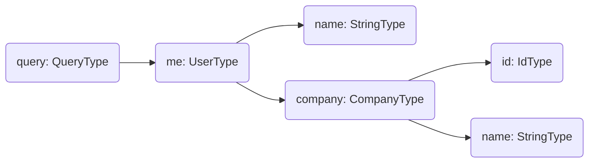

In the simplest terms, **a resolver is a generic function that produces a value for a particular field.**

You can think of each field in our query as a method of the previous type which returns the next type.

## Resolver Tree

A resolver tree is a projection of a GraphQL operation that is prepared for execution.

For better understanding, let's imagine we have a simple GraphQL query like the following, where we select some fields of the currently logged-in user.

```graphql
query {
  me {
    name
    company {
      id
      name
    }
  }
}
```

In Hot Chocolate, this query results in the following resolver tree.



This tree will be traversed by the execution engine, starting with one or more root resolvers. In the above example the `me` field represents the only root resolver.

Field resolvers that are sub-selections of a field, can only be executed after a value has been resolved for their _parent_ field. In the case of the above example this means that the `name` and `company` resolvers can only run, after the `me` resolver has finished. Resolvers of field sub-selections can and will be executed in parallel.

**Because of this it is important that resolvers, with the exception of top level mutation field resolvers, do not contain side-effects, since their execution order may vary.**

The execution of a request finishes, once each resolver of the selected fields has produced a result.

_This is of course an oversimplification that differs from the actual implementation._

# Defining a Resolver

Resolvers can be defined in a way that should feel very familiar to C# developers, as they either translate to methods or delegates.

<ExampleTabs>
<Implementation>

In the implementation-first approach, a public method is automatically inferred as a resolver. This means the method defines both the field in your schema and the logic to resolve its value.

```csharp
[QueryType]
public partial class Query
{
    public static string Foo() => "Bar";
}
```

This generates the following schema:

```sdl
type Query {
  foo: String!
}
```

Resolvers do not have to be methods. Public properties are also inferred as resolvers and exposed as fields in your schema.

```csharp
[QueryType]
public partial class Query
{
    public static User User => new User("Ted");
}

public record User(string Name);
```

In this case, the property `Name` of the `User` object is also inferred as a resolver.

</Implementation>
<Code>

In the code-first approach, you define a resolver by assigning a resolver delegate to a field. This delegate contains the logic for resolving the field's value.

```csharp
public class QueryType : ObjectType
{
    protected override void Configure(IObjectTypeDescriptor<Query> descriptor)
    {
        descriptor
            .Field("foo")
            .Type<NonNullType<StringType>>()
            .Resolve(ctx => "bar");
    }
}
```

You can also use `ObjectType<T>` with a backing POCO. Public methods and properties on the POCO are bound as fields automatically. Use the `Field` method with a lambda expression to configure individual fields.

```csharp
public class Query
{
    public string Foo() => "Bar";
}

public class QueryType : ObjectType<Query>
{
    protected override void Configure(IObjectTypeDescriptor<Query> descriptor)
    {
        descriptor
            .Field(f => f.Foo())
            .Type<NonNullType<StringType>>();
    }
}
```

</Code>
</ExampleTabs>

## Async Resolver

Resolvers can be synchronous or asynchronous. Most data fetching operations, such as calling a service or database, are asynchronous.

The most important aspect of async resolvers is to honor the CancellationToken. This allows execution to be cancelled if the client abandons the request, preventing unnecessary work and resource usage.

<ExampleTabs>
<Implementation>

When using the implementation-first approach, you can add a `CancellationToken` parameter to your resolver method. The execution engine will automatically inject the request’s cancellation token.

```csharp
public class Query
{
    public async Task<Product> GetProductByIdAsync(
      int id,
      ProductService productService,
      CancellationToken cancellationToken)
      => await productService.GetAsync(cancellationToken);
}
```

</Implementation>
<Code>

When using the code-first approach, you can access the `CancellationToken` through the `IResolverContext` provided to your resolver.

```csharp
descriptor
    .Field("foo")
    .Resolve(context =>
    {
        CancellationToken ct = context.RequestAborted;

        // Omitted code for brevity
    });
```

</Code>
</ExampleTabs>

# Arguments

In GraphQL, fields are conceptually similar to methods in C#. Just like methods, fields can have arguments, and you can access these argument values directly in your resolvers.

<ExampleTabs>
<Implementation>

When using the implementation-first approach, any parameter in your resolver method that is not a service, a `CancellationToken`, or specially annotated is treated as a GraphQL argument. The execution engine will inject the argument value from the query into these parameters. For example, in the method below, the `id` parameter is recognized as an argument, while `ProductService` is injected as a service from the DI container.

```csharp
public class Query
{
    public async Task<Product> GetProductByIdAsync(
      int id,
      ProductService productService,
      CancellationToken cancellationToken)
      => await productService.GetAsync(cancellationToken);
}
```

</Implementation>
<Code>

When using the code-first approach, you can access field arguments using the resolver context.

```csharp
descriptor
    .Field("foo")
    .Argument("id", a => a.Type<NonNullType<IntType>>())
    .Resolve(context =>
    {
        var id = context.ArgumentValue<int>("id");

        // Omitted code for brevity
    });
```

</Code>
</ExampleTabs>

[Learn more about arguments](/docs/hotchocolate/v16/defining-a-schema/arguments)

# Injecting Services

Hot Chocolate automatically recognizes types registered in the DI container and injects them into resolver parameters.

```csharp
public class Query
{
    public List<User> GetUsers(UserService userService)
        => userService.GetUsers();
}
```

While you can take attributes to annotate services, you do not have to for non-keyed services.

```csharp
public class Query
{
    public List<User> GetUsers([Service] UserService userService)
        => userService.GetUsers();
}
```

[Learn more about dependency injection](/docs/hotchocolate/v16/fetching-data/dependency-injection)

# Accessing parent values

Each field resolver has access to the value that was resolved for its parent type.

For example, consider the following schema:

```sdl
type Query {
  me: User!;
}

type User {
  id: ID!;
  friends: [User!]!;
}
```

The `User` schema type is represented by a `User` runtime class. The `id` field is a property on this class.

```csharp
public class User
{
    public string Id { get; set; }
}
```

The `friends` resolver, by contrast, is independent: it is not declared on the `User` type and uses the user's `Id` to compute its result.
From the `friends` resolver's perspective, the `User` runtime object is its _parent_.

Access the parent value like this:

<ExampleTabs>
<Implementation>

In the implementation-first approach, the parent object can be injected as a resolver parameter:

```csharp
[ObjectType<User>]
public static partial class UserNode
{
    public static Task<List<User>> GetFriendsAsync(
        [Parent] User user,
        UserService userService,
        CancellationToken cancellationToken)
    {
        // Omitted code for brevity
    }
}
```

If database projections are enabled, the parent object may only contain the fields requested by the client. To ensure the projections engine also loads properties required by the resolver, declare those requirements on the parent parameter:

```csharp
[ObjectType<User>]
public static partial class UserNode
{
    public static Task<List<User>> GetFriendsAsync(
        [Parent(requires: nameof(User.Id))] User user,
        UserService userService,
        CancellationToken cancellationToken)
    {
        // Omitted code for brevity
    }
}
```

Use `nameof` to make this requirement refactoring-safe.

</Implementation>
<Code>

In the code-first approach, the parent object is available via the `IResolverContext`.

```csharp
public class User
{
    public string Id { get; set; }
}

public class UserType : ObjectType<User>
{
    protected override void Configure(IObjectTypeDescriptor<User> descriptor)
    {
        descriptor
            .Field("friends")
            .Resolve(context =>
            {
                User parent = context.Parent<User>();

                // Omitted code for brevity
            });
    }
}
```

</Code>
</ExampleTabs>
