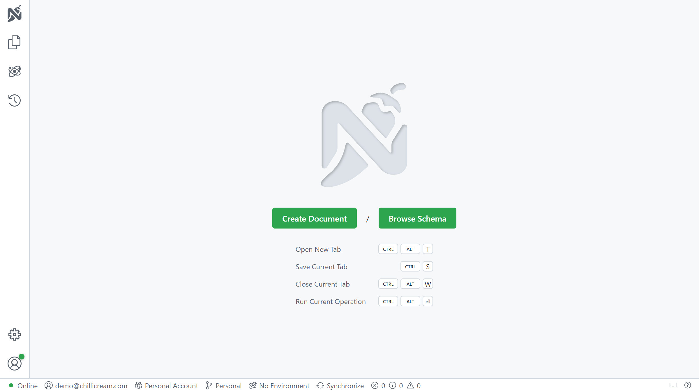
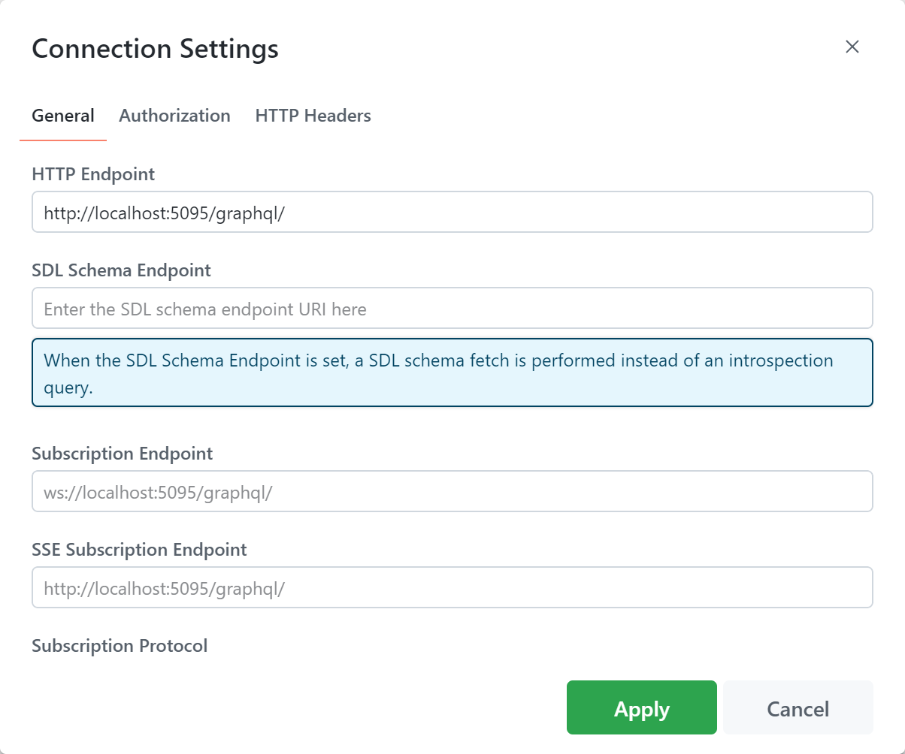
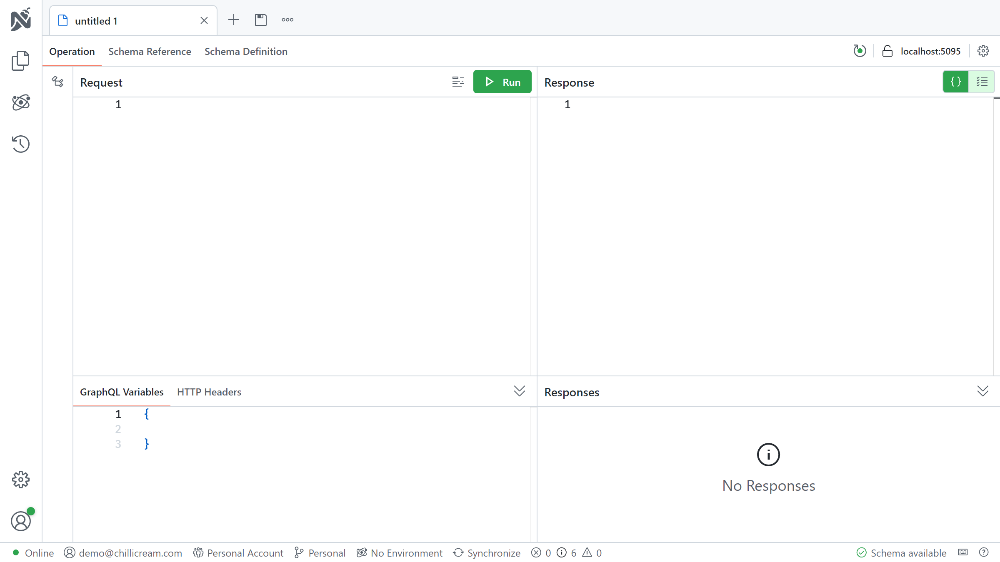
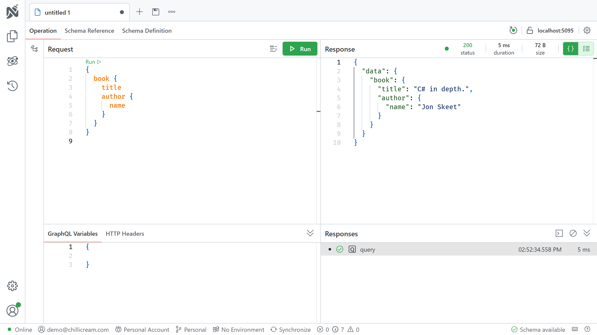
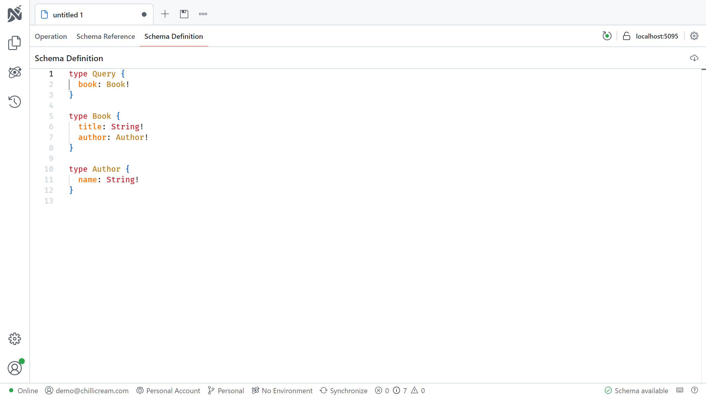

import { InputChoiceTabs } from "../../../components/mdx/input-choice-tabs"

By the end of this guide, you will have a running GraphQL server that responds to queries. You will use the Hot Chocolate project template, explore the generated code, and execute your first query in the Nitro GraphQL IDE.

**Prerequisites:** [.NET 8 SDK](https://dotnet.microsoft.com/download) or later.

# Create the Project

Install the Hot Chocolate templates.

```bash
dotnet new install HotChocolate.Templates
```

Create a new project from the template.

<InputChoiceTabs>
<InputChoiceTabs.CLI>

```bash
dotnet new graphql --name GettingStarted
```

This creates a `GettingStarted` directory with the project files. Open it in your editor.

</InputChoiceTabs.CLI>
<InputChoiceTabs.VisualStudio>

Create a new project from within Visual Studio using the **GraphQL Server** template.

[Learn how to create a new project in Visual Studio](https://docs.microsoft.com/visualstudio/ide/create-new-project)

</InputChoiceTabs.VisualStudio>
</InputChoiceTabs>

# Explore the Generated Code

## Domain Types

The `Types` directory contains two record types that represent the domain model.

```csharp
// Types/Author.cs
public record Author(string Name);
```

```csharp
// Types/Book.cs
public record Book(string Title, Author Author);
```

These are regular C# types. Hot Chocolate infers the GraphQL schema from them.

## Query Type

The `Query` class defines the root type for read operations. Each public method becomes a field that clients can query.

```csharp
// Types/Query.cs
[QueryType]
public static partial class Query
{
    public static Book GetBook()
        => new Book("C# in depth.", new Author("Jon Skeet"));
}
```

The `[QueryType]` attribute tells the source generator to register this class as part of the GraphQL Query type. The class must be `partial` so the source generator can add the registration code at build time.

The method `GetBook` becomes a field named `book` in the schema. Hot Chocolate strips the `Get` prefix by convention.

## Program.cs

The generated `Program.cs` sets up the server.

```csharp
builder.AddGraphQL()
```

`AddGraphQL` returns an `IRequestExecutorBuilder` for configuring the GraphQL server. The template also calls a source-generated `AddTypes` method that registers all types decorated with attributes like `[QueryType]` in the current assembly.

```csharp
app.MapGraphQL()
```

`MapGraphQL` exposes the GraphQL endpoint at `/graphql`. This is where clients send queries and where Nitro (the built-in GraphQL IDE) is served.

```csharp
app.RunWithGraphQLCommands(args)
```

`RunWithGraphQLCommands` works like `Run()` but adds developer commands. For example, you can export the schema as SDL.

```bash
dotnet run -- schema export
```

This writes a `schema.graphqls` file to your project directory.

# Run the Server

<InputChoiceTabs>
<InputChoiceTabs.CLI>

```bash
dotnet run
```

</InputChoiceTabs.CLI>
<InputChoiceTabs.VisualStudio>

Press `Ctrl + F5` or click the green **Debug** button in the toolbar.

</InputChoiceTabs.VisualStudio>
</InputChoiceTabs>

If everything worked, the terminal output includes a line like this:

```text
Now listening on: http://localhost:5095
```

Open <a href="http://localhost:5095/graphql" target="_blank" rel="noopener noreferrer">http://localhost:5095/graphql</a> in your browser. You should see the Nitro GraphQL IDE.



Click **Create Document**, verify the HTTP Endpoint matches your server URL, and click **Apply**.



You should see the editor with **Schema available** at the bottom right.



# Execute a Query

Paste the following query into the **Request** pane.

```graphql
{
  book {
    title
    author {
      name
    }
  }
}
```

Click **Run**. The **Response** pane should show:

```json
{
  "data": {
    "book": {
      "title": "C# in depth.",
      "author": {
        "name": "Jon Skeet"
      }
    }
  }
}
```



You can browse the schema by clicking the **Schema** tab next to **Operation**. The **Schema Definition** tab shows the raw SDL.



Your GraphQL server is running and responding to queries.

# Troubleshooting

## Port already in use

If `dotnet run` fails with an "address already in use" error, another process is using port 5095. Either stop that process or change the port in `Properties/launchSettings.json`.

## Schema available does not appear in Nitro

Verify the endpoint URL in Nitro matches the URL printed in the terminal output. If you changed the port, update the endpoint in Nitro accordingly.

## Template not found

If `dotnet new graphql` fails with "No templates matched the input template name", re-run `dotnet new install HotChocolate.Templates` and verify the installation succeeded.

# Next Steps

- **"I want to learn about the type system."** See [Defining a Schema](/docs/hotchocolate/v16/defining-a-schema) for queries, mutations, subscriptions, and all the GraphQL types.

- **"I want to fetch data from a database."** See [DataLoader](/docs/hotchocolate/v16/resolvers-and-data/dataloader) for batched data fetching, or [Entity Framework](/docs/hotchocolate/v16/integrations/entity-framework) for EF Core integration.

- **"I want a deeper tutorial."** Check out the [GraphQL Workshop](https://github.com/ChilliCream/graphql-workshop) for a hands-on walkthrough covering types, resolvers, DataLoaders, filtering, and more.

- **"I'm new to GraphQL."** Read the [official GraphQL introduction](https://graphql.org/learn/) to understand the concepts before diving deeper into Hot Chocolate.
